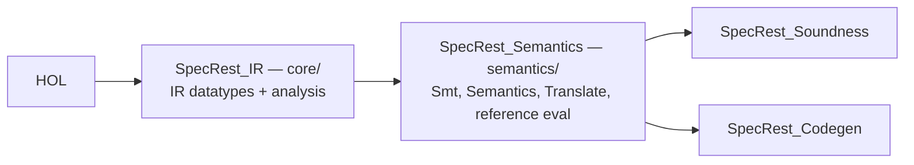

# Recent Pull Requests

A human-readable digest of the most recently merged pull requests (title + body), newest first.
Complements the release-please `CHANGELOG.md`, which only records squash-commit subjects; this file
preserves the full PR descriptions for context.

## #480 - refactor(proofs): move Semantics_Inlining to the Soundness session

_Merged 2026-06-25 by @HardMax71._

Moved `Semantics_Inlining` from the `semantics/` session to `soundness/`. It defines nothing. It's
just the proof that inlining preserves the reference semantics (`inline_calls_eval`), so it's a
soundness result that never belonged in the definitions layer.

The move is basically free: its one dependency already lives in the parent session, so nothing
re-builds and the whole build still takes around 225s. (Splitting it into a separate sibling
session, the earlier idea, was dropped because that one would have forced a re-build instead.) A
placement fix, then, not a speedup. The build's green with no `sorry`, and the generated Scala is
untouched.

## #479 - refactor(proofs): centralize name/variable mechanics into Names.thy

_Merged 2026-06-25 by @HardMax71._

Pulled all the string and variable-name helpers into one new base theory, `core/Names.thy` (it
imports only `Main`), and pointed `IR` at it so every layer picks them up through the usual import
chain. They used to live in four files across two sessions: `string_in_list` in the IR datatype
theory, `remove_name`/`remove_names` in `IR_FreeVars`, the whole `fresh_var` cluster in its own
`Smt_Fresh.thy`, and the membership lemmas in `Semantics_Reference`. `Smt_Fresh.thy` is gone now,
folded in. Anything that genuinely needs a datatype stayed put: `free_vars` needs `expr`,
`smt_var_list` needs `smt_term`.

Pure cleanup, no churn. The full build is green with zero `sorry`, nothing downstream was touched
(the moved `[simp]` lemmas still resolve through the import chain), and the generated Scala comes
out sorted-identical: 31 lines shift position, no content changes, and it recompiles under
`-Werror`.

## #478 - perf(proofs): prune BNF plugins on codegen datatypes (Codegen session ~20% faster)

_Merged 2026-06-25 by @HardMax71._

SPEEDUP.md's plugin-prune (Tier 2.1) added `(plugins only: code size)` to every datatype in
`IR`/`Semantics`/`Smt` (~22s saved) but **never reached the `SpecRest_Codegen` session** — all
**53** codegen datatypes still derived the full `quickcheck`/`nitpick`/`transfer`/`lifting` plugin
set. None of those are used anywhere in codegen (verified), so pruning skips the unused BNF
derivations.

## Measured

- `SpecRest_Codegen` session: **51s → 40s (~−11s, ~20%)** — runs on every pre-commit hook + CI job.
- `SpecRestGenerated.scala`: **byte-identical** (the `code` plugin is kept, so extraction is
  unchanged — no regen).
- Full proof build green, zero `sorry`.

## Safety

Mechanical edit (`datatype X` → `datatype (plugins only: code size) X`, 53 of them). Verified
codegen uses no `quickcheck`/`nitpick`/`lift_definition`/`transfer_rule` and no local-datatype BNF
`map_`/`set_`/`rel_` combinators, so the dropped derivations are genuinely unused. This just extends
the existing, documented optimization to the one session it had missed.

## #477 - refactor(proofs): define requiresAlloy as a fun, dropping the 31-lemma simp wall

_Merged 2026-06-25 by @HardMax71._

`requiresAlloy` used to be a fold over `allSubexprs` using `list_ex isUPowerUnary`, wrapped in four
extra definitions, plus about 31 hand-written per-constructor `[simp]` lemmas that just re-derived
the rewrite rules a structural recursion gives you for free. All of that is now one structural
mutual `fun` shaped like `allSubexprs` itself, so those per-constructor simps come out
automatically. `isUPowerUnary` folded into the `UnaryOpF` case and is gone. The behaviour is
identical: both decide whether some subterm uses `UPower`. It is a `fun` rather than a `primrec`
only because the nested-list recursion reads more cleanly with explicit mutual helpers, exactly how
`allSubexprs` is written; either form auto-generates the `[simp]` equations.

The payoff: `IR.thy` loses 124 lines, as the lemma wall, `isUPowerUnary`, and five definitions
collapse into a single ~37-line `fun`. Build time stays neutral, the IR session still at 60s and the
full proof build at 229s. Nothing downstream had to change, because the auto-generated simps already
discharge `Preservation_Wf`, `IR_Helpers`, and `VerifierDispatch`, and none of those ever referenced
the wall lemmas by name. The generated `SpecRestGenerated.scala` grows by 22 lines, since a direct
recursive `requiresAlloy` replaces the fold one-liner, but it now short-circuits instead of building
the whole `allSubexprs` list first.

This turned out to be the one real simplification available. Going through the Isabelle library and
the AFP confirmed that the rest of the proof overhead is inherent. The `fresh_var`/pigeonhole
machinery and `string_in_list` are forced by constructive `String.literal` extraction:
`infinite_literal` and `ex_new_if_finite` only prove that a fresh name exists, not the computable
witness the kernel needs. Nominal2, the binder framework that would otherwise automate this, is
AFP-only and does not extract to executable code, so it cannot live in the extraction pipeline. And
`Simps_Case_Conv` does not apply here, since the old definition was fold-based rather than
case-based. So this is the single place where a library or structural idiom actually removes
boilerplate.

Verification: the full build is green with zero `sorry`, `verify/test` passes 267/267, `ir/compile`
is clean under `-Werror`, and the regenerated extraction passes the drift-check.

## #476 - refactor(codegen): dedup identical route-kind / path-specificity helpers across emitters

_Merged 2026-06-25 by @HardMax71._

EmitGo/EmitTs/EmitPython each carried byte-identical copies of two language-agnostic helpers.
Consolidated into a new `private[codegen] object EmitShared`. Pure consolidation of identical logic
— codegen suite 385/385 green under `-Werror`; emit/golden tests confirm zero output drift.

## Consolidated

| Helper                                             | Was in                                   | Now                                                                                                       |
| -------------------------------------------------- | ---------------------------------------- | --------------------------------------------------------------------------------------------------------- |
| `routeKindName` (`route_kind → String`)            | EmitGo + EmitTs (identical)              | `EmitShared.routeKindName`                                                                                |
| `byPathSpecificity` (fewer path-params sort first) | EmitGo + EmitTs + EmitPython (identical) | `EmitShared.byPathSpecificity` (takes two path strings, so one def serves all three operation view types) |

## Deliberately NOT touched (investigated → language-specific, not duplication)

This is why the dedup is small — most apparent "duplicates" are intentional:

- **`toPascalCase` / `toCamelCase`**: already thin wrappers over `Naming.*` that pin a _per-language
  strategy_ (`Go` / `Ts` / `Plain`). Merging would erase the distinction.
- **`redirectTarget`**: EmitGo applies a trailing `.map(toPascalCase)` (Go exported-field naming)
  that EmitTs does not.
- **`fromDafny`**: each calls its own language's kernel scalar converter (`goKernelScalarConv` vs
  `tsKernelScalarConv`).

The per-language emitter _scaffolding_ (`emit`, `mergeProfile`, `buildEntityCtx`, `composeInputs`)
is parallel-but-different and intentionally independent — not consolidated.

## Verification

- `codegen/test`: **385 passed, 0 failed** (under `-Werror`, `-Wunused:all`).
- Emit/golden suites (EmitGo/Ts/Python, EmitTest, DialectProfileEmitTest) green → no
  generated-output drift.
- scalafmt + scalafix clean.

## #475 - test(testgen): split BehavioralTest into per-feature suites

_Merged 2026-06-25 by @HardMax71._

`BehavioralTest.scala` was the largest code file (1604 lines) — 57 tests accreted across feature
areas. Split it along its existing section boundaries into focused suites sharing a fixture trait.
Pure test relocation, no assertions changed.

## Layout

| File                                    | Lines | Tests | Covers                                                                                                                |
| --------------------------------------- | ----: | ----: | --------------------------------------------------------------------------------------------------------------------- |
| `BehavioralTestSupport.scala` (trait)   |    92 |     — | shared fixtures (`asSynthesized`, `loadProfiled[FromSpec]`, `profileSource`, `sensitiveInputSpec`, `cardinalitySpec`) |
| `BehavioralTest.scala`                  |   193 |    14 | core single-shot ensures/negative/invariant/sensitive                                                                 |
| `BehavioralTransitionTest.scala`        |   281 |    14 | M5.9 TransitionDecl-aware property tests                                                                              |
| `BehavioralGuardedTransitionTest.scala` |   615 |    18 | #152 guarded-transition seed-dict recognizer                                                                          |
| `BehavioralViaOpTest.scala`             |   144 |     3 | #155 via-ops with body/query inputs                                                                                   |
| `BehavioralStatusRestrictionTest.scala` |   298 |     8 | status-restriction negative tests                                                                                     |

57 behavioral tests preserved (14+14+18+3+8), now 5 discovered suites.

## One trap (caught by the compiler)

The shared fixtures were `private def` — but `private` trait members aren't visible to subclasses
(62 "not found" cascades). Made them `protected`.

## Verification

- `testgen/test`: **287 passed, 0 failed** (all suites).
- Compiles under `-Werror` (`-Wunused:all`) — no unused imports.
- `scalafmtAll` + `scalafix` clean.

Independent of #474 (no file overlap — that PR splits the source `Behavioral.scala`; this splits its
test).

## #474 - refactor(testgen): split Behavioral.scala into cohesive sub-modules

_Merged 2026-06-25 by @HardMax71._

`Behavioral.scala` was the largest source file (1297 lines) mixing four concerns. Split it into
cohesive units, behavior-preserving (testgen suite 287/287 green, scalafmt + scalafix clean).

## What moved where

| File                      | Lines | Responsibility                                                                                                                                   |
| ------------------------- | ----: | ------------------------------------------------------------------------------------------------------------------------------------------------ |
| `Behavioral.scala`        |   472 | Orchestrator (`emitFor`/`testsForOperation`) + per-operation category emitters (ensures / negative / invariant / temporal) + their build helpers |
| `StateMachineTests.scala` |   519 | Transition + status-restriction test generation and their shared scaffolding (`NonPathInput`, request/`@given` builders, enum-value lookup)      |
| `GuardSatisfier.scala`    |   315 | The guard seed-dict fixup engine (`Fix` ADT + `recognize`/`topoOrder`/`collect`) — fully self-contained                                          |
| `TestFormat.scala`        |    16 | Shared output-formatting helpers (`invName` / `prettyOneLine` / `escapeDocstring`)                                                               |

## Why this decomposition (not "by category")

I originally pitched splitting by emission category, but reading the code showed the four category
emitters share too many helpers (`inputArgList`, `build*Test`, `TestCtx`, `ExprToPython`) to
separate cleanly — splitting them would scatter tightly-coupled code. The genuine seams are the
**larger self-contained sub-systems**:

- `GuardSatisfier` is an already-nested, fully self-contained object → trivial lift.
- transition + status-restriction share a scaffolding cluster, so they form **one** module, not two.
- The only cross-cutting dependency was three formatting one-liners → `TestFormat`.

## Mechanics

Pure code movement + visibility widening: `private` → `private[testgen]` on the cross-file entry
points (`transitionEmission`, `statusRestriction*`) and their result types
(`TransitionEmissionResult`, `StatusRestriction`). `TestFormat` is an object (not top-level defs) to
avoid an `invName` overload clash with the wildcard-imported `SpecRestGenerated.invName`. No logic
changes.

## Verification

- `testgen/compile` clean (`-Werror`, no unused imports).
- `testgen/test`: **287 passed, 0 failed**.
- `scalafmtAll` + `scalafix` clean.

## #473 - fix(proofs): exclude callee names from free_vars; recognize mirrored refinement atoms

_Merged 2026-06-25 by @HardMax71._

Closes the two genuine latent gaps the #472 review surfaced (CodeRabbit, both Major). Both are
pre-existing behaviour in the verified subset — not regressions — fixed here with proofs
re-discharged and the extraction regenerated.

## 1. `free_vars` counted callee names as free variables

`free_vars (CallF (IdentifierF nm _) args)` included `nm`, so a sum-lambda body like `p => len(p)`
was wrongly rejected by the verified `translate` guard `list_all (\v. v = p) (free_vars body)` (the
builtin callee `len` showed up as a free var).

**Fix:** drop the callee when it is a bare identifier, via `identName` (an `option`-match — keeps
extraction off the wide `expr` case):

```isabelle
free_vars (CallF c args _) =
  (case identName c of Some _ ⇒ [] | None ⇒ free_vars c) @ free_vars_list args
```

`eval_coincidence`'s CallF case re-proved. Soundness-safe: shrinking `free_vars` only _strengthens_
the coincidence lemma, and it holds because `eval` reads the callee from the function/predicate
decls, never from `env`.

## 2. `decomposeAtom` ignored mirrored comparison atoms

It recognized `value <op> IntLit` and `len(value) <op> IntLit` but not the mirrored
`IntLit <op> value` (e.g. `3 < value`) — inconsistent with `rangeOf`, which already flips via
`mirrorBinOp`. So a mirrored refinement produced no OpenAPI/SQL/Hypothesis constraint.

**Fix:** recognize both forms, flipping the operator so the atom stays `value op' n`. Added
`intLitVal :: expr ⇒ int option` and matched on the `option` (2 constructors) rather than nesting
`expr` cases — the tuple/`expr` form blew the code generator up into a constructor cross-product
(~2.2k lines); the option form keeps the extraction compact.

## Not changed (Block A #3)

`eval` not modelling `LambdaF` is **correct**, not a gap: `ir_value` is a first-order value domain
with no closure value, so a bare lambda has no value → `LambdaF → None`. Only the stale comment was
wrong (fixed in #472). Modelling it would mean adding a closure type to `ir_value` — unwarranted.

## Verification

- `isabelle build SpecRest_Soundness SpecRest_Codegen` green, zero `sorry`/`oops`.
- `SpecRestGenerated.scala` regenerated; `sbt ir/compile` clean.
- `codegen/test` 376 passed, `verify/test` 267 passed — no drift (no shipped spec uses the
  newly-recognized patterns; the changes are additive).
- Added mirrored-comparison regression tests to `OpenApiConstraintsTest` (decomposeAtom has no proof
  guard; `free_vars` is guarded by `eval_coincidence`).

## #472 - refactor(proofs): modularize the Isabelle proof layer (session + theory splits)

_Merged 2026-06-25 by @HardMax71._

Modularizes the Isabelle proof base for navigability, incremental-build locality, and future
extension. Two layers of split, both semantics-preserving (zero `sorry`, full build green, Scala
extraction content-identical and recompiles).

## Session split (build-time win)

`SpecRest_Core` (one 6.4k-line session) → two along the IR/meaning seam:



The IR datatype + analysis layer is self-contained (never imports the meaning layer — verified), so
an edit to the heavily-churned meaning layer now **reuses the ~60 s IR heap** instead of
re-elaborating 2.2k lines of datatype/analysis. Separate directories (`core/`, `semantics/`) because
Isabelle rejects two sessions sharing one `in` directory (documented in `SPEEDUP.md`).

## Theory splits (navigability)

Each split uses a thin **re-export umbrella** so every downstream `imports` is unchanged — zero
import churn:

| Was                           | Now                                                                                                         |
| ----------------------------- | ----------------------------------------------------------------------------------------------------------- |
| `IR_Analysis` (808L)          | `IR_Recognizers` + `IR_Lint` + `IR_FreeVars` (+ umbrella)                                                   |
| `Semantics` (1374L)           | `Semantics_Eval` + `Semantics_Typing` (+ umbrella)                                                          |
| `Semantics_Reference` (1666L) | `Semantics_Reference` (eval def + shape/wf lemmas) + `Semantics_Inlining` (meaning-preservation metatheory) |
| `Smt` (623L)                  | `Smt` + `Smt_Fresh` (fresh-var infra)                                                                       |

The two largest files (1666, 1374) are gone; nothing now exceeds 1280L.

## Deliberately NOT done

- **IR tree-walks + `requiresAlloy`**: interleaved with the datatype tail and used by 7+ theories;
  extracting them would split the foundational `IR` datatype theory into a deep chain and risks the
  `export_code` "Illegal fixed variable" pollution that requires extracted defs stay co-located with
  their source datatypes. Cosmetic benefit, real risk — left in place.
- **`DirectSound` (937L)**: one `direct_sound` induction theorem; intrinsically monolithic (its
  helpers were already extracted in #399).

## Verification

- `isabelle build SpecRest_Soundness SpecRest_Codegen` green, zero `sorry`/`oops`.
- `SpecRestGenerated.scala` regenerated: the splits shift the code generator's topological emission
  order, so the file is **reordered but sorted-identical** (zero content change) to the prior
  commit, and `sbt ir/compile` is clean.
- Per-session cold times: IR ≈ 60 s, Semantics ≈ 110 s, Codegen ≈ 50 s, Soundness ≈ 25 s.
- README / SPEEDUP session docs reconciled to the 4-session DAG.

## #471 - build(deps): bump the actions group with 4 updates

_Merged 2026-06-25 by @app/dependabot._

Bumps the actions group with 4 updates: [actions/checkout](https://github.com/actions/checkout),
[actions/setup-java](https://github.com/actions/setup-java),
[sbt/setup-sbt](https://github.com/sbt/setup-sbt) and
[graalvm/setup-graalvm](https://github.com/graalvm/setup-graalvm).

Updates `actions/checkout` from 6.0.3 to 7.0.0

_(Upstream release-notes / changelog / commit list collapsed by Dependabot - trimmed here.)_
