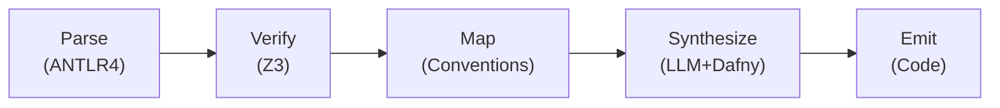

## Technology stack

- **Language:** TypeScript (ESM)
- **Parser:** ANTLR4 via antlr-ng
- **Verification IL:** Dafny (auto-active verification, compiles to C#/Java/Go/JS/Python)
- **Constraint solver:** Z3 (via z3-solver npm package)
- **LLM synthesis:** Claude / GPT-4 with CEGIS (Counter-Example Guided Inductive Synthesis) loop
- **Code generation:** Handlebars templates for Python/FastAPI, Go/chi, TS/Express targets
- **Test generation:** Schemathesis (property-based API testing) + Hypothesis

## Compiler pipeline



1. **Parse** — ANTLR4 grammar → CST → typed AST (TypeScript discriminated unions).
   See [Parser Implementation Notes](./parser-implementation) for deviations from the EBNF spec.
2. **Verify** — Static analysis: type checking, invariant satisfiability, deadlock detection
3. **Map** — Convention Engine applies M1–M10 rules, resolving HTTP methods, DB types, endpoints
4. **Synthesize** — CEGIS loop: LLM generates Dafny code → verifier checks → counterexamples feed
   back
5. **Emit** — Templates produce target-language code, DB migrations, OpenAPI spec, and test suites

## Internal representation

The IR uses TypeScript discriminated unions throughout:

```typescript
type IRNode =
  | { kind: "service"; name: string; entities: IREntity[]; operations: IROperation[] }
  | { kind: "entity"; name: string; fields: IRField[] }
  | {
      kind: "operation";
      name: string;
      params: IRParam[];
      returns: IRType;
      pre: IRExpr[];
      post: IRExpr[];
    };
// ...
```

## Build plan

The implementation is divided into 6 phases over ~20 weeks:

1. **Core parser** (weeks 1–3) — ANTLR4 grammar, AST builder, basic CLI
2. **Type system** (weeks 4–6) — Type checker, scope analysis, error reporting
3. **Convention engine** (weeks 7–9) — Mapping rules, override system, deployment profiles
4. **Verification** (weeks 10–13) — Z3 integration, invariant checking, state machine analysis
5. **LLM synthesis** (weeks 14–17) — CEGIS loop, Dafny integration, prompt engineering
6. **Code generation** (weeks 18–20) — Templates, multi-target output, test generation
