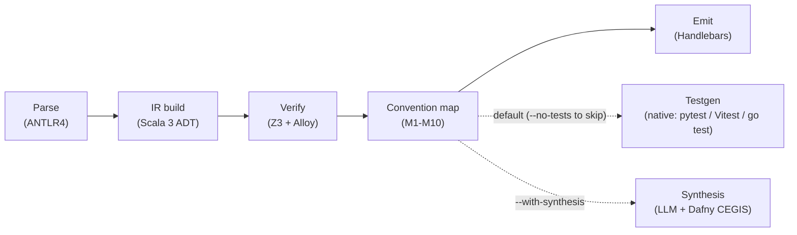

## Technology stack

The compiler runs on Scala 3.6.3. ANTLR4 (Java runtime) parses the input via
`sbt-antlr4`. The effect runtime is [Cats Effect 3.7](https://typelevel.org/cats-effect/);
every pipeline stage returns `IO` and the CLI runs as a `decline-effect` `CommandIOApp`
(see [Concurrency and Cancellation](/pipelines/concurrency)).

Constraint solving uses Z3 Java bindings via `tools.aqua:z3-turnkey` 4.13, which bundles
`libz3` natively so no system install is required. A second Z3-vs-cvc5 cross-check job
runs in CI ([#131](https://github.com/HardMax71/spec_to_rest/issues/131)). Bounded model
checking uses Alloy 6.2 (powerset + temporal `always`/`eventually`).

Translator soundness is mechanically verified in an Isabelle/HOL session under
`proofs/isabelle/SpecRest/`. The universal `soundness` theorem closes with zero `sorry`;
`Code_Target_Scala` extracts the verified translator and the canonical IR ADT to
`modules/ir/src/main/scala/specrest/ir/generated/SpecRestGenerated.scala`. The track
pivoted from Lean 4 in [#193](https://github.com/HardMax71/spec_to_rest/issues/193); IR
canonicalized in [#202](https://github.com/HardMax71/spec_to_rest/issues/202).

Code generation uses Handlebars templates (`handlebars.java`) for the
`python-fastapi-postgres`, `go-chi-postgres`
([#33](https://github.com/HardMax71/spec_to_rest/issues/33)), and
`ts-express-postgres` ([#35](https://github.com/HardMax71/spec_to_rest/issues/35))
targets. Test generation emits a native behavioral/stateful/structural conformance
suite under `tests/` by default (opt out with `compile --no-tests`), in the target's
own language (pytest+Hypothesis+Schemathesis / Vitest+fast-check / `go test`+rapid) via
the `Backend.scala` seam, with the Python path held byte-identical as the differential
oracle.

Distribution is via GraalVM native-image (`sbt-native-image`), built by the `native.yml`
workflow. The day-to-day entry point is `sbt cli/run ...`.

## Compiler pipeline

The `compile` pipeline is parse -> IR build -> verify -> convention map -> emit. Property-test
generation runs as a sixth stage by default (opt out via `--no-tests`). The
`--with-synthesis` flag invokes the M6 LLM-synthesis loop: `dafny verify`-driven CEGIS
over LLM-generated bodies ([#28](https://github.com/HardMax71/spec_to_rest/issues/28),
[#29](https://github.com/HardMax71/spec_to_rest/issues/29)) substitutes the verified
Dafny output for the `raise NotImplementedError` stubs in the emitted project
([#27](https://github.com/HardMax71/spec_to_rest/issues/27)). Graduated fallback
([#30](https://github.com/HardMax71/spec_to_rest/issues/30)) and DafnyPro-style hint
augmentation ([#229](https://github.com/HardMax71/spec_to_rest/issues/229)) cover the
cases where verification needs help. The standalone `synth verify` subcommand runs the
same loop without committing changes back to a project tree.



1. Parse. ANTLR4 grammar (`Spec.g4`) produces a CST that the builder lowers to a typed IR.
   The parser auto-injects a short preamble (`isValidURI`, `isValidEmail`). See
   [Parser Implementation Notes](/pipelines/parser-implementation).
2. IR build. CST becomes `ServiceIR`, a Scala 3 enum/case-class ADT, with span tracking.
3. Verify. `verify` runs structural lints (L01-L06; see
   [structural lints](/spec-language#structural-lints)) and then translates each obligation
   to either Z3 SMT-LIB or Alloy (non-overlapping routing) and checks it. The translator's
   correctness is mechanically validated by the universal `soundness` theorem in
   `proofs/isabelle/SpecRest/Soundness.thy`. The `compile` command treats `verify` as a
   hard gate (`--ignore-verify` to bypass).
4. Convention map. The convention engine applies M1-M10 operation-classification
   rules; user-supplied `conventions { ... }` overrides win where present. See
   [Convention Engine](/design/convention-engine).
5. Emit. Handlebars templates produce the FastAPI project: `app/`, `db/`, `alembic/`,
   `tests/`, `Dockerfile`, `docker-compose.yml`, `openapi.yaml`, `.github/workflows/ci.yml`,
   `Makefile`, `pyproject.toml`.
6. Testgen (default; opt out with `--no-tests`). Adds a conformance suite under
   `tests/` derived from the same `requires`/`ensures`/`invariant` clauses, rendered in
   the target's native language behind the `Backend.scala` seam (single shared
   derivation, pluggable `ExprBackend`/`StrategyBackend`/`HarnessTemplates`); the Python
   rendering is the byte-identical differential oracle. Coverage and skip rates are
   asserted by `SkipRateProbeTest`; per-language rendering parity by `BackendTest`.

## Internal representation

The IR is a Scala 3 ADT (sealed abstract classes + final case classes) **extracted from
Isabelle** by `Code_Target_Scala`. The source-of-truth definitions live in
[`proofs/isabelle/SpecRest/IR.thy`](https://github.com/HardMax71/spec_to_rest/blob/main/proofs/isabelle/SpecRest/IR.thy)
and are extracted to
[`modules/ir/src/main/scala/specrest/ir/generated/SpecRestGenerated.scala`](https://github.com/HardMax71/spec_to_rest/blob/main/modules/ir/src/main/scala/specrest/ir/generated/SpecRestGenerated.scala)
on every `isabelle build SpecRest`. Two levels:

`expr_full` is the full input language (27 constructors: `BoolLitF`, `IntLitF`,
`IdentifierF`, `BinaryOpF(op: bin_op_full, l, r, span)`, `UnaryOpF`, `QuantifierF`,
`WithF`, `LambdaF`, `MapLiteralF`, `SetComprehensionF`, and so on). This is what the
parser emits and what every consumer module reads.

`expr` is the verified subset (23 constructors, dropping `MapLiteral`, `Lambda`,
`Constructor`, `SomeWrap`, `SetComprehension`, `Matches`, `SeqLiteral`, `With`,
`MapType`, `RelationType`, and `UPower`). The translator-soundness theorem is stated
against this shape.

`lower :: expr_full => expr option` is the projection from input to verified subset,
proven sound by `lower_soundness` in `Soundness.thy`.

The top-level `service_ir_full` plus 18 sub-records (`entity_decl_full`, `field_decl_full`,
`operation_decl_full`, `invariant_decl_full`, `function_decl_full`, `predicate_decl_full`,
`transition_decl_full`, `conventions_decl_full`, `state_decl_full`, ...) carry the surrounding
declaration shape. Extracted Scala fields are positional letters (`a`, `b`, `c`, ...) since
the extractor doesn't preserve English names; the conceptual mapping (e.g. `ServiceIRFull.a`
is the service name, `.c` the entity list, `.g` the operation list, `.i` the invariants) is
spelled out in `IR.thy`.

The same IR feeds the verifier (Z3 + Alloy translators), the convention engine, the codegen,
and the testgen. The translator's correctness is mechanically validated by the universal
soundness theorem in `proofs/isabelle/SpecRest/Soundness.thy`. IR canonicalization shipped
in [#202](https://github.com/HardMax71/spec_to_rest/issues/202).

## Project layout

```tree
modules/
├── ir/         # IR ADT (Isabelle-extracted SpecRestGenerated.scala), circe Serialize, PrettyPrint, VerifyError
├── parser/     # ANTLR4 grammar, Parse, Builder, Preamble injection
├── lint/       # Structural lints L01-L06
├── convention/ # M1-M10 classifier, naming, path, schema, validate, Builtins registry (single source of truth for spec-language builtin functions)
├── profile/    # Deployment profiles, type mapping, annotation
├── verify/     # Z3 + Alloy translators, backends, Consistency, Diagnostic, Narration
├── codegen/    # Engine (handlebars.java), Emit, OpenAPI, Alembic
├── testgen/    # Backend seam (ExprBackend/StrategyBackend/HarnessTemplates), Strategies, Stateful/Structural/Behavioral + Ts*/Go* emitters; dispatches builtin calls through convention.Builtins
├── synth/      # LLM integration, PromptBuilder, DiffChecker, DafnyVerifier, CegisLoop, Cache, Tracker
├── cli/        # decline-effect CommandIOApp: check / inspect / verify / compile / synth try / synth verify
└── bench/      # JMH benchmarks (ParallelVerifyBench, parallel verify CSV golden)

proofs/
└── isabelle/   # Isabelle/HOL session: IR, Semantics, Smt, Translate, Soundness, Codegen
```

Each module is a separate sbt subproject with test isolation; `sbt <module>/test` runs one
module's tests. Every public entry point in `verify/` returns `IO[Either[VerifyError, _]]`.

## Effect system layer

Every IO-returning stage (parse, IR build, Z3/Alloy translation, backend `check`, top-level
`Consistency.runConsistencyChecks`) composes via `IO.flatMap`, and the whole pipeline is one
fiber tree rooted at `CommandIOApp.main`. Backends are acquired as `Resource[IO, _]` so
finalizers run on success, failure, and cancellation alike. The `--parallel` flag maps to
`parTraverseN(n)`; `--timeout` is enforced natively inside each backend (Z3's `timeout`
solver param; Alloy's `Future.get(timeout, ...)`). See
[Concurrency and Cancellation](/pipelines/concurrency) for the full model, JMH numbers,
and the cancellation contract.

## CI surface

Ten workflows live under `.github/workflows/`:

| Workflow                | What it gates                                                                  |
|-------------------------|--------------------------------------------------------------------------------|
| `ci.yml`                | full `sbt test` matrix + cvc5 cross-check on a curated subset                  |
| `isabelle-build.yml`    | `isabelle build SpecRest`: universal soundness theorem + extracted Scala drift gate |
| `mutation-testing.yml`  | `mutmut` against the generated Python services for selected fixtures           |
| `bench.yml`             | JMH parallel-verify regression vs. golden CSV                                  |
| `native.yml`            | GraalVM native-image build smoke                                               |
| `docs.yml`              | Fumadocs production build + link check                                         |
| `quality.yml`           | scalafmt, scalafix, wartremover, coverage floor                                |
| `dependency-submission.yml` / `branch-name.yml` / `lint-workflows.yml` | repo hygiene |

## Roadmap status

For the project-level phase ledger, the per-program milestone history (M_CE.\* / M_L.\*
/ M5.\* / M6.\*), the verifier capability inventory, and the closed-not-planned
decisions, see **[Roadmap](/roadmap)**. Architecture stays scoped to system design.
