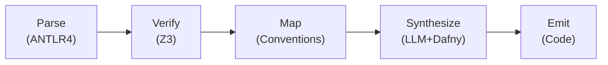

## Technology stack

- **Language:** Scala 3
- **Parser:** ANTLR4 (Java runtime) via `sbt-antlr4`
- **Effect runtime:** [Cats Effect 3.7](https://typelevel.org/cats-effect/) — every pipeline
  stage returns `IO`; the CLI runs as `CommandIOApp`. See
  [Concurrency and Cancellation](../pipelines/concurrency).
- **Verification IL:** Dafny (auto-active verification, compiles to C#/Java/Go/JS/Python)
- **Constraint solver:** Z3 Java bindings via `tools.aqua:z3-turnkey` (bundles libz3 natively — no system install)
- **LLM synthesis:** Claude / GPT-4 with CEGIS (Counter-Example Guided Inductive Synthesis) loop
- **Code generation:** Handlebars templates (`handlebars.java`) for Python/FastAPI, Go/chi, TS/Express targets
- **Test generation:** Schemathesis (property-based API testing) + Hypothesis
- **Distribution:** GraalVM native-image — single static binary, ~50 ms cold start, no JVM runtime required for end users

## Compiler pipeline



1. **Parse** — ANTLR4 grammar → CST → typed AST (Scala 3 enums + case classes).
   See [Parser Implementation Notes](../pipelines/parser-implementation) for deviations from the EBNF spec.
2. **Verify** — Static analysis: type checking, invariant satisfiability, deadlock detection
3. **Map** — Convention Engine applies M1–M10 rules, resolving HTTP methods, DB types, endpoints
4. **Synthesize** — CEGIS loop: LLM generates Dafny code → verifier checks → counterexamples feed
   back
5. **Emit** — Templates produce target-language code, DB migrations, OpenAPI spec, and test suites

## Internal representation

The IR uses Scala 3 enums (true ADTs) with exhaustive pattern matching:

```scala
enum Expr derives CanEqual:
  case BinaryOp(op: BinOp, left: Expr, right: Expr, span: Option[Span])
  case Identifier(name: String, span: Option[Span])
  case IntLit(value: Long, span: Option[Span])
  // ... 25 total variants

enum TypeExpr:
  case NamedType(name: String, span: Option[Span])
  case SetType(elementType: TypeExpr, span: Option[Span])
  case RelationType(fromType: TypeExpr, multiplicity: Multiplicity, toType: TypeExpr, span: Option[Span])
  // ...

final case class ServiceIR(
    name: String,
    entities: List[EntityDecl],
    enums: List[EnumDecl],
    operations: List[OperationDecl],
    invariants: List[InvariantDecl],
    state: Option[StateDecl],
    // ... other top-level decls
)
```

## Project layout

import { Files, Folder, File } from 'fumadocs-ui/components/files';

<Files>
  <Folder name="modules" defaultOpen>
    <Folder name="ir" />
    <Folder name="parser" />
    <Folder name="convention" />
    <Folder name="profile" />
    <Folder name="verify" />
    <Folder name="codegen" />
    <Folder name="cli" />
    <Folder name="bench" />
  </Folder>
</Files>

| Module       | Responsibility                                                                                |
| ------------ | --------------------------------------------------------------------------------------------- |
| `ir`         | IR types, JSON serializer (circe)                                                             |
| `parser`     | ANTLR grammar + `Parse.scala` + `Builder.scala` (returns `IO`)                                |
| `convention` | M1-M10 classifier, naming, path, schema, validate                                             |
| `profile`    | Deployment profiles, type mapping, annotation                                                 |
| `verify`     | Translator, SmtLib, Backend (Java Z3), Alloy backend, Consistency, CounterExample, Diagnostic — every public entry point returns `IO` |
| `codegen`    | Engine (handlebars.java), Emit, OpenAPI, Alembic                                              |
| `cli`        | decline-effect `CommandIOApp`: check, inspect, verify, compile                                |
| `bench`      | JMH benchmarks (`ParallelVerifyBench`, parallel verify CSV golden)                            |

Each module is a separate sbt subproject with test isolation; `sbt <module>/test` runs one module's tests.

## Effect system layer

Every IO-returning stage — parse, IR build, Z3/Alloy translation, backend `check`, top-level
`Consistency.runConsistencyChecks` — composes via `IO.flatMap`, and the whole pipeline is one
fiber tree rooted at `CommandIOApp.main`. Backends are acquired as `Resource[IO, _]` so
finalizers run on success, failure, and cancellation alike. The `--parallel` flag maps to
`parTraverseN(n)`; `--timeout` is enforced natively inside each backend (Z3's `timeout`
solver param; Alloy's `Future.get(timeout, …)`). See
[Concurrency and Cancellation](../pipelines/concurrency) for the full model, JMH numbers,
and the cancellation contract.

## Build plan

The implementation is divided into 6 phases over ~20 weeks:

1. **Core parser** (weeks 1–3) — ANTLR4 grammar, AST builder, basic CLI
2. **Type system** (weeks 4–6) — Type checker, scope analysis, error reporting
3. **Convention engine** (weeks 7–9) — Mapping rules, override system, deployment profiles
4. **Verification** (weeks 10–13) — Z3 integration, invariant checking, state machine analysis
5. **LLM synthesis** (weeks 14–17) — CEGIS loop, Dafny integration, prompt engineering
6. **Code generation** (weeks 18–20) — Templates, multi-target output, test generation
