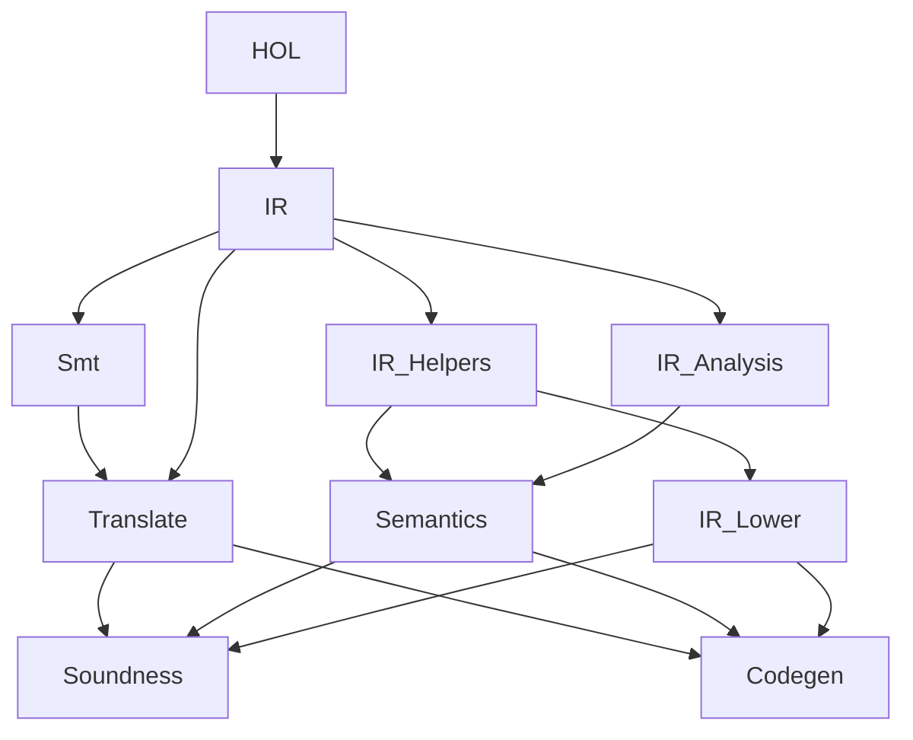
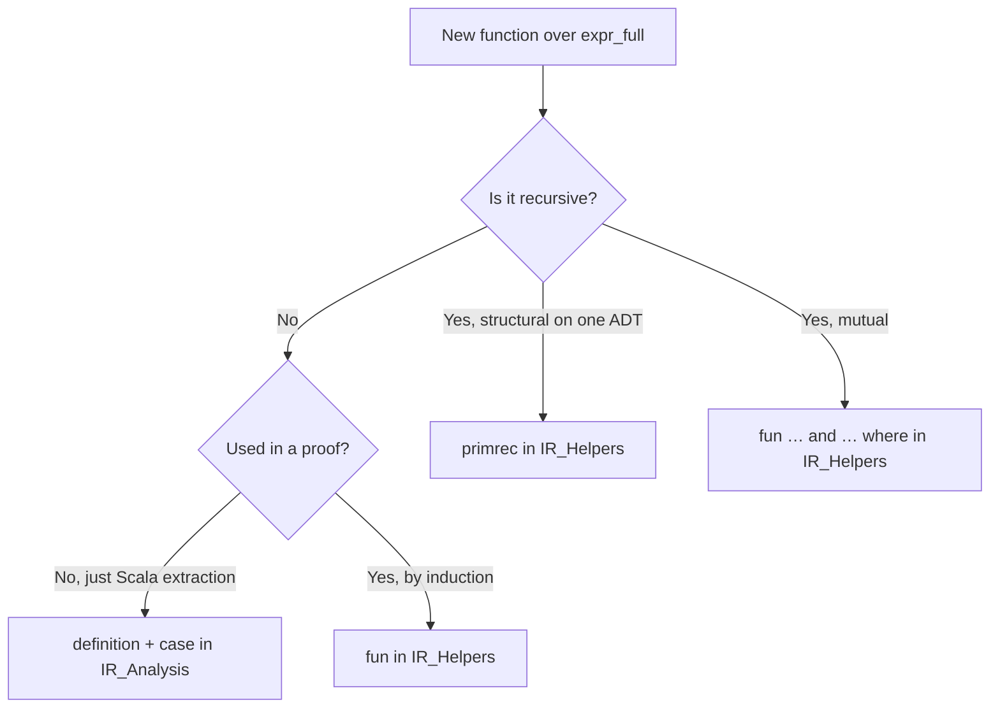

## At a glance

The `proofs/isabelle/SpecRest/` session mechanically verifies the verifier's
translator (`translate`), evaluator (`eval`), and SMT evaluator (`smt_eval`)
and exports the canonical IR ADT + extracted functions to
`modules/ir/src/main/scala/specrest/ir/generated/SpecRestGenerated.scala`. The
universal `soundness` theorem closes with zero `sorry`. The pivot from Lean 4
landed in [#193](https://github.com/HardMax71/spec_to_rest/issues/193).

This page is the **operational guide** for contributors who edit those theory
files: how the session is split, what the build budget is, and the
single-paragraph "don't do this" rules that catch the recurring
pattern-elaboration-time traps.

For the engineering journal (every attempted change with measured impact and
verdict) see [`proofs/isabelle/SPEEDUP.md`](https://github.com/HardMax71/spec_to_rest/blob/main/proofs/isabelle/SPEEDUP.md).

## Performance budget

Clean rebuild target on a developer machine (8+ cores):

| Metric                | Budget     | Why this number      |
| --------------------- | ---------- | -------------------- |
| Wall time             | **< 2 min** | Iterates per change while editing |
| CPU factor            | **> 2.5x**  | Multiple theories elaborating in parallel |
| Slowest single `fun`  | **< 20 s** | Above this, Isabelle's `running for N seconds` warning fires; usually fixable |
| Slowest single `by`   | **< 10 s** | A slow `by` is almost always a `blast` searching the wrong half of HOL |

Two rounds of work have hit those numbers:

| PR                                                                         | Wall before  | Wall after    | Δ        |
| -------------------------------------------------------------------------- | ------------ | ------------- | -------- |
| [#241](https://github.com/HardMax71/spec_to_rest/pull/241) (May 2026)      | 2:48 (168 s) | 1:17 (77 s)   | −54 %    |
| [#299](https://github.com/HardMax71/spec_to_rest/pull/299) (May 2026)      | 6:32 (392 s) | 1:42 (102 s)  | −74 %    |

The wall time grew between #241 and #299 because PRs #285 / #289 / #297 / #298
added ~600 lines of new lifted primitives to `IR.thy`. PR #299 reorganized
that growth.

## Session layout

The session is a single `SpecRest = HOL` in `proofs/isabelle/SpecRest/ROOT`,
intentionally split into small theories so polyml can elaborate independent
sub-theories on separate ML threads:



### What lives where

| Theory               | Lines  | What it owns                                                                                                                                              |
| -------------------- | ------ | --------------------------------------------------------------------------------------------------------------------------------------------------------- |
| `IR.thy`             | ~510   | The 37 datatypes (verified-subset `expr`, full-language `expr_full`, `*_full` declaration types) + the **base structural walks**: `subexprs`, `requiresAlloy`, `stripSpans`, `typeStripSpans`, `binOpToTs`, `spanOf`, `flattenAnd*`, `rootIdentifier`, `string_in_list` |
| `IR_Helpers.thy`     | ~520   | Detect-pattern recognizers (`preservedRelationOf`, `createPatternOf`, …), `collectExprInfo` mutual walker, entity / type / schema helpers, inheritance flattening, lemmas about those |
| `IR_Analysis.thy`    | ~415   | The Phase-9 lifted primitives (`isTrueLit`, `enumLiteralOf`, `combineAnd`, `decomposeAtom` + `refinement_atom`, `free_vars` / `subst` / `hasPrePrime` mutual recs, `litClass` + diagnostic helpers) |
| `IR_Lower.thy`       | ~210   | `lower` and the `lower_forall_*` / `lower_with_assigns` mutual lowering from `expr_full` to the verified subset `expr` |
| `Smt.thy`            | ~320   | The SMT IR (`smt_term`, `smt_val`, `smt_model`) and `smt_eval` |
| `Semantics.thy`      | ~1190  | `ir_value`, `state`, `tyctx`, the typing judgement, `eval`, `check_value_has_ty` |
| `Translate.thy`      | ~50    | The translator `translate :: expr ⇒ smt_term` (small but central) |
| `Soundness.thy`      | ~2970  | All 157 lemmas that close `soundness` |
| `Codegen.thy`        | ~115   | `export_code` directives — the contract with the consumer Scala layer |

### Why split this way

Polyml runs one ML kernel per session, but elaborates **theories** on
separate threads. Splitting `IR.thy` into four files lets `IR_Helpers`,
`IR_Analysis`, and `Smt` elaborate in parallel once the base `IR` (the
datatypes + base structural walks) finishes. Before the split, all of that
work serialized through a single 1934-line file.

The cumulated-time / wall-time gap measures parallelism:

```text
$ isabelle build -c -d proofs/isabelle/SpecRest -v SpecRest | grep cumulated
SpecRest: theory SpecRest.IR             100% (33 s cumulated time)
SpecRest: theory SpecRest.Smt            100% (17 s cumulated time)
SpecRest: theory SpecRest.IR_Helpers     100% (31 s cumulated time)
SpecRest: theory SpecRest.IR_Analysis    100% (17 s cumulated time)
SpecRest: theory SpecRest.IR_Lower       100% (11 s cumulated time)
SpecRest: theory SpecRest.Semantics      100% (24 s cumulated time)
SpecRest: theory SpecRest.Translate      100% ( 1 s cumulated time)
SpecRest: theory SpecRest.Soundness      100% (27 s cumulated time)
SpecRest: theory SpecRest.Codegen        100% ( 6 s cumulated time)
                                                              ───
                                                              170 s cumulated, 102 s wall, factor 3.12x
```

The critical path is `IR → IR_Helpers → Semantics → Soundness`
(33 + 31 + 24 + 27 = 115 s); everything else fits inside that window.

## How to build locally

The standard incantation (also pre-commit-hooked):

```bash
isabelle build -d proofs/isabelle/SpecRest -b SpecRest
```

Useful flags during iteration:

| Flag      | When                                                                |
| --------- | ------------------------------------------------------------------- |
| `-c`      | Force a clean rebuild (don't reuse the heap). Use when measuring.   |
| `-v`      | Verbose per-theory and per-`fun`/`by` timing. Required for profiling. |
| `-S`      | "Soft" build: skip if no source changed. Cheap pre-flight.          |
| `-j N`    | Parallel sessions (only matters if you also build deps).            |

The session sets `threads = 0` (auto-pick based on `nproc`). Don't pin it.

To regenerate the extracted Scala after a `.thy` change:

```bash
work="$(mktemp -d)"
isabelle build -d proofs/isabelle/SpecRest -b SpecRest
isabelle export -d proofs/isabelle/SpecRest -O "$work" \
  -x 'SpecRest.Codegen:code/*' SpecRest

target="modules/ir/src/main/scala/specrest/ir/generated/SpecRestGenerated.scala"
{ printf 'package specrest.ir.generated\n\nimport scala.annotation.nowarn\n\n@nowarn\n'
  cat "$work/SpecRest.Codegen/code/SpecRestGenerated.scala"
} > "$target"
scalafmt --config .scalafmt.conf --non-interactive "$target"
```

The `isabelle-build` CI workflow runs the same pipeline in `--check` mode on
every PR that touches `proofs/isabelle/**` or the generated Scala — a `git
diff` against the freshly-extracted file is the gate. A theory edit that
forgets the regen step will fail CI.

## Do's and don'ts

These rules come straight from the perf journal — each one has a measured
cost behind it.

### 1. Use `string_in_list X xs`, not `list_ex (λn. n = X) xs`

`list_ex` is polymorphic (`'a ⇒ bool ⇒ 'a list ⇒ bool`). When you embed a
polymorphic HOF with a lambda inside a `fun`, Isabelle's pattern-overlap
analysis blows up. In #299, four 8-line `fun`s with this pattern cost
**106 s** elaboration time each. Switching to the monomorphic
`string_in_list` primrec dropped each one to under a second.

```text
(* DON'T *)
fun preservedRelationOf :: "String.literal list ⇒ expr_full ⇒ String.literal list" where
  "preservedRelationOf stateFields (BinaryOpF BEq _ _ _) =
     (if list_ex (λn. n = name) stateFields then [name] else [])"
| ...

(* DO *)
fun preservedRelationOf :: "String.literal list ⇒ expr_full ⇒ String.literal list" where
  "preservedRelationOf stateFields (BinaryOpF BEq _ _ _) =
     (if string_in_list name stateFields then [name] else [])"
| ...
```

If you need membership on a list of something other than `String.literal`,
write a monomorphic primrec for that element type. The cost of the extra
function is dwarfed by the cost of a polymorphic-HOF call inside a `fun`.
See [memory: Isabelle polymorphic fun](https://github.com/HardMax71/spec_to_rest/pull/241).

### 2. `fun` for recursion, `definition + case` for shape recognition

`fun` generates an exhaustiveness proof, a termination proof, a `.simps`
collection, an induction principle, and case / elim rules. For a recursive
function over `expr_full` (28 constructors), that's appropriate and the
generated rules carry their weight.

For a **non-recursive shape recognizer** — `decomposeAtom`,
`createPatternOf`, `rangeOf` — none of those auto-generated artifacts are
used in any proof. `definition + case` skips all of it.

```text
(* DON'T (115 s elaboration in #299) *)
fun createPatternOf :: "String.literal list ⇒ expr_full ⇒ String.literal list" where
  "createPatternOf stateFields
     (BinaryOpF BEq (PrimeF (IdentifierF name _) _)
                    (BinaryOpF BAdd l r sp) _) =
        (if string_in_list name stateFields
            ∧ containsPreInPlusChain (BinaryOpF BAdd l r sp) name
         then [name] else [])"
| "createPatternOf _ _ = []"

(* DO (sub-second) *)
definition createPatternOf :: "String.literal list ⇒ expr_full ⇒ String.literal list" where
  "createPatternOf stateFields e ≡
     (case e of
        BinaryOpF BEq (PrimeF (IdentifierF name _) _) rhs _ ⇒
          (case rhs of
             BinaryOpF BAdd _ _ _ ⇒
               (if string_in_list name stateFields
                   ∧ containsPreInPlusChain rhs name
                then [name] else [])
           | _ ⇒ [])
      | _ ⇒ [])"
```

**Rule of thumb:** if your `fun` body never appears as a `using foo.simps`,
`by (induction rule: foo.induct)`, or `by (cases x rule: foo.cases)` in any
proof — it's a `definition`.

### 3. `primrec` for structural recursion on a single ADT

When the function _is_ recursive but the recursion is purely structural on
one argument and one ADT, prefer `primrec` over `fun`. It skips the
`lexicographic_order` termination search (NP-complete, exponential in the
number of mutual functions — see
[Bulwahn-Krauss-Nipkow, FroCoS 2007](https://www21.in.tum.de/~krauss/papers/lexicographic-orders.pdf)).

```text
(* DO *)
primrec string_in_list :: "String.literal ⇒ String.literal list ⇒ bool" where
  "string_in_list y [] = False"
| "string_in_list y (x # xs) = (x = y ∨ string_in_list y xs)"
```

### 4. Pick the proof method that knows the shape of your goal

`blast` is a generic intuitionistic-prover for FOL goals. It's powerful but
it searches a huge inference space when it doesn't know what's relevant.
In #299, a `by blast` call on the final `soundness` theorem ran for
**410 seconds** because the relevant lemma returns
`lower e ≠ None` and the goal was `∃e'. lower e = Some e'` — the
not-equal-None / exists-equals-Some conversion sent `blast` into the weeds.

| Goal shape                                            | Preferred method                                    |
| ----------------------------------------------------- | --------------------------------------------------- |
| `x ≠ None ⇒ ∃y. x = Some y` style                     | `by (auto simp: not_None_eq)`                       |
| "Apply this specific lemma after some rewriting"      | `by (metis lemma1 lemma2)` — 2–5 explicit facts     |
| Pure equational reasoning                             | `by simp` / `by (simp add: foo_def)`                |
| Case split on one ADT then per-case `auto`            | `by (cases x) auto`                                 |
| First-order with a known set of intro/dest rules      | `by (auto intro: …, dest!: …)`                      |
| Nothing else works, you have time to wait             | `by blast`                                          |

Always pass `blast` the smallest set of facts you can. `using` followed by
`by blast` is fine when blast knows where to look; `by blast` alone is the
red flag.

### 5. Datatype derivation pruning

Top of every datatype:

```text
datatype (plugins only: code size) expr_full = ...
```

This skips quickcheck, nitpick, transfer, lifting derivations — none of
which the proofs use. PR #241 measured **22 s** saved by adding the
attribute to the 14 datatypes in `IR.thy` / `Semantics.thy` / `Smt.thy`.

### 6. Don't let dead theory code rot in the session

`enc_*` / `dec_*` / a `json` datatype lived in `IR.thy` for ~3 months as
scaffolding for a never-shipped Phase-9m extraction PR. They were not
exported, not referenced in any proof, and not used by any Scala consumer.
They added ~30 s to the build. PR #299 deleted them.

**Audit periodically:** anything in `IR*.thy` should be either exported in
`Codegen.thy` or referenced (directly or transitively) by a `Soundness`
lemma. If neither, delete it.

### 7. `threads = 0` in `ROOT`, never a fixed integer

```text
session SpecRest = HOL +
  options [document = false, threads = 0]
```

Auto-picks based on `nproc`. Hand-pinning to `4` was leaving 12 cores idle
on a typical dev machine. PR #299 went from parallelism factor 1.63 to 3.12
on this change alone.

### 8. When you split a theory, update import lists downstream

After PR #299 moved `lower` from `IR.thy` into `IR_Lower.thy`, three `by
simp` calls in `Soundness.thy` failed because the simp set no longer
contained `lower.simps` — `Soundness` only imported `Translate` and
`Semantics`. Fix: add the new sub-theory to the importer.

```text
theory Soundness
  imports Translate Semantics IR_Helpers IR_Analysis IR_Lower
begin
```

If your edit moves a definition between theory files, grep for
`<name>.simps` / `<name>.induct` / `<name>_def` across `Soundness.thy`,
`Semantics.thy`, `Translate.thy` before committing.

### 9. Beware deep nested patterns — they extract to cross-product Scala

`Code_Target_Scala` compiles each `case` arm into an exhaustive `match`
over the matched type's constructors. A pattern that nests three or
four constructor levels expands as the **cross product** of those
constructors. For `expr_full` (28 constructors), one nested pattern
quickly becomes 100–200 generated arms even when the Isabelle source
is two lines.

PR #301 review caught two cases of this:

- `BinaryOpF BIn (IdentifierF i _) (IdentifierF s _) _` — naive
  formulation extracted to a **200+-arm cross product** (op ×
  left-shape × right-shape).
- `fun stripAddSubIntLit e = e` recursive identity fallback — unfolds
  to per-constructor identity reconstruction (~80 arms each
  reconstructing the same `BinaryOpF(BAnd(), va, vb, vc) ⇒
  BinaryOpF(BAnd(), va, vb, vc)` shape).

For the BIn shape, switch to a **shallow split-case** + `\<and>` (each
inner `case` is one constructor level deep and short-circuits on the
first miss):

```text
(* DON'T — cross product *)
case c of
  BinaryOpF BIn (IdentifierF i _) (IdentifierF s _) _ ⇒
    i = inputName ∧ s = stateName
| _ ⇒ False

(* DO — shallow split-case *)
case c of
  BinaryOpF op l r _ ⇒
    (case op of BIn ⇒ True | _ ⇒ False) ∧
    (case l of IdentifierF i _ ⇒ i = inputName | _ ⇒ False) ∧
    (case r of IdentifierF s _ ⇒ s = stateName | _ ⇒ False)
| _ ⇒ False
```

For the recursive identity-fallback (the `stripAddSubIntLit` shape),
there's no compact extraction unless you avoid the recursion entirely.
If the function has a single Scala consumer, **don't lift it** — the
extracted bloat dominates the lift's value.

**Rule of thumb:** before committing a lift, run the regen pipeline
and `wc -l` the new `def`. If it's > 80 lines for a function that was
< 10 in hand-written Scala, the lift is paying for itself in
maintainability but not in line-count; reconsider whether single
source of truth is worth the generated bloat at this site.

## Profiling: finding the next bottleneck

`isabelle build -v -c` emits two kinds of timing line:

```text
SpecRest: theory SpecRest.IR_Helpers 100% (31.148s cumulated time)
SpecRest: command "fun" running for 84.818s (line 33 of theory "SpecRest.IR_Helpers")
```

The first gives **per-theory cumulated** (thread-summed) time. The second
fires when any single `fun`/`by` exceeds 20 s and ticks every 2 s
thereafter — that's how you spot the hotspot. A typical iteration loop:

1. `isabelle build -c -d proofs/isabelle/SpecRest -v SpecRest 2>&1 | tee /tmp/iter.log`
2. `grep "running for" /tmp/iter.log | tail -10` — find the worst offenders
3. `sed -n '<line>,+5p' proofs/isabelle/SpecRest/<theory>.thy` — inspect
4. Apply one of the do's above
5. Re-build, compare wall times

Cap the wait at 5–6 minutes per iteration — anything longer and you're
optimizing the wrong thing.

## Passing IR context across the Scala/Isabelle boundary

Lifted IR walkers (`aliasRefinements`, `findEnumValuesInType`, future
`resolveType`) take alias and enum declarations as association lists:

```text
type_synonym alias_map = "(String.literal × type_alias_decl_full) list"
type_synonym enum_map  = "(String.literal × enum_decl_full) list"
```

This is **deliberate**, not lazy. Isabelle's only code-extractable
finite-map type is the abstract `Mapping`, and we don't currently wire
it up to `RBT_Mapping` (the O(log n) red-black tree backing). Until we
do, the walker uses `map_of` on a list — O(n) per lookup. The Scala
caller's job is to make sure that lookup happens against a **pre-built
list, not a re-derived one**.

That's what `specrest.ir.IrIndex` is for. Built once per
`ServiceIRFull` and cached in a weak-keyed map, it carries:

```scala
final case class IrIndex(
    entities: List[EntityDeclFull],
    enums: List[EnumDeclFull],
    aliases: List[TypeAliasDeclFull],
    entityByName: Map[String, EntityDeclFull],
    enumByName:   Map[String, EnumDeclFull],
    aliasByName:  Map[String, TypeAliasDeclFull],
    entityNames:  Set[String],
    enumNames:    Set[String],
    aliasNames:   Set[String]
)
```

Every consumer that previously wrote

```scala
val entityNames = ir.c.collect { case e: EntityDeclFull => e.a }.toSet
val aliasMap    = ir.e.collect { case a: TypeAliasDeclFull => a.a -> a }.toMap
```

now writes `ir.idx.entityNames` / `ir.idx.aliasByName`. Adopt the
pattern for any new consumer. The boilerplate is centralised and the
maps cost one build per IR even when threaded through dozens of helper
calls.

**Why we keep symbolic name refs at all.** MLIR keeps its
`SymbolRefAttr` precisely because resolved pointers tie an IR to a
particular notion of scope and dominance; refs survive serialisation
and round-tripping. Our IR is similar — `NamedTypeF "Email"` is a
deliberate reference, not a missed resolution. The lookup cost is the
price of decoupling.

**Future work** (in order of impact):

1. **Switch walker signatures to `Mapping`** and `import HOL-Library.RBT_Mapping`
   in `Codegen.thy` so extracted lookups are O(log n) without changing
   call sites. ~30 lines in `SchemaTraversal.thy`, ~5 in `Codegen.thy`,
   plus a `Mapping.of_alist` wrap at the Scala boundary.
2. **Resolve the IR once into a `resolved_type` side ADT** — eliminates
   `alias_map` / `enum_map` from walker signatures entirely; walkers
   become trivial pattern matches on the resolved form. This is what
   CompCert / CakeML do at their elaboration phase; it's a bigger
   refactor (~6 file touches across walkers + their Scala callers).

References worth keeping handy:
[MLIR Symbol References](https://mlir.llvm.org/docs/SymbolsAndSymbolTables/),
[Isabelle `RBT_Mapping`](https://www.cl.cam.ac.uk/research/hvg/Isabelle/dist/library/HOL/HOL-Library/RBT_Mapping.html),
[CakeML ICFP'16](https://cakeml.org/icfp16.pdf).

## Adding new functions to `IR_*` theories

Decision tree:



After adding:

1. Add the symbol to `Codegen.thy`'s `export_code` block if a Scala
   consumer needs it.
2. Regenerate `SpecRestGenerated.scala` (the snippet above).
3. Run `isabelle build -v -c` and confirm no `running for` line crosses 20 s.
4. If it does, apply one of the patterns above before committing.

## References

**Inside the repo:**

- [`proofs/isabelle/README.md`](https://github.com/HardMax71/spec_to_rest/blob/main/proofs/isabelle/README.md) — what the proofs cover, how the regen pipeline works
- [`proofs/isabelle/STATUS.md`](https://github.com/HardMax71/spec_to_rest/blob/main/proofs/isabelle/STATUS.md) — every shipped phase + open theorems
- [`proofs/isabelle/SPEEDUP.md`](https://github.com/HardMax71/spec_to_rest/blob/main/proofs/isabelle/SPEEDUP.md) — the engineering journal
- [PR #241](https://github.com/HardMax71/spec_to_rest/pull/241) — first perf round (−54 %)
- [PR #299](https://github.com/HardMax71/spec_to_rest/pull/299) — second perf round (−74 %)

**Isabelle/HOL reference:**

- [`functions.pdf`](https://isabelle.in.tum.de/dist/Isabelle2025-2/doc/functions.pdf) — the `fun` / `primrec` / `function` packages, termination, induction rules
- [`datatypes.pdf`](https://isabelle.in.tum.de/dist/Isabelle2025-2/doc/datatypes.pdf) — BNF, derivation plugins, `(plugins only: …)`
- [`system.pdf`](https://isabelle.in.tum.de/dist/Isabelle2025-2/doc/system.pdf) — session structure, ROOT options, `threads` / `parallel_proofs`
- [Bulwahn, Krauss, Nipkow — _Finding Lexicographic Orders for Termination Proofs in Isabelle/HOL_, FroCoS 2007](https://www21.in.tum.de/~krauss/papers/lexicographic-orders.pdf) — why `lexicographic_order` blows up
