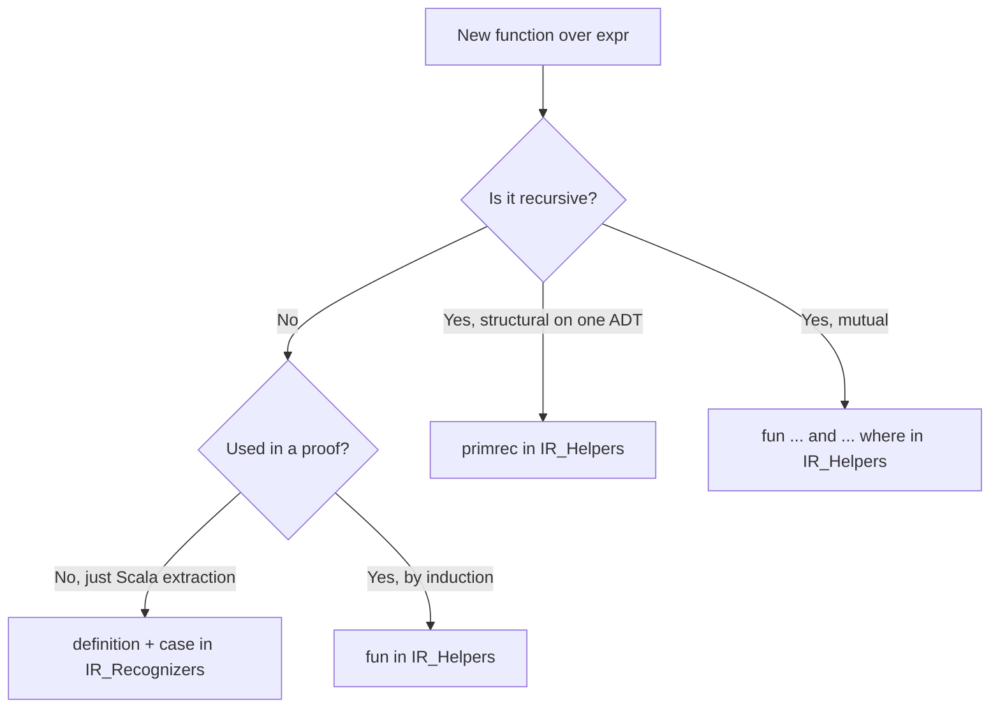

## Performance budget

A clean rebuild of the whole tree on a developer machine (this one is 16-core) runs in about
3.5 minutes wall, split across the four sessions. Most edits touch one session and re-elaborate only
that session plus whatever sits downstream, so the loop while editing is far shorter than the full
number.

| Session | Clean wall | Parallelism factor |
| ------- | ---------- | ------------------ |
| `SpecRest_IR` | ~0:58 | 2.7x |
| `SpecRest_Semantics` | ~1:42 | 2.8x |
| `SpecRest_Soundness` | ~0:16 | 4.9x |
| `SpecRest_Codegen` | ~0:39 | 3.5x |
| whole tree | ~3:43 | 3.0x |

Two per-command thresholds are worth watching while you edit:

| Metric | Budget | Why this number |
| ------ | ------ | --------------- |
| Slowest single `fun` | < 20 s | Above this, Isabelle's `running for N seconds` warning fires; usually fixable with a [proof idiom](/design/isabelle-proofs/proof-idioms) |
| Slowest single `by` | < 10 s | A slow `by` is almost always a `blast` searching the wrong half of HOL |

Two rounds of dedicated perf work got the tree to these numbers.
[#241](https://github.com/HardMax71/spec_to_rest/pull/241) cut the then-single session by 54%
(168 s to 77 s), and [#299](https://github.com/HardMax71/spec_to_rest/pull/299) cut it 74% (392 s to
102 s) after a run of lifted-primitive PRs had ballooned `IR.thy`. The tree was later split into the
four sessions above, which is why the budget is now per-session rather than one wall number.

## Building locally

The standard incantation (also run by the pre-commit hook) builds the two leaf sessions and lets the
shared `SpecRest_IR` and `SpecRest_Semantics` deps come along:

```bash
isabelle build -d proofs/isabelle/SpecRest -b SpecRest_Soundness SpecRest_Codegen
```

There is no session named plain `SpecRest`; the four are `SpecRest_IR`, `SpecRest_Semantics`,
`SpecRest_Soundness`, and `SpecRest_Codegen`. Useful flags during iteration:

| Flag | When |
| ---- | ---- |
| `-b` | Build the persistent heap images so a later run reuses them. |
| `-c` | Force a clean rebuild (don't reuse the heap). Use when measuring. |
| `-v` | Verbose per-theory and per-command timing. Required for profiling. |
| `-S` | Soft build: observe source changes, not heap images. Cheap pre-flight. |
| `-j N` | Maximum parallel jobs. |

The sessions set `threads = 0` in `ROOT`, which auto-picks based on `nproc`; don't pin it. The full
grammar of `ROOT` options lives in the Isabelle
[`system`](https://isabelle.in.tum.de/dist/Isabelle2025-2/doc/system.pdf) manual.

## Regenerating `SpecRestGenerated.scala`

`codegen/Codegen.thy` runs `export_code` on every build of `SpecRest_Codegen`, but Isabelle writes the
result into the session database. The checked-in
`modules/ir/src/main/scala/specrest/ir/generated/SpecRestGenerated.scala` is produced by extracting
it out:

```bash
work="$(mktemp -d)"
isabelle build -d proofs/isabelle/SpecRest -b SpecRest_Codegen
isabelle export -d proofs/isabelle/SpecRest -O "$work" \
  -x 'SpecRest_Codegen.Codegen:code/*' SpecRest_Codegen

target="modules/ir/src/main/scala/specrest/ir/generated/SpecRestGenerated.scala"
{ printf 'package specrest.ir.generated\n\n'
  cat "$work/SpecRest_Codegen.Codegen/code/SpecRestGenerated.scala"
} > "$target"
scalafmt --config .scalafmt.conf --non-interactive "$target"
```

The `isabelle-build` CI workflow runs the same extraction on every PR that touches
`proofs/isabelle/**` or the generated Scala, then `git diff`s the result against the committed file. A
theory edit that forgets the regen step fails CI. The same workflow greps for `sorry` and `oops` and
fails if either appears.

## Profiling: finding the next bottleneck

`isabelle build -v -c` emits two kinds of timing line. The per-theory cumulated time (thread-summed
across the commands in that theory) is the coarse map:

```text
SpecRest_IR: theory SpecRest_IR.IR             100% (32.7s cumulated time)
SpecRest_IR: theory SpecRest_IR.IR_FreeVars    100% (12.9s cumulated time)
SpecRest_IR: theory SpecRest_IR.IR_Helpers     100% (10.0s cumulated time)
SpecRest_IR: theory SpecRest_IR.IR_Recognizers 100% ( 9.2s cumulated time)
Finished SpecRest_IR (0:58 elapsed, 2:38 cpu, factor 2.72)
```

The second kind fires only when a single `fun` or `by` exceeds 20 s, and reprints every 2 s after
that:

```text
SpecRest_Semantics: command "fun" running for 24s (line N of theory "SpecRest_Semantics.Smt")
```

That second line is how you spot a hotspot, so in a healthy build it does not appear at all; the most
recent clean build had no command cross 20 s. A typical iteration loop:

1. `isabelle build -c -v -d proofs/isabelle/SpecRest SpecRest_Soundness SpecRest_Codegen 2>&1 | tee /tmp/iter.log`
2. `grep "running for" /tmp/iter.log | tail -10` to find the worst offenders.
3. `sed -n '<line>,+5p' proofs/isabelle/SpecRest/<session>/<theory>.thy` to inspect.
4. Apply one of the [proof idioms](/design/isabelle-proofs/proof-idioms).
5. Rebuild and compare.

Cap the wait at five to six minutes per iteration. Anything longer and you are optimizing the wrong
thing.

## Passing IR context across the Scala/Isabelle boundary

Lifted IR walkers (`aliasRefinements`, `findEnumValuesInType`) take alias and enum declarations as
association lists, defined in `codegen/SchemaTraversal.thy`:

```text
type_synonym alias_map = "(String.literal × type_alias_decl) list"
type_synonym enum_map  = "(String.literal × enum_decl) list"
```

This is deliberate, not lazy. Isabelle's only code-extractable finite-map type is the abstract
`Mapping`, and the codegen session does not yet wire it to the `RBT_Mapping` red-black-tree backing.
Until it does, the walker uses `map_of` on a list, which is O(n) per lookup. The Scala caller's job is
to make sure that lookup happens against a pre-built list, not a re-derived one.

That is what `specrest.ir.IrIndex` is for. Built once per service IR and cached in a weak-keyed map, it
carries the declarations and their name-keyed maps and sets:

```scala
final case class IrIndex(
    entities: List[entity_decl],
    enums: List[enum_decl],
    aliases: List[type_alias_decl],
    entityByName: Map[String, entity_decl],
    enumByName: Map[String, enum_decl],
    aliasByName: Map[String, type_alias_decl],
    entityNames: Set[String],
    enumNames: Set[String],
    aliasNames: Set[String]
)
```

A consumer that used to recompute `entityNames` or an alias map inline now reads `ir.idx.entityNames`
or `ir.idx.aliasByName`, and `IrIndex.aliasAList` / `enumAList` hand the walker the association list it
wants. The maps cost one build per IR even when threaded through dozens of helper calls. Adopt the
pattern for any new consumer.

Keeping symbolic name references is also deliberate. MLIR keeps its
[`SymbolRefAttr`](https://mlir.llvm.org/docs/SymbolsAndSymbolTables/) precisely because resolved
pointers tie an IR to a particular notion of scope and dominance, while refs survive serialization and
round-tripping; `NamedTypeF "Email"` here is a reference by design, not a missed resolution, and the
lookup cost is the price of decoupling. Two future steps would cut that cost: switch the walker
signatures to `Mapping` and `import HOL-Library.RBT_Mapping`
([Isabelle library](https://www.cl.cam.ac.uk/research/hvg/Isabelle/dist/library/HOL/HOL-Library/RBT_Mapping.html))
in `Codegen.thy` so extracted lookups become O(log n) without touching call sites, or resolve the IR
once into a side ADT so walkers become trivial pattern matches, the way
[CakeML](https://cakeml.org/icfp16.pdf) and CompCert do at their elaboration phase.

## Adding new functions to the `core/` theories



After adding:

1. Add the symbol to `Codegen.thy`'s `export_code` block if a Scala consumer needs it.
2. Regenerate `SpecRestGenerated.scala` with the recipe above.
3. Run `isabelle build -v -c` and confirm no `running for` line crosses 20 s.
4. If one does, apply a [proof idiom](/design/isabelle-proofs/proof-idioms) before committing.

The `fun` / `primrec` / `function` packages and their termination and induction machinery are
documented in the Isabelle
[`functions`](https://isabelle.in.tum.de/dist/Isabelle2025-2/doc/functions.pdf) manual.
