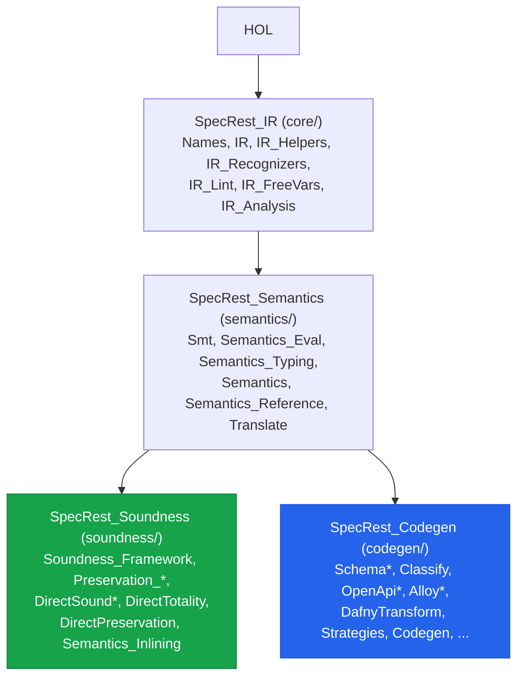
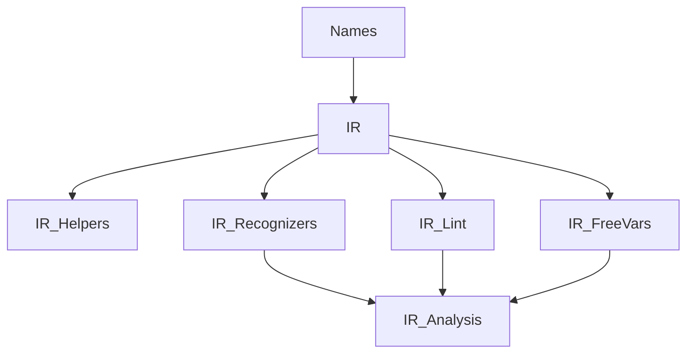

The `proofs/isabelle/SpecRest/` proof tree mechanically verifies the verifier's translator
(`translate`), evaluator (`eval`), and SMT evaluator (`smt_eval`), and exports the canonical IR
datatype plus the extracted functions to
`modules/ir/src/main/scala/specrest/ir/generated/SpecRestGenerated.scala`. Two named theorems carry
the result, both closing with zero `sorry`: `translate_soundness_standalone` in
`soundness/DirectSound.thy` and `cat_h_progress_and_preservation_direct` in
`soundness/DirectPreservation.thy`. The pivot from Lean 4 landed in
[#193](https://github.com/HardMax71/spec_to_rest/issues/193); the separate verified-subset `expr`
and full-language `expr_full` were later collapsed into one `expr` in
[#391](https://github.com/HardMax71/spec_to_rest/issues/391), so the IR is now a single 27-constructor
datatype whose constructors keep their `F` suffix (`BinaryOpF`, `IdentifierF`, and the rest).

For what the proofs cover and how the regeneration pipeline works, see
[`proofs/isabelle/README.md`](https://github.com/HardMax71/spec_to_rest/blob/main/proofs/isabelle/README.md);
for the shipped-phase ledger and any open theorems,
[`proofs/isabelle/STATUS.md`](https://github.com/HardMax71/spec_to_rest/blob/main/proofs/isabelle/STATUS.md);
for the engineering journal that records every attempted change with measured impact,
[`proofs/isabelle/SPEEDUP.md`](https://github.com/HardMax71/spec_to_rest/blob/main/proofs/isabelle/SPEEDUP.md).

## The four sessions

`proofs/isabelle/SpecRest/ROOT` defines four sessions, one per subdirectory, not a single monolith.
Each builds on the one before it, so a heap is reused across the chain and an edit only re-elaborates
its own session and whatever sits downstream.

`SpecRest_Soundness` is the theorem track. `SpecRest_Codegen` is the extraction track: it adds
`HOL-Library` and ends in `Codegen.thy`, whose `export_code` block is the contract with the Scala
layer. The two leaf sessions are independent of each other, so CI and the pre-commit hook build both
(`SpecRest_Soundness SpecRest_Codegen`) and let the shared `SpecRest_IR` and `SpecRest_Semantics`
deps come along.

## What lives where

`SpecRest_IR` (`core/`) holds the datatypes and the pure walks over them.

| Theory | Lines | What it owns |
| ------ | ----- | ------------ |
| `Names.thy` | ~135 | name and string helpers, including the monomorphic `string_in_list` |
| `IR.thy` | ~725 | every datatype (the 27-constructor `expr`, the declaration types, `service_ir`) plus base structural walks (`subexprs`, `stripSpans`, `flattenAnd*`, `rootIdentifier`) |
| `IR_Helpers.thy` | ~585 | the `collectExprInfo` mutual walker, entity / type / schema helpers, inheritance flattening, and lemmas about them |
| `IR_Recognizers.thy` | ~335 | shape recognizers (`preservedRelationOf`, `createPatternOf`, `decomposeAtom`) |
| `IR_Lint.thy` | ~225 | lint analysis over the IR |
| `IR_FreeVars.thy` | ~265 | `free_vars` / `subst` / `hasPrePrime` mutual recursions |
| `IR_Analysis.thy` | ~10 | umbrella that re-exports `IR_Recognizers`, `IR_Lint`, and `IR_FreeVars` under one import |

`SpecRest_Semantics` (`semantics/`) holds the meaning of the IR and the translation to SMT.

| Theory | Lines | What it owns |
| ------ | ----- | ------------ |
| `Smt.thy` | ~535 | the SMT IR (`smt_term`, `smt_val`, `smt_model`) and `smt_eval` |
| `Semantics_Eval.thy` | ~235 | `ir_value`, `state`, and `eval` |
| `Semantics_Typing.thy` | ~1145 | the typing context, the typing judgement, and `check_value_has_ty` |
| `Semantics.thy` | ~10 | umbrella re-exporting `Semantics_Eval` and `Semantics_Typing` |
| `Semantics_Reference.thy` | ~380 | the reference semantics that the inlining and preservation proofs compare against |
| `Translate.thy` | ~415 | the translator `translate :: expr => smt_term` |

`SpecRest_Soundness` (`soundness/`) is the proof track. `DirectSound.thy` closes
`translate_soundness_standalone`; `DirectPreservation.thy` closes
`cat_h_progress_and_preservation_direct`.

| Theory | Lines | What it owns |
| ------ | ----- | ------------ |
| `Soundness_Framework.thy` | ~535 | shared lemmas and the relation framework the direct proofs build on |
| `Preservation_Wf.thy` / `Preservation_WellTyped.thy` | ~135 / ~160 | preservation under well-formedness and well-typedness |
| `DirectSound_Smt.thy` / `DirectSound_Desugar.thy` / `DirectSound.thy` | ~445 / ~180 / ~935 | the direct soundness proof, ending in `translate_soundness_standalone` |
| `DirectTotality.thy` | ~475 | totality of the translation over the subset |
| `DirectPreservation.thy` | ~550 | `cat_h_progress_and_preservation_direct` |
| `Semantics_Inlining.thy` | ~1275 | meaning preservation of call inlining |

`SpecRest_Codegen` (`codegen/`) is the extraction track: 23 theories, roughly 5,450 lines, covering
schema derivation and diffing, OpenAPI and Alloy emission, the Dafny transform, convention
validation, and classification. It ends in `Codegen.thy` (~485 lines), whose `export_code` directives
are the single contract with the generated Scala.

## Why split this way

Polyml runs one ML kernel per session but elaborates separate theories on separate threads. Splitting
the datatypes-and-walks layer into `IR`, `IR_Helpers`, `IR_Recognizers`, `IR_Lint`, and `IR_FreeVars`
lets the four leaf theories elaborate in parallel once the base `IR` finishes, instead of serializing
through one large file.

The session boundaries do the same job at a coarser grain. Editing a proof in
`SpecRest_Soundness` never re-elaborates `SpecRest_Codegen`, and vice versa, because neither imports
the other. The umbrella theories (`IR_Analysis`, `Semantics`) exist so a downstream importer can pull
a whole layer with one name while the definitions stay in their own parallelizable files.
