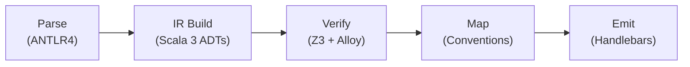

import { Card, Cards } from 'fumadocs-ui/components/card';
import { Callout } from 'fumadocs-ui/components/callout';
import {
  ShieldCheck,
  Workflow,
  Sparkles,
  Layers,
  BookOpen,
  Cpu,
  FileCode2,
  ArrowRight,
} from 'lucide-react';

<div className="not-prose mt-2 mb-10 flex flex-col gap-4 rounded-2xl border bg-gradient-to-br from-fd-card via-fd-card to-fd-primary/5 p-8 shadow-sm">
  <div className="text-xs uppercase tracking-[0.18em] text-fd-muted-foreground">
    Scala 3 · Cats Effect 3 · Z3 · Alloy
  </div>
  <h1 className="text-4xl font-semibold tracking-tight md:text-5xl">
    Specs in. <span className="text-fd-primary">Verified REST out.</span>
  </h1>
  <p className="max-w-2xl text-lg text-fd-muted-foreground">
    <strong>spec_to_rest</strong> compiles a formal behavioral specification &mdash; entities,
    operations with pre/post conditions, invariants &mdash; into a running REST service whose
    correctness has been mechanically checked before a single line is emitted.
  </p>
  <div className="mt-2 flex flex-wrap gap-3">
    <a
      href="/spec-language"
      className="inline-flex items-center gap-2 rounded-lg bg-fd-primary px-4 py-2 text-sm font-medium text-fd-primary-foreground shadow transition hover:bg-fd-primary/90"
    >
      <BookOpen className="h-4 w-4" />
      Read the spec language
    </a>
    <a
      href="https://github.com/HardMax71/spec_to_rest"
      target="_blank"
      rel="noopener noreferrer"
      className="inline-flex items-center gap-2 rounded-lg border bg-fd-card px-4 py-2 text-sm font-medium text-fd-foreground transition hover:bg-fd-accent"
    >
      <FileCode2 className="h-4 w-4" />
      Source on GitHub
    </a>
  </div>
</div>

## Why a verified compiler

<Cards>
  <Card
    icon={<ShieldCheck />}
    title="Verified before emit"
    description="Z3 checks invariant satisfiability, operation requires/enabled, and per-(op × invariant) preservation. Alloy handles powerset and temporal predicates. Failed verification refuses codegen — what ships matches what was checked."
  />
  <Card
    icon={<Sparkles />}
    title="Counterexamples in plain English"
    description="When verification fails, the compiler narrates why: which operation, which invariant, which contributing field, with concrete pre/post values from the solver model. No staring at unsat cores."
  />
  <Card
    icon={<Workflow />}
    title="Cancellable, parallel checks"
    description="Every pipeline stage returns IO. Per-check timeouts run inside the solver; SIGINT propagates to fiber cancel and Z3 Context.interrupt(). --parallel <n> dispatches via parTraverseN."
  />
  <Card
    icon={<Layers />}
    title="One spec, many targets"
    description="Python/FastAPI/PostgreSQL today, Go/chi and TypeScript/Express on the roadmap. Convention rules (M1–M10) plus per-target profiles map abstract spec to concrete HTTP/DB conventions."
  />
  <Card
    icon={<FileCode2 />}
    title="Code as artifact"
    description="The emitter writes the full project tree: app/, alembic/, tests/, Dockerfile, docker-compose.yml, OpenAPI spec, GitHub Actions CI. Run sbt 'cli/run compile ...' once and you have a deployable service."
  />
  <Card
    icon={<Cpu />}
    title="Effect-typed end to end"
    description="Parse, IR build, Z3/Alloy translate, backend check, top-level Consistency.runConsistencyChecks — every public entry is IO[Either[VerifyError, _]]. Backends acquired as Resource[IO, _] with cancel-aware finalizers."
  />
</Cards>

## How it works



Five stages, each with a typed boundary. The verify stage is the gate &mdash; if any check fails,
`compile` exits non-zero and writes nothing.

## A 25-line URL shortener

```spec
service UrlShortener {
  entity Url {
    code: String
    target: String
    clicks: Int = 0
    created: DateTime = now()
  }

  operation Shorten(target: String) -> Url {
    requires valid_url(target)
    ensures store'.contains(result)
    ensures result.target == target
    ensures result.clicks == 0
  }

  operation Resolve(code: String) -> Url {
    requires store.exists(u => u.code == code)
    ensures result == store.find(u => u.code == code)
    ensures result.clicks == store.find(u => u.code == code).clicks + 1
  }

  invariant unique_codes {
    forall a, b in store: a.code == b.code => a == b
  }
}
```

From the above, the compiler emits a complete FastAPI + Postgres project: handlers, SQLAlchemy
models, Alembic migrations, Pydantic schemas, OpenAPI 3.1, a Dockerfile, a docker-compose stack,
and a GitHub Actions CI workflow. See [Python + FastAPI + PostgreSQL](/targets/python-fastapi-postgres)
for the rendered tree and the live OpenAPI viewer.

<Callout type="info">
  The verifier is opinionated about what it accepts. Plain first-order Z3 handles 99% of operation
  contracts; powerset and temporal logic route to Alloy with a bounded scope. Constructs that fall
  outside both surface as <code>translator_limitation</code> diagnostics &mdash; never silent passes.
</Callout>

## Where to next

<Cards>
  <Card
    icon={<BookOpen />}
    title="Spec Language"
    description="Full grammar, type system, structural lints, and convention overrides."
    href="/spec-language"
  />
  <Card
    icon={<ShieldCheck />}
    title="Verification Engine"
    description="Z3/Alloy routing, preservation VC shape, diagnostic categories, JSON output, --dump-vc."
    href="/pipelines/verification"
  />
  <Card
    icon={<Workflow />}
    title="Concurrency & Cancellation"
    description="The IO/Resource model, --parallel and --timeout semantics, JMH benchmark numbers."
    href="/pipelines/concurrency"
  />
  <Card
    icon={<Cpu />}
    title="Architecture"
    description="Module layout, IR ADT design, effect-system layering, build plan."
    href="/design/architecture"
  />
  <Card
    icon={<Layers />}
    title="Convention Engine"
    description="The M1–M10 mapping rules from spec to REST, DB, and HTTP conventions."
    href="/design/convention-engine"
  />
  <Card
    icon={<FileCode2 />}
    title="Python + FastAPI + Postgres"
    description="The reference deployment target — emitted file tree, naming rules, live OpenAPI."
    href="/targets/python-fastapi-postgres"
  />
</Cards>
