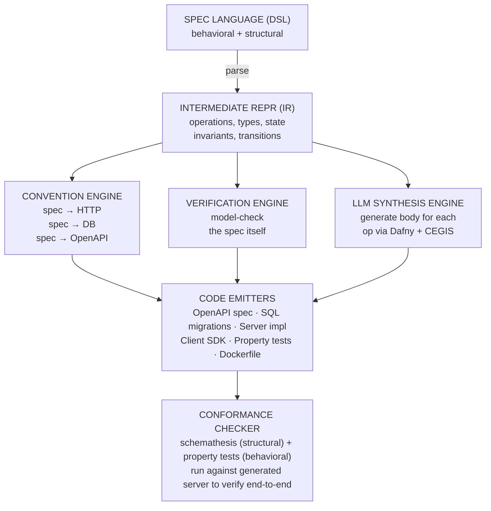

> A formal-specification-to-running-REST-service compiler. This document synthesizes research across
> 7 domains: Alloy-to-code tools, LLM+verification synthesis, spec-first REST generators, program
> synthesis foundations, model-driven engineering, property-based testing, and service DSLs.

---

## 1. Executive Summary

**The goal:** Write a formal behavioral specification of a REST service and have a compiler produce
a complete, verified, running implementation in a single pass -- abstracting away HTTP, database,
language, and infrastructure concerns.

**The verdict:** No such tool exists today. But every piece of it has been built separately by
different communities who don't talk to each other. This is an engineering integration project, not
a research moonshot.

**The landscape gap (confirmed by research across 60+ tools):**

| Capability                     | Tools that do it                                | Missing piece               |
| ------------------------------ | ----------------------------------------------- | --------------------------- |
| Formal behavioral verification | TLA+, Alloy, Quint, P language                  | No code generation          |
| Structural API spec generation | TypeSpec, Smithy, OpenAPI                       | No behavioral verification  |
| Code generation from specs     | openapi-generator, JHipster, Ballerina          | No behavioral correctness   |
| Verified code extraction       | Dafny, F\*/KaRaMeL, Coq                         | No REST/HTTP awareness      |
| LLM+verifier synthesis loops   | Clover, AutoVerus, DafnyPro (86% on benchmarks) | No service targeting        |
| Conformance testing from specs | Schemathesis, RESTler, Hypothesis               | Testing only, no generation |
| Alloy-to-code compilation      | Alchemy (2008, Brown/WPI)                       | Dead research prototype     |

**No tool bridges behavioral specification to REST service implementation.** JHipster is closest on
the structural side (full CRUD stacks from JDL). TLA+/P language are closest on the behavioral side
(used at AWS on S3, DynamoDB). The gap between them is exactly what this compiler fills.

---

## 2. Prior Art: What Has Been Tried

### 2.1 Alchemy (2008) -- The Only Direct Predecessor

- **Authors:** Krishnamurthi, Dougherty, Fisler, Yoo (WPI/Brown)
- **What it did:** Compiled Alloy specs to database-backed implementations
- **Pipeline:** Alloy sigs -> DB tables, Alloy predicates -> stored procedures, Alloy facts -> DB
  integrity constraints
- **Core algorithm:** Rewriting relational algebra formulas into database transaction code
- **Why it died:** Research prototype, subset of Alloy only, no HTTP layer, no maintenance after
  2010
- **Key insight we inherit:** The convention that "state-change predicates = write operations" and
  "facts = integrity constraints" is directly applicable to REST services
- **Paper:**
  [FSE 2008](https://cs.brown.edu/~sk/Publications/Papers/Published/kdfy-alchemy-trans-alloy-spec-impl/)
- **Improved algorithm:** [arXiv:1003.5350](https://arxiv.org/abs/1003.5350) (2010)

### 2.2 Imperative Alloy (2010) -- Alloy-to-Prolog

- **Author:** Joseph P. Near (MIT, Jackson's group)
- **What it did:** Extended Alloy with imperative constructs, compiled to Prolog
- **Key insight:** Prolog's native nondeterminism maps well to Alloy's declarative constraints
- **Why it matters:** Shows that the relational-to-imperative translation is feasible for a useful
  subset
- **Thesis:**
  [people.csail.mit.edu/jnear/papers/jnear_ms.pdf](https://people.csail.mit.edu/jnear/papers/jnear_ms.pdf)

### 2.3 aRby (2014) -- Alloy Embedded in Ruby

- **Authors:** Milicevic, Efrati, Jackson (MIT CSAIL)
- **What it did:** Mixed imperative Ruby + declarative Alloy constraint solving in same program
- **Key insight:** You can embed a spec language in an executable host and get both verification and
  execution
- **Status:** Inactive since 2014, 19 GitHub stars
- **GitHub:** [github.com/sdg-mit/arby](https://github.com/sdg-mit/arby)

### 2.4 Squander (2011) -- Alloy Specs as Java Annotations

- **Authors:** Milicevic, Rayside, Yessenov, Jackson (MIT)
- **What it did:** Java annotations with Alloy-like specs, solved at runtime against live heap via
  Kodkod/SAT
- **Key insight:** Specs can be inline with executable code and enforced at runtime
- **GitHub:**
  [github.com/aleksandarmilicevic/squander](https://github.com/aleksandarmilicevic/squander)

### 2.5 Milicevic PhD Thesis (2015) -- Unifying Framework

- **Title:** "Advancing Declarative Programming" (MIT)
- **Covers:** aRby, Alloy\*, Squander, and SUNNY (a model-based reactive web framework)
- **SUNNY is notable:** Domain-specific language with declarative constraints, runtime model
  checking, online code generation, reactive UI updates. This is the closest historical precedent to
  what we want to build.
- **PDF:**
  [aleksandarmilicevic.github.io/papers/mit15-milicevic-phd.pdf](https://aleksandarmilicevic.github.io/papers/mit15-milicevic-phd.pdf)

### 2.6 Rosette (Active) -- The Spiritual Successor

- **Author:** Emina Torlak (UW) -- also created Kodkod, Alloy's SAT backend
- **What it does:** Solver-aided Racket programming. Write an interpreter for any DSL in Rosette,
  get synthesis/verification for free.
- **Key capability:** `(synthesize #:forall input #:guarantee expr)` finds values for program holes
  satisfying all inputs
- **Why it matters:** Demonstrates that the "DSL interpreter in a solver-aided host" pattern can
  make specs executable
- **Status:** Active (v4.1), 688 stars
- **Site:** [emina.github.io/rosette/](https://emina.github.io/rosette/)

---

## 3. The LLM+Verification Frontier (2023-2026)

This is the most active and promising research area. 16 major projects in the last 3 years.

### 3.1 The Dominant Pattern: Generate-Check-Repair

Nearly all successful systems use the same loop:

```
LLM generates candidate code
    -> Formal verifier checks it
    -> If fail: error message + counterexample fed back to LLM
    -> Repeat until verified or budget exhausted
```

### 3.2 Key Projects (ranked by relevance to our compiler)

| Project                         | Year | Target            | Success Rate                                               | Key Innovation                                           |
| ------------------------------- | ---- | ----------------- | ---------------------------------------------------------- | -------------------------------------------------------- |
| **Clover** (Stanford)           | 2023 | Dafny             | 87% acceptance, 0% false positives                         | Triangulates code/annotations/docstrings for consistency |
| **DafnyPro**                    | 2026 | Dafny             | 86% on DafnyBench                                          | Diff-checker + pruner + hint augmentation                |
| **AutoVerus** (MSR)             | 2024 | Verus/Rust        | >90% on 150 tasks                                          | Multi-agent mimicking human proof phases                 |
| **AlphaVerus** (CMU)            | 2024 | Verus/Rust        | 32.9-65.7% verified code gen (75.7% proof-only annotation) | Self-improving via iterative translation                 |
| **SAFE** (MSR)                  | 2024 | Verus/Rust        | 43% on VerusBench                                          | Self-evolving spec + proof synthesis                     |
| **Laurel** (UCSD)               | 2024 | Dafny             | 56.6% assertion gen                                        | Localizes where assertions are needed                    |
| **VerMCTS** (Harvard)           | 2024 | Dafny/Coq         | +30% absolute over baselines                               | Verifier as MCTS heuristic                               |
| **Baldur** (UMass/Google)       | 2023 | Isabelle/HOL      | 65.7% combined                                             | Whole-proof generation + repair                          |
| **LMGPA** (Northeastern)        | 2025 | TLA+              | 38-59% on protocols                                        | Constrained decomposition for TLA+ proofs                |
| **LLMLift** (UC Berkeley)       | 2024 | DSL transpilation | 44/45 Spark benchmarks                                     | Python as intermediate repr for LLMs                     |
| **Eudoxus/SPEAC** (UC Berkeley) | 2024 | UCLID5            | 84.8% parse rate                                           | "Parent language" design for LLM alignment               |
| **SynVer** (Purdue)             | 2024 | C + Rocq/VST      | Verified linked lists, BSTs                                | Two-LLM: coder + prover                                  |

### 3.3 Key Trend: Dafny as the Verification IL

The field is converging on **Dafny** as the preferred intermediate verification language because:

- Auto-active verification (specs inline with code, no separate proof scripts)
- Compiles to C#, Java, Go, JavaScript, Python
- Growing benchmark ecosystem (DafnyBench)
- Success rates climbing: ~70% -> 86% in one year (2025-2026)
- AWS already uses smithy-dafny for SDK verification

### 3.4 Implications for Our Compiler

The LLM+verifier loop is the key to filling the "business logic" gap. The convention engine handles
structural mapping (spec -> HTTP routes, DB schema), but business logic (how to compute a short
code, how to validate a URL) needs synthesis. The research shows:

1. **LLMs can reliably generate code that passes formal verification** (86%+ on Dafny)
2. **The verifier feedback loop is critical** -- raw LLM generation is much worse
3. **Dafny is the right intermediate target** -- verified, then compiled to any language
4. **Clover's triangulation approach** is especially relevant: generate code + annotations +
   docstrings, cross-validate all three

---

## 4. Spec-First REST Tools: The Structural Side

### 4.1 Tools That Generate Code from API Specs

| Tool                     | Input                  | Output                                        | Quality                                           | Stars |
| ------------------------ | ---------------------- | --------------------------------------------- | ------------------------------------------------- | ----- |
| **OpenAPI Generator**    | OpenAPI YAML           | 40+ language stubs                            | Mixed -- "often doesn't compile" for some targets | 26.1k |
| **Smithy** (AWS)         | Smithy IDL             | Client+server SDKs (7+ langs)                 | Production-proven (all AWS SDKs)                  | --    |
| **TypeSpec** (Microsoft) | TypeSpec DSL           | OpenAPI + JSON Schema + protobuf              | High -- enforces consistency                      | 5.7k  |
| **JHipster**             | JDL                    | Full-stack CRUD apps (Spring Boot + frontend) | Production-ready but CRUD-only                    | --    |
| **Ballerina**            | Ballerina code         | Bidirectional OpenAPI                         | Tight integration, niche language                 | --    |
| **gRPC-Gateway**         | Protobuf + annotations | Go reverse-proxy + OpenAPI v2                 | Battle-tested, millions of req/day                | 19.9k |

### 4.2 Key Insights for Our Compiler

- **OpenAPI Generator quality varies wildly** -- we should generate OpenAPI as an intermediate
  artifact but not rely on third-party generators for the final code
- **Smithy's trait system** is the best model for extensible API metadata
- **JHipster is the closest existing tool** to what we want (spec -> running app), but it's
  CRUD-only with no behavioral verification
- **Ballerina proves** a language can be purpose-built for network services with structural typing
  and first-class HTTP
- **TypeSpec proves** a focused DSL can generate multiple output formats from a single source

### 4.3 Testing Tools That Verify Implementations Against Specs

| Tool              | Technique                                  | Finds                                          | Status                     |
| ----------------- | ------------------------------------------ | ---------------------------------------------- | -------------------------- |
| **Schemathesis**  | Property-based fuzzing from OpenAPI        | Schema violations, 500s, validation bypasses   | Active (~4.15), 3.2k stars |
| **RESTler** (MSR) | Stateful fuzzing with dependency inference | Security bugs, resource leaks, race conditions | Active, 2.9k stars         |
| **EvoMaster**     | Evolutionary test generation               | 80 real bugs across 5 services                 | Active, 695 stars          |
| **Dredd**         | Schema validation                          | Structural conformance                         | **Archived Nov 2024**      |
| **Pact**          | Consumer-driven contracts                  | Integration mismatches                         | Active, mature             |

---

## 5. Formal Specification Languages: The Behavioral Side

### 5.1 Languages Ranked by Relevance

| Language             | Expressiveness                               | Code Gen                   | Industry Use                                       | Our Relevance                                  |
| -------------------- | -------------------------------------------- | -------------------------- | -------------------------------------------------- | ---------------------------------------------- |
| **Dafny**            | Pre/postconditions, invariants, termination  | C#, Java, Go, JS, Python   | AWS (Cedar)                                        | **Primary target** -- verified impl extraction |
| **TLA+**             | Temporal logic, state machines, concurrency  | None (verification only)   | AWS (S3, DynamoDB, 10 systems per 2015 CACM paper) | **Spec language inspiration**                  |
| **Quint**            | TLA+ with TS-like syntax, temporal operators | Traces + verification      | Blockchain protocols                               | **Syntax inspiration**                         |
| **Alloy**            | Relational logic, transitive closure         | None (analysis only)       | AT&T, Amazon (limited)                             | **Data modeling inspiration**                  |
| **P language** (AWS) | Communicating state machines                 | None (verification only)   | AWS (S3, DynamoDB, Aurora, EC2)                    | **State machine model**                        |
| **Event-B**          | Refinement-based, set theory                 | Java, C, Ada (via plugins) | Safety-critical systems                            | **Refinement concept**                         |
| **VDM**              | Pre/postconditions, set theory               | Java, C (via Overture)     | Legacy industrial                                  | **Operation modeling**                         |
| **F\***              | Dependent types, effects                     | C (via KaRaMeL)            | HACL\* crypto (Firefox, Linux)                     | **Extraction proof**                           |

### 5.2 The P Language Deserves Special Attention

AWS's P language is the closest to our target domain:

- Specifies systems as **communicating state machines** (= microservices)
- Used for S3's strong consistency migration, DynamoDB, MemoryDB, Aurora, EC2, IoT
- **PObserve** (2023) validates production logs match P specs post-hoc
- But: P is verification-only, does not generate service code

### 5.3 Session Types -- Behavioral Types for Communication

- **Scribble** (Imperial College) generates type-safe Java API channels from global protocol specs
- Session types guarantee freedom from communication errors, deadlocks, livelocks
- Implementations exist for 16+ languages
- **Problem:** REST is stateless request-response; session types assume stateful multi-step sessions
- **Opportunity:** Session types could model multi-step API workflows (create -> retrieve -> update
  -> delete)

---

## 6. The Compiler Architecture

Based on all the research, here is the architecture that synthesizes the best ideas from each field.

### 6.1 Overview



### 6.2 The Five Stages

**Stage 1: Spec Language + Parser**

A new DSL combining:

- **Alloy-like** relational data modeling (sigs, fields, relations)
- **TLA+/Quint-like** state transition definitions (pre/post conditions)
- **VDM-like** operation modeling (requires/ensures)
- **TypeSpec-like** API hints (when the user wants to override conventions)

See Section 7 for the language design.

**Stage 2: Convention Engine** (the key innovation)

A declarative mapping that bridges the abstraction gap:

```
state mutation with input  ->  POST /{resource}
state read, no mutation    ->  GET /{resource}/{id}
partial state mutation     ->  PATCH /{resource}/{id}
state deletion             ->  DELETE /{resource}/{id}
collection read            ->  GET /{resource}
requires clause            ->  HTTP 422 + request validation
ensures clause             ->  response schema + property test
fact / invariant           ->  DB constraint + runtime assertion
sig with fields            ->  DB table + ORM model
relation (one-to-many)     ->  foreign key
relation (many-to-many)    ->  junction table
```

This is what Alchemy did for databases in 2008. We extend it to HTTP + DB + tests.

**Stage 3: Verification Engine**

Before generating any code, verify the spec itself:

- Model-check for reachability (can all operations be invoked?)
- Check for conflicting invariants
- Verify that postconditions are achievable given preconditions
- Check for deadlocks in state machine transitions

Tools: Alloy Analyzer for relational checks, or compile to Quint/TLA+ for temporal checks.

**Stage 4: LLM Synthesis + CEGIS Loop** (for business logic)

For each operation:

1. Extract the pre/postcondition pair from the spec
2. Generate a Dafny implementation using an LLM (Clover-style triangulation)
3. Verify with Dafny verifier
4. If verification fails, feed error + counterexample back to LLM
5. Repeat (budget: ~8 iterations, per DafnyPro research showing 86% success)
6. Compile verified Dafny to target language (Python, Go, Java, etc.)

For simple CRUD operations, skip the LLM -- the convention engine can emit them directly (like
JHipster does).

**Stage 5: Conformance Testing**

Generate a test suite from the spec:

- **Structural tests:** Schemathesis-style fuzzing against the generated OpenAPI
- **Behavioral tests:** Hypothesis-style stateful tests encoding the spec's pre/postconditions as a
  state machine model (QuickCheck/Hypothesis `RuleBasedStateMachine`)
- **Trace validation:** If the spec has temporal properties, generate TLA+ traces and validate
  against running system (MongoDB's approach, Kuppe et al. 2024)

---

## 7. The Spec Language Design

### 7.1 Design Principles

1. **Looks like pseudocode, not math** -- target audience is developers, not proof theorists
2. **Structural + behavioral in one file** -- don't split across formalisms
3. **Conventions are defaults, overridable** -- the convention engine makes decisions you can
   override
4. **No HTTP/DB/language concepts** -- those are compilation targets, not spec concerns
5. **Machine-verifiable** -- every statement can be model-checked before code generation

### 7.2 Language Sketch

```
service UrlShortener {

  // --- Data Model (Alloy-inspired) ---

  entity ShortCode {
    value: String
    invariant: len(value) >= 6 and len(value) <= 10
    invariant: value matches /^[a-zA-Z0-9]+$/
  }

  entity LongURL {
    value: String
    invariant: isValidURI(value)
  }

  // --- State (the abstract "database") ---

  state {
    store: ShortCode -> lone LongURL    // partial function: each code maps to at most one URL
    created_at: ShortCode -> DateTime   // metadata
  }

  // --- Operations (VDM/Dafny-inspired) ---

  operation Shorten {
    input:   url: LongURL
    output:  code: ShortCode, short_url: String

    requires: isValidURI(url.value)

    ensures:
      code not in pre(store)           // code was fresh
      store'[code] = url               // store updated
      short_url = base_url + "/" + code.value
      #store' = #store + 1             // exactly one entry added
  }

  operation Resolve {
    input:  code: ShortCode
    output: url: LongURL

    requires: code in store             // code must exist

    ensures:
      url = store[code]                // correct lookup
      store' = store                   // state unchanged
  }

  operation Delete {
    input:  code: ShortCode

    requires: code in store

    ensures:
      code not in store'               // removed
      #store' = #store - 1
  }

  // --- Global Invariants ---

  invariant: all c in store | isValidURI(store[c].value)
  invariant: all c in store | c in created_at

  // --- Optional: Override Conventions ---

  conventions {
    Resolve.http_method = "GET"           // default would be GET anyway (no mutation)
    Resolve.http_status_success = 302     // override: redirect instead of 200
    Resolve.http_header "Location" = output.url
  }
}
```

### 7.3 What the Convention Engine Produces from This

| Spec Element                                   | Convention Output                                           |
| ---------------------------------------------- | ----------------------------------------------------------- |
| `entity ShortCode`                             | DB column type `VARCHAR(10) CHECK(...)`, Pydantic/Go struct |
| `entity LongURL`                               | DB column type `TEXT CHECK(...)`, Pydantic/Go struct        |
| `state store: ShortCode -> lone LongURL`       | DB table `store(code VARCHAR PK, url TEXT NOT NULL)`        |
| `operation Shorten` (mutates state, has input) | `POST /shorten`                                             |
| `operation Resolve` (reads state, no mutation) | `GET /{code}`                                               |
| `operation Delete` (removes from state)        | `DELETE /{code}`                                            |
| `requires: code in store`                      | HTTP 404 when code not found                                |
| `requires: isValidURI(url.value)`              | HTTP 422 with validation error                              |
| `invariant: all c in store \| isValidURI(...)` | DB CHECK constraint + runtime assertion                     |
| `ensures: code not in pre(store)`              | Property test: after POST, code didn't exist before         |

### 7.4 What the LLM Synthesizes

The convention engine handles the structural mapping. The LLM handles:

- **How to generate a short code** (the algorithm inside `Shorten` -- hash? random? counter?)
- **How to construct the short_url** (string concatenation with base URL)
- **Any non-trivial computation** in operation bodies

The LLM generates these as Dafny functions with the spec's pre/postconditions as Dafny
`requires`/`ensures` clauses. The Dafny verifier confirms correctness. Then Dafny compiles to the
target language.

---

## 8. Technical Risks and Mitigations

### Risk 1: The Abstraction Gap is Too Wide

**Concern:** The spec says `store' = store + {code -> url}` but code needs to decide about
transactions, retries, connection pooling, etc.

**Mitigation:** The convention engine encodes these decisions as infrastructure templates. A
Postgres template includes transaction handling. A Redis template includes connection management.
The user selects a "deployment profile" (postgres+fastapi, redis+go-chi, etc.) and the templates
fill the infrastructure gap. This is what JHipster does successfully.

### Risk 2: LLM Synthesis Fails for Complex Operations

**Concern:** DafnyPro achieves 86% on benchmarks, but real operations may be harder.

**Mitigation:**

- For CRUD operations (majority of REST APIs), skip the LLM entirely -- emit directly from
  conventions
- For complex operations, fall back to generating a skeleton with a `TODO` comment
- The user can always write the body manually; the spec still generates everything else
- Use the Clover triangulation approach (code + annotations + docstrings cross-validated)

### Risk 3: Generated Code Quality is Poor

**Concern:** openapi-generator "often doesn't compile" for some targets. Dafny's generated code is
"not idiomatic" and requires runtime libraries.

**Mitigation:**

- Generate to a small number of well-tested targets (Python/FastAPI, Go/chi, TypeScript/Express)
- Use target-specific post-processing templates (not generic code generation)
- Each target is hand-tuned, not auto-derived from a meta-generator

### Risk 4: The Spec Language is Too Complex to Learn

**Concern:** TLA+ has high learning curve; Alloy is unfamiliar to most developers.

**Mitigation:**

- Design the DSL to look like pseudocode (see Section 7.2)
- Avoid mathematical notation -- use `not in` instead of `\notin`, `and` instead of `\land`
- Provide error messages that explain what the spec means in plain English
- Leverage LLMs to translate natural language requirements to spec language (Eudoxus approach)

### Risk 5: Verification of the Spec Itself is Incomplete

**Concern:** Model checking is bounded; can't prove properties for all possible states.

**Mitigation:**

- For REST services, state spaces are typically manageable (unlike distributed protocols)
- Use Alloy-style bounded checking for data model properties
- Use Quint/TLA+ for temporal properties if needed
- Accept that bounded verification catches most bugs (Amazon's experience: found bugs in every
  system)

---

## 9. Build Plan

### Phase 1: Spec Language + Convention Engine (Core)

- Design and implement the DSL grammar (ANTLR4 via antlr-ng TypeScript target)
- Implement the convention engine (spec IR -> HTTP mapping, DB schema, OpenAPI)
- Generate: OpenAPI spec, SQL migrations, server stubs (one target language)
- **Deliverable:** Given a spec, produce a running CRUD service with validation
- **Estimated scope:** ~2000-3000 lines of code

### Phase 2: Verification Engine

- Integrate spec model-checking (compile to Alloy or Quint for analysis)
- Verify spec consistency before code generation
- **Deliverable:** Catch spec errors (conflicting invariants, unreachable operations) before
  generating code

### Phase 3: Test Generation

- Generate Schemathesis config from the produced OpenAPI
- Generate Hypothesis `RuleBasedStateMachine` tests from spec operations
- Generate property tests from `ensures` clauses
- **Deliverable:** Run `make test` and get spec-derived conformance tests

### Phase 4: LLM Synthesis Loop

- Integrate LLM for non-trivial operation bodies
- Implement Clover-style triangulation (code + Dafny annotations + docstrings)
- Implement CEGIS feedback loop with Dafny verifier
- Compile verified Dafny to target language
- **Deliverable:** Complex operations are synthesized and verified, not just stubbed

### Phase 5: Multi-Target + Polish

- Add Go, TypeScript targets
- Add deployment artifacts (Dockerfile, docker-compose, CI config)
- Add `conventions` override system
- **Deliverable:** Production-quality generated services in 3 languages

---

## 10. Key Sources

### Foundational (Must-Read)

| Source                                                                                                           | Why                                                     |
| ---------------------------------------------------------------------------------------------------------------- | ------------------------------------------------------- |
| [Alchemy (FSE 2008)](https://cs.brown.edu/~sk/Publications/Papers/Published/kdfy-alchemy-trans-alloy-spec-impl/) | Only prior Alloy-to-implementation compiler             |
| [Milicevic PhD Thesis (MIT 2015)](https://aleksandarmilicevic.github.io/papers/mit15-milicevic-phd.pdf)          | Unifying framework for declarative+imperative           |
| [Clover (Stanford 2023)](https://arxiv.org/abs/2310.17807)                                                       | Best LLM+verification triangulation approach            |
| [DafnyPro (2026)](https://arxiv.org/abs/2601.05385)                                                              | SOTA Dafny verification with LLMs (86%)                 |
| [AWS Formal Methods (CACM)](https://cacm.acm.org/practice/systems-correctness-practices-at-amazon-web-services/) | Industry validation that formal specs work for services |
| [P Language](https://p-org.github.io/P/)                                                                         | AWS's state-machine spec language for services          |
| [Schemathesis](https://schemathesis.io/)                                                                         | Best spec-driven API testing tool                       |

### Spec Language Design

| Source                                                                                                   | Why                                                             |
| -------------------------------------------------------------------------------------------------------- | --------------------------------------------------------------- |
| [Quint Language Reference](https://github.com/informalsystems/quint/blob/main/docs/content/docs/lang.md) | Modern TLA+ syntax inspiration                                  |
| [TypeSpec](https://typespec.io/)                                                                         | API-focused DSL design patterns                                 |
| [Smithy IDL](https://smithy.io/2.0/)                                                                     | Resource+trait-based API modeling                               |
| [Ballerina Spec](https://ballerina.io/spec/lang/master/)                                                 | Network-native type system design                               |
| [Jolie](https://www.jolie-lang.org/)                                                                     | Service-oriented language with formal semantics (SOCK calculus) |
| [Dafny Reference](https://dafny.org/dafny/DafnyRef/DafnyRef)                                             | Verification-aware language design                              |

### Code Generation Infrastructure

| Source                                                                           | Why                                      |
| -------------------------------------------------------------------------------- | ---------------------------------------- |
| [Dafny Compilation Targets](https://dafny.org/latest/HowToFAQ/FAQCompileTargets) | Multi-language extraction pipeline       |
| [Smithy-Dafny](https://github.com/smithy-lang/smithy-dafny)                      | Smithy model -> Dafny -> verified code   |
| [Xtext DSL Framework](https://eclipse.dev/Xtext/documentation/)                  | Grammar-based DSL tooling                |
| [JetBrains MPS](https://www.jetbrains.com/opensource/mps/)                       | Projectional DSL workbench               |
| [Rosette](https://emina.github.io/rosette/)                                      | Solver-aided DSL embedding               |
| [Event-B CodeGen](https://wiki.event-b.org/index.php/Code_Generation_Activity)   | Refinement-based code generation plugins |

### LLM+Verification

| Source                                                            | Why                                            |
| ----------------------------------------------------------------- | ---------------------------------------------- |
| [AutoVerus (MSR 2024)](https://arxiv.org/abs/2409.13082)          | Multi-agent proof generation                   |
| [AlphaVerus (CMU 2024)](https://arxiv.org/abs/2412.06176)         | Self-improving verified code via bootstrapping |
| [Laurel (UCSD 2024)](https://arxiv.org/abs/2405.16792)            | Localizing where proofs are needed             |
| [VerMCTS (Harvard 2024)](https://arxiv.org/abs/2402.08147)        | Verifier-guided search over program space      |
| [Eudoxus/SPEAC (Berkeley 2024)](https://arxiv.org/abs/2406.03636) | "Parent language" design for LLM code gen      |
| [LMGPA (2025)](https://arxiv.org/abs/2512.09758)                  | LLM-guided TLA+ proof automation               |
| [CEGNS (Oxford 2020)](https://arxiv.org/abs/2001.09245)           | Foundational CEGIS + neural network paper      |

### Testing + Conformance

| Source                                                                                   | Why                                                     |
| ---------------------------------------------------------------------------------------- | ------------------------------------------------------- |
| [Schemathesis GitHub](https://github.com/schemathesis/schemathesis)                      | Property-based API testing from OpenAPI                 |
| [RESTler (MSR)](https://github.com/microsoft/restler-fuzzer)                             | Stateful REST API fuzzing                               |
| [TLA+ Trace Validation (Kuppe 2024)](https://arxiv.org/abs/2404.16501)                   | Checking implementations against TLA+ specs             |
| [Hypothesis Stateful Testing](https://hypothesis.readthedocs.io/en/latest/stateful.html) | Model-based testing in Python                           |
| [Spec Explorer](https://www.microsoft.com/en-us/research/project/spec-explorer/)         | Microsoft's pioneering MBT tool (saved 50 person-years) |

### MDE + Domain Engineering

| Source                                                                                         | Why                                             |
| ---------------------------------------------------------------------------------------------- | ----------------------------------------------- |
| [JHipster JDL](https://www.jhipster.tech/jdl/intro/)                                           | Most mature spec-to-fullstack generator         |
| [EMF-REST (arXiv)](https://arxiv.org/pdf/1504.03498)                                           | EMF models to JAX-RS REST APIs                  |
| [LEMMA](https://github.com/SeelabFhdo/lemma)                                                   | Multi-DSL microservice architecture modeling    |
| [Context Mapper -> JHipster](https://contextmapper.org/docs/jhipster-microservice-generation/) | DDD bounded contexts to microservices           |
| [Session Types Catalog](https://groups.inf.ed.ac.uk/abcd/session-implementations.html)         | Behavioral types for communication protocols    |
| [Scribble Protocol Language](https://github.com/scribble/scribble-language-guide)              | Protocol-safe code generation from global types |

---

## 11. What Makes This Project Novel

No existing tool combines all five of:

1. **Formal behavioral specification** (pre/postconditions, invariants, state transitions)
2. **Convention-based HTTP/DB mapping** (no manual HTTP/SQL/ORM code)
3. **Verified code generation** (Dafny-verified business logic)
4. **Spec-derived conformance tests** (structural + behavioral + temporal)
5. **Single-pass compilation** (spec in, running service out)

Individual pieces exist:

- JHipster does #2 and #5 (but no behavioral specs)
- Dafny does #3 (but no REST awareness)
- Schemathesis does #4 (but only structural, and testing-only)
- TLA+/Alloy do #1 (but no code generation)

The compiler is the **integration** -- and that integration is the product.

---

<!-- Added: competitive positioning vs AI coding agents (gap analysis) -->

## 12. Competitive Positioning

The spec-to-REST compiler occupies a unique position in the landscape. Here is how it compares to
the three categories of tools developers might reach for instead.

### 12.1 vs AI Coding Agents (Claude, ChatGPT, Cursor, Copilot, v0.dev)

AI coding agents can generate a REST service from a natural language prompt. But they provide none
of the guarantees that matter for production software:

| Dimension                   | AI Agent ("build me a URL shortener")                                         | Spec-to-REST Compiler                                                                                                |
| --------------------------- | ----------------------------------------------------------------------------- | -------------------------------------------------------------------------------------------------------------------- |
| **Correctness**             | Best-effort; may have subtle bugs (e.g., race conditions, missing validation) | Formally verified: Dafny-checked business logic, model-checked invariants                                            |
| **Reproducibility**         | Different output every time; prompt sensitivity                               | Deterministic: same spec always produces same code                                                                   |
| **Incremental updates**     | Regenerate everything or manually patch                                       | Change one operation in the spec, regenerate only affected files                                                     |
| **Spec as documentation**   | The prompt is lost; code is the only artifact                                 | The spec is a living, machine-checked document of system behavior                                                    |
| **Conformance testing**     | None; you write your own tests                                                | Auto-generated: property tests from postconditions, fuzz tests from OpenAPI, stateful tests from state machine model |
| **Behavioral verification** | Cannot verify that code matches intended behavior                             | Pre/postconditions are checked by Dafny verifier and enforced by generated tests                                     |

AI agents are useful for prototyping and exploration. The spec-to-REST compiler is for when you need
to know the service is correct and keep it correct as requirements change.

### 12.2 vs Low-Code / Instant-API Platforms (Supabase, Hasura, PostgREST)

These tools generate REST or GraphQL APIs directly from a database schema. They handle CRUD well but
cannot express behavioral invariants:

| Dimension          | Supabase / Hasura / PostgREST                                | Spec-to-REST Compiler                                                    |
| ------------------ | ------------------------------------------------------------ | ------------------------------------------------------------------------ |
| **Data modeling**  | SQL schema (tables, columns, FKs)                            | Formal entities with invariants, state relations with multiplicities     |
| **Business logic** | Custom functions, triggers, or external code                 | Specified as pre/postconditions; verified and synthesized                |
| **Invariants**     | CHECK constraints only (single-row)                          | Cross-entity invariants, temporal properties, state machine transitions  |
| **Auth**           | Row-level security policies (SQL)                            | `requires: caller.role in {Admin}` as formal, verifiable spec constructs |
| **Testing**        | Manual                                                       | Auto-generated from the spec                                             |
| **Portability**    | Locked to Postgres (PostgREST, Supabase) or Hasura's runtime | Emits to Python/FastAPI, Go/chi, TypeScript/Express with any SQL backend |

Low-code tools are excellent for simple CRUD APIs where the database schema IS the spec. The
spec-to-REST compiler is for services with behavioral complexity that goes beyond what database
constraints can express.

### 12.3 vs Spec-First API Generators (OpenAPI Generator, Smithy, TypeSpec, JHipster)

These tools generate code from structural API descriptions but cannot verify behavior:

| Dimension                 | OpenAPI Generator / Smithy / JHipster                    | Spec-to-REST Compiler                                                       |
| ------------------------- | -------------------------------------------------------- | --------------------------------------------------------------------------- |
| **Specification scope**   | Structural only (request/response shapes, status codes)  | Structural + behavioral (pre/postconditions, invariants, state transitions) |
| **Code quality**          | Stubs or scaffolds; business logic is manual             | Complete, runnable services with verified business logic                    |
| **Verification**          | None (except JHipster's entity validation)               | Model-checking of the spec, Dafny verification of generated code            |
| **Testing**               | Manual (or Schemathesis for structural fuzzing)          | Structural + behavioral + temporal tests, all auto-generated                |
| **Behavioral guarantees** | None; the generated code compiles but may not be correct | Postconditions are formally verified before code emission                   |

### 12.4 The Value Proposition

**Formal specs + verified generation = correctness guarantees that no other approach provides.**

- AI agents generate code but cannot verify it behaves correctly.
- Low-code platforms handle CRUD but cannot express behavioral invariants.
- Spec-first generators describe structure but not behavior.

The spec-to-REST compiler is the only tool that takes a behavioral specification and produces a
running service with machine-checked correctness guarantees. The spec is both the documentation and
the source of truth; the generated code is proven to conform to it.
