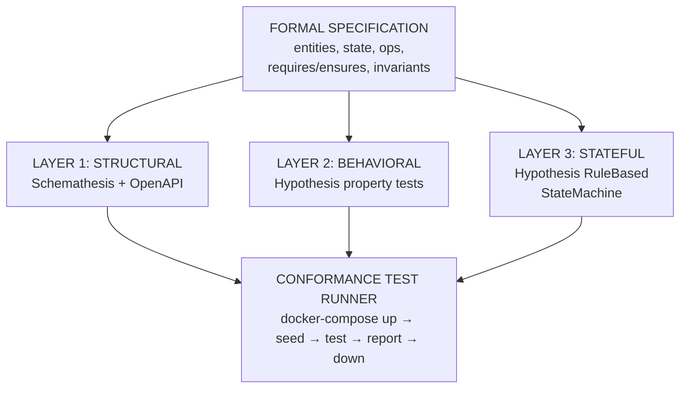

> Design document for the spec-to-REST compiler's test generation subsystem. Covers structural,
> behavioral, and stateful test layers with complete worked examples for three service domains.

> **Implementation status (2026-04):** §3 (Hypothesis property tests, behavioral layer) is
> partially landed via M5.1 — see [pipelines/test-generation.mdx](/pipelines/test-generation)
> for what `--with-tests` actually emits today. §2 (Schemathesis), §4 (stateful), §6 (TLA+),
> §7 (conformance runner), §9 (mutation testing) are tracked under sister tickets:
> [#26](https://github.com/HardMax71/spec_to_rest/issues/26),
> [#25](https://github.com/HardMax71/spec_to_rest/issues/25),
> [#23](https://github.com/HardMax71/spec_to_rest/issues/23),
> [#135](https://github.com/HardMax71/spec_to_rest/issues/135). This page is the design
> vision; the pipelines page is the shipped surface.

---

## Table of Contents

1. [Architecture Overview](#1-architecture-overview)
2. [Schemathesis Integration (Structural Layer)](#2-schemathesis-integration-structural-layer)
3. [Hypothesis Property Tests (Behavioral Layer)](#3-hypothesis-property-tests-behavioral-layer)
4. [Hypothesis Stateful Testing (State Machine Layer)](#4-hypothesis-stateful-testing-state-machine-layer)
5. [Custom Hypothesis Strategies from Spec Types](#5-custom-hypothesis-strategies-from-spec-types)
6. [TLA+ Trace Validation (Advanced)](#6-tla-trace-validation-advanced)
7. [Conformance Test Runner Architecture](#7-conformance-test-runner-architecture)
8. [Spec-to-Test Mapping Table](#8-spec-to-test-mapping-table)
9. [Test Quality Metrics](#9-test-quality-metrics)
10. [Comparison with Existing Testing Approaches](#10-comparison-with-existing-testing-approaches)

---

## 1. Architecture Overview

The test generation pipeline produces three complementary test layers from a single formal
specification. Each layer catches a different class of defects, and together they provide end-to-end
conformance checking between the spec and the running service.



**What each layer catches:**

| Layer                               | Catches                                                                                                          | Misses                                                                       |
| ----------------------------------- | ---------------------------------------------------------------------------------------------------------------- | ---------------------------------------------------------------------------- |
| Structural (Schemathesis)           | Wrong status codes, missing endpoints, schema mismatches, 500 errors, content-type violations                    | Correct-shaped but wrong-valued responses, invariant violations across calls |
| Behavioral (Hypothesis properties)  | Single-operation postcondition failures, precondition bypass, wrong return values                                | Multi-step invariant drift, state corruption across operation sequences      |
| Stateful (Hypothesis state machine) | Multi-step invariant violations, illegal state transitions, resource lifecycle bugs, ordering-dependent failures | Performance issues, concurrency bugs (unless parallel testing is added)      |

---

## 2. Schemathesis Integration (Structural Layer)

### 2.1 How We Generate Schemathesis Configuration from the Spec

The compiler already produces an OpenAPI specification as an intermediate artifact (see Section 6.2
of `00_comprehensive_analysis.md`). This OpenAPI spec becomes the direct input to Schemathesis. No
additional translation is needed for the structural layer -- the OpenAPI document _is_ the test
specification.

However, we augment the basic Schemathesis run with:

1. **Custom checks** derived from the formal spec's `ensures` and `invariant` clauses
2. **Stateful test links** derived from operation input/output relationships
3. **Test profiles** that control depth and breadth of exploration
4. **Auth configuration** generated from the spec's security declarations
5. **Database seeding** scripts generated from the spec's initial state

### 2.2 Test Profiles

The compiler generates three test profiles for different contexts:

| Profile      | Max Examples      | Stateful Depth | Timeout | Use Case                     |
| ------------ | ----------------- | -------------- | ------- | ---------------------------- |
| `smoke`      | 10 per endpoint   | 3 steps        | 30s     | Pre-commit hook, local dev   |
| `thorough`   | 100 per endpoint  | 10 steps       | 5m      | CI pipeline, pull requests   |
| `exhaustive` | 1000 per endpoint | 25 steps       | 30m     | Release gate, nightly builds |

### 2.3 Complete Generated Schemathesis Test File (URL Shortener)

The following file is generated from the URL shortener spec. It is complete and runnable against the
generated service.

```python
# file: tests/test_structural.py
#
# AUTO-GENERATED from spec: UrlShortener
# Do not edit manually -- regenerate with: spec-to-rest generate --tests

import schemathesis
import pytest
from urllib.parse import urlparse

# ---------------------------------------------------------------------------
# Configuration
# ---------------------------------------------------------------------------

BASE_URL = "http://localhost:8000"
SCHEMA_PATH = "./openapi.json"

schema = schemathesis.from_path(
    SCHEMA_PATH,
    base_url=BASE_URL,
)

# ---------------------------------------------------------------------------
# Test profile (set via environment variable SPEC_TEST_PROFILE)
# ---------------------------------------------------------------------------

import os

PROFILE = os.environ.get("SPEC_TEST_PROFILE", "thorough")

PROFILE_SETTINGS = {
    "smoke": {"max_examples": 10, "stateful_step_count": 3},
    "thorough": {"max_examples": 100, "stateful_step_count": 10},
    "exhaustive": {"max_examples": 1000, "stateful_step_count": 25},
}

settings = PROFILE_SETTINGS[PROFILE]

# ---------------------------------------------------------------------------
# Auth hook (if the spec declares authentication)
# ---------------------------------------------------------------------------

AUTH_TOKEN = os.environ.get("SPEC_TEST_AUTH_TOKEN", None)


@schemathesis.hook("before_call")
def add_auth(context, case, **kwargs):
    """Attach auth token to every request if configured."""
    if AUTH_TOKEN is not None:
        case.headers = case.headers or {}
        case.headers["Authorization"] = f"Bearer {AUTH_TOKEN}"


# ---------------------------------------------------------------------------
# Custom checks derived from spec ensures/invariants
# ---------------------------------------------------------------------------


@schemathesis.check
def spec_shorten_returns_valid_short_url(response, case):
    """
    Derived from: ensures short_url = base_url + "/" + code.value
    Only applies to POST /shorten with 201 responses.
    """
    if case.path != "/shorten" or case.method.upper() != "POST":
        return
    if response.status_code != 201:
        return
    data = response.json()
    short_url = data.get("short_url", "")
    code = data.get("code", "")
    assert short_url.endswith(
        f"/{code}"
    ), f"short_url '{short_url}' does not end with code '{code}'"
    parsed = urlparse(short_url)
    assert parsed.scheme in (
        "http",
        "https",
    ), f"short_url '{short_url}' has invalid scheme"


@schemathesis.check
def spec_shorten_code_length_valid(response, case):
    """
    Derived from entity invariant: len(ShortCode.value) >= 6 and len(ShortCode.value) <= 10
    """
    if case.path != "/shorten" or case.method.upper() != "POST":
        return
    if response.status_code != 201:
        return
    code = response.json().get("code", "")
    assert 6 <= len(code) <= 10, f"code length {len(code)} outside [6, 10]"


@schemathesis.check
def spec_shorten_code_alphanumeric(response, case):
    """
    Derived from entity invariant: ShortCode.value matches /^[a-zA-Z0-9]+$/
    """
    if case.path != "/shorten" or case.method.upper() != "POST":
        return
    if response.status_code != 201:
        return
    code = response.json().get("code", "")
    assert code.isalnum(), f"code '{code}' is not alphanumeric"


@schemathesis.check
def spec_resolve_returns_valid_uri(response, case):
    """
    Derived from: invariant all c in store | isValidURI(store[c].value)
    Applies to GET /{code} with 302 responses.
    """
    if not case.path.startswith("/{code}"):
        return
    if case.method.upper() != "GET":
        return
    if response.status_code != 302:
        return
    location = response.headers.get("Location", "")
    parsed = urlparse(location)
    assert parsed.scheme in (
        "http",
        "https",
    ), f"Location header '{location}' is not a valid URI"


@schemathesis.check
def spec_no_server_errors(response, case):
    """All operations: server must never return 5xx."""
    assert response.status_code < 500, (
        f"Server error {response.status_code} on "
        f"{case.method.upper()} {case.path}"
    )


# ---------------------------------------------------------------------------
# Stateless tests (one per endpoint)
# ---------------------------------------------------------------------------


from hypothesis import settings as hypothesis_settings

@schema.parametrize()
@hypothesis_settings(max_examples=settings["max_examples"])
def test_api_structural(case):
    """
    For each endpoint in the OpenAPI spec, Schemathesis generates random
    valid requests and validates that responses conform to the declared schemas.
    Custom checks above are run automatically for every response.
    """
    case.call_and_validate()


# ---------------------------------------------------------------------------
# Stateful tests (multi-step sequences via OpenAPI links)
# ---------------------------------------------------------------------------
#
# The generated OpenAPI spec includes links that express the data flow
# between operations:
#
#   POST /shorten  --[code]--> GET /{code}
#   POST /shorten  --[code]--> DELETE /{code}
#   GET /{code}    --[code]--> DELETE /{code}
#
# Schemathesis discovers these links and generates multi-step test sequences.

state_machine = schema.as_state_machine()


class TestStatefulUrlShortener(state_machine):
    """
    Stateful test class. Schemathesis builds a state machine from the OpenAPI
    links and explores multi-step sequences up to the configured depth.
    """

    pass


TestStatefulUrlShortener.settings = hypothesis_settings(
    max_examples=settings["max_examples"],
    stateful_step_count=settings["stateful_step_count"],
)

# ---------------------------------------------------------------------------
# Database seeding fixture
# ---------------------------------------------------------------------------


@pytest.fixture(scope="session", autouse=True)
def seed_database():
    """
    Seed the database with known test data before the test session.
    Generated from the spec's initial state constraints.
    """
    import httpx

    # Seed a few known URLs so that resolve/delete tests have targets
    seed_data = [
        {"url": "https://example.com/page1"},
        {"url": "https://example.com/page2"},
        {"url": "https://example.com/page3"},
    ]
    created_codes = []
    for item in seed_data:
        resp = httpx.post(f"{BASE_URL}/shorten", json=item)
        if resp.status_code == 201:
            created_codes.append(resp.json()["code"])

    yield created_codes

    # Teardown: delete seeded entries
    for code in created_codes:
        httpx.delete(f"{BASE_URL}/{code}")
```

### 2.4 Expected Output Interpretation

Schemathesis produces a structured report. Here is how to interpret it in the context of spec
conformance:

| Schemathesis Finding                    | Spec Violation                                                                             |
| --------------------------------------- | ------------------------------------------------------------------------------------------ |
| `status_code_conformance` failure       | Convention engine mapped the wrong HTTP status to an operation                             |
| `content_type_conformance` failure      | Response serialization does not match OpenAPI `produces`                                   |
| `response_schema_conformance` failure   | Entity or output type not correctly mapped to JSON schema                                  |
| Custom check failure (`spec_shorten_*`) | An `ensures` or `invariant` clause is violated                                             |
| `not_a_server_error` failure            | Unhandled exception in generated code                                                      |
| Stateful test failure                   | Data flow between operations is broken (e.g., code from shorten cannot be used in resolve) |

### 2.5 CI Integration (Schemathesis)

The generated `Makefile` includes targets for each profile:

```makefile
.PHONY: test-structural test-structural-smoke test-structural-exhaustive

test-structural-smoke:
	SPEC_TEST_PROFILE=smoke pytest tests/test_structural.py -v --tb=short

test-structural:
	SPEC_TEST_PROFILE=thorough pytest tests/test_structural.py -v --tb=short

test-structural-exhaustive:
	SPEC_TEST_PROFILE=exhaustive pytest tests/test_structural.py -v --tb=long
```

---

## 3. Hypothesis Property Tests (Behavioral Layer)

This is the most critical layer. Every `ensures` clause in the spec becomes one or more Hypothesis
property tests. Every `requires` clause generates a negative test. Every `invariant` generates an
after-every-operation check.

### 3.1 Mapping Rules

| Spec Element                       | Generated Test                 | What It Verifies                              |
| ---------------------------------- | ------------------------------ | --------------------------------------------- |
| `ensures: X not in pre(state)`     | Freshness property test        | Newly created identifier did not exist before |
| `ensures: state'[k] = v`           | Storage correctness test       | Value retrievable after mutation              |
| `ensures: #state' = #state + N`    | Cardinality test               | Exactly N elements added/removed              |
| `ensures: state' = state`          | No-mutation test               | Read operations do not change state           |
| `ensures: output = f(input)`       | Output correctness test        | Return value matches specification            |
| `requires: X in state`             | Negative test (missing X)      | Returns error, state unchanged                |
| `requires: predicate(input)`       | Negative test (invalid input)  | Returns 422, state unchanged                  |
| `invariant: forall x in S \| P(x)` | Post-operation invariant check | Property holds after every operation          |

### 3.2 Helper Infrastructure (Generated)

Every generated test suite includes these shared utilities:

```python
# file: tests/conftest.py
#
# AUTO-GENERATED from spec: UrlShortener

import pytest
import httpx
from hypothesis import strategies as st, given, settings, assume, HealthCheck

# ---------------------------------------------------------------------------
# Test client
# ---------------------------------------------------------------------------

BASE_URL = "http://localhost:8000"


@pytest.fixture(scope="session")
def client():
    with httpx.Client(base_url=BASE_URL, timeout=10.0) as c:
        yield c


# Global client for use in Hypothesis tests (which cannot use pytest fixtures
# directly due to the @given decorator)
_client = httpx.Client(base_url=BASE_URL, timeout=10.0)


def get_client() -> httpx.Client:
    return _client


# ---------------------------------------------------------------------------
# Spec-derived helper functions
# ---------------------------------------------------------------------------


def get_all_codes() -> set[str]:
    """Return all short codes currently in the store."""
    resp = get_client().get("/codes")
    resp.raise_for_status()
    return set(resp.json())


def get_store_count() -> int:
    """Return the number of entries in the store."""
    resp = get_client().get("/stats")
    resp.raise_for_status()
    return resp.json()["count"]


def is_valid_uri(s: str) -> bool:
    """Check if a string is a valid URI per the spec's valid_uri predicate."""
    from urllib.parse import urlparse

    try:
        result = urlparse(s)
        return all([result.scheme in ("http", "https"), result.netloc])
    except Exception:
        return False


# ---------------------------------------------------------------------------
# Database reset between tests
# ---------------------------------------------------------------------------


@pytest.fixture(autouse=True)
def reset_state():
    """Reset the service state before each test function."""
    resp = get_client().post("/test/reset")
    assert resp.status_code == 200
    yield
    # No teardown needed; next test will reset
```

### 3.3 URL Shortener -- Complete Property Tests

**Spec:**

```
service UrlShortener {
  entity ShortCode { value: String; invariant: len(value) >= 6 and len(value) <= 10; invariant: value matches /^[a-zA-Z0-9]+$/ }
  entity LongURL   { value: String; invariant: isValidURI(value) }
  state { store: ShortCode -> lone LongURL }

  operation Shorten {
    input:  url: LongURL
    output: code: ShortCode, short_url: String
    requires: isValidURI(url.value)
    ensures:  code not in pre(store); store'[code] = url; #store' = #store + 1
  }

  operation Resolve {
    input:  code: ShortCode
    output: url: LongURL
    requires: code in store
    ensures:  url = store[code]; store' = store
  }

  operation Delete {
    input:  code: ShortCode
    requires: code in store
    ensures:  code not in store'; #store' = #store - 1
  }

  invariant: all c in store | isValidURI(store[c].value)
}
```

**Generated tests:**

```python
# file: tests/test_behavioral_url_shortener.py
#
# AUTO-GENERATED from spec: UrlShortener
# Tests every ensures clause as a Hypothesis property test,
# every requires clause as a negative test,
# and every invariant as a post-operation check.

import re
import pytest
from hypothesis import given, settings, assume, HealthCheck
from hypothesis import strategies as st
from tests.conftest import get_client, get_all_codes, get_store_count, is_valid_uri

# ---------------------------------------------------------------------------
# Strategies derived from entity definitions
# ---------------------------------------------------------------------------

valid_urls = st.sampled_from([
    "https://example.com",
    "https://example.com/path/to/page",
    "https://subdomain.example.org/page?q=1&r=2",
    "http://example.net/a/b/c",
    "https://example.com/very/long/path/" + "x" * 200,
]) | st.from_regex(
    r"https?://[a-z]{3,12}\.[a-z]{2,6}(/[a-z0-9]{1,20}){0,5}",
    fullmatch=True,
)

invalid_urls = st.sampled_from([
    "",
    "not-a-url",
    "ftp://wrong-scheme.com",
    "://missing-scheme",
    "http://",
    "   ",
    "javascript:alert(1)",
])

# ---------------------------------------------------------------------------
# OPERATION: Shorten
# ---------------------------------------------------------------------------
# ensures: code not in pre(store)
# ensures: store'[code] = url
# ensures: #store' = #store + 1


@given(url=valid_urls)
@settings(
    max_examples=100,
    suppress_health_check=[HealthCheck.too_slow, HealthCheck.function_scoped_fixture],
)
def test_shorten_returns_fresh_code(url):
    """
    Ensures: code not in pre(store)

    After shortening, the returned code must not have existed before
    the operation was called.
    """
    client = get_client()
    client.post("/test/reset")

    # Capture pre-state
    existing_codes = get_all_codes()

    # Execute operation
    response = client.post("/shorten", json={"url": url})
    assert response.status_code == 201

    code = response.json()["code"]
    assert code not in existing_codes, (
        f"Returned code '{code}' already existed in store before shorten was called"
    )


@given(url=valid_urls)
@settings(
    max_examples=100,
    suppress_health_check=[HealthCheck.too_slow, HealthCheck.function_scoped_fixture],
)
def test_shorten_stores_correct_mapping(url):
    """
    Ensures: store'[code] = url

    After shortening, resolving the returned code must yield the original URL.
    """
    client = get_client()
    client.post("/test/reset")

    response = client.post("/shorten", json={"url": url})
    assert response.status_code == 201

    code = response.json()["code"]
    lookup = client.get(f"/{code}", follow_redirects=False)
    assert lookup.status_code == 302
    assert lookup.headers["Location"] == url, (
        f"Expected Location '{url}', got '{lookup.headers.get('Location')}'"
    )


@given(url=valid_urls)
@settings(
    max_examples=100,
    suppress_health_check=[HealthCheck.too_slow, HealthCheck.function_scoped_fixture],
)
def test_shorten_adds_exactly_one(url):
    """
    Ensures: #store' = #store + 1

    The store must contain exactly one more entry after a successful shorten.
    """
    client = get_client()
    client.post("/test/reset")

    count_before = get_store_count()
    response = client.post("/shorten", json={"url": url})
    assert response.status_code == 201

    count_after = get_store_count()
    assert count_after == count_before + 1, (
        f"Store count went from {count_before} to {count_after}, expected {count_before + 1}"
    )


# ---------------------------------------------------------------------------
# OPERATION: Resolve
# ---------------------------------------------------------------------------
# ensures: url = store[code]
# ensures: store' = store


@given(url=valid_urls)
@settings(
    max_examples=100,
    suppress_health_check=[HealthCheck.too_slow, HealthCheck.function_scoped_fixture],
)
def test_resolve_returns_correct_url(url):
    """
    Ensures: url = store[code]

    Resolving a code must return the URL that was stored when it was shortened.
    """
    client = get_client()
    client.post("/test/reset")

    # Create a mapping
    shorten_resp = client.post("/shorten", json={"url": url})
    assert shorten_resp.status_code == 201
    code = shorten_resp.json()["code"]

    # Resolve it
    resolve_resp = client.get(f"/{code}", follow_redirects=False)
    assert resolve_resp.status_code == 302
    assert resolve_resp.headers["Location"] == url


@given(url=valid_urls)
@settings(
    max_examples=100,
    suppress_health_check=[HealthCheck.too_slow, HealthCheck.function_scoped_fixture],
)
def test_resolve_does_not_mutate_state(url):
    """
    Ensures: store' = store

    The resolve operation must not change the store. The count before and after
    must be identical.
    """
    client = get_client()
    client.post("/test/reset")

    # Create a mapping
    shorten_resp = client.post("/shorten", json={"url": url})
    assert shorten_resp.status_code == 201
    code = shorten_resp.json()["code"]

    count_before = get_store_count()
    codes_before = get_all_codes()

    # Resolve
    client.get(f"/{code}", follow_redirects=False)

    count_after = get_store_count()
    codes_after = get_all_codes()

    assert count_after == count_before, "Resolve mutated the store count"
    assert codes_after == codes_before, "Resolve mutated the store contents"


# ---------------------------------------------------------------------------
# OPERATION: Delete
# ---------------------------------------------------------------------------
# ensures: code not in store'
# ensures: #store' = #store - 1


@given(url=valid_urls)
@settings(
    max_examples=100,
    suppress_health_check=[HealthCheck.too_slow, HealthCheck.function_scoped_fixture],
)
def test_delete_removes_code(url):
    """
    Ensures: code not in store'

    After deletion, the code must no longer be in the store.
    """
    client = get_client()
    client.post("/test/reset")

    # Create a mapping
    shorten_resp = client.post("/shorten", json={"url": url})
    assert shorten_resp.status_code == 201
    code = shorten_resp.json()["code"]

    # Delete it
    delete_resp = client.delete(f"/{code}")
    assert delete_resp.status_code == 204

    # Verify removal
    remaining_codes = get_all_codes()
    assert code not in remaining_codes, f"Code '{code}' still in store after delete"


@given(url=valid_urls)
@settings(
    max_examples=100,
    suppress_health_check=[HealthCheck.too_slow, HealthCheck.function_scoped_fixture],
)
def test_delete_removes_exactly_one(url):
    """
    Ensures: #store' = #store - 1

    The store must contain exactly one fewer entry after a successful delete.
    """
    client = get_client()
    client.post("/test/reset")

    # Create a mapping
    shorten_resp = client.post("/shorten", json={"url": url})
    assert shorten_resp.status_code == 201
    code = shorten_resp.json()["code"]

    count_before = get_store_count()
    delete_resp = client.delete(f"/{code}")
    assert delete_resp.status_code == 204

    count_after = get_store_count()
    assert count_after == count_before - 1, (
        f"Store count went from {count_before} to {count_after}, expected {count_before - 1}"
    )


# ---------------------------------------------------------------------------
# NEGATIVE TESTS: requires clause violations
# ---------------------------------------------------------------------------


@given(url=invalid_urls)
@settings(
    max_examples=50,
    suppress_health_check=[HealthCheck.too_slow, HealthCheck.function_scoped_fixture],
)
def test_shorten_rejects_invalid_url(url):
    """
    Requires: isValidURI(url.value)

    Violating this precondition must return 422 and must NOT mutate state.
    """
    client = get_client()
    client.post("/test/reset")

    count_before = get_store_count()
    response = client.post("/shorten", json={"url": url})
    assert response.status_code == 422, (
        f"Expected 422 for invalid URL '{url}', got {response.status_code}"
    )

    count_after = get_store_count()
    assert count_after == count_before, (
        "State was mutated despite requires clause violation"
    )


def test_resolve_rejects_nonexistent_code():
    """
    Requires: code in store

    Resolving a code that does not exist must return 404.
    """
    client = get_client()
    client.post("/test/reset")

    response = client.get("/NONEXISTENT", follow_redirects=False)
    assert response.status_code == 404


def test_delete_rejects_nonexistent_code():
    """
    Requires: code in store

    Deleting a code that does not exist must return 404 and must NOT mutate state.
    """
    client = get_client()
    client.post("/test/reset")

    count_before = get_store_count()
    response = client.delete("/NONEXISTENT")
    assert response.status_code == 404

    count_after = get_store_count()
    assert count_after == count_before, (
        "State was mutated despite requires clause violation"
    )


# ---------------------------------------------------------------------------
# INVARIANT CHECKS: run after every operation
# ---------------------------------------------------------------------------


def check_global_invariants():
    """
    Invariant: all c in store | isValidURI(store[c].value)

    Every URL in the store must be a valid URI. Called after every operation
    in the stateful test layer, and spot-checked here.
    """
    client = get_client()
    codes = get_all_codes()
    for code in codes:
        resp = client.get(f"/{code}", follow_redirects=False)
        if resp.status_code == 302:
            location = resp.headers["Location"]
            assert is_valid_uri(location), (
                f"Invariant violated: store[{code}] = '{location}' is not a valid URI"
            )


@given(url=valid_urls)
@settings(
    max_examples=50,
    suppress_health_check=[HealthCheck.too_slow, HealthCheck.function_scoped_fixture],
)
def test_invariant_holds_after_shorten(url):
    """Global invariant must hold after every Shorten operation."""
    client = get_client()
    client.post("/test/reset")
    client.post("/shorten", json={"url": url})
    check_global_invariants()


@given(url=valid_urls)
@settings(
    max_examples=50,
    suppress_health_check=[HealthCheck.too_slow, HealthCheck.function_scoped_fixture],
)
def test_invariant_holds_after_delete(url):
    """Global invariant must hold after every Delete operation."""
    client = get_client()
    client.post("/test/reset")

    resp = client.post("/shorten", json={"url": url})
    assert resp.status_code == 201
    code = resp.json()["code"]
    client.delete(f"/{code}")
    check_global_invariants()
```

### 3.4 Todo List with State Machine -- Complete Property Tests

**Spec:**

```
service TodoList {
  entity TodoId    { value: UUID }
  entity TodoTitle { value: String; invariant: len(value) >= 1 and len(value) <= 200 }

  enum TodoStatus { todo, in_progress, done }

  entity TodoItem {
    id:     TodoId
    title:  TodoTitle
    status: TodoStatus
  }

  state { items: TodoId -> lone TodoItem }

  operation CreateTodo {
    input:  title: TodoTitle
    output: item: TodoItem
    requires: len(title.value) >= 1
    ensures:
      item.id not in pre(items)
      item.status = TodoStatus.todo
      item.title = title
      items'[item.id] = item
      #items' = #items + 1
  }

  operation StartTodo {
    input:  id: TodoId
    output: item: TodoItem
    requires: id in items
    requires: items[id].status = TodoStatus.todo
    ensures:
      item.status = TodoStatus.in_progress
      items'[id].status = TodoStatus.in_progress
      #items' = #items
  }

  operation CompleteTodo {
    input:  id: TodoId
    output: item: TodoItem
    requires: id in items
    requires: items[id].status = TodoStatus.in_progress
    ensures:
      item.status = TodoStatus.done
      items'[id].status = TodoStatus.done
      #items' = #items
  }

  operation DeleteTodo {
    input:  id: TodoId
    requires: id in items
    ensures:
      id not in items'
      #items' = #items - 1
  }

  // State transition constraints
  invariant: all t in items | items[t].status = done implies
    (items[t] was in_progress)  // done items must have been in_progress

  // General invariants
  invariant: all t in items | len(items[t].title.value) >= 1
}
```

**Generated tests:**

```python
# file: tests/test_behavioral_todo.py
#
# AUTO-GENERATED from spec: TodoList

import pytest
from hypothesis import given, settings, assume, HealthCheck
from hypothesis import strategies as st
from tests.conftest import get_client

# ---------------------------------------------------------------------------
# Strategies
# ---------------------------------------------------------------------------

valid_titles = st.text(
    alphabet=st.characters(whitelist_categories=("L", "N", "P", "Z")),
    min_size=1,
    max_size=200,
).filter(lambda t: len(t.strip()) >= 1)

invalid_titles = st.sampled_from(["", None]) | st.text(min_size=201, max_size=300)

# ---------------------------------------------------------------------------
# Helpers
# ---------------------------------------------------------------------------


def get_all_items():
    resp = get_client().get("/todos")
    resp.raise_for_status()
    return resp.json()


def get_item_count():
    return len(get_all_items())


# ---------------------------------------------------------------------------
# OPERATION: CreateTodo
# ---------------------------------------------------------------------------
# ensures: item.id not in pre(items)
# ensures: item.status = TodoStatus.todo
# ensures: item.title = title
# ensures: items'[item.id] = item
# ensures: #items' = #items + 1


@given(title=valid_titles)
@settings(
    max_examples=100,
    suppress_health_check=[HealthCheck.too_slow, HealthCheck.function_scoped_fixture],
)
def test_create_todo_returns_fresh_id(title):
    """Ensures: item.id not in pre(items)"""
    client = get_client()
    client.post("/test/reset")

    existing_ids = {item["id"] for item in get_all_items()}
    response = client.post("/todos", json={"title": title})
    assert response.status_code == 201

    new_id = response.json()["id"]
    assert new_id not in existing_ids, f"ID '{new_id}' already existed"


@given(title=valid_titles)
@settings(
    max_examples=100,
    suppress_health_check=[HealthCheck.too_slow, HealthCheck.function_scoped_fixture],
)
def test_create_todo_initial_status_is_todo(title):
    """Ensures: item.status = TodoStatus.todo"""
    client = get_client()
    client.post("/test/reset")

    response = client.post("/todos", json={"title": title})
    assert response.status_code == 201

    item = response.json()
    assert item["status"] == "todo", f"Expected status 'todo', got '{item['status']}'"


@given(title=valid_titles)
@settings(
    max_examples=100,
    suppress_health_check=[HealthCheck.too_slow, HealthCheck.function_scoped_fixture],
)
def test_create_todo_stores_correct_title(title):
    """Ensures: item.title = title"""
    client = get_client()
    client.post("/test/reset")

    response = client.post("/todos", json={"title": title})
    assert response.status_code == 201

    item = response.json()
    assert item["title"] == title, f"Expected title '{title}', got '{item['title']}'"


@given(title=valid_titles)
@settings(
    max_examples=100,
    suppress_health_check=[HealthCheck.too_slow, HealthCheck.function_scoped_fixture],
)
def test_create_todo_adds_exactly_one(title):
    """Ensures: #items' = #items + 1"""
    client = get_client()
    client.post("/test/reset")

    count_before = get_item_count()
    response = client.post("/todos", json={"title": title})
    assert response.status_code == 201

    count_after = get_item_count()
    assert count_after == count_before + 1


# ---------------------------------------------------------------------------
# OPERATION: StartTodo
# ---------------------------------------------------------------------------
# ensures: item.status = TodoStatus.in_progress
# ensures: items'[id].status = TodoStatus.in_progress
# ensures: #items' = #items


@given(title=valid_titles)
@settings(
    max_examples=100,
    suppress_health_check=[HealthCheck.too_slow, HealthCheck.function_scoped_fixture],
)
def test_start_todo_transitions_to_in_progress(title):
    """Ensures: item.status = TodoStatus.in_progress"""
    client = get_client()
    client.post("/test/reset")

    # Create a todo (starts in 'todo' state)
    create_resp = client.post("/todos", json={"title": title})
    assert create_resp.status_code == 201
    todo_id = create_resp.json()["id"]

    # Start it
    start_resp = client.patch(f"/todos/{todo_id}/start")
    assert start_resp.status_code == 200

    item = start_resp.json()
    assert item["status"] == "in_progress"


@given(title=valid_titles)
@settings(
    max_examples=100,
    suppress_health_check=[HealthCheck.too_slow, HealthCheck.function_scoped_fixture],
)
def test_start_todo_persists_status(title):
    """Ensures: items'[id].status = TodoStatus.in_progress (check via GET)"""
    client = get_client()
    client.post("/test/reset")

    create_resp = client.post("/todos", json={"title": title})
    todo_id = create_resp.json()["id"]
    client.patch(f"/todos/{todo_id}/start")

    # Verify persisted state via a fresh GET
    get_resp = client.get(f"/todos/{todo_id}")
    assert get_resp.status_code == 200
    assert get_resp.json()["status"] == "in_progress"


@given(title=valid_titles)
@settings(
    max_examples=100,
    suppress_health_check=[HealthCheck.too_slow, HealthCheck.function_scoped_fixture],
)
def test_start_todo_does_not_change_count(title):
    """Ensures: #items' = #items"""
    client = get_client()
    client.post("/test/reset")

    create_resp = client.post("/todos", json={"title": title})
    todo_id = create_resp.json()["id"]

    count_before = get_item_count()
    client.patch(f"/todos/{todo_id}/start")
    count_after = get_item_count()

    assert count_after == count_before


# ---------------------------------------------------------------------------
# OPERATION: CompleteTodo
# ---------------------------------------------------------------------------
# ensures: item.status = TodoStatus.done
# ensures: items'[id].status = TodoStatus.done
# ensures: #items' = #items


@given(title=valid_titles)
@settings(
    max_examples=100,
    suppress_health_check=[HealthCheck.too_slow, HealthCheck.function_scoped_fixture],
)
def test_complete_todo_transitions_to_done(title):
    """Ensures: item.status = TodoStatus.done"""
    client = get_client()
    client.post("/test/reset")

    create_resp = client.post("/todos", json={"title": title})
    todo_id = create_resp.json()["id"]
    client.patch(f"/todos/{todo_id}/start")  # must be in_progress first

    complete_resp = client.patch(f"/todos/{todo_id}/complete")
    assert complete_resp.status_code == 200
    assert complete_resp.json()["status"] == "done"


@given(title=valid_titles)
@settings(
    max_examples=100,
    suppress_health_check=[HealthCheck.too_slow, HealthCheck.function_scoped_fixture],
)
def test_complete_todo_persists_status(title):
    """Ensures: items'[id].status = TodoStatus.done (check via GET)"""
    client = get_client()
    client.post("/test/reset")

    create_resp = client.post("/todos", json={"title": title})
    todo_id = create_resp.json()["id"]
    client.patch(f"/todos/{todo_id}/start")
    client.patch(f"/todos/{todo_id}/complete")

    get_resp = client.get(f"/todos/{todo_id}")
    assert get_resp.json()["status"] == "done"


# ---------------------------------------------------------------------------
# OPERATION: DeleteTodo
# ---------------------------------------------------------------------------
# ensures: id not in items'
# ensures: #items' = #items - 1


@given(title=valid_titles)
@settings(
    max_examples=100,
    suppress_health_check=[HealthCheck.too_slow, HealthCheck.function_scoped_fixture],
)
def test_delete_todo_removes_item(title):
    """Ensures: id not in items'"""
    client = get_client()
    client.post("/test/reset")

    create_resp = client.post("/todos", json={"title": title})
    todo_id = create_resp.json()["id"]

    delete_resp = client.delete(f"/todos/{todo_id}")
    assert delete_resp.status_code == 204

    get_resp = client.get(f"/todos/{todo_id}")
    assert get_resp.status_code == 404


@given(title=valid_titles)
@settings(
    max_examples=100,
    suppress_health_check=[HealthCheck.too_slow, HealthCheck.function_scoped_fixture],
)
def test_delete_todo_removes_exactly_one(title):
    """Ensures: #items' = #items - 1"""
    client = get_client()
    client.post("/test/reset")

    create_resp = client.post("/todos", json={"title": title})
    todo_id = create_resp.json()["id"]

    count_before = get_item_count()
    client.delete(f"/todos/{todo_id}")
    count_after = get_item_count()

    assert count_after == count_before - 1


# ---------------------------------------------------------------------------
# NEGATIVE TESTS: requires clause violations
# ---------------------------------------------------------------------------


def test_start_rejects_nonexistent_todo():
    """Requires: id in items"""
    client = get_client()
    client.post("/test/reset")
    resp = client.patch("/todos/00000000-0000-0000-0000-000000000000/start")
    assert resp.status_code == 404


@given(title=valid_titles)
@settings(
    max_examples=50,
    suppress_health_check=[HealthCheck.too_slow, HealthCheck.function_scoped_fixture],
)
def test_start_rejects_non_todo_status(title):
    """Requires: items[id].status = TodoStatus.todo -- cannot start an in_progress item."""
    client = get_client()
    client.post("/test/reset")

    create_resp = client.post("/todos", json={"title": title})
    todo_id = create_resp.json()["id"]
    client.patch(f"/todos/{todo_id}/start")  # now in_progress

    # Trying to start again should fail
    resp = client.patch(f"/todos/{todo_id}/start")
    assert resp.status_code == 422 or resp.status_code == 409, (
        f"Expected 422 or 409 for invalid transition, got {resp.status_code}"
    )


@given(title=valid_titles)
@settings(
    max_examples=50,
    suppress_health_check=[HealthCheck.too_slow, HealthCheck.function_scoped_fixture],
)
def test_complete_rejects_todo_status(title):
    """Requires: items[id].status = TodoStatus.in_progress -- cannot complete from todo."""
    client = get_client()
    client.post("/test/reset")

    create_resp = client.post("/todos", json={"title": title})
    todo_id = create_resp.json()["id"]

    # Item is in 'todo' status, not 'in_progress'
    resp = client.patch(f"/todos/{todo_id}/complete")
    assert resp.status_code == 422 or resp.status_code == 409

    # Verify state was not mutated
    get_resp = client.get(f"/todos/{todo_id}")
    assert get_resp.json()["status"] == "todo"


@given(title=invalid_titles)
@settings(
    max_examples=50,
    suppress_health_check=[HealthCheck.too_slow, HealthCheck.function_scoped_fixture],
)
def test_create_rejects_invalid_title(title):
    """Requires: len(title.value) >= 1"""
    client = get_client()
    client.post("/test/reset")

    count_before = get_item_count()
    resp = client.post("/todos", json={"title": title})
    assert resp.status_code == 422

    count_after = get_item_count()
    assert count_after == count_before, "State mutated despite requires failure"
```

### 3.5 E-Commerce Orders -- Complete Property Tests

**Spec:**

```
service OrderSystem {
  entity ProductId   { value: UUID }
  entity OrderId     { value: UUID }
  entity CustomerId  { value: UUID }
  entity Money       { cents: Int; invariant: cents >= 0 }

  enum OrderStatus { pending, confirmed, shipped, delivered, cancelled }

  entity OrderLine {
    product: ProductId
    quantity: Int
    unit_price: Money
    invariant: quantity >= 1
  }

  entity Order {
    id:       OrderId
    customer: CustomerId
    lines:    set OrderLine
    status:   OrderStatus
    total:    Money
  }

  state {
    orders:   OrderId -> lone Order
    products: ProductId -> lone Product    // catalog (read-only for order ops)
    inventory: ProductId -> Int            // stock counts
  }

  operation PlaceOrder {
    input:  customer: CustomerId, lines: set OrderLine
    output: order: Order
    requires: #lines >= 1
    requires: all l in lines | l.product in products
    requires: all l in lines | inventory[l.product] >= l.quantity
    ensures:
      order.id not in pre(orders)
      order.status = OrderStatus.pending
      order.customer = customer
      order.lines = lines
      order.total.cents = sum(l in lines | l.quantity * l.unit_price.cents)
      orders'[order.id] = order
      all l in lines | inventory'[l.product] = inventory[l.product] - l.quantity
      #orders' = #orders + 1
  }

  operation ConfirmOrder {
    input:  id: OrderId
    output: order: Order
    requires: id in orders
    requires: orders[id].status = OrderStatus.pending
    ensures:
      order.status = OrderStatus.confirmed
      orders'[id].status = OrderStatus.confirmed
  }

  operation CancelOrder {
    input:  id: OrderId
    output: order: Order
    requires: id in orders
    requires: orders[id].status in {OrderStatus.pending, OrderStatus.confirmed}
    ensures:
      order.status = OrderStatus.cancelled
      orders'[id].status = OrderStatus.cancelled
      // Restore inventory
      all l in orders[id].lines | inventory'[l.product] = inventory[l.product] + l.quantity
  }

  invariant: all o in orders | orders[o].total.cents >= 0
  invariant: all o in orders | #orders[o].lines >= 1
  invariant: all p in inventory | inventory[p] >= 0
}
```

**Generated tests:**

```python
# file: tests/test_behavioral_orders.py
#
# AUTO-GENERATED from spec: OrderSystem

import pytest
from hypothesis import given, settings, assume, HealthCheck
from hypothesis import strategies as st
from tests.conftest import get_client

# ---------------------------------------------------------------------------
# Strategies
# ---------------------------------------------------------------------------

# These assume a pre-seeded product catalog with known product IDs and prices.
SEED_PRODUCTS = [
    {"id": "prod-001", "name": "Widget", "price_cents": 999},
    {"id": "prod-002", "name": "Gadget", "price_cents": 2499},
    {"id": "prod-003", "name": "Doohickey", "price_cents": 50},
]

CUSTOMER_ID = "cust-001"

order_lines = st.lists(
    st.fixed_dictionaries({
        "product": st.sampled_from([p["id"] for p in SEED_PRODUCTS]),
        "quantity": st.integers(min_value=1, max_value=5),
        "unit_price_cents": st.sampled_from([p["price_cents"] for p in SEED_PRODUCTS]),
    }),
    min_size=1,
    max_size=5,
)

# ---------------------------------------------------------------------------
# Helpers
# ---------------------------------------------------------------------------


def get_all_orders():
    resp = get_client().get("/orders")
    resp.raise_for_status()
    return resp.json()


def get_order_count():
    return len(get_all_orders())


def get_inventory(product_id: str) -> int:
    resp = get_client().get(f"/products/{product_id}/inventory")
    resp.raise_for_status()
    return resp.json()["quantity"]


def seed_catalog():
    """Ensure seed products exist with sufficient inventory."""
    client = get_client()
    for p in SEED_PRODUCTS:
        client.put(f"/products/{p['id']}", json={
            "name": p["name"],
            "price_cents": p["price_cents"],
        })
        client.put(f"/products/{p['id']}/inventory", json={"quantity": 1000})


# ---------------------------------------------------------------------------
# OPERATION: PlaceOrder
# ---------------------------------------------------------------------------
# ensures: order.id not in pre(orders)
# ensures: order.status = OrderStatus.pending
# ensures: order.customer = customer
# ensures: order.total.cents = sum(...)
# ensures: orders'[order.id] = order
# ensures: all l in lines | inventory'[l.product] = inventory[l.product] - l.quantity
# ensures: #orders' = #orders + 1


@given(lines=order_lines)
@settings(
    max_examples=100,
    suppress_health_check=[HealthCheck.too_slow, HealthCheck.function_scoped_fixture],
)
def test_place_order_returns_fresh_id(lines):
    """Ensures: order.id not in pre(orders)"""
    client = get_client()
    client.post("/test/reset")
    seed_catalog()

    existing_ids = {o["id"] for o in get_all_orders()}
    resp = client.post("/orders", json={"customer": CUSTOMER_ID, "lines": lines})
    assert resp.status_code == 201

    new_id = resp.json()["id"]
    assert new_id not in existing_ids


@given(lines=order_lines)
@settings(
    max_examples=100,
    suppress_health_check=[HealthCheck.too_slow, HealthCheck.function_scoped_fixture],
)
def test_place_order_initial_status_pending(lines):
    """Ensures: order.status = OrderStatus.pending"""
    client = get_client()
    client.post("/test/reset")
    seed_catalog()

    resp = client.post("/orders", json={"customer": CUSTOMER_ID, "lines": lines})
    assert resp.status_code == 201
    assert resp.json()["status"] == "pending"


@given(lines=order_lines)
@settings(
    max_examples=100,
    suppress_health_check=[HealthCheck.too_slow, HealthCheck.function_scoped_fixture],
)
def test_place_order_correct_total(lines):
    """Ensures: order.total.cents = sum(l in lines | l.quantity * l.unit_price.cents)"""
    client = get_client()
    client.post("/test/reset")
    seed_catalog()

    resp = client.post("/orders", json={"customer": CUSTOMER_ID, "lines": lines})
    assert resp.status_code == 201

    order = resp.json()
    expected_total = sum(l["quantity"] * l["unit_price_cents"] for l in lines)
    assert order["total_cents"] == expected_total, (
        f"Expected total {expected_total}, got {order['total_cents']}"
    )


@given(lines=order_lines)
@settings(
    max_examples=100,
    suppress_health_check=[HealthCheck.too_slow, HealthCheck.function_scoped_fixture],
)
def test_place_order_decrements_inventory(lines):
    """Ensures: all l in lines | inventory'[l.product] = inventory[l.product] - l.quantity"""
    client = get_client()
    client.post("/test/reset")
    seed_catalog()

    # Record pre-state inventory
    inventory_before = {}
    for line in lines:
        pid = line["product"]
        if pid not in inventory_before:
            inventory_before[pid] = get_inventory(pid)

    resp = client.post("/orders", json={"customer": CUSTOMER_ID, "lines": lines})
    assert resp.status_code == 201

    # Check inventory decremented correctly
    expected_decrements = {}
    for line in lines:
        pid = line["product"]
        expected_decrements[pid] = expected_decrements.get(pid, 0) + line["quantity"]

    for pid, decrement in expected_decrements.items():
        inventory_after = get_inventory(pid)
        assert inventory_after == inventory_before[pid] - decrement, (
            f"Product {pid}: expected inventory {inventory_before[pid] - decrement}, "
            f"got {inventory_after}"
        )


@given(lines=order_lines)
@settings(
    max_examples=100,
    suppress_health_check=[HealthCheck.too_slow, HealthCheck.function_scoped_fixture],
)
def test_place_order_adds_exactly_one(lines):
    """Ensures: #orders' = #orders + 1"""
    client = get_client()
    client.post("/test/reset")
    seed_catalog()

    count_before = get_order_count()
    resp = client.post("/orders", json={"customer": CUSTOMER_ID, "lines": lines})
    assert resp.status_code == 201

    count_after = get_order_count()
    assert count_after == count_before + 1


# ---------------------------------------------------------------------------
# OPERATION: CancelOrder
# ---------------------------------------------------------------------------
# ensures: order.status = OrderStatus.cancelled
# ensures: all l in orders[id].lines | inventory'[l.product] = inventory[l.product] + l.quantity


@given(lines=order_lines)
@settings(
    max_examples=100,
    suppress_health_check=[HealthCheck.too_slow, HealthCheck.function_scoped_fixture],
)
def test_cancel_order_restores_inventory(lines):
    """
    Ensures: all l in orders[id].lines |
        inventory'[l.product] = inventory[l.product] + l.quantity

    Cancelling an order must restore the inventory that was decremented.
    """
    client = get_client()
    client.post("/test/reset")
    seed_catalog()

    # Record inventory before placing order
    inventory_initial = {}
    for line in lines:
        pid = line["product"]
        if pid not in inventory_initial:
            inventory_initial[pid] = get_inventory(pid)

    # Place and then cancel
    place_resp = client.post("/orders", json={"customer": CUSTOMER_ID, "lines": lines})
    assert place_resp.status_code == 201
    order_id = place_resp.json()["id"]

    cancel_resp = client.patch(f"/orders/{order_id}/cancel")
    assert cancel_resp.status_code == 200
    assert cancel_resp.json()["status"] == "cancelled"

    # Inventory should be fully restored
    for pid, initial_qty in inventory_initial.items():
        restored_qty = get_inventory(pid)
        assert restored_qty == initial_qty, (
            f"Product {pid}: inventory after cancel is {restored_qty}, "
            f"expected restoration to {initial_qty}"
        )


# ---------------------------------------------------------------------------
# NEGATIVE TESTS
# ---------------------------------------------------------------------------


def test_place_order_rejects_empty_lines():
    """Requires: #lines >= 1"""
    client = get_client()
    client.post("/test/reset")
    seed_catalog()

    resp = client.post("/orders", json={"customer": CUSTOMER_ID, "lines": []})
    assert resp.status_code == 422


def test_confirm_rejects_non_pending():
    """Requires: orders[id].status = OrderStatus.pending"""
    client = get_client()
    client.post("/test/reset")
    seed_catalog()

    # Create and confirm an order
    lines = [{"product": "prod-001", "quantity": 1, "unit_price_cents": 999}]
    place_resp = client.post("/orders", json={"customer": CUSTOMER_ID, "lines": lines})
    order_id = place_resp.json()["id"]
    client.patch(f"/orders/{order_id}/confirm")

    # Trying to confirm again should fail
    resp = client.patch(f"/orders/{order_id}/confirm")
    assert resp.status_code in (409, 422)


def test_cancel_rejects_shipped():
    """Requires: orders[id].status in {pending, confirmed}"""
    client = get_client()
    client.post("/test/reset")
    seed_catalog()

    lines = [{"product": "prod-001", "quantity": 1, "unit_price_cents": 999}]
    place_resp = client.post("/orders", json={"customer": CUSTOMER_ID, "lines": lines})
    order_id = place_resp.json()["id"]
    client.patch(f"/orders/{order_id}/confirm")
    client.patch(f"/orders/{order_id}/ship")  # transition to shipped

    # Cannot cancel a shipped order
    resp = client.patch(f"/orders/{order_id}/cancel")
    assert resp.status_code in (409, 422)

    # Verify status was NOT changed
    get_resp = client.get(f"/orders/{order_id}")
    assert get_resp.json()["status"] == "shipped"


# ---------------------------------------------------------------------------
# INVARIANT CHECKS
# ---------------------------------------------------------------------------


def check_order_invariants():
    """
    invariant: all o in orders | orders[o].total.cents >= 0
    invariant: all o in orders | #orders[o].lines >= 1
    invariant: all p in inventory | inventory[p] >= 0
    """
    client = get_client()
    orders = get_all_orders()

    for order in orders:
        assert order["total_cents"] >= 0, (
            f"Order {order['id']} has negative total: {order['total_cents']}"
        )
        assert len(order["lines"]) >= 1, (
            f"Order {order['id']} has no lines"
        )

    for p in SEED_PRODUCTS:
        inv = get_inventory(p["id"])
        assert inv >= 0, f"Product {p['id']} has negative inventory: {inv}"


@given(lines=order_lines)
@settings(
    max_examples=50,
    suppress_health_check=[HealthCheck.too_slow, HealthCheck.function_scoped_fixture],
)
def test_invariants_hold_after_place_order(lines):
    client = get_client()
    client.post("/test/reset")
    seed_catalog()
    client.post("/orders", json={"customer": CUSTOMER_ID, "lines": lines})
    check_order_invariants()
```

---

## 4. Hypothesis Stateful Testing (State Machine Layer)

The stateful test layer builds a `RuleBasedStateMachine` that mirrors the spec's abstract state.
Each spec operation becomes a rule. Each `requires` clause becomes a `@precondition`. Each `ensures`
clause becomes an assertion inside the rule body. Each `invariant` becomes a `@invariant`-decorated
method.

### 4.1 Mapping from Spec to State Machine

| Spec Element                  | StateMachine Element                        | Purpose                              |
| ----------------------------- | ------------------------------------------- | ------------------------------------ |
| `state { store: K -> V }`     | `self.store: dict[K, V] = {}`               | Model state mirrors spec state       |
| `operation Foo { output: x }` | `@rule(target=xs)` returning x              | Track created resources in Bundles   |
| `operation Foo { input: x }`  | `@rule(x=xs)` drawing from Bundle           | Consume previously created resources |
| `requires: condition`         | `@precondition(lambda self: condition)`     | Guard rule applicability             |
| `ensures: assertion`          | `assert assertion` inside rule body         | Check postconditions                 |
| `invariant: property`         | `@invariant() def check(): assert property` | Check after every rule               |

### 4.2 URL Shortener -- Complete State Machine

```python
# file: tests/test_stateful_url_shortener.py
#
# AUTO-GENERATED from spec: UrlShortener

import random
from hypothesis import settings, HealthCheck
from hypothesis import strategies as st
from hypothesis.stateful import (
    RuleBasedStateMachine,
    Bundle,
    rule,
    invariant,
    precondition,
    initialize,
)
from urllib.parse import urlparse
import httpx

BASE_URL = "http://localhost:8000"
client = httpx.Client(base_url=BASE_URL, timeout=10.0)

# Strategies derived from entity definitions
valid_urls = st.sampled_from([
    "https://example.com",
    "https://example.com/path/to/page",
    "https://subdomain.example.org/page?q=1&r=2",
    "http://example.net/a/b/c",
]) | st.from_regex(
    r"https?://[a-z]{3,12}\.[a-z]{2,6}(/[a-z0-9]{1,20}){0,5}",
    fullmatch=True,
)


def is_valid_uri(s: str) -> bool:
    try:
        result = urlparse(s)
        return all([result.scheme in ("http", "https"), result.netloc])
    except Exception:
        return False


class UrlShortenerStateMachine(RuleBasedStateMachine):
    """
    State machine that mirrors the spec's abstract state.
    The model state (self.store) tracks what the service should contain.
    Every rule executes a real HTTP request and verifies the response against
    both the model and the spec's ensures clauses.
    """

    # -----------------------------------------------------------------------
    # Model state (mirrors spec: state { store: ShortCode -> lone LongURL })
    # -----------------------------------------------------------------------
    def __init__(self):
        super().__init__()
        self.store: dict[str, str] = {}

    # -----------------------------------------------------------------------
    # Bundles for tracking created resources
    # -----------------------------------------------------------------------
    codes = Bundle("codes")

    # -----------------------------------------------------------------------
    # Initialize: reset the service state before each test case
    # -----------------------------------------------------------------------
    @initialize()
    def reset_service(self):
        resp = client.post("/test/reset")
        assert resp.status_code == 200
        self.store = {}

    # -----------------------------------------------------------------------
    # OPERATION: Shorten
    # Spec: requires isValidURI(url.value)
    #       ensures code not in pre(store)
    #       ensures store'[code] = url
    #       ensures #store' = #store + 1
    # -----------------------------------------------------------------------
    @rule(target=codes, url=valid_urls)
    def shorten(self, url):
        response = client.post("/shorten", json={"url": url})
        assert response.status_code == 201, (
            f"Shorten failed with {response.status_code}: {response.text}"
        )

        data = response.json()
        code = data["code"]

        # ensures: code not in pre(store)
        assert code not in self.store, (
            f"Code '{code}' already existed in model store"
        )

        # ensures: ShortCode entity invariants
        assert 6 <= len(code) <= 10, f"Code length {len(code)} outside [6, 10]"
        assert code.isalnum(), f"Code '{code}' is not alphanumeric"

        # ensures: short_url = base_url + "/" + code.value
        short_url = data.get("short_url", "")
        assert short_url.endswith(f"/{code}"), (
            f"short_url '{short_url}' does not end with code '{code}'"
        )

        # Update model state: store'[code] = url
        self.store[code] = url

        # ensures: #store' = #store + 1
        # (implicitly true since we added exactly one key that wasn't there)

        return code

    # -----------------------------------------------------------------------
    # OPERATION: Resolve
    # Spec: requires code in store
    #       ensures url = store[code]
    #       ensures store' = store
    # -----------------------------------------------------------------------
    @rule(code=codes)
    def resolve(self, code):
        # Only resolve codes that are still in the store
        if code not in self.store:
            # Code was deleted; expect 404
            response = client.get(f"/{code}", follow_redirects=False)
            assert response.status_code == 404, (
                f"Expected 404 for deleted code '{code}', got {response.status_code}"
            )
            return

        count_before = len(self.store)
        response = client.get(f"/{code}", follow_redirects=False)

        # ensures: url = store[code]
        assert response.status_code == 302, (
            f"Expected 302 for existing code '{code}', got {response.status_code}"
        )
        assert response.headers["Location"] == self.store[code], (
            f"Expected Location '{self.store[code]}', "
            f"got '{response.headers.get('Location')}'"
        )

        # ensures: store' = store (no mutation)
        assert len(self.store) == count_before

    # -----------------------------------------------------------------------
    # OPERATION: Delete
    # Spec: requires code in store
    #       ensures code not in store'
    #       ensures #store' = #store - 1
    # -----------------------------------------------------------------------
    @rule(code=codes)
    def delete(self, code):
        if code not in self.store:
            # Already deleted; expect 404
            response = client.delete(f"/{code}")
            assert response.status_code == 404
            return

        count_before = len(self.store)
        response = client.delete(f"/{code}")
        assert response.status_code == 204, (
            f"Expected 204 for delete of '{code}', got {response.status_code}"
        )

        # Update model: ensures code not in store'
        del self.store[code]

        # ensures: #store' = #store - 1
        assert len(self.store) == count_before - 1

    # -----------------------------------------------------------------------
    # NEGATIVE: Resolve nonexistent code
    # Tests: requires code in store -> 404 when violated
    # -----------------------------------------------------------------------
    @rule(code=st.text(
        alphabet=st.characters(whitelist_categories=("L", "N")),
        min_size=6,
        max_size=10,
    ))
    def resolve_nonexistent(self, code):
        if code in self.store:
            return  # Skip; this code happens to exist
        response = client.get(f"/{code}", follow_redirects=False)
        assert response.status_code == 404, (
            f"Expected 404 for nonexistent code '{code}', got {response.status_code}"
        )

    # -----------------------------------------------------------------------
    # INVARIANT: all c in store | isValidURI(store[c].value)
    # Checked after EVERY rule execution
    # -----------------------------------------------------------------------
    @invariant()
    def all_stored_urls_are_valid(self):
        for code, url in self.store.items():
            assert is_valid_uri(url), (
                f"Invariant violated: store[{code}] = '{url}' is not a valid URI"
            )

    # -----------------------------------------------------------------------
    # INVARIANT: model/service state consistency
    # The model store and the actual service store must agree
    # -----------------------------------------------------------------------
    @invariant()
    def model_matches_service(self):
        resp = client.get("/codes")
        if resp.status_code == 200:
            service_codes = set(resp.json())
            model_codes = set(self.store.keys())
            assert service_codes == model_codes, (
                f"Model/service mismatch. "
                f"Model has {model_codes - service_codes} extra, "
                f"service has {service_codes - model_codes} extra"
            )


# ---------------------------------------------------------------------------
# Test case generation
# ---------------------------------------------------------------------------

TestUrlShortener = UrlShortenerStateMachine.TestCase
TestUrlShortener.settings = settings(
    max_examples=200,
    stateful_step_count=15,
    suppress_health_check=[HealthCheck.too_slow],
)
```

### 4.3 Todo List with State Transitions -- Complete State Machine

```python
# file: tests/test_stateful_todo.py
#
# AUTO-GENERATED from spec: TodoList

from hypothesis import settings, HealthCheck
from hypothesis import strategies as st
from hypothesis.stateful import (
    RuleBasedStateMachine,
    Bundle,
    rule,
    invariant,
    precondition,
    initialize,
    multiple,
)
import httpx

BASE_URL = "http://localhost:8000"
client = httpx.Client(base_url=BASE_URL, timeout=10.0)

valid_titles = st.text(
    alphabet=st.characters(whitelist_categories=("L", "N", "P", "Z")),
    min_size=1,
    max_size=200,
).filter(lambda t: len(t.strip()) >= 1)


class TodoItem:
    """Model representation of a todo item, mirrors the spec entity."""
    def __init__(self, id: str, title: str, status: str = "todo"):
        self.id = id
        self.title = title
        self.status = status


class TodoListStateMachine(RuleBasedStateMachine):
    """
    State machine that mirrors the spec's abstract state and enforces
    the state transition constraints:
        todo -> in_progress -> done
    """

    def __init__(self):
        super().__init__()
        self.items: dict[str, TodoItem] = {}

    # Bundles for tracking resources by state
    todo_ids = Bundle("todo_ids")
    in_progress_ids = Bundle("in_progress_ids")
    done_ids = Bundle("done_ids")
    all_ids = Bundle("all_ids")

    @initialize()
    def reset_service(self):
        resp = client.post("/test/reset")
        assert resp.status_code == 200
        self.items = {}

    # -------------------------------------------------------------------
    # OPERATION: CreateTodo
    # ensures: item.id not in pre(items)
    # ensures: item.status = TodoStatus.todo
    # ensures: item.title = title
    # ensures: #items' = #items + 1
    # -------------------------------------------------------------------
    @rule(target=todo_ids, title=valid_titles)
    def create_todo(self, title):
        count_before = len(self.items)

        response = client.post("/todos", json={"title": title})
        assert response.status_code == 201

        data = response.json()
        todo_id = data["id"]

        # ensures: item.id not in pre(items)
        assert todo_id not in self.items

        # ensures: item.status = TodoStatus.todo
        assert data["status"] == "todo"

        # ensures: item.title = title
        assert data["title"] == title

        # Update model
        self.items[todo_id] = TodoItem(id=todo_id, title=title, status="todo")

        # ensures: #items' = #items + 1
        assert len(self.items) == count_before + 1

        return todo_id

    # -------------------------------------------------------------------
    # OPERATION: StartTodo
    # requires: id in items
    # requires: items[id].status = TodoStatus.todo
    # ensures: items'[id].status = TodoStatus.in_progress
    # ensures: #items' = #items
    # -------------------------------------------------------------------
    @rule(target=in_progress_ids, todo_id=todo_ids)
    def start_todo(self, todo_id):
        if todo_id not in self.items:
            return multiple()  # Item was deleted, skip
        if self.items[todo_id].status != "todo":
            return multiple()  # Wrong state, skip

        count_before = len(self.items)

        response = client.patch(f"/todos/{todo_id}/start")
        assert response.status_code == 200

        data = response.json()

        # ensures: items'[id].status = TodoStatus.in_progress
        assert data["status"] == "in_progress"

        # Update model
        self.items[todo_id].status = "in_progress"

        # ensures: #items' = #items
        assert len(self.items) == count_before

        return todo_id

    # -------------------------------------------------------------------
    # OPERATION: CompleteTodo
    # requires: id in items
    # requires: items[id].status = TodoStatus.in_progress
    # ensures: items'[id].status = TodoStatus.done
    # ensures: #items' = #items
    # -------------------------------------------------------------------
    @rule(target=done_ids, ip_id=in_progress_ids)
    def complete_todo(self, ip_id):
        if ip_id not in self.items:
            return multiple()
        if self.items[ip_id].status != "in_progress":
            return multiple()

        count_before = len(self.items)

        response = client.patch(f"/todos/{ip_id}/complete")
        assert response.status_code == 200

        data = response.json()

        # ensures: items'[id].status = TodoStatus.done
        assert data["status"] == "done"

        # Update model
        self.items[ip_id].status = "done"

        # ensures: #items' = #items
        assert len(self.items) == count_before

        return ip_id

    # -------------------------------------------------------------------
    # OPERATION: DeleteTodo
    # requires: id in items
    # ensures: id not in items'
    # ensures: #items' = #items - 1
    # -------------------------------------------------------------------
    @rule(todo_id=todo_ids)
    def delete_todo(self, todo_id):
        if todo_id not in self.items:
            return  # Already deleted

        count_before = len(self.items)

        response = client.delete(f"/todos/{todo_id}")
        assert response.status_code == 204

        # ensures: id not in items'
        del self.items[todo_id]

        # ensures: #items' = #items - 1
        assert len(self.items) == count_before - 1

    # -------------------------------------------------------------------
    # NEGATIVE: Invalid state transitions
    # -------------------------------------------------------------------
    @rule(ip_id=in_progress_ids)
    def start_in_progress_fails(self, ip_id):
        """Cannot start an already in-progress item."""
        if ip_id not in self.items or self.items[ip_id].status != "in_progress":
            return
        response = client.patch(f"/todos/{ip_id}/start")
        assert response.status_code in (409, 422)

    @rule(todo_id=todo_ids)
    def complete_todo_status_fails(self, todo_id):
        """Cannot complete an item that is still in 'todo' status."""
        if todo_id not in self.items or self.items[todo_id].status != "todo":
            return
        response = client.patch(f"/todos/{todo_id}/complete")
        assert response.status_code in (409, 422)

    @rule(done_id=done_ids)
    def start_done_fails(self, done_id):
        """Cannot start a done item (no backward transitions)."""
        if done_id not in self.items or self.items[done_id].status != "done":
            return
        response = client.patch(f"/todos/{done_id}/start")
        assert response.status_code in (409, 422)

    # -------------------------------------------------------------------
    # INVARIANTS
    # -------------------------------------------------------------------
    @invariant()
    def all_titles_non_empty(self):
        """invariant: all t in items | len(items[t].title.value) >= 1"""
        for item in self.items.values():
            assert len(item.title) >= 1

    @invariant()
    def model_matches_service(self):
        """The model and the service must agree on the set of items and their states."""
        resp = client.get("/todos")
        if resp.status_code != 200:
            return
        service_items = {item["id"]: item["status"] for item in resp.json()}
        model_items = {k: v.status for k, v in self.items.items()}
        assert service_items == model_items, (
            f"Model/service mismatch.\n"
            f"  Model:   {model_items}\n"
            f"  Service: {service_items}"
        )

    @invariant()
    def valid_status_values(self):
        """All items have a status that is one of the enum values."""
        for item in self.items.values():
            assert item.status in ("todo", "in_progress", "done"), (
                f"Item {item.id} has invalid status '{item.status}'"
            )


TestTodoList = TodoListStateMachine.TestCase
TestTodoList.settings = settings(
    max_examples=200,
    stateful_step_count=20,
    suppress_health_check=[HealthCheck.too_slow],
)
```

### 4.4 E-Commerce Order Lifecycle -- Complete State Machine

```python
# file: tests/test_stateful_orders.py
#
# AUTO-GENERATED from spec: OrderSystem

from hypothesis import settings, HealthCheck
from hypothesis import strategies as st
from hypothesis.stateful import (
    RuleBasedStateMachine,
    Bundle,
    rule,
    invariant,
    precondition,
    initialize,
    multiple,
)
import httpx

BASE_URL = "http://localhost:8000"
client = httpx.Client(base_url=BASE_URL, timeout=10.0)

SEED_PRODUCTS = [
    {"id": "prod-001", "name": "Widget", "price_cents": 999},
    {"id": "prod-002", "name": "Gadget", "price_cents": 2499},
    {"id": "prod-003", "name": "Doohickey", "price_cents": 50},
]
CUSTOMER_ID = "cust-001"

order_lines = st.lists(
    st.fixed_dictionaries({
        "product": st.sampled_from([p["id"] for p in SEED_PRODUCTS]),
        "quantity": st.integers(min_value=1, max_value=3),
        "unit_price_cents": st.sampled_from([p["price_cents"] for p in SEED_PRODUCTS]),
    }),
    min_size=1,
    max_size=3,
)


class OrderModel:
    """Model of an order, mirrors the spec entity."""
    def __init__(self, id: str, customer: str, lines: list, status: str, total_cents: int):
        self.id = id
        self.customer = customer
        self.lines = lines
        self.status = status
        self.total_cents = total_cents


class OrderSystemStateMachine(RuleBasedStateMachine):
    """
    State machine for e-commerce order lifecycle.
    Tracks orders and inventory, verifies all spec ensures and invariants.

    State transitions:
        pending -> confirmed -> shipped -> delivered
        pending -> cancelled
        confirmed -> cancelled
    """

    def __init__(self):
        super().__init__()
        self.orders: dict[str, OrderModel] = {}
        self.inventory: dict[str, int] = {}

    # Bundles for tracking orders by status
    pending_ids = Bundle("pending_ids")
    confirmed_ids = Bundle("confirmed_ids")
    shipped_ids = Bundle("shipped_ids")

    @initialize()
    def reset_and_seed(self):
        resp = client.post("/test/reset")
        assert resp.status_code == 200
        self.orders = {}
        self.inventory = {}

        # Seed product catalog
        for p in SEED_PRODUCTS:
            client.put(f"/products/{p['id']}", json={
                "name": p["name"],
                "price_cents": p["price_cents"],
            })
            client.put(f"/products/{p['id']}/inventory", json={"quantity": 100})
            self.inventory[p["id"]] = 100

    # -------------------------------------------------------------------
    # OPERATION: PlaceOrder
    # -------------------------------------------------------------------
    @rule(target=pending_ids, lines=order_lines)
    def place_order(self, lines):
        # Check precondition: sufficient inventory
        needed = {}
        for line in lines:
            needed[line["product"]] = needed.get(line["product"], 0) + line["quantity"]
        for pid, qty in needed.items():
            if self.inventory.get(pid, 0) < qty:
                # Insufficient inventory; expect rejection
                resp = client.post("/orders", json={
                    "customer": CUSTOMER_ID, "lines": lines,
                })
                assert resp.status_code in (409, 422)
                return multiple()

        count_before = len(self.orders)

        resp = client.post("/orders", json={
            "customer": CUSTOMER_ID, "lines": lines,
        })
        assert resp.status_code == 201

        data = resp.json()
        order_id = data["id"]

        # ensures: order.id not in pre(orders)
        assert order_id not in self.orders

        # ensures: order.status = OrderStatus.pending
        assert data["status"] == "pending"

        # ensures: order.total.cents = sum(...)
        expected_total = sum(l["quantity"] * l["unit_price_cents"] for l in lines)
        assert data["total_cents"] == expected_total

        # Update model: store order
        self.orders[order_id] = OrderModel(
            id=order_id,
            customer=CUSTOMER_ID,
            lines=lines,
            status="pending",
            total_cents=expected_total,
        )

        # Update model: decrement inventory
        for line in lines:
            self.inventory[line["product"]] -= line["quantity"]

        # ensures: #orders' = #orders + 1
        assert len(self.orders) == count_before + 1

        return order_id

    # -------------------------------------------------------------------
    # OPERATION: ConfirmOrder
    # requires: orders[id].status = OrderStatus.pending
    # ensures: orders'[id].status = OrderStatus.confirmed
    # -------------------------------------------------------------------
    @rule(target=confirmed_ids, order_id=pending_ids)
    def confirm_order(self, order_id):
        if order_id not in self.orders:
            return multiple()
        if self.orders[order_id].status != "pending":
            return multiple()

        resp = client.patch(f"/orders/{order_id}/confirm")
        assert resp.status_code == 200
        assert resp.json()["status"] == "confirmed"

        self.orders[order_id].status = "confirmed"
        return order_id

    # -------------------------------------------------------------------
    # OPERATION: ShipOrder (implied by spec state machine)
    # requires: orders[id].status = OrderStatus.confirmed
    # ensures: orders'[id].status = OrderStatus.shipped
    # -------------------------------------------------------------------
    @rule(target=shipped_ids, order_id=confirmed_ids)
    def ship_order(self, order_id):
        if order_id not in self.orders:
            return multiple()
        if self.orders[order_id].status != "confirmed":
            return multiple()

        resp = client.patch(f"/orders/{order_id}/ship")
        assert resp.status_code == 200
        assert resp.json()["status"] == "shipped"

        self.orders[order_id].status = "shipped"
        return order_id

    # -------------------------------------------------------------------
    # OPERATION: CancelOrder
    # requires: orders[id].status in {pending, confirmed}
    # ensures: orders'[id].status = OrderStatus.cancelled
    # ensures: inventory restored
    # -------------------------------------------------------------------
    @rule(order_id=pending_ids)
    def cancel_pending_order(self, order_id):
        if order_id not in self.orders:
            return
        if self.orders[order_id].status != "pending":
            return

        resp = client.patch(f"/orders/{order_id}/cancel")
        assert resp.status_code == 200
        assert resp.json()["status"] == "cancelled"

        # Restore inventory in model
        for line in self.orders[order_id].lines:
            self.inventory[line["product"]] += line["quantity"]

        self.orders[order_id].status = "cancelled"

    @rule(order_id=confirmed_ids)
    def cancel_confirmed_order(self, order_id):
        if order_id not in self.orders:
            return
        if self.orders[order_id].status != "confirmed":
            return

        resp = client.patch(f"/orders/{order_id}/cancel")
        assert resp.status_code == 200
        assert resp.json()["status"] == "cancelled"

        # Restore inventory in model
        for line in self.orders[order_id].lines:
            self.inventory[line["product"]] += line["quantity"]

        self.orders[order_id].status = "cancelled"

    # -------------------------------------------------------------------
    # NEGATIVE: Cannot cancel shipped orders
    # -------------------------------------------------------------------
    @rule(order_id=shipped_ids)
    def cancel_shipped_fails(self, order_id):
        if order_id not in self.orders:
            return
        if self.orders[order_id].status != "shipped":
            return
        resp = client.patch(f"/orders/{order_id}/cancel")
        assert resp.status_code in (409, 422)
        # Verify status unchanged
        assert self.orders[order_id].status == "shipped"

    # -------------------------------------------------------------------
    # INVARIANTS
    # -------------------------------------------------------------------
    @invariant()
    def all_totals_non_negative(self):
        """invariant: all o in orders | orders[o].total.cents >= 0"""
        for order in self.orders.values():
            assert order.total_cents >= 0, (
                f"Order {order.id} has negative total: {order.total_cents}"
            )

    @invariant()
    def all_orders_have_lines(self):
        """invariant: all o in orders | #orders[o].lines >= 1"""
        for order in self.orders.values():
            assert len(order.lines) >= 1, (
                f"Order {order.id} has no lines"
            )

    @invariant()
    def inventory_non_negative(self):
        """invariant: all p in inventory | inventory[p] >= 0"""
        for pid, qty in self.inventory.items():
            assert qty >= 0, f"Product {pid} has negative inventory: {qty}"

    @invariant()
    def model_matches_service(self):
        """The service's order statuses must match the model."""
        resp = client.get("/orders")
        if resp.status_code != 200:
            return
        service_orders = {o["id"]: o["status"] for o in resp.json()}
        model_orders = {k: v.status for k, v in self.orders.items()}
        assert service_orders == model_orders, (
            f"Model/service order status mismatch.\n"
            f"  Model:   {model_orders}\n"
            f"  Service: {service_orders}"
        )


TestOrderSystem = OrderSystemStateMachine.TestCase
TestOrderSystem.settings = settings(
    max_examples=150,
    stateful_step_count=25,
    suppress_health_check=[HealthCheck.too_slow],
)
```

---

## 5. Custom Hypothesis Strategies from Spec Types

Every entity in the spec with invariants generates a corresponding Hypothesis strategy that only
produces values satisfying those invariants. This ensures that Hypothesis never wastes time on
inputs the spec already declares invalid.

### 5.1 Strategy Generation Rules

| Entity Invariant Pattern              | Generated Strategy                        |
| ------------------------------------- | ----------------------------------------- |
| `len(value) >= A and len(value) <= B` | `st.text(min_size=A, max_size=B)`         |
| `value matches /^REGEX$/`             | `st.from_regex(r"REGEX", fullmatch=True)` |
| `value >= A and value <= B` (Int)     | `st.integers(min_value=A, max_value=B)`   |
| `value >= A and value <= B` (Float)   | `st.floats(min_value=A, max_value=B)`     |
| `isValidURI(value)`                   | Custom URI strategy                       |
| `valid_email(value)`                  | Custom email strategy                     |
| `value in {a, b, c}` (enum)           | `st.sampled_from([a, b, c])`              |

### 5.2 ShortCode (String with length and regex constraints)

```
entity ShortCode {
  value: String
  invariant: len(value) >= 6 and len(value) <= 10
  invariant: value matches /^[a-zA-Z0-9]+$/
}
```

```python
# file: tests/strategies.py (auto-generated)

from hypothesis import strategies as st


@st.composite
def short_codes(draw):
    """
    Strategy for ShortCode entity.
    Derived from:
      invariant: len(value) >= 6 and len(value) <= 10
      invariant: value matches /^[a-zA-Z0-9]+$/
    """
    length = draw(st.integers(min_value=6, max_value=10))
    return draw(st.text(
        alphabet=st.characters(
            whitelist_categories=("Lu", "Ll", "Nd"),  # uppercase, lowercase, digits
        ),
        min_size=length,
        max_size=length,
    ))
```

### 5.3 Email Addresses

```
entity Email {
  value: String
  invariant: value matches /^[a-zA-Z0-9._%+-]+@[a-zA-Z0-9.-]+\.[a-zA-Z]{2,}$/
  invariant: len(value) <= 254
}
```

```python
@st.composite
def emails(draw):
    """
    Strategy for Email entity.
    Generates RFC-compliant email addresses within the spec's constraints.
    """
    local_length = draw(st.integers(min_value=1, max_value=64))
    local_part = draw(st.text(
        alphabet=st.sampled_from(
            "abcdefghijklmnopqrstuvwxyz"
            "ABCDEFGHIJKLMNOPQRSTUVWXYZ"
            "0123456789._%+-"
        ),
        min_size=local_length,
        max_size=local_length,
    ).filter(lambda s: not s.startswith(".") and not s.endswith(".")))

    domain_label = draw(st.text(
        alphabet=st.characters(whitelist_categories=("Ll", "Nd")),
        min_size=1,
        max_size=20,
    ))
    tld = draw(st.text(
        alphabet=st.characters(whitelist_categories=("Ll",)),
        min_size=2,
        max_size=6,
    ))

    email = f"{local_part}@{domain_label}.{tld}"
    # Enforce total length constraint
    if len(email) > 254:
        email = email[:254]
    return email
```

### 5.4 URLs (isValidURI predicate)

```
entity LongURL {
  value: String
  invariant: isValidURI(value)
}
```

```python
@st.composite
def valid_uris(draw):
    """
    Strategy for LongURL entity.
    Generates valid HTTP/HTTPS URIs.
    """
    scheme = draw(st.sampled_from(["http", "https"]))
    # Domain: 1-3 labels, each 3-12 lowercase chars
    num_labels = draw(st.integers(min_value=1, max_value=3))
    labels = [
        draw(st.text(
            alphabet=st.characters(whitelist_categories=("Ll",)),
            min_size=3,
            max_size=12,
        ))
        for _ in range(num_labels)
    ]
    tld = draw(st.sampled_from(["com", "org", "net", "io", "dev"]))
    domain = ".".join(labels) + "." + tld

    # Optional path segments
    num_segments = draw(st.integers(min_value=0, max_value=5))
    path = ""
    if num_segments > 0:
        segments = [
            draw(st.text(
                alphabet=st.characters(whitelist_categories=("Ll", "Nd")),
                min_size=1,
                max_size=20,
            ))
            for _ in range(num_segments)
        ]
        path = "/" + "/".join(segments)

    # Optional query string
    has_query = draw(st.booleans())
    query = ""
    if has_query:
        key = draw(st.text(
            alphabet=st.characters(whitelist_categories=("Ll",)),
            min_size=1,
            max_size=10,
        ))
        val = draw(st.text(
            alphabet=st.characters(whitelist_categories=("Ll", "Nd")),
            min_size=1,
            max_size=10,
        ))
        query = f"?{key}={val}"

    return f"{scheme}://{domain}{path}{query}"
```

### 5.5 Monetary Amounts

```
entity Money {
  cents: Int
  invariant: cents >= 0
}
```

```python
@st.composite
def money_amounts(draw):
    """
    Strategy for Money entity.
    Generates non-negative cent amounts. Biased towards realistic values
    while still exploring the boundary.
    """
    cents = draw(st.one_of(
        # Common prices: $0.01 - $999.99
        st.integers(min_value=1, max_value=99999),
        # Boundary: exactly $0.00
        st.just(0),
        # Large amounts: up to $1,000,000.00
        st.integers(min_value=100000, max_value=100000000),
    ))
    return cents
```

### 5.6 Date Ranges

```
entity DateRange {
  start: Date
  end: Date
  invariant: start <= end
}
```

```python
import datetime

@st.composite
def date_ranges(draw):
    """
    Strategy for DateRange entity.
    Generates (start, end) pairs where start <= end.
    """
    start = draw(st.dates(
        min_value=datetime.date(2020, 1, 1),
        max_value=datetime.date(2030, 12, 31),
    ))
    # End is at least start, at most 365 days later
    max_delta = draw(st.integers(min_value=0, max_value=365))
    end = start + datetime.timedelta(days=max_delta)
    return {"start": start.isoformat(), "end": end.isoformat()}
```

### 5.7 Enum / State Machine States

```
enum OrderStatus { pending, confirmed, shipped, delivered, cancelled }
```

```python
order_statuses = st.sampled_from(["pending", "confirmed", "shipped", "delivered", "cancelled"])
```

### 5.8 Nested Objects

```
entity Address {
  street: String; invariant: len(street) >= 1
  city:   String; invariant: len(city) >= 1
  zip:    String; invariant: zip matches /^[0-9]{5}$/
  country: String; invariant: len(country) == 2
}
```

```python
@st.composite
def addresses(draw):
    """Strategy for Address entity with nested constraints."""
    street = draw(st.text(
        alphabet=st.characters(whitelist_categories=("L", "N", "Z")),
        min_size=1,
        max_size=100,
    ))
    city = draw(st.text(
        alphabet=st.characters(whitelist_categories=("L",)),
        min_size=1,
        max_size=50,
    ))
    zip_code = draw(st.from_regex(r"[0-9]{5}", fullmatch=True))
    country = draw(st.text(
        alphabet=st.characters(whitelist_categories=("Lu",)),
        min_size=2,
        max_size=2,
    ))
    return {
        "street": street,
        "city": city,
        "zip": zip_code,
        "country": country,
    }
```

### 5.9 Relations with Referential Integrity

```
entity Order {
  customer: CustomerId        // foreign key
  lines: set OrderLine        // one-to-many
}
```

When generating an `Order` strategy, the compiler must ensure that `customer` refers to an existing
customer. This is handled via Bundles in the stateful layer (the customer must be created first), or
via a seeded database in the property layer:

```python
@st.composite
def order_inputs(draw, existing_customer_ids: list[str], existing_product_ids: list[str]):
    """
    Strategy for Order creation input.
    Takes lists of existing IDs to ensure referential integrity.
    """
    customer = draw(st.sampled_from(existing_customer_ids))
    num_lines = draw(st.integers(min_value=1, max_value=10))
    lines = []
    for _ in range(num_lines):
        lines.append({
            "product": draw(st.sampled_from(existing_product_ids)),
            "quantity": draw(st.integers(min_value=1, max_value=20)),
        })
    return {"customer": customer, "lines": lines}
```

---

## 6. TLA+ Trace Validation (Advanced)

For services with temporal properties -- state machines, eventual consistency, or complex
multi-entity invariants that span multiple operations -- we generate TLA+ models and validate
execution traces against them.

### 6.1 When TLA+ Trace Validation Is Warranted

| Situation                                      | Use TLA+? | Rationale                                           |
| ---------------------------------------------- | --------- | --------------------------------------------------- |
| Simple CRUD with entity invariants             | No        | Hypothesis property tests suffice                   |
| State machine with simple transitions          | No        | Hypothesis stateful tests cover this                |
| Multi-entity transactions (orders + inventory) | Maybe     | If cancellation/rollback semantics matter           |
| Concurrent operations on shared state          | Yes       | Need to verify linearizability                      |
| Eventual consistency / async workflows         | Yes       | Temporal properties cannot be checked synchronously |
| Saga / choreography patterns                   | Yes       | Multi-step distributed transactions                 |

### 6.2 The Approach: Constrained Model Checking (Kuppe et al., 2024)

The key insight from the MongoDB/TLA+ community is that trace validation can be reduced to
constrained model checking:

1. **Instrument** the running service to emit a trace of state transitions (operation name,
   pre-state, post-state, timestamp).
2. **Express** the trace as a constrained TLA+ specification that fixes the sequence of actions to
   match the observed trace.
3. **Use TLC** (the TLA+ model checker) to verify that the constrained trace is a valid behavior of
   the unconstrained specification.
4. If TLC finds no valid assignment, the implementation violated the spec.

### 6.3 Concrete Example: Order State Machine

**Step 1: The spec-generated TLA+ model**

```text
---------------------------- MODULE OrderStateMachine ----------------------------
EXTENDS Naturals, Sequences, FiniteSets

CONSTANTS OrderIds, ProductIds, MaxQuantity

VARIABLES orders, inventory

vars == <<orders, inventory>>

TypeOK ==
    /\ orders \in [OrderIds -> [status: {"pending", "confirmed", "shipped",
                                          "delivered", "cancelled"},
                                 lines: SUBSET (ProductIds \X (1..MaxQuantity)),
                                 total: Nat]]
    /\ inventory \in [ProductIds -> Nat]

Init ==
    /\ orders = [o \in {} |-> <<>>]
    /\ inventory \in [ProductIds -> 1..100]

\* ----- PlaceOrder -----
PlaceOrder(oid, lines) ==
    /\ oid \notin DOMAIN orders
    /\ lines /= {}
    /\ \A <<pid, qty>> \in lines : pid \in ProductIds /\ inventory[pid] >= qty
    /\ orders' = [orders EXCEPT ![oid] =
                    [status |-> "pending",
                     lines |-> lines,
                     total |-> SumLines(lines)]]
    /\ inventory' = [p \in ProductIds |->
                      inventory[p] - SumForProduct(p, lines)]

\* ----- ConfirmOrder -----
ConfirmOrder(oid) ==
    /\ oid \in DOMAIN orders
    /\ orders[oid].status = "pending"
    /\ orders' = [orders EXCEPT ![oid].status = "confirmed"]
    /\ UNCHANGED inventory

\* ----- ShipOrder -----
ShipOrder(oid) ==
    /\ oid \in DOMAIN orders
    /\ orders[oid].status = "confirmed"
    /\ orders' = [orders EXCEPT ![oid].status = "shipped"]
    /\ UNCHANGED inventory

\* ----- CancelOrder -----
CancelOrder(oid) ==
    /\ oid \in DOMAIN orders
    /\ orders[oid].status \in {"pending", "confirmed"}
    /\ orders' = [orders EXCEPT ![oid].status = "cancelled"]
    /\ inventory' = [p \in ProductIds |->
                      inventory[p] + SumForProduct(p, orders[oid].lines)]

\* ----- Next state -----
Next ==
    \/ \E oid \in OrderIds, lines \in SUBSET (ProductIds \X (1..MaxQuantity)) :
        PlaceOrder(oid, lines)
    \/ \E oid \in OrderIds : ConfirmOrder(oid)
    \/ \E oid \in OrderIds : ShipOrder(oid)
    \/ \E oid \in OrderIds : CancelOrder(oid)

\* ----- Invariants -----
InventoryNonNeg == \A p \in ProductIds : inventory[p] >= 0
TotalNonNeg == \A oid \in DOMAIN orders : orders[oid].total >= 0
NoEmptyOrders == \A oid \in DOMAIN orders : orders[oid].lines /= {}

\* ----- Temporal properties -----
Spec == Init /\ [][Next]_vars

\* An order that is shipped must eventually be delivered or remain shipped.
\* (This is a liveness property that cannot be checked by Hypothesis.)
ShippedEventuallyDelivered ==
    \A oid \in DOMAIN orders :
        orders[oid].status = "shipped" ~>
            orders[oid].status \in {"shipped", "delivered"}

=============================================================================
```

**Step 2: Service instrumentation**

The generated service includes a middleware that emits trace events:

```python
# file: app/middleware/trace_logger.py (auto-generated)

import json
import time
from pathlib import Path

TRACE_FILE = Path("/tmp/service_trace.ndjson")


class TraceMiddleware:
    """
    Emits a trace event for every state-mutating operation.
    Used for TLA+ trace validation in exhaustive test mode.
    """

    def __init__(self, app):
        self.app = app

    async def __call__(self, scope, receive, send):
        if scope["type"] != "http":
            await self.app(scope, receive, send)
            return

        # Capture pre-state
        pre_state = await self._snapshot_state()

        # Process request
        response = await self.app(scope, receive, send)

        # Capture post-state
        post_state = await self._snapshot_state()

        # Emit trace event
        event = {
            "timestamp": time.time_ns(),
            "method": scope.get("method", ""),
            "path": scope.get("path", ""),
            "pre_orders": pre_state["orders"],
            "pre_inventory": pre_state["inventory"],
            "post_orders": post_state["orders"],
            "post_inventory": post_state["inventory"],
        }
        with TRACE_FILE.open("a") as f:
            f.write(json.dumps(event) + "\n")

        return response

    async def _snapshot_state(self):
        # Implementation depends on the storage backend
        # Returns {"orders": {...}, "inventory": {...}}
        pass
```

**Step 3: Trace-to-TLA+ conversion**

```python
# file: tests/tla_trace_validator.py (auto-generated)

import json
import subprocess
from pathlib import Path


def convert_trace_to_tla(trace_file: Path, output_file: Path):
    """
    Convert an NDJSON trace file into a TLA+ trace specification
    that constrains the model checker to follow the observed behavior.
    """
    events = []
    with trace_file.open() as f:
        for line in f:
            events.append(json.loads(line))

    tla_lines = [
        "---- MODULE TraceValidation ----",
        "EXTENDS OrderStateMachine, TLC, Sequences",
        "",
        f"TraceLen == {len(events)}",
        "",
        "VARIABLE step",
        "",
        "TraceInit ==",
        "    /\\ Init",
        f"    /\\ step = 1",
        "",
        "TraceNext ==",
    ]

    for i, event in enumerate(events, start=1):
        action = _infer_action(event)
        tla_lines.append(f"    {'\\/' if i > 1 else '/\\'} (step = {i} /\\ {action} /\\ step' = {i + 1})")

    tla_lines.extend([
        "",
        "TraceSpec == TraceInit /\\ [][TraceNext]_<<vars, step>>",
        "",
        "TraceAccepted == <>(step = TraceLen + 1)",
        "",
        "====",
    ])

    output_file.write_text("\n".join(tla_lines))


def _infer_action(event: dict) -> str:
    """Map an HTTP trace event to the corresponding TLA+ action."""
    method = event["method"]
    path = event["path"]

    if method == "POST" and "/orders" in path:
        return "\\E oid \\in OrderIds, lines \\in SUBSET (ProductIds \\X (1..MaxQuantity)) : PlaceOrder(oid, lines)"
    elif method == "PATCH" and "/confirm" in path:
        oid = _extract_order_id(path)
        return f"ConfirmOrder(\"{oid}\")"
    elif method == "PATCH" and "/ship" in path:
        oid = _extract_order_id(path)
        return f"ShipOrder(\"{oid}\")"
    elif method == "PATCH" and "/cancel" in path:
        oid = _extract_order_id(path)
        return f"CancelOrder(\"{oid}\")"
    else:
        return "UNCHANGED vars"


def _extract_order_id(path: str) -> str:
    # /orders/{id}/confirm -> extract {id}
    parts = path.strip("/").split("/")
    if len(parts) >= 2:
        return parts[1]
    return ""


def validate_trace(trace_file: Path, tla_model_dir: Path) -> bool:
    """
    Run TLC model checker to validate the trace against the spec.
    Returns True if the trace is a valid behavior of the spec.
    """
    trace_tla = tla_model_dir / "TraceValidation.tla"
    convert_trace_to_tla(trace_file, trace_tla)

    result = subprocess.run(
        [
            "java", "-jar", str(tla_model_dir / "tla2tools.jar"),
            "-config", str(tla_model_dir / "TraceValidation.cfg"),
            str(trace_tla),
        ],
        capture_output=True,
        text=True,
        timeout=120,
    )

    if "Model checking completed. No error has been found." in result.stdout:
        return True
    else:
        print(f"TLA+ trace validation FAILED:\n{result.stdout}\n{result.stderr}")
        return False
```

**Step 4: Integration with test runner**

```python
# file: tests/test_tla_trace.py (auto-generated, only for exhaustive profile)

import pytest
from pathlib import Path
from tests.tla_trace_validator import validate_trace

TRACE_FILE = Path("/tmp/service_trace.ndjson")
TLA_MODEL_DIR = Path(__file__).parent.parent / "tla"


@pytest.mark.skipif(
    not TLA_MODEL_DIR.exists(),
    reason="TLA+ model not generated (requires exhaustive profile)",
)
def test_execution_trace_conforms_to_spec():
    """
    After running the stateful tests, validate that the recorded trace
    is a valid behavior of the TLA+ specification.
    """
    assert TRACE_FILE.exists(), "No trace file found. Was TraceMiddleware enabled?"
    assert validate_trace(TRACE_FILE, TLA_MODEL_DIR), (
        "Execution trace does not conform to the TLA+ specification. "
        "See output above for the violating step."
    )
```

---

## 7. Conformance Test Runner Architecture

### 7.1 The Complete Test Execution Pipeline

```mermaid
flowchart TD
  subgraph Runner["CONFORMANCE TEST RUNNER"]
    S1["1. docker-compose up -d"]
    S2["2. Wait for health check (GET /health, retry with backoff)"]
    S3["3. POST /test/reset (clear state)"]
    S4["4. Seed test data if needed (POST /test/seed)"]
    S5["5. Run structural tests (Schemathesis)"]
    S6["6. POST /test/reset"]
    S7["7. Run property tests (Hypothesis behavioral)"]
    S8["8. POST /test/reset"]
    S9["9. Run stateful tests (Hypothesis StateMachine)"]
    S10["10. Optional: Run TLA+ trace validation"]
    S11["11. Collect and merge results (JUnit XML)"]
    S12["12. docker-compose down"]
    S1 --> S2 --> S3 --> S4 --> S5 --> S6 --> S7 --> S8 --> S9 --> S10 --> S11 --> S12
  end
```



### 7.2 Generated Test Runner Script

```python
#!/usr/bin/env python3
# file: tests/run_conformance.py
#
# AUTO-GENERATED conformance test runner.
# Usage: python tests/run_conformance.py [smoke|thorough|exhaustive]

import subprocess
import sys
import time
import httpx

BASE_URL = "http://localhost:8000"
PROFILE = sys.argv[1] if len(sys.argv) > 1 else "thorough"


def wait_for_health(url: str, timeout: int = 60, interval: float = 1.0):
    """Wait for the service to become healthy."""
    deadline = time.time() + timeout
    while time.time() < deadline:
        try:
            resp = httpx.get(f"{url}/health", timeout=2.0)
            if resp.status_code == 200:
                print(f"Service is healthy at {url}")
                return
        except httpx.ConnectError:
            pass
        time.sleep(interval)
    print(f"FATAL: Service at {url} did not become healthy within {timeout}s")
    sys.exit(1)


def run_phase(name: str, cmd: list[str]) -> bool:
    """Run a test phase and return True if it passed."""
    print(f"\n{'='*60}")
    print(f"PHASE: {name}")
    print(f"{'='*60}\n")

    result = subprocess.run(cmd, env={
        **dict(__import__("os").environ),
        "SPEC_TEST_PROFILE": PROFILE,
    })
    passed = result.returncode == 0
    status = "PASSED" if passed else "FAILED"
    print(f"\n{name}: {status}")
    return passed


def main():
    print(f"Running conformance tests (profile: {PROFILE})")

    # Step 1: Start services
    print("Starting services...")
    subprocess.run(["docker-compose", "up", "-d"], check=True)

    try:
        # Step 2: Wait for health
        wait_for_health(BASE_URL)

        # Step 3: Reset state
        httpx.post(f"{BASE_URL}/test/reset")

        results = {}

        # Step 4: Structural tests (Schemathesis)
        results["structural"] = run_phase(
            "Structural Tests (Schemathesis)",
            [
                "pytest", "tests/test_structural.py",
                "-v", "--tb=short",
                f"--junitxml=results/structural-{PROFILE}.xml",
            ],
        )

        # Step 5: Reset and run behavioral tests
        httpx.post(f"{BASE_URL}/test/reset")
        results["behavioral"] = run_phase(
            "Behavioral Tests (Hypothesis Properties)",
            [
                "pytest", "tests/test_behavioral_url_shortener.py",
                "-v", "--tb=short",
                f"--junitxml=results/behavioral-{PROFILE}.xml",
            ],
        )

        # Step 6: Reset and run stateful tests
        httpx.post(f"{BASE_URL}/test/reset")
        results["stateful"] = run_phase(
            "Stateful Tests (Hypothesis State Machine)",
            [
                "pytest", "tests/test_stateful_url_shortener.py",
                "-v", "--tb=long",
                f"--junitxml=results/stateful-{PROFILE}.xml",
            ],
        )

        # Step 7: TLA+ trace validation (exhaustive only)
        if PROFILE == "exhaustive":
            results["tla_trace"] = run_phase(
                "TLA+ Trace Validation",
                [
                    "pytest", "tests/test_tla_trace.py",
                    "-v", "--tb=long",
                    f"--junitxml=results/tla-trace-{PROFILE}.xml",
                ],
            )

        # Step 8: Report summary
        print(f"\n{'='*60}")
        print("CONFORMANCE TEST SUMMARY")
        print(f"{'='*60}")
        all_passed = True
        for phase, passed in results.items():
            status = "PASS" if passed else "FAIL"
            print(f"  {phase:20s} {status}")
            if not passed:
                all_passed = False

        print(f"\nOverall: {'ALL PASSED' if all_passed else 'FAILURES DETECTED'}")

        return 0 if all_passed else 1

    finally:
        # Step 9: Tear down
        print("\nStopping services...")
        subprocess.run(["docker-compose", "down"])


if __name__ == "__main__":
    sys.exit(main())
```

### 7.3 GitHub Actions Workflow

```yaml
# file: .github/workflows/conformance.yml
#
# AUTO-GENERATED conformance test workflow.

name: Conformance Tests

on:
  push:
    branches: [main]
  pull_request:
    branches: [main]
  schedule:
    # Nightly exhaustive run at 2 AM UTC
    - cron: "0 2 * * *"

jobs:
  # ---------------------------------------------------------------------------
  # Structural tests (fast, run on every push)
  # ---------------------------------------------------------------------------
  structural:
    runs-on: ubuntu-latest
    timeout-minutes: 10
    steps:
      - uses: actions/checkout@v4

      - name: Set up Python
        uses: actions/setup-python@v5
        with:
          python-version: "3.12"

      - name: Install dependencies
        run: pip install -r requirements-test.txt

      - name: Start service
        run: docker-compose up -d

      - name: Wait for health check
        run: |
          for i in $(seq 1 30); do
            if curl -s http://localhost:8000/health | grep -q ok; then
              echo "Service is healthy"
              exit 0
            fi
            sleep 2
          done
          echo "Service failed to start"
          exit 1

      - name: Run structural tests
        env:
          SPEC_TEST_PROFILE: thorough
        run: pytest tests/test_structural.py -v --tb=short --junitxml=results/structural.xml

      - name: Upload results
        if: always()
        uses: actions/upload-artifact@v4
        with:
          name: structural-results
          path: results/

      - name: Tear down
        if: always()
        run: docker-compose down

  # ---------------------------------------------------------------------------
  # Behavioral + stateful tests (medium, run on every push)
  # ---------------------------------------------------------------------------
  behavioral:
    runs-on: ubuntu-latest
    timeout-minutes: 20
    steps:
      - uses: actions/checkout@v4

      - name: Set up Python
        uses: actions/setup-python@v5
        with:
          python-version: "3.12"

      - name: Install dependencies
        run: pip install -r requirements-test.txt

      - name: Start service
        run: docker-compose up -d

      - name: Wait for health check
        run: |
          for i in $(seq 1 30); do
            if curl -s http://localhost:8000/health | grep -q ok; then
              echo "Service is healthy"
              exit 0
            fi
            sleep 2
          done
          echo "Service failed to start"
          exit 1

      - name: Run behavioral tests
        env:
          SPEC_TEST_PROFILE: thorough
        run: |
          pytest tests/test_behavioral_url_shortener.py -v --tb=short --junitxml=results/behavioral.xml
          pytest tests/test_stateful_url_shortener.py -v --tb=long --junitxml=results/stateful.xml

      - name: Upload results
        if: always()
        uses: actions/upload-artifact@v4
        with:
          name: behavioral-results
          path: results/

      - name: Tear down
        if: always()
        run: docker-compose down

  # ---------------------------------------------------------------------------
  # Exhaustive tests (slow, nightly only)
  # ---------------------------------------------------------------------------
  exhaustive:
    runs-on: ubuntu-latest
    timeout-minutes: 60
    if: github.event_name == 'schedule'
    steps:
      - uses: actions/checkout@v4

      - name: Set up Python
        uses: actions/setup-python@v5
        with:
          python-version: "3.12"

      - name: Install dependencies
        run: pip install -r requirements-test.txt

      - name: Start service with tracing
        run: docker-compose -f docker-compose.yml -f docker-compose.trace.yml up -d

      - name: Wait for health check
        run: |
          for i in $(seq 1 30); do
            if curl -s http://localhost:8000/health | grep -q ok; then
              echo "Service is healthy"
              exit 0
            fi
            sleep 2
          done
          echo "Service failed to start"
          exit 1

      - name: Run exhaustive conformance suite
        env:
          SPEC_TEST_PROFILE: exhaustive
        run: python tests/run_conformance.py exhaustive

      - name: Upload results
        if: always()
        uses: actions/upload-artifact@v4
        with:
          name: exhaustive-results
          path: results/

      - name: Tear down
        if: always()
        run: docker-compose down

  # ---------------------------------------------------------------------------
  # Report aggregation
  # ---------------------------------------------------------------------------
  report:
    needs: [structural, behavioral]
    runs-on: ubuntu-latest
    if: always()
    steps:
      - name: Download all results
        uses: actions/download-artifact@v4
        with:
          path: all-results

      - name: Publish test results
        uses: dorny/test-reporter@v1
        with:
          name: Conformance Test Results
          path: "all-results/**/*.xml"
          reporter: java-junit
```

### 7.4 Failure Triage

When a test fails, the error message identifies which spec element was violated:

| Test Name Pattern                 | Spec Element                    | Triage Action                                                 |
| --------------------------------- | ------------------------------- | ------------------------------------------------------------- |
| `test_*_returns_fresh_*`          | `ensures: X not in pre(state)`  | Check ID generation: is it using a collision-prone algorithm? |
| `test_*_stores_correct_*`         | `ensures: state'[k] = v`        | Check database write: is it persisting correctly?             |
| `test_*_adds_exactly_one`         | `ensures: #state' = #state + 1` | Check for accidental double-writes or off-by-one              |
| `test_*_does_not_mutate_*`        | `ensures: state' = state`       | Check for unintended side effects in read operations          |
| `test_*_rejects_invalid_*`        | `requires: predicate(input)`    | Check input validation: is it too lenient?                    |
| `test_*_rejects_nonexistent_*`    | `requires: key in state`        | Check 404 handling: is it returning wrong status?             |
| `model_matches_service` invariant | Overall state consistency       | Most serious: the service and spec have diverged              |

---

## 8. Spec-to-Test Mapping Table

This is the comprehensive mapping from every possible spec element to the test artifacts it
generates.

### 8.1 Entity-Level Elements

| Spec Element                            | Test Type                           | What It Checks                     | Framework               | Generated File        |
| --------------------------------------- | ----------------------------------- | ---------------------------------- | ----------------------- | --------------------- |
| Entity string invariant (`len(v) >= A`) | Strategy constraint                 | Generated values satisfy invariant | Hypothesis strategy     | `tests/strategies.py` |
| Entity regex invariant (`v matches R`)  | Strategy constraint + property test | Values match pattern               | Hypothesis strategy     | `tests/strategies.py` |
| Entity numeric invariant (`v >= 0`)     | Strategy constraint                 | Generated values in range          | Hypothesis strategy     | `tests/strategies.py` |
| Entity `isValidURI` predicate           | Custom strategy                     | Only valid URIs generated          | Hypothesis `@composite` | `tests/strategies.py` |
| Entity `valid_email` predicate          | Custom strategy                     | Only valid emails generated        | Hypothesis `@composite` | `tests/strategies.py` |
| Enum declaration                        | `st.sampled_from`                   | Only valid enum values             | Hypothesis              | `tests/strategies.py` |
| Entity with nested fields               | `st.fixed_dictionaries`             | All sub-constraints satisfied      | Hypothesis `@composite` | `tests/strategies.py` |

### 8.2 State-Level Elements

| Spec Element                   | Test Type       | What It Checks                       | Framework           | Generated File               |
| ------------------------------ | --------------- | ------------------------------------ | ------------------- | ---------------------------- |
| `state { store: K -> V }`      | Model attribute | State machine tracks this collection | Hypothesis SM       | `tests/test_stateful_*.py`   |
| `state { store: K -> lone V }` | Property test   | At most one V per K                  | pytest + Hypothesis | `tests/test_behavioral_*.py` |
| `state { items: set T }`       | Model attribute | State machine tracks this set        | Hypothesis SM       | `tests/test_stateful_*.py`   |

### 8.3 Operation-Level Elements

| Spec Element                     | Test Type                | What It Checks                    | Framework           | Generated File               |
| -------------------------------- | ------------------------ | --------------------------------- | ------------------- | ---------------------------- |
| `requires: key in state`         | Negative test (404)      | Returns 404 when key missing      | pytest              | `tests/test_behavioral_*.py` |
| `requires: predicate(input)`     | Negative test (422)      | Returns 422 for invalid input     | pytest + Hypothesis | `tests/test_behavioral_*.py` |
| `requires: state[k].status = X`  | Negative test (409/422)  | Rejects wrong-state transitions   | pytest + Hypothesis | `tests/test_behavioral_*.py` |
| `ensures: key not in pre(state)` | Freshness property test  | New ID was not reused             | Hypothesis `@given` | `tests/test_behavioral_*.py` |
| `ensures: state'[k] = v`         | Storage correctness test | Value persisted correctly         | Hypothesis `@given` | `tests/test_behavioral_*.py` |
| `ensures: #state' = #state + N`  | Cardinality test         | Exactly N items added             | Hypothesis `@given` | `tests/test_behavioral_*.py` |
| `ensures: #state' = #state - N`  | Cardinality test         | Exactly N items removed           | Hypothesis `@given` | `tests/test_behavioral_*.py` |
| `ensures: state' = state`        | No-mutation test         | Read ops don't write              | Hypothesis `@given` | `tests/test_behavioral_*.py` |
| `ensures: output = f(input)`     | Output correctness test  | Return value matches formula      | Hypothesis `@given` | `tests/test_behavioral_*.py` |
| `ensures: output.field = value`  | Field correctness test   | Specific field has expected value | Hypothesis `@given` | `tests/test_behavioral_*.py` |
| All `ensures` together           | SM rule body assertions  | All postconditions in sequence    | Hypothesis SM       | `tests/test_stateful_*.py`   |
| All `requires` together          | SM precondition guards   | Rule only fires when valid        | Hypothesis SM       | `tests/test_stateful_*.py`   |

### 8.4 Invariant-Level Elements

| Spec Element                         | Test Type            | What It Checks                                 | Framework           | Generated File               |
| ------------------------------------ | -------------------- | ---------------------------------------------- | ------------------- | ---------------------------- |
| `invariant: forall x in S \| P(x)`   | Post-operation check | Property holds for all elements after every op | pytest + Hypothesis | `tests/test_behavioral_*.py` |
| `invariant: forall x in S \| P(x)`   | SM `@invariant`      | Property holds after every rule in sequence    | Hypothesis SM       | `tests/test_stateful_*.py`   |
| `invariant: #state >= 0`             | SM `@invariant`      | Count never goes negative                      | Hypothesis SM       | `tests/test_stateful_*.py`   |
| `invariant: state[k].field = f(...)` | SM `@invariant`      | Derived field stays consistent                 | Hypothesis SM       | `tests/test_stateful_*.py`   |
| Model-service consistency            | SM `@invariant`      | Model state matches service state              | Hypothesis SM       | `tests/test_stateful_*.py`   |

### 8.5 Convention-Level Elements

| Spec Element                     | Test Type                   | What It Checks                    | Framework    | Generated File             |
| -------------------------------- | --------------------------- | --------------------------------- | ------------ | -------------------------- |
| Operation -> HTTP method mapping | Schemathesis endpoint test  | Correct HTTP method accepted      | Schemathesis | `tests/test_structural.py` |
| Operation -> HTTP status mapping | Schemathesis response check | Correct status codes returned     | Schemathesis | `tests/test_structural.py` |
| Entity -> JSON schema mapping    | Schemathesis schema check   | Response body matches schema      | Schemathesis | `tests/test_structural.py` |
| `conventions { X.http_header }`  | Schemathesis custom check   | Header present with correct value | Schemathesis | `tests/test_structural.py` |
| OpenAPI Links (data flow)        | Schemathesis stateful test  | Multi-step sequences work         | Schemathesis | `tests/test_structural.py` |

### 8.6 Temporal Properties (TLA+ only)

| Spec Element              | Test Type             | What It Checks                     | Framework         | Generated File            |
| ------------------------- | --------------------- | ---------------------------------- | ----------------- | ------------------------- |
| Liveness (`eventually X`) | TLA+ trace validation | Property eventually holds in trace | TLC model checker | `tests/test_tla_trace.py` |
| Safety (`always X`)       | TLA+ trace validation | Property never violated in trace   | TLC model checker | `tests/test_tla_trace.py` |
| Fairness (`leads-to`)     | TLA+ trace validation | If X then eventually Y             | TLC model checker | `tests/test_tla_trace.py` |

---

## 9. Test Quality Metrics

### 9.1 Spec Coverage

**Definition:** The percentage of spec elements that have at least one corresponding test.

```
spec_coverage = (tested_elements / total_elements) * 100
```

The compiler can compute this statically by counting how many spec elements appear in the generated
test files:

| Spec Element Type        | Count Method                                                 |
| ------------------------ | ------------------------------------------------------------ |
| `ensures` clauses        | Count clauses; each should have >= 1 `@given` test           |
| `requires` clauses       | Count clauses; each should have >= 1 negative test           |
| `invariant` declarations | Count declarations; each should have >= 1 `@invariant`       |
| Entity invariants        | Count invariants; each should appear in strategy constraints |
| State declarations       | Count fields; each should appear as SM model attribute       |
| Operations               | Count operations; each should be an SM `@rule`               |

**Target:** 100% spec coverage. Since all tests are generated from the spec, this should be achieved
by construction. The metric is a self-check on the compiler.

### 9.2 Mutation Testing

**Goal:** Verify that the generated tests would catch real bugs in the implementation.

**Approach:** Introduce controlled mutations into the generated service code and verify that at
least one test fails for each mutation.

| Mutation Type                       | What It Simulates            | Test That Should Catch It              |
| ----------------------------------- | ---------------------------- | -------------------------------------- |
| Remove a `store[key] = value` write | Forgetting to persist data   | `test_*_stores_correct_*`              |
| Return wrong status code            | Incorrect HTTP mapping       | Schemathesis structural test           |
| Skip input validation               | Missing requires enforcement | `test_*_rejects_invalid_*`             |
| Off-by-one in count                 | Incorrect cardinality        | `test_*_adds_exactly_one`              |
| Allow invalid state transition      | Missing precondition check   | SM negative rule test                  |
| Fail to restore inventory on cancel | Incomplete rollback          | `test_cancel_order_restores_inventory` |
| Return wrong field value            | Incorrect output mapping     | `test_*_returns_correct_*`             |

**Mutation testing tools:** `mutmut` (Python) or `cosmic-ray` (Python) can be configured to run
against the generated service code with the generated test suite as the test oracle.

```bash
# Example: run mutation testing with mutmut
mutmut run \
    --paths-to-mutate=app/ \
    --tests-dir=tests/ \
    --runner="pytest tests/test_behavioral_url_shortener.py -x --tb=no -q"
```

**Target metric:** Mutation score >= 90%. A mutation that is not caught indicates either a gap in
the spec (the spec does not constrain the mutated behavior) or a gap in the test generator.

### 9.3 Test Effectiveness Comparison

To compare the generated test suite against hand-written alternatives:

| Metric              | How to Measure                             | What It Tells You             |
| ------------------- | ------------------------------------------ | ----------------------------- |
| Bug detection rate  | Inject known bugs, measure detection %     | How many bugs the tests catch |
| Time to write       | Wall-clock time: hand-written vs generated | Developer productivity gain   |
| Maintenance cost    | Lines changed when spec changes            | Cost of keeping tests current |
| False positive rate | Tests that fail on correct code            | Noise level                   |
| Shrinking quality   | Size of minimal counterexample             | Debuggability of failures     |

**Expected advantages of generated tests:**

1. **Zero time to write** -- tests are generated from the spec.
2. **Zero maintenance when spec changes** -- regenerate tests from updated spec.
3. **No missed spec elements** -- 100% spec coverage by construction.
4. **Better shrinking** -- Hypothesis's shrinking finds minimal counterexamples.
5. **Broader input coverage** -- property tests explore more inputs than example tests.

**Expected disadvantages:**

1. **Slower execution** -- property tests run many examples per test function.
2. **Harder to debug** -- generated test names are less intuitive than hand-written ones.
3. **Cannot test unstated requirements** -- only tests what the spec declares.
4. **Requires a running service** -- integration tests, not unit tests.

---

## 10. Comparison with Existing Testing Approaches

### 10.1 Comparison Matrix

| Approach                | Structural         | Behavioral             | Stateful             | From Formal Spec       | Auto-Generated          | Shrinking |
| ----------------------- | ------------------ | ---------------------- | -------------------- | ---------------------- | ----------------------- | --------- |
| **Our approach**        | Yes (Schemathesis) | Yes (Hypothesis props) | Yes (Hypothesis SM)  | Yes                    | Yes                     | Yes       |
| **Schemathesis alone**  | Yes                | No                     | Partial (links only) | From OpenAPI only      | Yes                     | Partial   |
| **RESTler**             | Partial            | No                     | Yes (fuzzing)        | From OpenAPI only      | Yes                     | No        |
| **EvoMaster**           | Yes                | No                     | Yes (evolutionary)   | From OpenAPI only      | Yes                     | No        |
| **Dredd**               | Yes                | No                     | No                   | From OpenAPI/Blueprint | Yes                     | No        |
| **Pact**                | No                 | Partial (contracts)    | No                   | No (consumer-driven)   | Partial                 | No        |
| **QuickCheck SM**       | No                 | Yes                    | Yes                  | From model             | No (hand-written model) | Yes       |
| **Spec Explorer**       | No                 | Yes                    | Yes                  | From C# model          | Yes                     | No        |
| **Hand-written pytest** | Depends            | Depends                | Depends              | No                     | No                      | No        |

### 10.2 What Each Approach Misses

**Schemathesis alone:**

- Checks structural conformance (schemas, status codes, content types)
- Cannot verify behavioral postconditions (e.g., "the returned code was fresh")
- Stateful testing is limited to OpenAPI Links (data flow only, no model comparison)
- No invariant checking beyond schema validation
- **What we add:** Behavioral property tests that check ensures clauses, stateful tests that
  maintain a model and compare it against the service, invariant checks after every operation

**RESTler (Microsoft Research):**

- Excellent at finding security bugs (500 errors, resource leaks)
- Infers producer-consumer dependencies from OpenAPI
- Does _not_ check postconditions or invariants
- Fuzzing is unguided by a behavioral specification
- **What we add:** Spec-guided testing that checks not just "does it crash?" but "does it satisfy
  the postconditions?" and "do invariants hold?"

**EvoMaster:**

- Evolutionary search for inputs that maximize code coverage
- White-box: instruments the service to guide search
- Good at achieving high line/branch coverage
- Does _not_ check behavioral correctness (only crashes and 500s)
- **What we add:** An oracle. EvoMaster finds inputs; we check outputs against the spec. The two
  approaches are complementary.

**Dredd (archived):**

- One request per documented endpoint, check response matches schema
- No randomization, no edge cases, no stateful sequences
- **What we add:** Everything beyond "does the happy path return the documented shape?"

**Pact (consumer-driven contracts):**

- Verifies that a provider satisfies consumer expectations
- Consumer writes the contract, not the spec author
- Does not test internal invariants or state transitions
- **What we add:** Provider-side behavioral verification derived from the authoritative
  specification, not from consumer expectations

**QuickCheck state machine testing (Erlang/Haskell):**

- The closest conceptual match to our stateful testing layer
- Requires manually writing the state machine model in Erlang/Haskell
- Excellent at finding bugs in stateful systems (used at Volvo, Ericsson)
- No HTTP/REST awareness, no structural testing
- **What we add:** Automatic generation of the state machine model from the spec, HTTP client
  integration, structural testing via Schemathesis, entity-level strategy generation

**Spec Explorer (Microsoft):**

- Model-based testing from C# model programs
- Explored state graphs, generated covering test suites
- Saved 50 person-years at Microsoft
- Visual Studio-only, not maintained, no REST awareness
- **What we add:** REST-native, Python ecosystem, alive, spec-driven rather than code-driven

### 10.3 What Our Approach Cannot Do (Honest Limitations)

| Limitation                             | Why                                                                           | Mitigation                                                                                                   |
| -------------------------------------- | ----------------------------------------------------------------------------- | ------------------------------------------------------------------------------------------------------------ |
| Cannot test unstated requirements      | Tests derive from spec; if the spec omits a requirement, no test is generated | Supplement with hand-written tests for domain-specific edge cases                                            |
| Cannot test performance/latency        | Spec does not declare performance requirements                                | Separate performance testing (e.g., Locust, k6)                                                              |
| Cannot test concurrent race conditions | Hypothesis SM is sequential by default                                        | Use Hypothesis's `@given` with `st.runner()` for limited parallelism; use TLA+ for full concurrency analysis |
| Cannot test UI/frontend                | Spec covers API behavior only                                                 | Separate frontend testing                                                                                    |
| Cannot test third-party integrations   | Spec describes the service's own behavior                                     | Mock external dependencies in test fixtures                                                                  |
| Slower than unit tests                 | Integration tests require a running service                                   | Use `smoke` profile for fast feedback, `exhaustive` for release gates                                        |

### 10.4 Positioning on the Testing Spectrum

```
                    Structural                    Behavioral
                    conformance                   conformance
                    |                             |
  Dredd ---------->|                              |
  Schemathesis --->|------->                      |
  RESTler -------->|----------->                  |
  EvoMaster ------>|--------------->              |
  Pact ----------->|                  |           |
  QuickCheck SM    |                  |---------->|
  Spec Explorer    |                  |---------->|
  Our approach --->|--------------------------------->|
                   ^                                  ^
                   Least                              Most
                   coverage                           coverage
```

Our approach is the only one that covers the full spectrum from structural conformance (does the API
match its schema?) through behavioral conformance (does each operation satisfy its postconditions?)
to stateful conformance (do invariants hold across arbitrary operation sequences?).

---

## Appendix A: Requirements File

```
# file: requirements-test.txt
#
# AUTO-GENERATED test dependencies.

pytest>=8.0
hypothesis>=6.100
schemathesis~=4.15
httpx>=0.27
```

## Appendix B: Generated File Manifest

Every spec-to-REST compilation with `--tests` produces these files:

```
tests/
  conftest.py                        # Shared fixtures, helpers, strategies
  strategies.py                      # Hypothesis strategies from entity types
  test_structural.py                 # Schemathesis structural tests
  test_behavioral_{service}.py       # Hypothesis property tests per service
  test_stateful_{service}.py         # Hypothesis state machine tests per service
  test_tla_trace.py                  # TLA+ trace validation (exhaustive only)
  run_conformance.py                 # Test runner orchestrator
tla/
  {service}.tla                      # TLA+ model (exhaustive only)
  TraceValidation.tla                # Trace validation spec (generated at runtime)
  TraceValidation.cfg                # TLC configuration
.github/
  workflows/
    conformance.yml                  # CI workflow
results/                             # JUnit XML output directory
requirements-test.txt                # Test dependencies
Makefile                             # Test targets (smoke, thorough, exhaustive)
```
