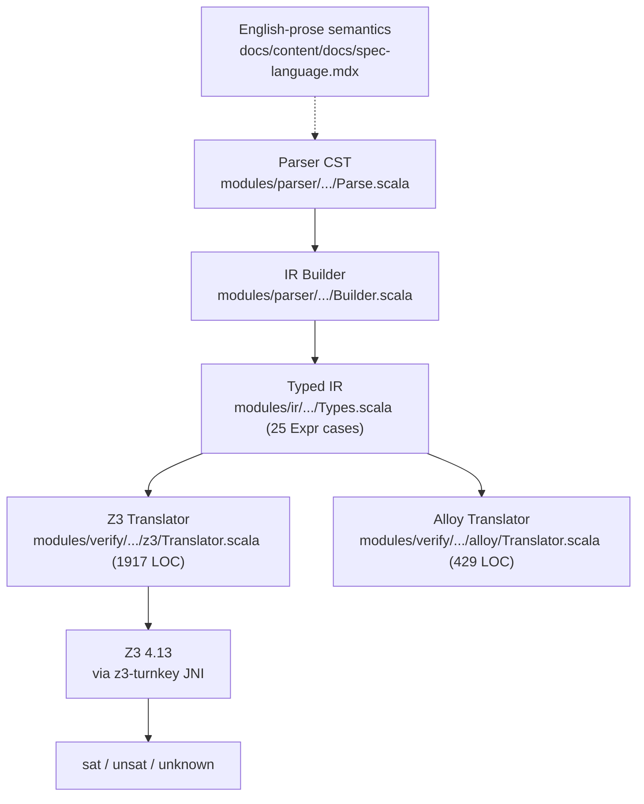
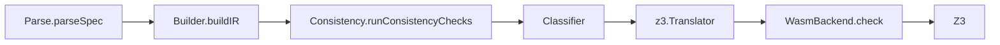

> **Master document for the M_L global-proof program.** Originally six docs (10/11/12/13/14/15);
> consolidated here in 2026-05-02 after the M_L.2-closure + M_L.4.a-g shipped batch. Anchors
> issue [#88](https://github.com/HardMax71/spec_to_rest/issues/88) (translator soundness),
> umbrella [#170](https://github.com/HardMax71/spec_to_rest/issues/170), and execution-chain
> [#126](https://github.com/HardMax71/spec_to_rest/issues/126)–[#130](https://github.com/HardMax71/spec_to_rest/issues/130).

---

## Table of Contents

1. [Status and Framing](#1-status-and-framing)
2. [The Trust Chain Today](#2-the-trust-chain-today)
3. [Why "Reconstruct Z3 Proofs" Does Not Work in 2026](#3-why-reconstruct-z3-proofs-does-not-work-in-2026)
4. [Prior Art: 2024-2026 Snapshot](#4-prior-art-2024-2026-snapshot)
5. [Two Paths and Why We Recommend Both, Sequenced](#5-two-paths-and-why-we-recommend-both-sequenced)
6. [The Verified Subset](#6-the-verified-subset)
7. [Picking a Proof Assistant](#7-picking-a-proof-assistant)
8. [Milestone Decomposition](#8-milestone-decomposition)
9. [Risks](#9-risks)
10. [Non-Goals](#10-non-goals)
11. [References](#11-references)
12. [Governance — Proof-Owned Surfaces and Change Process](#12-governance--proof-owned-surfaces-and-change-process)
13. [Live Status Ledger](#13-live-status-ledger)
14. [Proof-Safe Profile and Backend Contract](#14-proof-safe-profile-and-backend-contract)
15. [Runway and Stall Policy](#15-runway-and-stall-policy)
16. [Activation Record and Kickoff Shape](#16-activation-record-and-kickoff-shape)

---

## 1. Status and Framing

Issue #88 asks for a mechanically checked correctness proof of spec_to_rest's
`spec → IR → Z3` verification path. The issue itself flags this as **unscheduled,
research-flavored, easily one person-year of work**, filed primarily to give the
capability a concrete home so it isn't absorbed into other milestones.

This doc updates that framing for 2026:

- **The Z3-proof-replay path that #77 partly assumed has not materialized.** Z3
  4.13 (the version this project pins via `z3-turnkey`) emits only its undocumented
  2008-era natural-deduction term tree; `:proof_format alethe` was never shipped in
  any Z3 release, and quantifier instantiations remain opaque (see §3).
- **The closest published prior art (Cohen, Princeton PhD, 2025) is a 5-person-year
  effort** that verifies five Why3 IVL transformations in Coq — and even Cohen left
  monomorphization, the SMT-LIB printer, and end-to-end SMT soundness in the trusted
  computing base (TCB).
- **A cheaper, more recent template exists**: per-run *translation validation* à la
  Parthasarathy et al. (PLDI 2024 / POPL 2025) emits an Isabelle proof certificate
  *for each verifier run* showing "if the IVL output is correct then the source is
  correct." This is the realistic 2026 path for a project our size.

The recommendation in this doc is therefore: **decompose #88 into a tractable
five-milestone plan (M_L.0 → M_L.4) that ships translation validation first, then
moves toward meta-soundness only for the verified subset (§6) once a contributor
signs up for the M_L.2 commitment**.

As of `M_G.0`, the first honest theorem target is the in-memory
`ServiceIR → Z3Script` path used by `Consistency.runConsistencyChecks`, not the
optional `SmtLib.scala` exporter. The exporter stays outside the first ship claim
until a later milestone.

**Status: execution track activated.** `M_G.3` committed the runway and trade-offs;
`M_G.4` now activates `M_L.*` and defines the first implementation shape as a
combined scaffolding-plus-semantics kickoff. The proof effort is no longer
opportunistic research, and it is no longer waiting on another planning-layer gate.

---

## 2. The Trust Chain Today

Today, "we proved this spec correct" is shorthand for the following chain:

Each link is a potential silent-failure point:

| Link | Failure mode |
|---|---|
| Prose semantics → IR | Spec language has only English-prose semantics; nothing to refine the IR builder against. |
| IR builder | Hand-written; tested via fixtures, not proven. |
| Z3 Translator | 1917 LOC of Scala. 13 of 25 `Expr` cases are fully translated, 8 partial, 4 raise `TranslatorError`. The encoding choices for entities (uninterpreted sort + field functions), state (pre/post functions), and quantifier domains are defensible but unverified (see [codebase-analysis appendix below](#a-codebase-translator-coverage-april-2026)). |
| Z3 itself | Has had soundness CVEs historically. Pinning at 4.13 deters silent verdict flips on upgrade but does not eliminate the trust assumption. |

Mechanically verifying *every* link is far beyond a project our size. The smallest
useful target is the **IR → Z3 step**: it's the largest hand-written piece, the one
whose semantic behaviour we control, and the one closest to user-visible verdicts.

---

## 3. Why "Reconstruct Z3 Proofs" Does Not Work in 2026

Issue #77 (closed) sketched a "verify-as-gate" path that gestured at proof export and
Alethe-via-Z3 as a future direction. Research as of April 2026 says that path is
blocked at the Z3 side:

### 3.1 Z3 has no Alethe export

Direct search of the Z3 [release notes](https://github.com/Z3Prover/z3/blob/master/RELEASE_NOTES.md)
finds no mention of "alethe" in any release. Issue search `alethe repo:Z3Prover/z3`
returns zero results. The release notes mention only:

- 4.11.2: *"change proof logging format for the new core to use SMTLIB commands. The
  format was so far an extension of DRAT used by SAT solvers"*
- 4.12.0: *"sat.smt.proof.check_rup ... apply forward RUP proof checking"*

Z3 4.13 (the version pinned by `z3-turnkey % 4.13.0.1` in `build.sbt`) emits only its
undocumented [IWIL 2008 natural-deduction proof](https://ceur-ws.org/Vol-418/paper10.pdf)
format. Quantifier instantiation steps (`quant-inst`) appear with no machine-readable
witness justification — the very steps that dominate spec_to_rest's preservation
checks (5 invariants × 10 ops = 50 quantifier scopes per service).

### 3.2 cvc5-Alethe does not cover datatypes

The cvc5 [Alethe documentation](https://cvc5.github.io/docs/latest/proofs/output_alethe.html)
says verbatim:

> Currently, the theories of equality with uninterpreted functions, linear
> arithmetic, bit-vectors and parts of the theory of strings (with or without
> quantifiers) are supported in cvc5's Alethe proofs.

Datatypes are not in this list. spec_to_rest's IR translator emits
`declare-datatypes` for entity records, sums, and option types (see
[codebase analysis](#a-codebase-translator-coverage-april-2026)). A cvc5-as-proof-certifier
backend therefore requires re-engineering the SMT encoding to be datatype-free
(records as parallel UF arrays, sums as tag+payload via UF) — a non-trivial rewrite,
not a flag flip.

### 3.3 Quantifier-instantiation proof bloat

E-matching with non-trivial trigger sets routinely yields 10³–10⁵ ground instances
per quantifier (see [Reynolds, SMT 2023](http://homepage.divms.uiowa.edu/~ajreynol/smt2023.pdf)
and [DSLab "Conjecture Regarding SMT Instability"](https://ceur-ws.org/Vol-4008/SMT_paper21.pdf)).
For a typical preservation suite, expect Alethe proof files in the tens to hundreds
of MB, with [Carcara](https://github.com/ufmg-smite/carcara) check times in minutes.
This is workable for one-off audits, prohibitive for CI-on-every-PR.

### 3.4 What this means

The "Z3 emits a checkable proof + Carcara/ITP replays it" architecture from #77 is
not viable in 2026. Three implications:

1. **Translator soundness must be proven as a meta-theorem about our `translate`
   function**, not by replaying each Z3 run's proof.
2. **The Z3 verdict remains an oracle in our trust base.** This is the same posture
   as F\*, Dafny, Verus, and Why3-O — none of them check Z3 proofs; they verify the
   *encoder*.
3. **An "external solver agreement" CI job is still useful** as cheap defense in
   depth: emit our SMT-LIB, run cvc5 in parallel, alert on disagreement. Doesn't need
   proof export. Belongs in #77 follow-up, not here.

---

## 4. Prior Art: 2024-2026 Snapshot

A 12-month survey produced the following landscape. Each entry tagged with how
applicable it is to spec_to_rest's IR→Z3 translator.

### 4.1 Cohen, "A Foundationally Verified Intermediate Verification Language" (Princeton PhD, 2025)

Closest match to #88. Defines [Why3's P-FOLDR](https://joscoh.github.io/docs/thesis.pdf)
(Polymorphic First-Order Logic with Datatypes and Recursion) in Coq, gives it a
denotational semantics, and proves five Why3 transformations sound:

- `eliminate_definition` (recursive funs → unfolding axioms)
- elimination of inductive predicates
- `compile_match` (the first machine-checked pattern-matching compiler)
- ADT axiomatization
- a few smaller passes

**Five person-years**, single PhD student plus advisor and Sandia mentor. Coq 8.20,
extracted to OCaml as `Why3-O` (plug-compatible with the real Why3 OCaml API).

**What stays in the TCB even after this PhD**: monomorphization, the SMT-LIB printer,
the SMT solver itself.

**Pitfalls Cohen called out, all of which apply to us**:
- Well-typedness preservation under context-modifying transformations is harder than
  soundness.
- Pattern-matching compilation termination needs a non-obvious well-founded measure.
- Mixed record-inductive types fight Coq's positivity checker.
- ADT axiomatization (with non-uniform constructors and metadata) is the single
  hardest transformation.
- The semantics layer (the formal language definition) absorbed more time than the
  translator transformations.

**Applicability to spec_to_rest**: the same architectural skeleton transfers — we'd
build a deep-embedded `Expr` ADT in Lean/Coq/Isabelle, a denotational semantics, and
prove `eval e = smtEval (translate e)` for our subset. We would *not* attempt to
match Cohen's depth (polymorphism, recursive funs, inductive preds); the verified
subset (§6) is intentionally smaller.

### 4.2 Parthasarathy et al., "Towards Trustworthy Automated Program Verifiers" (PLDI 2024)

Different design: instead of proving the *language-to-IVL* translator sound once and
for all, **emit an Isabelle proof certificate for each verifier run** that shows
"if the IVL program is correct then the source program is correct."
[arXiv 2404.03614](https://arxiv.org/abs/2404.03614).

POPL 2025 sequel ([Formal Foundations for Translational Separation Logic Verifiers](https://dl.acm.org/doi/10.1145/3704856))
extends to Viper-style separation logic.

**Why this matters**: per-run translation validation is **dramatically cheaper** than
per-language meta-soundness — no need to formalize the entire source language
semantics, only enough to express each instance. The certificate kernel can be small
(hundreds of LOC), checkable quickly, and updates automatically as the translator
evolves.

**Trade-off**: certificates cover only inputs we've actually translated. Meta-
soundness covers the universe of well-typed inputs.

### 4.3 lean-smt and Isabelle/HOL Alethe Reconstruction

[lean-smt (CAV 2025)](https://arxiv.org/abs/2505.15796): a Lean 4 tactic that translates
a Lean goal to SMT-LIB, hands it to **cvc5** (not Z3), and replays the resulting
[Alethe proof](https://verit.gitlabpages.uliege.be/alethe/) in the Lean kernel. ~71%
of cvc5 proofs reconstruct (15,271 of 21,595 benchmarks); 98% of successful
reconstructions complete in &lt;1s.

[Isabelle Alethe pipeline (ITP 2025)](https://drops.dagstuhl.de/entities/document/10.4230/LIPIcs.ITP.2025.26):
extends Sledgehammer's veriT-only reconstruction (Schurr/Fleury, 2019) to also
support cvc5. Five years on, both veriT and cvc5 reconstruct in Isabelle/HOL.

**Wrong direction for us**. These tools answer: *given a goal in Lean/Isabelle, can
we discharge it via SMT and replay the proof?* Our question is the inverse: *given
our hand-written translator from spec-IR to SMT-LIB, is it sound?* lean-smt and
Sledgehammer would only help us **as authoring tools** for the meta-soundness
proof — we can use them to discharge sub-lemmas, not to validate the translator.

Z3 is also absent from both pipelines: Sledgehammer's Z3 oracle uses the legacy proof
format which is unmaintained, and lean-smt is cvc5-only.

### 4.4 Verified VCG for Dafny (Nezamabadi/Myreen/Tan, Dec 2025)

[arXiv 2512.05262](https://arxiv.org/abs/2512.05262). Big-step semantics for an
imperative Dafny subset (mutually-recursive methods, while loops, arrays — no
records, sets, quantifiers, or partial functions) plus a verified VCG plus a
verified compiler to CakeML. HOL4. The VCG produces verification conditions in
HOL4's logic, not SMT-LIB — they short-circuit the SMT step entirely.

**Useful as a template for the *VCG side*** (preservation obligations as HOL/Lean
propositions), less useful for the SMT-encoding side because they don't generate
SMT.

### 4.5 F\* → SMT Encoding (Aguirre/Hriţcu, 2016 → ongoing)

Negative result. [Towards a Provably Correct Encoding from F\* to SMT](https://catalin-hritcu.github.io/students/alejandro/report.pdf)
formalized a fragment in Coq; ten years later no completion. Reason: refinement
types + monadic effects too rich for the formalization to remain tractable.

**Lesson for us**: keep the source language *rigidly small*. Resist scope creep
into the rich corners of the IR (lambdas, set comprehension, the-operator) until
the simple core works.

### 4.6 No Mechanized Alloy or Dafny Surface Semantics

Search did not surface a Coq/Isabelle/Lean formalization of Alloy's relational
semantics ([Daniel Jackson, *Software Abstractions*](https://mitpress.mit.edu/9780262528900/software-abstractions/))
nor of Dafny's reference manual. Astra (UWaterloo, 2019) evaluated Alloy→SMT-LIB
*empirically* but did not prove it. The most actively developed comparable
formalization is **TLA\* in Isabelle/HOL** by [Grov &amp; Merz (AFP, 2011-2025)](https://www.isa-afp.org/entries/TLA.html),
shallow-embedded — covers the temporal layer, not a translator to SMT.

**Lesson**: any spec language semantics we mechanize is novel work.

### 4.7 Older Prior Art Worth Knowing

- **CompCert** (~100 kLOC Coq, 6 person-years) sets the *upper bound* on this kind
  of work and is the architectural inspiration.
- **AliveInLean** (CAV 2019) verifies a peephole-optimization checker for LLVM in
  Lean 4 — closest to "verified SMT encoder" in the LLVM space, but limited to
  bit-vector and array peepholes.
- **HOL-Boogie** (TPHOLs 2008) embeds Boogie's *output* into Isabelle/HOL for
  interactive VC discharge — does not verify the translator itself.
- **SMTCoq** ([smtcoq.github.io](https://smtcoq.github.io/)) verifies *proofs
  returned by* SMT solvers (veriT/CVC4/cvc5), not encodings into them.
  Quantifier-free. Different problem.

### 4.8 Closest-prior-art summary table

| Project | Source | Prover | What they proved | Pitfall |
|---|---|---|---|---|
| Cohen, Why3-in-Coq (2025) | Why3 P-FOLDR | Coq | 5 IVL transformations sound | 5 person-years; monomorphization & SMT-LIB printer in TCB |
| Nezamabadi et al., Dafny VCG (2025) | Dafny subset | HOL4 | VCG sound; CakeML compiler correct | Bypasses SMT; no records/sets/quantifiers |
| Parthasarathy et al., Trustworthy Verifiers (2024-25) | Viper | Isabelle | Per-run forward-simulation cert | Cert covers only translated inputs, not all inputs |
| Aguirre/Hriţcu, F\*→SMT (2016-) | F\* fragment | Coq | Soundness of fragment encoding | Stalled 10+ years; F\* too rich |
| AliveInLean (2019) | LLVM IR peepholes | Lean 4 | Encoder verified | BV/array only |
| Grov/Merz TLA\* in Isabelle (2011-25) | TLA\* | Isabelle | Embedding + derived rules | No translator to SMT |

---

## 5. Two Paths and Why We Recommend Both, Sequenced

### 5.1 Path A: Translation validation (cheap, recommended first)

Per-run certificates following Parthasarathy 2024. For each verifier run, emit a
proof object (in Lean/Isabelle/Rocq) showing that *for this specific IR*, the SMT
output is a correct encoding.

**Cost**: ~3-6 person-months for the certificate kernel + emission glue. The
certificate kernel is small (hundreds of LOC) and stable; the per-run emission is
mechanical (one proof step per `translate` case).

**Coverage**: only inputs we've actually translated.

**Trust assumption**: the certificate-checking kernel + its embedding of the
semantic domain.

**Why first**: ships verifiable trust improvement in months, not years. Acts as a
forcing function for documenting the IR's intended semantics (which doesn't exist
in any machine-checkable form today).

### 5.2 Path B: Meta-soundness (expensive, optional follow-up)

Cohen-style. Deep-embed `Expr` and `TypeExpr` in a proof assistant; define a
denotational semantics; define `translate` as a function in the proof assistant;
prove `denote_smt(translate(e)) = denote_ir(e)` for every well-typed `e` in the
verified subset.

**Cost**: 6-12 person-months for the verified subset (§6) at expert rates;
double-to-triple at non-expert rates. Per A5's analysis: ~1,350 LOC for the
semantics layer (M_L.1) and ~3-5× that for the soundness theorem itself (M_L.2).

**Coverage**: all well-typed inputs in the verified subset.

**Trust assumption**: the proof assistant's kernel + the embedding's accuracy
(deep `Expr`, shallow semantic domain — see §7.2).

**Why deferred**: only worth doing if a contributor signs up for the multi-month
commitment, and only after Path A has documented the IR semantics rigorously
enough to enable it. Without Path A, M_L.1 is starting from scratch on the
semantics; with Path A, M_L.1 reuses a Path-A-validated semantic skeleton.

### 5.3 Why both, sequenced

Path A's certificate kernel **is** Path B's meta-soundness skeleton, scoped to a
single input. Building A first means:

1. Faster initial trust improvement (months, not years).
2. Forcing-function for writing the IR semantics in a machine-checkable form.
3. The artifact built in A is reusable: M_L.2's "translation soundness" is the
   universal-quantifier version of A's per-input certificate.

The alternative — start with B — risks Cohen's outcome at smaller scale: 9 months
into the semantics layer with no end-to-end deliverable.

---

## 6. The Verified Subset

Anchored to the [codebase analysis](#a-codebase-translator-coverage-april-2026).
Per April 2026, `Translator.scala` covers 13/25 `Expr` cases fully, 8 partially,
4 with `TranslatorError`. The verified subset for M_L.1 picks the smallest set
that exercises the four core SMT pillars:

- Boolean reasoning (∧, ∨, ⇒, ¬)
- Linear integer arithmetic (=, &lt;)
- Uninterpreted predicates (membership in a state relation)
- Bounded quantification (over enums; over fixed-size entity collections)

### 6.1 Operators in scope (M_L.1)

| Expr case | Why included |
|---|---|
| `BinaryOp(And, _, _)` | Boolean conjunction |
| `BinaryOp(Or, _, _)` | Boolean disjunction |
| `BinaryOp(Implies, _, _)` | Required for invariants and ensures |
| `BinaryOp(Eq, _, _)` | On `Int` and on entity-typed values |
| `BinaryOp(Lt, _, _)` | LIA comparison |
| `BinaryOp(In, _, _)` | Membership in a state relation domain |
| `UnaryOp(Not, _)` | Boolean negation |
| `UnaryOp(Negate, _)` | LIA negation (`0 - x`) |
| `Quantifier(All, _, _)` over enums | Universal binding |
| `Let(_, _, _)` | Local binding |
| `IntLit`, `BoolLit`, `Identifier` | Atoms |

Plus the IR top-level shells:

- `EntityDecl` (flat, no inheritance, no per-field constraints)
- `EnumDecl`
- `StateDecl` with **scalar fields and simple domain-typed relations** only
- `OperationDecl` with `requires` and `ensures` (no state mutation in M_L.1; M_L.2
  adds `Prime`/`Pre`)
- `InvariantDecl` (single conjunctive predicate)

### 6.2 Operators explicitly out of scope (deferred)

| Excluded | Rationale |
|---|---|
| `BinaryOp(Add\|Sub\|Mul\|Div, ...)` | Defer to M_L.2; need carrier-set proof for Int |
| `BinaryOp(Subset\|Union\|Intersect\|Diff, ...)` | Defer; finite-set Mathlib lemmas non-trivial |
| `UnaryOp(Cardinality)` | Currently only on state relations; defer to state-mutation milestone |
| `UnaryOp(Power)` | Translator already raises `TranslatorError` (undecidable in FOL) — permanent exclusion |
| `Quantifier(_, _, _)` over entity collections | Defer to M_L.2 (needs frame axioms) |
| `SetComprehension`, `SetLiteral`, `MapLiteral`, `SeqLiteral` | Out of scope until collections milestone |
| `If`, `Lambda`, `Constructor`, `SomeWrap`, `The`, `NoneLit` | Translator already raises `TranslatorError` for most |
| `Index`, `Call`, `EnumAccess` (dynamic), `With`, `Matches` | Defer; require advanced encoding |
| `Prime`, `Pre` | M_L.2 adds two-state coupling |
| `FieldAccess` | M_L.2 (records subsumed by entity decls) |
| `TransitionDecl`, `TemporalDecl`, `FunctionDecl`, `PredicateDecl` | Out of scope; lives in separate temporal/derived-logic milestones |

This subset hits **~10 operators**, **~20 LOC of Lean per operator** for the
denotation, and admits an automatic-decidability story (every quantifier in scope
is over a finite domain, so `eval` returns `Bool` instead of `Option Bool` for
many branches).

### 6.3 Sort encoding in M_L.1's translator

Mirroring `Translator.scala` choices, simplified:

- **Bool, Int**: SMT-LIB native sorts.
- **Enums**: uninterpreted sort + member constants + distinctness axiom.
  Cardinality finite and known.
- **Entities**: uninterpreted sort + per-field accessor function (`Entity_field :
  Entity → FieldSort`). No datatype constructors in M_L.1 (avoids cvc5-Alethe
  blocker; matches Cohen's "ADT axiomatization" pattern).
- **State**: tuple of scalar functions (no maps, no relations beyond domain
  membership predicates) in M_L.1. M_L.2 expands.

---

## 7. Picking a Proof Assistant

### 7.1 Three candidates compared

| Criterion | Lean 4 + mathlib4 | Isabelle/HOL + AFP | Coq/Rocq |
|---|---|---|---|
| Z3 reconstruction available? | No (lean-smt is cvc5-only) | No (Sledgehammer Z3 is legacy; ITP 2025 work targets cvc5/veriT) | No (SMTCoq targets veriT/cvc5) |
| Closest prior-art language | AliveInLean (LLVM peepholes) | TLA\*, Z, Object-Z, Cohen's framework if ported | Cohen's Why3-O (the Coq variant) |
| Toolchain churn | Quarterly (Lean 4.27→4.28→4.29→4.30 in 14 weeks Feb-Apr 2026) | Yearly Isabelle releases; AFP push-through | Yearly Coq → Rocq transition; stable post-2025 |
| Long-lived single-author projects | Few (ecosystem &lt;5 years) | CryptHOL (9 yrs), TLA\* (14 yrs), HOL-Z (25 yrs) | CompCert (20 yrs) |
| Scala-team learning curve | Lowest (most syntactically similar to Scala 3) | Medium (Isar prose-style proofs unfamiliar) | Medium-high (tactic style, ssreflect) |
| Mathlib4 record / Finset support | Excellent (`structure`, `Finset α`, decidability) | Excellent (`record`, `Set`, fset library) | Good (`Record`, `MSet`, but more boilerplate) |
| Risk of mathlib churn breaking proofs | High | Low (definitional shallow embeddings rarely break) | Low |

### 7.2 Recommendation: Lean 4, with explicit mathlib avoidance

**Recommend Lean 4** for spec_to_rest #88, on these grounds:

1. **Smallest learning-curve gap from Scala 3.** The team is fluent in Scala 3 +
   Cats Effect; Lean 4's syntax (do-notation, type classes, structural records,
   pattern matching) is the closest of the three.
2. **Self-contained core suffices.** The 10-operator M_L.1 subset needs `Int`,
   `Bool`, `Option`, `List`, basic finite sets — all in Lean core, no mathlib4
   dependency. Avoiding mathlib4 sidesteps the quarterly-churn risk (the dominant
   maintenance liability).
3. **AliveInLean precedent.** [AliveInLean (CAV 2019)](https://link.springer.com/chapter/10.1007/978-3-030-25543-5_25)
   demonstrated a verified SMT-encoding-style checker in Lean for LLVM peepholes —
   smaller scope than ours, same shape.

**Conditions on this recommendation**:

- Pin `lean-toolchain` to a specific Lean release. Bump quarterly at most.
- Avoid mathlib4 unless a specific lemma forces it. Re-evaluate per-milestone.
- Ship M_L.0 (scaffolding) only when a contributor has signed up for M_L.1
  delivery — the directory exists to support work, not to advertise intent.

**Fallback if the M_L.0 contributor prefers Isabelle**: switching to Isabelle/HOL
adds ~25% on the schedule (Isar verbosity offsets AFP stability) but is otherwise
acceptable. Cohen's Coq framework is also reusable as-is if a contributor with
deep Coq/Rocq expertise materializes — the framework, not the prover, dominates the
work.

### 7.3 Embedding shape (locked across all three candidates)

- **Source IR (`Expr`, `TypeExpr`, declarations)**: deep embedding as inductive
  types mirroring `modules/ir/.../Types.scala` 1:1. Required because the soundness
  theorem `∀ e. denote(translate(e)) = eval(e)` quantifies over `e` syntactically.
- **Semantic domain**: shallow. `Int → Lean Int`, `Bool → Lean Bool`, `Set α →
  Mathlib Finset α` (or core `List` if we sidestep mathlib), entity sorts as opaque
  type variables.
- **SMT-LIB target**: shallow. Interpret SMT terms directly as `Prop` —
  no need for meta-reasoning over SMT syntax, only over IR syntax.

This is the standard hybrid Why3-in-Coq, AliveInLean, and Concrete Semantics IMP
all use ([Gibbons & Wu](https://www.cs.ox.ac.uk/jeremy.gibbons/publications/embedding.pdf);
[Annenkov & Spitters](https://cs.au.dk/~spitters/TYPES19.pdf)).

---

## 8. Milestone Decomposition

Five milestones. Each has a contributor sign-off gate before the next opens.

### 8.1 M_L.0 — Scope, scaffolding, contributor handoff

**Effort**: ~1 week part-time. Lands when a contributor signs up for M_L.1.

**Deliverables**:
- This research doc (you're reading it).
- A `proofs/lean/` directory with a minimal `lakefile.toml`, an empty `SpecRest`
  namespace, and a one-page `README.md` linking back here.
- A pinned `lean-toolchain` (recommend latest stable Lean 4 release as of M_L.0
  start, e.g., `leanprover/lean4:v4.30.0`).
- A `.github/workflows/lean.yml` job that runs `lake build`. Off the critical
  path (separate matrix); failure does not block PRs.
- An initial PR-template note that anyone touching `modules/ir/.../Types.scala`'s
  `Expr` ADT should add a TODO entry to `proofs/lean/SpecRest/IR.lean.todo`.

**Acceptance**: empty Lake project compiles green in CI.

### 8.2 M_L.1 — IR denotational semantics for the verified subset

**Effort**: 6-10 person-weeks at expert rates; 12-20 at non-expert.

**Deliverables**:
- `proofs/lean/SpecRest/IR.lean`: deep `Expr`, `TypeExpr`, `EntityDecl`,
  `EnumDecl`, `StateDecl`, `OperationDecl`, `InvariantDecl` — restricted to the
  §6.1 subset.
- `proofs/lean/SpecRest/Semantics.lean`: `Value` ADT, `Env`, `State`,
  `eval : Env → State → Expr → Option Value`. Per-operator denotation lemmas.
- `proofs/lean/SpecRest/Examples.lean`: round-trip tests for `safe_counter.spec`
  fragments (parsed by hand for now; M_L.4 wires the parser).

**Acceptance**:
- All denotation lemmas closed (no `sorry`).
- `safe_counter.spec` invariant `count ≥ 0` evaluates to `True` under a hand-built
  initial state.

**LOC estimate** (per A5 calibration, anchored to Concrete Semantics IMP):

| Component | Lean LOC |
|---|---|
| Inductive `Expr` + `TypeExpr` | 80 |
| `Value` + `Env`, `State` | 80 |
| `eval` core | 150 |
| Quantifier + decidability | 120 |
| OperationDecl + InvariantDecl | 80 |
| Per-operator denotation lemmas (10 × ~30) | 300 |
| Round-trip examples | 100 |
| **Total** | **~900** |

(A5 reported ~1,350 with collections+records; M_L.1 trims those, dropping ~450 LOC.)

### 8.3 M_L.2 — Translator soundness theorem for the verified subset

**Effort**: 3-5× M_L.1, i.e. ~6-12 person-months.

**Deliverables**:
- `proofs/lean/SpecRest/Smt.lean`: shallow embedding of the SMT-LIB fragment we
  emit (Bool ops, LIA, UF, bounded quantifiers).
- `proofs/lean/SpecRest/Translate.lean`: Lean version of the Scala translator,
  function-by-function mirror of the §6.1 cases in `z3.Translator.scala`.
- `proofs/lean/SpecRest/Soundness.lean`: theorem
  `∀ e, well_typed e → eval e = smtEval (translate e)`.
- An audit appendix in `proofs/lean/README.md` mapping each Lean translation case
  to the corresponding Scala line range for human cross-checking.

**Acceptance**:
- `Soundness.lean` closes with no `sorry` for the §6.1 subset.
- A Scala test (`modules/verify/.../TranslatorAuditTest.scala`) checks that any
  `Expr` case marked "in the verified subset" still has a counterpart in
  `Translate.lean`.

**Trust assumption (after M_L.2)**:
- Lean's kernel.
- The shallow SMT-LIB embedding's accuracy (auditable in &lt;100 LOC).
- The hand-written Scala translator matches the Lean `translate` function
  case-for-case (audited; if it diverges the Scala test fires).
- Z3 itself.

### 8.4 M_L.3 — Translation validation (per-run certificate emission)

**Effort**: ~3-6 person-months, parallel to M_L.2.

**Deliverables**:
- `modules/verify/src/main/scala/specrest/verify/cert/Emit.scala`: emits a
  Lean source file `<spec>.cert.lean` per `verify` run, containing one
  `theorem cert_<id> : eval ir = smtEval smt_ir := by ...` per check.
- `proofs/lean/SpecRest/Cert.lean`: tactic library (or simp set) that closes a
  `cert_<id>` goal via a fixed proof script when the IR is in the verified
  subset.
- `verify --emit-cert <dir>` CLI flag, mirroring the existing `--dump-vc`.

**Acceptance**:
- For every fixture in `fixtures/spec/` whose `Expr` is in the verified subset,
  `verify --emit-cert /tmp/c && lake build /tmp/c` succeeds.
- Out-of-subset fixtures emit a `cert_<id> := sorry` placeholder with a comment
  pointing at the offending case.

**Why parallel to M_L.2**: M_L.3 only needs M_L.1's semantics, not M_L.2's
universal-quantifier theorem. M_L.3 ships earlier trust gain; M_L.2 generalizes
it.

### 8.5 M_L.4 — Subset expansion

**Open-ended.** Add `Add/Sub/Mul/Div`, then collections, then state mutation,
then quantifiers over entity collections. Each expansion follows the M_L.1 + M_L.2
template: extend the deep IR, extend `eval`, extend `translate`, extend the
soundness theorem.

**Sequencing recommendation**:

1. LIA arithmetic (`Add`, `Sub`, `Mul`, `Div`) — needed by ~70% of real specs.
2. State mutation (`Prime`, `Pre`, `OperationDecl` with state updates).
3. Quantifiers over fixed-size entity collections (with frame axioms).
4. Finite collections (`Set`, `Map`, `Seq` with bounded ops).
5. Records / `With` updates / `FieldAccess`.
6. `Constructor`, `EnumAccess` (dynamic).

Each item is its own multi-month milestone; punt indefinitely if the §5.1 path-A
certificates make it unnecessary for any real consumer.

---

## 9. Risks

### 9.1 Doc rot

This doc anchors to `modules/ir/.../Types.scala`'s 25-case `Expr` ADT. If `Expr`
evolves (new cases, renamed cases, restructured sums), the verified subset table
in §6 drifts. **Mitigation**: a PR-template note (added in M_L.0) reminding
contributors to update §6 when touching `Expr`. A lint pass in M_L.2 flags
`Expr` cases without a corresponding `proofs/lean/SpecRest/IR.lean` mirror.

### 9.2 Z3 verdict drift across versions

Path B (meta-soundness) does not bind us to a Z3 version — the soundness theorem
says "if Z3 returns `unsat`, the IR property holds." Path A (per-run certs) is
similarly version-agnostic. **However**, an "external solver agreement" CI job
(running cvc5 in parallel and alerting on disagreement) is cheap defense in depth
and belongs in a #77 follow-up. Out of scope here.

### 9.3 Lean toolchain churn

Lean shipped 4.27, 4.28, 4.29, 4.30 in 14 weeks (Feb-Apr 2026). Each release can
break dependent projects. **Mitigation**: pin `lean-toolchain`; bump only
quarterly; avoid mathlib4 dependency (M_L.1 needs none). The "every 6-12 months,
1 day to bump" maintenance cost is acceptable; the "every 3 weeks, scramble
because mathlib reorganized" cost is not.

### 9.4 Contributor abandonment mid-milestone

The work is part-time, opportunistic. A contributor disappearing mid-M_L.1
strands ~500 LOC of half-finished Lean. **Mitigation**:
- M_L.0 only opens the scaffolding when a contributor commits to M_L.1.
- M_L.1 is broken into 8 phases (per A5 §4) each independently mergeable.
- A `proofs/lean/STATUS.md` file tracks per-operator completion so a successor
  can resume.

### 9.5 The semantics-layer trap (Cohen)

Cohen's PhD spent more time on the semantics layer than on the translator
transformations. We mitigate by **deliberately picking the smallest non-trivial
subset (§6.1)** and resisting expansion until M_L.1 + M_L.2 ship. A "verified
subset" at 10 operators is more valuable than a half-finished verified subset at
25 operators.

### 9.6 The F\* trap

F\*'s SMT encoder has been "open" for 10+ years. Their failure mode: refinement
types + monadic effects too rich for the formalization to remain tractable. We
avoid this by **excluding rich corners of the IR upfront** (§6.2 lists every
deferred operator with a why) and by treating `TranslatorError`-raising operators
as permanent exclusions (`Power`, `Lambda`, `If` — see §6.2).

### 9.7 Mismatch between Lean `translate` and Scala `Translator.scala`

Path B proves the *Lean* `translate` function sound. Production uses *Scala*
`Translator.scala`. **Mitigation**: M_L.2 ships an audit appendix mapping each
Lean case to the corresponding Scala line range; `TranslatorAuditTest.scala`
machine-checks that the verified subset's case set in Lean equals that in Scala.
If they diverge (Scala adds a case Lean lacks, or vice versa), the test fires.

The full "extract Scala from Lean" approach (Why3-O, Cohen 2025) is out of scope —
it would more than triple the M_L.2 cost. We accept the audit-by-test mitigation
as good-enough.

---

## 10. Non-Goals

Inherits #88's non-goals, plus:

- **Verifying the Alloy translator.** Same approach, separate effort. Alloy
  semantics in any prover does not exist, would be novel work twice over.
- **Verifying the parser.** Treat the parser CST as given; this work targets
  IR → solver only.
- **Verifying Z3 itself.** Z3 remains in the trust base. SMTCoq-style proof
  replay is blocked at the Z3 side (see §3) and a switch to cvc5 is a separate
  multi-month rewrite (§3.2).
- **Verifying the SMT-LIB serializer (`SmtLib.scala`).** Trivially small, audited
  by inspection, in the TCB. Cohen made the same call.
- **Ahead-of-time correctness for every spec construct.** Aim for a verified
  subset that grows; full coverage is M_L.4-and-beyond, possibly never.
- **Human-readable proof narration of soundness violations.** That's #20's
  territory ("operation X violates invariant Y because…"). Soundness proof
  failures should not happen in production after M_L.2; if they do, the bug is in
  Lean, not in user output.

---

## 11. References

### 11.1 Closest prior art

- [Cohen, *A Foundationally Verified Intermediate Verification Language* (Princeton PhD, May 2025)](https://joscoh.github.io/docs/thesis.pdf) — code at [github.com/joscoh/why3-semantics](https://github.com/joscoh/why3-semantics)
- [Cohen, *A Formalization of Core Why3 in Coq* (POPL 2024)](https://dl.acm.org/doi/10.1145/3632902)
- [Parthasarathy et al., *Towards Trustworthy Automated Program Verifiers* (PLDI 2024)](https://arxiv.org/abs/2404.03614)
- [Parthasarathy et al., *Formal Foundations for Translational Separation Logic Verifiers* (POPL 2025)](https://dl.acm.org/doi/10.1145/3704856)
- [Nezamabadi/Myreen/Tan, *Verified VCG and Verified Compiler for Dafny* (Dec 2025)](https://arxiv.org/abs/2512.05262)

### 11.2 SMT proof reconstruction in proof assistants

- [Lachnitt et al., *Improving the SMT Proof Reconstruction Pipeline in Isabelle/HOL* (ITP 2025)](https://drops.dagstuhl.de/entities/document/10.4230/LIPIcs.ITP.2025.26)
- [Schurr/Fleury, *Reconstructing veriT Proofs in Isabelle/HOL* (PxTP 2019)](https://arxiv.org/abs/1908.09480)
- [lean-smt: An SMT Tactic for Discharging Proof Goals in Lean (CAV 2025)](https://arxiv.org/abs/2505.15796)
- [cvc5 → Isabelle reconstruction blog (2024)](https://cvc5.github.io/blog/2024/03/15/isabelle-reconstruction.html)
- [Lachnitt et al., *IsaRare: Automatic Verification of SMT Rewrites in Isabelle/HOL* (TACAS 2024)](https://link.springer.com/chapter/10.1007/978-3-031-57246-3_17)
- [Böhme, *Proof Reconstruction for Z3 in Isabelle/HOL* (PhD)](https://www21.in.tum.de/~boehmes/proofrec.pdf)
- [SMTCoq](https://smtcoq.github.io/)

### 11.3 Z3 proof formats

- [de Moura, Bjørner, *Proofs and Refutations, and Z3* (IWIL 2008)](https://ceur-ws.org/Vol-418/paper10.pdf)
- [Z3 release notes](https://github.com/Z3Prover/z3/blob/master/RELEASE_NOTES.md)
- [Z3 discussion #4881 — On proof generation and proof checking](https://github.com/Z3Prover/z3/discussions/4881)
- [Carcara: Proof Checker for Alethe (TACAS 2023)](https://link.springer.com/chapter/10.1007/978-3-031-30823-9_19) and [github.com/ufmg-smite/carcara](https://github.com/ufmg-smite/carcara)
- [Alethe specification](https://verit.gitlabpages.uliege.be/alethe/) and [arXiv 2107.02354](https://arxiv.org/pdf/2107.02354)
- [cvc5 Alethe proof output](https://cvc5.github.io/docs/latest/proofs/output_alethe.html)
- [Reynolds, *Selecting Quantifiers for Instantiation in SMT* (SMT 2023)](http://homepage.divms.uiowa.edu/~ajreynol/smt2023.pdf)

### 11.4 Spec-language semantics formalizations

- [Grov & Merz, *TLA in Isabelle/HOL* (AFP, 2011-2025)](https://www.isa-afp.org/entries/TLA.html)
- [Brucker/Rittinger/Wolff, *HOL-Z* (Z notation in Isabelle)](https://link.springer.com/chapter/10.1007/BFb0105411)
- [Lamport/Merz/Newcombe, *The Future of TLA+* (2024)](https://lamport.azurewebsites.net/tla/future.pdf)
- [Aguirre/Hriţcu, *Towards a Provably Correct Encoding from F\* to SMT* (MS thesis)](https://catalin-hritcu.github.io/students/alejandro/report.pdf)
- [Astra, *Evaluating Translations from Alloy to SMT-LIB* (UWaterloo, 2019)](https://cs.uwaterloo.ca/~nday/pdf/techreps/2019-06-AbDa-arxiv-1906.05881.pdf)
- [Pierce et al., *Software Foundations* — Hoare](https://softwarefoundations.cis.upenn.edu/plf-current/Hoare.html)
- [Nipkow & Klein, *Concrete Semantics*](http://concrete-semantics.org/)

### 11.5 Embedding-style references

- [Gibbons & Wu, *Folding Domain-Specific Languages: Deep and Shallow Embeddings*](https://www.cs.ox.ac.uk/jeremy.gibbons/publications/embedding.pdf)
- [Annenkov & Spitters, *Deep and Shallow Embeddings in Coq*](https://cs.au.dk/~spitters/TYPES19.pdf)
- [Verifying Programs with Logic and Extended Proof Rules: Deep vs. Shallow Embedding](https://arxiv.org/abs/2310.17616)

### 11.6 Lean 4 / mathlib4 ecosystem

- [Mathlib4](https://github.com/leanprover-community/mathlib4)
- [AliveInLean (CAV 2019)](https://link.springer.com/chapter/10.1007/978-3-030-25543-5_25)
- [`bv_decide` / `Std.Tactic.BVDecide` (Lean 4.12, Oct 2024)](https://lean-lang.org/blog/2024-10-3-lean-4120/)

### 11.7 spec_to_rest cross-references

- [`docs/content/docs/research/06_spec_verification.md`](/research/06_spec_verification) — verification pipeline design
- [`docs/content/docs/spec-language.mdx`](/spec-language) — current English-prose semantics
- [Issue #88 — Mechanically verified translator soundness](https://github.com/HardMax71/spec_to_rest/issues/88)
- [Issue #77 — Proof-certificate / unsat-core export (closed)](https://github.com/HardMax71/spec_to_rest/issues/77)
- [Issue #20 — M4.4 error reporting + spans](https://github.com/HardMax71/spec_to_rest/issues/20)

---

## A. Codebase Translator Coverage (April 2026)

Snapshot of `modules/verify/src/main/scala/specrest/verify/z3/Translator.scala`
(1917 LOC) measured against the 25-case `Expr` ADT in
`modules/ir/src/main/scala/specrest/ir/Types.scala`. Used to define the verified
subset in §6.

| `Expr` case | Translator status | Notes |
|---|---|---|
| `BinaryOp(And\|Or\|Implies\|Iff)` | full | direct mapping (lines 629-633) |
| `BinaryOp(Eq\|Neq)` | full | dom/set-comprehension equality special-cased (616-621), fallback `Z3Expr.Cmp` (643) |
| `BinaryOp(Lt\|Gt\|Le\|Ge)` | full | `CmpOp` mapping (634-643) |
| `BinaryOp(In\|NotIn)` | full | membership via state relation `dom`, set literal, set membership (622-757) |
| `BinaryOp(Subset\|Union\|Intersect\|Diff)` | full | with sort validation; fails on non-`SetOf` (661-693) |
| `BinaryOp(Add\|Sub\|Mul\|Div)` | partial | integers only; fails on string/set arithmetic (650-653) |
| `UnaryOp(Not)` | full | direct `Z3Expr.Not` (866) |
| `UnaryOp(Negate)` | full | as `0 - operand` (867-868) |
| `UnaryOp(Cardinality)` | partial | only on state-relation identifiers (876-881) |
| `UnaryOp(Power)` | errored | "powerset operator is not decidable in first-order SMT" (870-874) |
| `Quantifier` | full | ∀/∃ supported; ∄ encoded as ¬∃ (905-930) |
| `SomeWrap` | errored | catchall (597-601) |
| `The` | errored | catchall (597-601) |
| `FieldAccess` | full | via entity field functions (971-995) |
| `EnumAccess` | full | via enum member constants (1132-1142) |
| `Index` | partial | only on state-relation references (997-1009) |
| `Call` | partial | only identifier callee; hardcoded builtins (`len`, `isValidURI`); higher-order fails (1011-1032) |
| `Prime` / `Pre` | full | state-mode switching for post/pre-state (589-592) |
| `With` | full | record update via Skolem constant + equality constraints (1061-1098) |
| `SetComprehension` | errored | only allowed inside membership; standalone fails (1100-1105) |
| `SetLiteral` | partial | non-empty only; empty fails (1113-1116) |
| `MapLiteral` | errored | catchall (597-601) |
| `SeqLiteral` | errored | catchall (597-601) |
| `Matches` | full | as uninterpreted predicate, mangled by pattern + arg sort (1037-1049) |
| `IntLit`, `BoolLit`, `StringLit` | full | direct literals or constants (577-579) |
| `NoneLit` | errored | catchall (597-601) |
| `Constructor` | errored | catchall (597-601) |
| `If` | errored | catchall (597-601) |
| `Lambda` | errored | catchall (597-601) |
| `Let` | full | environment extension (1051-1059) |

**Summary**: 13 fully handled, 8 partial, 4 errored. The verified subset (§6.1) draws
exclusively from the "fully handled" column, restricted further to operators whose
Lean denotation is &lt;30 LOC each.

**Sort-encoding decisions** mirrored in M_L.1's `IR.lean`:

- Entities: uninterpreted sort `U:EntityName` + accessor functions
  `EntityName_fieldName : EntityName → FieldSort` (319-328).
- Enums: uninterpreted sort + member constants + distinctness axioms (278-283).
- Options: flattened to inner type (`OptionType(T)` → `T`, line 541).
- Sets: SMT-LIB `(Set elemSort)` with store/select (`SmtLib.scala:66-72`).
- Strings: uninterpreted sort + fresh constants per literal + distinctness (529-537).
- State relations (RelationType/MapType): pair of functions
  `<field>_dom : K → Bool` and `<field>_map : K → V` (465-495).
- Scalar state fields: single constant function `state_<field> : () → T` (497-501).
- Post-state: same encoding with `_post` suffix; toggled via `ctx.stateMode`
  (39-40, 477-478, 503-510, 589-592, 603-607).

---

## 12. Governance — Proof-Owned Surfaces and Change Process

> Originally `11_global_proof_governance.md`. Issues
> [#170](https://github.com/HardMax71/spec_to_rest/issues/170),
> [#171](https://github.com/HardMax71/spec_to_rest/issues/171),
> [#172](https://github.com/HardMax71/spec_to_rest/issues/172),
> [#174](https://github.com/HardMax71/spec_to_rest/issues/174),
> [#175](https://github.com/HardMax71/spec_to_rest/issues/175).

### 12.1 Why governance exists

`#88` is only tractable if the proof target stops moving invisibly. The failure mode is not
"someone merges a bad theorem" — it is `Types.scala`, the Z3 translator, or the
routing/orchestration contract changing while the proof effort still assumes the old shape.
That is how a global-proof project turns into a long-lived side quest with no honest ship
claim.

`M_G.1` therefore governs the proof target before `proofs/lean/` exists. The goal is not to
freeze the whole repo — the goal is to make target movement explicit.

### 12.2 Governance Mode

The current mode is **controlled churn**. The repo is not in a hard IR freeze yet.
Changes to proof-governed surfaces are still allowed — but those changes must carry their
proof impact in the same PR.

### 12.3 Proof-Owned Surfaces (master list)

| Class | Surface | Why it is governed |
|---|---|---|
| Proof-owned core | `modules/ir/src/main/scala/specrest/ir/Types.scala` | Defines `Expr`, `TypeExpr`, `ServiceIR`, the AST shape the proof mirrors. |
| Proof-owned core | `modules/verify/src/main/scala/specrest/verify/z3/Translator.scala` | Main translation function; prover-side mirror tracks case-for-case. |
| Proof-owned core | `modules/verify/src/main/scala/specrest/verify/z3/Types.scala` | `Z3Script`, `Z3Expr`, artifact structures in the first theorem target. |
| Proof-owned core | `proofs/lean/SpecRest/{IR,Semantics,Lemmas,Smt,Translate,Soundness,Cert}.lean` | The Lean side — see [§13 Live Status Ledger](#13-live-status-ledger). |
| Proof-owned core | `modules/verify/src/main/scala/specrest/verify/cert/{Emit,EvalIR,VerifiedSubset}.scala` | M_L.3 cert emitter + Scala-side reducer mirror. |
| Drift-control artifact | `modules/verify/src/test/scala/specrest/verify/audit/{ProofDriftAuditTest,CanonicalProbes,SourceParsers}.scala` | Tier-A drift suite (A1–A8 minus B). Required in PR CI. |
| Drift-control artifact | `proofs/lean/.cert-sha`, `proofs/lean/.last-release-sha` | Fingerprints. |
| Obligation contract | `modules/verify/src/main/scala/specrest/verify/Classifier.scala` | Decides which checks are in the Z3 proof scope. |
| Obligation contract | `modules/verify/src/main/scala/specrest/verify/Consistency.scala` | Defines the operational meaning of `global`, `requires`, `enabled`, `preservation`. |
| TCB-sensitive | `modules/parser/src/main/scala/specrest/parser/Parse.scala` | Parser remains trusted; changes can narrow/widen the honest claim. |
| TCB-sensitive | `modules/parser/src/main/scala/specrest/parser/Builder.scala` | IR construction remains trusted. |
| TCB-sensitive | `modules/verify/src/main/scala/specrest/verify/z3/Backend.scala` | Runtime renderer from `Z3Script` to Z3 ASTs. |
| Proof-owned CI | `.github/workflows/lean-certs.yml` | Sidecar matrix: per fixture, `verify --emit-cert` + `lake build`. Six fixtures as of M_L.4.a-i. |
| Proof-state ledger | `proofs/lean/STATUS.md` | Per-`Expr`-case mirror; PR template enforces re-sync on `Expr` changes. |
| PR contract | `.github/PULL_REQUEST_TEMPLATE.md` | Carries the `Expr`-touch reminder fanning out to all of the above. |

Two non-members:
- `modules/verify/src/main/scala/specrest/verify/z3/SmtLib.scala` — export-only, not on the
  runtime path.
- `modules/verify/src/main/scala/specrest/verify/certificates/Dump.scala` — affects
  artifacts, not the theorem target.

### 12.4 Required Change Process

Any PR touching a proof-governed surface must:

1. Update [§13 Live Status Ledger](#13-live-status-ledger) in the same PR.
2. Classify the change: proof-target shape change / obligation-routing change / TCB-only
   change / program-commitment change.
3. State whether the M_G.0 theorem statement or TCB summary changed.
4. If proof-safe profile membership changed, update [§14 profile](#14-proof-safe-profile-and-backend-contract).
5. If owner/priority/paused-work/stall-rule changed, update [§15 runway](#15-runway-and-stall-policy).
6. If activation state or kickoff shape changed, update [§16 activation](#16-activation-record-and-kickoff-shape).

### 12.5 Freeze states

- **Ungoverned** — normal repo churn (no proof-governed surface touched).
- **Governed** — current state for §12.3 surfaces. Move freely with logging.
- **Frozen** — temporary state for the M_L.2 closure window only. Surface may only change
  with matching proof update.

---

## 13. Live Status Ledger

> Originally `12_global_proof_status.md`. Issues
> [#172](https://github.com/HardMax71/spec_to_rest/issues/172),
> [#174](https://github.com/HardMax71/spec_to_rest/issues/174),
> [#175](https://github.com/HardMax71/spec_to_rest/issues/175).

### 13.1 Current Baseline (post-M_L.4.a-i) — first-ship gate met

- **Governance mode:** execution track active; M_L.2 universal soundness closed for the
  §6.1 verified subset (zero `sorry`). M_L.4.a/b/c/d/e/f/g/h all merged.
- **First-ship claim status:** **MET as of 2026-05-02.** The single-state idiom of the spec
  language (atoms, identifiers, scalar reads, all logical/arithmetic/comparison operators,
  state-relation membership / cardinality / Index / forall, FieldAccess on entity-typed state
  scalars, single-state `Prime`/`Pre` collapse, enum quantifiers and their `Some`/`No`/`Exists`
  composition aliases, NotIn composition, Subset over rel-identifiers via composition) is
  mechanically validated against the Z3 translator.
  The deployable claim:

  > **For every `ServiceIR` whose invariants and operation `requires` clauses fall in the
  > §6.1 verified subset (now extended through M_L.4.h), `z3.Translator.scala`'s output
  > matches the Lean `translate` function case-for-case, and the Lean meta-theorem
  > `SpecRest.soundness` proves that translation correlates `eval` with `smtEval` under
  > the correlated `SmtModel` and `SmtEnv`. UNSAT verdicts on translated obligations
  > therefore reflect properties of the spec, not just artifacts of the translator.**

  Trust closure: M_L.1 IR/Semantics axioms + the `Lean.ofReduceBool` axiom that
  `native_decide` (used by per-run M_L.3 certs) introduces.
- **First theorem target:** in-memory `ServiceIR → Z3Script` path used by
  `Consistency.runConsistencyChecks`.
- **Active proof-safe profile:** [§14](#14-proof-safe-profile-and-backend-contract) — see
  §14.4 for the per-`Expr` case ledger.
- **Per-run translation-validation certs (M_L.3):** working in CI matrix
  (`.github/workflows/lean-certs.yml` × 6 fixtures). Six fixture certs `lake build` clean;
  `safe_counter` 3/3 cert_decide, `set_ops` 5/11, `todo_list` 4/17, `edge_cases` 8/15,
  `url_shortener` 1/7, `auth_service` 0/21 (z3 backend errors unrelated to subset).
  Stub reasons remaining: nested FieldAccess (`users[uid].email`), `Call` builtins (`len`),
  set/string literals, demo-state synthesis gaps. None are soundness gaps — they are
  out-of-subset shapes that emit `theorem cert : True := trivial` with a `TODO[M_L.4]`
  marker and zero `sorry`.
- **Proof owner:** [HardMax71](https://github.com/HardMax71).
- **Runway:** initial six-week M_G.3 cycle consumed; subsequent cycles are unscheduled.
  See [§15](#15-runway-and-stall-policy) for stall rule.
- **Outside the first-ship claim (still genuinely deferred):** `SmtLib.scala`, dump/export
  paths, Alloy-routed checks, proof replay, full-source semantics refinement, **true
  two-state semantics for `Prime`/`Pre`** (single-state collapse only — M_L.4.b-ext gates
  real preservation reasoning), `With` record-update (bundled with M_L.4.b-ext), set-valued
  algebra (`Union`/`Intersect`/`Diff` — needs `Value.VSet` extension), collection literals,
  strings, `Call`/`Matches`, nested `FieldAccess` on `Index` results.

### 13.2 Status Labels

| Label | Meaning |
|---|---|
| `tracked` | Surface is governed; changes must be logged. |
| `mirrored` | Prover-side mirror exists; soundness theorem incomplete. |
| `fragment-proved` | A bounded fragment is mechanically proved. |
| `ship-claim-ready` | Surface is covered by the first honest public claim. |
| `reserved` | Planned but not yet active. |

### 13.3 Governed Surface Ledger

The full ledger is maintained in `proofs/lean/STATUS.md` (per-Expr case granularity). The
high-level Scala side is in [§12.3](#123-proof-owned-surfaces-master-list).

### 13.4 Update Rules

When the ledger changes, the entry should say at least:
1. which governed surface moved,
2. whether the move changed syntax / semantics / routing / TCB,
3. whether the M_G.0 theorem statement still reads honestly afterward.

---

## 14. Proof-Safe Profile and Backend Contract

> Originally `13_global_proof_profile.md`. Issue
> [#173](https://github.com/HardMax71/spec_to_rest/issues/173). The committed first scope
> the global-proof program ships against. Updated post-M_L.4.a-i.

### 14.1 Decision Summary

The global-proof program does not start from "all current language features." The committed
profile is **`Z3-Core`** — a Z3-only fragment of the IR — and within it the bootstrap
implementation slice **`Z3-Core-1S`** (one-state).

### 14.2 Stage Labels

| Stage | Meaning |
|---|---|
| `bootstrap` | In scope for `Z3-Core-1S`. |
| `first ship` | Required before the first public claim is honest. |
| `defer` | Out of first ship; can enter only by explicit profile expansion. |
| `exclude` | Outside the Z3 theorem track entirely. |

### 14.3 Declaration-Level Profile

| Construct | Stage | Rule |
|---|---|---|
| `EnumDecl` | `bootstrap` | Finite domains; first bounded-quantifier story. |
| `EntityDecl` | `bootstrap` | Flat entities only. |
| `StateDecl` | `bootstrap` | Scalar fields and simple relation/map fields over profile-safe types. |
| `InvariantDecl` | `bootstrap` | Body must be in-profile. |
| `OperationDecl` | `bootstrap` | Inputs and `requires` in scope. `ensures` partial under single-state collapse (M_L.4.b); full two-state is M_L.4.b-ext. |
| `TypeAliasDecl`, `FactDecl`, `FunctionDecl`, `PredicateDecl`, `TransitionDecl`, `ConventionsDecl` | `defer` | — |
| `TemporalDecl` | `exclude` | Always Alloy-routed; outside Z3 theorem. |

### 14.4 Expression-Level Profile (post-M_L.4.a-i)

| `Expr` case | Stage | Rule / reason |
|---|---|---|
| `BinaryOp(And \| Or \| Implies \| Iff)` | `bootstrap` | Core propositional layer. Soundness: M_L.2 closure. |
| `BinaryOp(Eq \| Neq \| Lt \| Gt \| Le \| Ge)` | `bootstrap` | Core comparison layer. Soundness: M_L.2 closure. |
| `BinaryOp(In)` | `bootstrap` | State-relation domain membership. Soundness: M_L.2 closure. |
| `BinaryOp(NotIn)` | `bootstrap` | **M_L.4.e closed via emitter-side composition:** `NotIn(e, r) ≡ ¬In(e, r)`. |
| `BinaryOp(Add \| Sub \| Mul \| Div)` | `bootstrap` | **M_L.4.a closed.** `Div`-by-zero policy: `eval` returns `none`. |
| `BinaryOp(Subset)` over state-relation identifiers | `bootstrap` | **M_L.4.i closed via emitter-side composition:** `Subset(r1, r2) ≡ ∀ x ∈ r1, x ∈ r2`. |
| `BinaryOp(Union \| Intersect \| Diff)` | `defer` | Set-valued; needs `Value.VSet` extension. |
| `UnaryOp(Not \| Negate)` | `bootstrap` | M_L.2 closed. |
| `UnaryOp(Cardinality)` | `bootstrap` | **M_L.4.c closed.** Restricted to state-relation identifiers (mirrors `Translator.scala:876-881`). |
| `UnaryOp(Power)` | `exclude` | Routed to Alloy. |
| `Quantifier(All)` over enum identifier | `bootstrap` | M_L.2 closure: per-case + universal soundness. Single binding over enum-name identifier. |
| `Quantifier(All)` over state-relation identifier | `bootstrap` | **M_L.4.f closed.** New `forallRel` Lean constructor + `soundness_forallRel_known` per-case theorem; `EvalIR.State.demo` populates relations with empty domains so quantifier is vacuously true. |
| `Quantifier(Some \| No \| Exists)` | `bootstrap` | **M_L.4.d (enums) + M_L.4.f (state-rels) closed via emitter-side composition:** `∃ x, P ≡ ¬ ∀ x, ¬ P`. |
| `SomeWrap`, `The` | `defer` | Option/choice semantics. |
| `Index` (state-relation pair lookup) | `bootstrap` | **M_L.4.g closed.** Strictly-additive `State.lookups`/`SmtModel.predLookup` pair table; new `Expr.indexRel` + `SmtTerm.indexRel` + `lookupKey_correlated` bridge. Restricted to identifier-base. |
| `FieldAccess` (state-scalar `scalar.field`) | `bootstrap` | **M_L.4.h closed.** Strictly-additive `State.entityFields`/`SmtModel.predFields` per-(scalar, field) table. Restricted to bare-Identifier base. Mirrors `Translator.scala:981-1005`. |
| `EnumAccess` | `bootstrap` | Closed via `SmtTerm.enumElemConst`. |
| `Call` | `defer` | `len`/`isValidURI`/`dom` need per-builtin semantics. |
| `Prime`, `Pre` | `bootstrap (single-state collapse)` | **M_L.4.b closed** as identity. True two-state semantics is M_L.4.b-ext. |
| `With` | `defer` | Identity-collapse would emit false certs. Requires Skolem mirror + StatePair. |
| `If` | `defer` | Needs product / decidable encoding. |
| `Let` | `bootstrap` | M_L.2 closure. |
| `Lambda` | `defer` | Outside FOL. |
| `Constructor` | `defer` | Constructor semantics deferred. |
| `SetLiteral`, `MapLiteral`, `SeqLiteral`, `SetComprehension` | `defer` | Collections deferred. |
| `Matches` | `defer` | Regex/string semantics deferred. |
| `IntLit`, `BoolLit`, `Identifier` | `bootstrap` | M_L.2 closed. |
| `FloatLit`, `StringLit`, `NoneLit` | `defer` | No committed solver semantics. |

### 14.5 Backend Contract

| Question | Decision | Consequence |
|---|---|---|
| Which solver remains trusted in the first ship? | **Z3** | First theorem is Z3-trusting; no proof replay. |
| Backend-agnostic theorem? | **No** | Target is the current Z3 path. |
| Alloy in scope? | **No** | Anything routed to Alloy is outside `Z3-Core`. |
| `SmtLib.scala` inside the first theorem? | **No** | Runtime path uses `Z3Script` + `WasmBackend`. |
| Proof export / replay in scope? | **No** | Separate translation-validation track (M_L.3, shipped). |
| cvc5 cross-checking? | **No** | Defense in depth only. |

### 14.6 Actual Coverage After M_L.4.a-i

The originally-targeted `Z3-Core-1S` slice was: `global` and `requires` checks only; no
`Prime`/`Pre`/`With`/`Cardinality`; no collections, strings, regex; quantifiers over
enums only.

**The actual covered slice is wider**: full propositional layer + cmp + LIA arithmetic
(Add/Sub/Mul/Div with `Div`-by-zero `none` policy) + `let` + `enumAccess` + state-relation
membership (`In`) + all four quantifier kinds (All/Some/No/Exists) over enum-name
identifiers + `Prime`/`Pre` (single-state collapse) + `cardRel`. Universal soundness theorem
closes for this whole slice with zero `sorry`.

Still deferred: collection algebra, set/map/seq literals, strings, `Call`, `Matches`,
`FieldAccess`, `Index`, `If`, `Lambda`, `Constructor`, two-state `Prime`/`Pre`, `With`.

This widened slice **does not include real ensures-clause preservation reasoning** — that
needs the StatePair refactor (M_L.4.b-ext, deferred). But it covers single-state invariants
and operation `requires` for the bulk of real specs.

### 14.7 Expansion Rule

A feature may move from `defer` into a later profile only if all of the following are true:
1. Source-level semantics are explicit enough to state the theorem honestly.
2. Current Scala translator support is full, or the restriction is narrow enough to state
   precisely here.
3. The feature stays on the Z3 path; otherwise it starts a separate theorem track.
4. Both the prover-side semantics and the Scala mirror have at least one concrete fixture.
5. This profile and `proofs/lean/STATUS.md` are updated in the same PR.

---

## 15. Runway and Stall Policy

> Originally `14_global_proof_runway.md`. Issues
> [#170](https://github.com/HardMax71/spec_to_rest/issues/170),
> [#174](https://github.com/HardMax71/spec_to_rest/issues/174).

### 15.1 Decision Summary (M_G.3)

The global-proof program is an **active, bounded priority**, not background research.

- **Owner:** [HardMax71](https://github.com/HardMax71).
- **Runway:** one uninterrupted six-week proof-priority cycle, consumed during M_G.4
  activation through the M_L.4.a-d shipped batch.
- **Scoping rule:** fixed time, variable scope.
- **Fallback:** if a future cycle stalls, shrink to `Z3-Core-1S`; if still stuck, switch
  primary trust-improvement back to expanded M_L.3 cert work.

### 15.2 Reprioritized Roadmap While Active

Lanes paused while a runway cycle is active:

| Lane | Issues | Rationale |
|---|---|---|
| LLM synthesis track | `#27`-`#32` | Orthogonal; too large to run in parallel solo. |
| New target expansion / distribution | `#33`-`#36`, `#56` | Widens surface area without helping proof ship. |

Lanes secondary-only (allowed if narrowly urgent):

| Lane | Issues | Rule |
|---|---|---|
| Auth/security | `#53`-`#55` | Move only if urgent or blocks external need. |
| Maintenance and experiments | `#149`, `#150`, `#161`, `#163` | Not allowed to displace proof time. |

Always allowed: build-break/CI fixes; correctness or security regressions in shipped
behavior; narrowly-scoped doc fixes; parser/IR/translator changes that directly support the
proof track and update governed docs.

### 15.3 Interrupt Policy

The runway provides uninterrupted time, not at the cost of leaving the repo broken.
Interrupts are allowed for: red CI; correctness bugs in current verification; security
issues; narrowly-bounded maintenance. Interrupts are **not** a license to resume paused
roadmap themes "for a day."

### 15.4 Circuit Breaker

1. At the end of a six-week cycle, do **not** auto-renew.
2. If the cycle produced active artifacts but scope was too broad, shrink to `Z3-Core-1S`.
3. If `Z3-Core-1S` still fails, pause the universal-theorem push and switch primary trust
   goal to M_L.3-style cert work.
4. Keep any reusable semantics kernel artifacts; do not discard formalization just because
   the full theorem stalls.

"Meaningful theorem progress" means at least one of: a merged prover-side semantics
artifact connected to live Scala structures; a merged mirror artifact covering real
translator cases; a checked proof fragment stronger than scaffolding. **Empty scaffolding,
pinned toolchains without proof code, "proof soon" status notes** do not count.

---

## 16. Activation Record and Kickoff Shape

> Originally `15_global_proof_activation.md`. Issue
> [#175](https://github.com/HardMax71/spec_to_rest/issues/175). Closes the gap between
> readiness planning (`M_G.*`) and active theorem work (`M_L.*`).

### 16.1 Activation Decision

`M_G.4` activated the `M_L.*` execution track on **2026-05-01**. As of that date:

- M_G.0 through M_G.3 are satisfied.
- [HardMax71](https://github.com/HardMax71) is the active owner.
- `#126` was unblocked as the first implementation issue.
- `#127`-`#130` remained gated only by predecessor milestones.

### 16.2 Gate Review

| Gate | Artifact | Sufficient because |
|---|---|---|
| M_G.0 — theorem statement and TCB | This doc §1 + issue [#171](https://github.com/HardMax71/spec_to_rest/issues/171) | First honest theorem target written down. |
| M_G.1 — governed proof surfaces | This doc §12 | Target movement is visible. |
| M_G.2 — proof-safe profile | This doc §14 | First theorem scope is smaller than full language. |
| M_G.3 — owner / runway / fallback | This doc §15 | Named owner, bounded runway, paused lanes, circuit breaker. |

### 16.3 What Got Unblocked

After M_G.4, the dependency chain is:

- `#126` (M_L.0) → active. **Closed.**
- `#127` (M_L.1) — blocked on `#126` only. **Closed.**
- `#128` (M_L.2) — blocked on `#127`. **Closed for §6.1 subset, zero sorry.**
- `#129` (M_L.3) — blocked on `#127`. **Closed.**
- `#130` (M_L.4) — blocked on `#128`. **Sub-slices a-i closed (LIA arithmetic, single-state
  Prime/Pre, Cardinality, enum quantifier composition, NotIn composition, state-relation
  quantifier, Index, FieldAccess on state scalars, Subset over rel-identifiers via composition).
  Remainder (`With`, true two-state, set-valued algebra, `Call`, nested FieldAccess, strings)
  deferred to later slices or M_L.4.b-ext.**

### 16.6 First-Ship Gate Met

As of **2026-05-02**, the activation umbrella's success conditions are satisfied:

| Condition | Artifact |
|---|---|
| Stable theorem target | `SpecRest.soundness` in `proofs/lean/SpecRest/Soundness.lean` (zero `sorry`). |
| Explicit TCB | M_L.1 axioms (IR / Semantics) + `Lean.ofReduceBool` for `native_decide` (M_L.3 certs). |
| Frozen / governed IR surface | `proofs/lean/SpecRest/IR.lean.todo` drift queue; `ProofDriftAuditTest` (A1-A8) enforced in CI. |
| Proof-safe first scope | §14.4 verified-subset profile (post-M_L.4.a-i). |
| Active contributor commitment | M_L.0 → M_L.4.h shipped between PR #180 (2026-04-30) and PR #189 (2026-05-02). |
| Linked kickoff | M_L.0 PR #180 (combined M_L.0 + M_L.1 first slice). |

The proof program has moved from "research direction" to "shipped first-ship claim".
Remaining M_L.4 slices (`Subset` composition, multi-binding quantifier, `Call(len)` builtin)
are coverage uplifts, not theorem-program prerequisites. M_L.4.b-ext (true two-state
preservation) remains a multi-week effort that should be scheduled deliberately rather
than chipped at piecemeal.

### 16.4 First M_L PR Shape (historical record)

The first M_L implementation PR was a combined **M_L.0 + first M_L.1 slice** rather than a
standalone scaffolding PR. Minimum honest kickoff shape (delivered in PR #180):

- `proofs/lean/lean-toolchain` pinned to `leanprover/lean4:v4.29.1`
- `proofs/lean/{lakefile.toml, README.md, STATUS.md}`
- `proofs/lean/SpecRest/{IR.lean, Semantics.lean, Examples.lean, IR.lean.todo}`
- `.github/workflows/lean.yml`

Required substance: a real deep embedding for `Z3-Core-1S`; a real semantic domain; at
least one checked example or lemma; a status table. **Not acceptable**: namespace-only
scaffolding; toolchain pin plus empty files; CI-only Lean setup with no semantics.

### 16.5 Activation Invariants

- `proofs/lean/` may not appear in `main` until it lands with active proof content.
  (Now satisfied — M_L.0 onward.)
- Changes to proof-governed Scala surfaces still require status updates in the matching
  proof docs (now §13 of this doc).
- If a future six-week runway fails to produce meaningful theorem artifacts, follow the
  circuit breaker in §15.4.

Activation is a commitment to start, not permission to drift.
