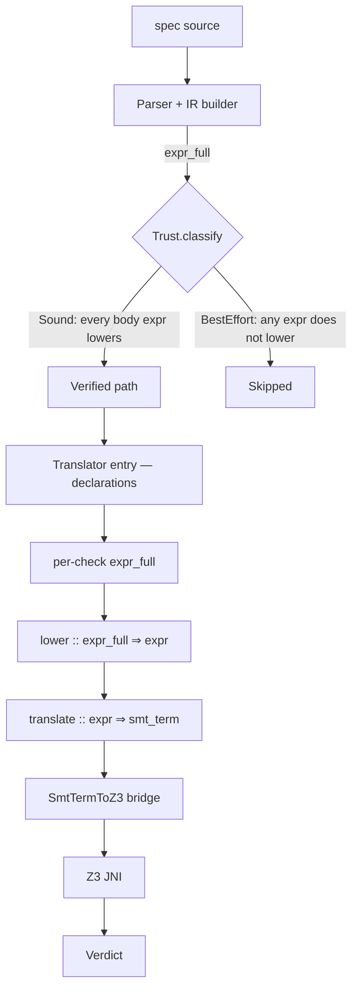

This page enumerates the **trusted computing base (TCB)** for `spec-to-rest verify`, the set of
components whose correctness must be assumed for the verifier's verdicts to mean what they claim.
Anything in TCB is *not* the soundness theorem proving anything about it; the rest of the system is
either machine-verified or out of the soundness scope.

It exists because issue [#192](https://github.com/HardMax71/spec_to_rest/issues/192) AC #6 says
"TCB documented and audited" and the answer was previously distributed across several research
notes. This page is the single ledger.

## Verdict semantics, recapped

`verify` issues per-check verdicts of one of:

- **`sat`**, the check holds. Z3 found no counterexample within the timeout.
- **`unsat`**, the check fails. Z3 (or Alloy) produced a model violating the property.
- **`unknown`**, Z3 timed out or hit incompleteness; result indeterminate.
- **`skipped`**, the check was not run; the diagnostic categorizes why.

Each verdict carries a **trust tag** in the JSON report:

- `trust: "sound"`, the check ran end-to-end through the extracted (Isabelle-verified) translator.
  If the verdict is `sat` or `unsat`, the soundness theorem applies (modulo TCB below).
- `trust: "best-effort"`, the check would have routed through the hand-written translator at the
  check-body level. As of [#192](https://github.com/HardMax71/spec_to_rest/issues/192) such checks
  always skip with `category=soundness_limitation` rather than producing a verdict.

So the practical guarantee is: **every non-skipped Z3 verdict is `trust=sound`**, backed by the
universal soundness theorem in `proofs/isabelle/SpecRest/Soundness.thy`.

## The verify pipeline, layer by layer



Every box's correctness obligation:

| Layer | Component | Status |
|---|---|---|
| Parse | `modules/parser/.../Parser.scala`, `Builder.scala` | **Trusted**, hand-written. Build errors surface as exit 1. |
| Classifier | `Trust.classify`, `Classifier` | **Trusted**, hand-written, but limited to *which* path runs; classification errors only cause spurious skips, rather than unsoundness. |
| `lower` projection | extracted from `IR.thy` via `Code_Target_Scala`, lives at `modules/ir/.../SpecRestGenerated.scala` | **Verified**, proven total in Isabelle. Returns `None` for shapes outside the subset. |
| `translate` (verified) | extracted from `Translate.thy`. Same generated file. | **Verified**, `translate :: expr ⇒ smt_term` is the function the soundness theorem talks about. |
| `Code_Target_Scala` extraction | Isabelle stock tool | **Trusted**, production-grade, used by Stainless/Leon, but not formally verified end-to-end. |
| `SmtTermToZ3` bridge | new in #192, lives in `modules/verify/.../z3/Translator.scala` (private nested object) | **Trusted**, hand-written, ~250 LOC. Converts `smt_term` to `Z3Expr` for the JNI driver. |
| Hand-written `translateExpr` | same file, ~1900 LOC | **Trusted but bypassed for sound checks**, invoked only for declaration-level expressions (entity field constraints, type-alias `where`-clauses); on the check-body path, lower→bridge runs instead. |
| Sort inference, Z3 declaration management, set-of-T monomorphization, Skolem allocation, span threading | hand-written, in `Translator.scala` | **Trusted**, outside the soundness statement; runs before/around the bridge. |
| Z3 SMT solver (`com.microsoft.z3`) | external | **Trusted**, incomplete on quantifiers + nonlinear arithmetic + theory combinations. UNSAT verdicts are sound; SAT/Unknown can be solver artifacts. |
| Counterexample decoder | `modules/verify/.../z3/CounterExample.scala` | **Trusted**, hand-written; outside soundness. |
| Alloy backend | `modules/verify/src/main/scala/specrest/verify/alloy/*` | **Trusted**, separate bounded-model-checking story, rather than subject to `lower`. |

## What "verified" means, exactly

The Isabelle theorem in `Soundness.thy` is:

```text
theorem soundness:
  fixes e :: expr and env :: env
  shows "eval env e = smt_eval env (translate e)"
```

That is, for every constructor `e` in the verified subset (the ADT defined in `IR.thy`), the
denotational `eval` agrees with the SMT-side `smt_eval` after translation. The theorem closes
with zero `sorry` and is checked by `isabelle build SpecRest` in CI.

What it does **not** claim:

- It says nothing about Z3's actual evaluation. The bridge converts `smt_term` to `Z3Expr` and Z3
  evaluates that. Z3's correctness is in TCB.
- It says nothing about IR shapes outside the subset. `lower` returns `None` for those, and
  verify skips the check.
- It says nothing about declaration-level expressions (entity field constraints, etc.), those
  still run through the hand-written translator. The check-body level is where soundness lives.
- It says nothing about the parser, builder, or sort inference. Errors there cause the verifier
  to report failures or skips, but the *meaning* of those failures is set by the hand-written
  layer.

## Net TCB delta, before vs. after #192

Before #192:

- Hand-written `translateExpr` end-to-end for every check (~1900 LOC).
- Soundness theorem existed but only the A8 round-trip oracle exercised the verified path on 24
  canonical probes, that test set was too small to call the production path "verified."

After #192:

- Hand-written `translateExpr` reduced to declaration-level expressions only (~hundreds of LOC
  reachable on a typical spec).
- Check-body translation routes through verified `lower → translate` plus the new
  `SmtTermToZ3` bridge (~250 LOC, new TCB).
- Net hand-written check-body code in TCB: roughly half of `translateExpr`'s 1900 LOC replaced by
  the much smaller bridge + verified extraction. Best-effort checks no longer produce unsound
  verdicts at all, they skip.

The bridge is the only piece of *new* TCB. It is small, syntax-directed, and structurally
constrained: each `smt_term` constructor maps to one or two `Z3Expr` shapes, with sort checks at
the boundaries. The rest of the trust closure either shrinks or stays the same.

## Where TCB grows that the soundness theorem cannot reach

The bridge handles edge cases the verified `smt_term` ADT does not distinguish:

- **`TInDom(name, _)` over a set-typed state constant.** The verified semantics expects a relation;
  a set constant is treated as set-membership. This is sound under the well-typed-IR assumption but
  is not formally backed by the soundness theorem.
- **`TForallRel(v, name, _)` where `name` is a set-typed constant or operation input.** Bridge
  emits a quantifier with a set-membership guard or, for genuinely unknown sorts, an
  unconstrained quantifier (matching the hand-written translator's pre-#192 behavior).
- **`TSetMember`, `TSetUnion`, `TSetIntersect`, `TSetDiff`** sort checks. The bridge replicates the
  hand-written translator's sort-mismatch errors so ill-typed specs surface a translator-level
  diagnostic rather than a Z3 solve-time failure.

These cases are documented here so a reviewer auditing TCB knows exactly which corners of the
bridge sit *outside* the soundness theorem's reach. They are necessary because `expr_full` and the
verified `expr` ADT make different distinctions; the bridge has to bridge that gap somewhere.

## What is permanently *not* in scope for verification

The Isabelle subset will not, on any reasonable horizon, cover:

- **Regex matching (`MatchesF`).** Z3's string theory is slow and incomplete; the soundness story
  for arbitrary regex against strings is its own multi-month theory project.
- **Calls to user-defined `fun` predicates with arbitrary bodies.** Per-spec inlining can extend
  soundness to specific bodies but cannot anticipate every shape a spec author writes.
- **Aggregate forms over unbounded universes** (e.g., `MapLiteralF` keyed by an infinite type).
  Z3 can sometimes solve these via skolemization but the soundness statement would require a
  bounded enumeration we are not willing to mandate.

These shapes will permanently route through the hand-written translator (when the spec uses them)
and will surface as `trust=best-effort` → skipped. Specs that rely on them will need to either
narrow to the verified subset, or accept that those particular checks are not formally backed.

## Where to look in the codebase

| Concern | Path |
|---|---|
| Verified subset ADT | `proofs/isabelle/SpecRest/IR.thy` |
| Verified semantics | `proofs/isabelle/SpecRest/Semantics.thy`, `Smt.thy` |
| Verified translation | `proofs/isabelle/SpecRest/Translate.thy` |
| Soundness theorem | `proofs/isabelle/SpecRest/Soundness.thy` |
| Code extraction | `proofs/isabelle/SpecRest/Codegen.thy` |
| Generated Scala | `modules/ir/src/main/scala/specrest/ir/generated/SpecRestGenerated.scala` |
| Bridge + dispatcher | `modules/verify/src/main/scala/specrest/verify/z3/Translator.scala` (`encodeFromSmtTerm`, `translateExpr`) |
| Trust classifier | `modules/verify/src/main/scala/specrest/verify/Trust.scala` |
| Skip dispatcher | `modules/verify/src/main/scala/specrest/verify/Consistency.scala` (`runOperationCheck` etc.) |
| CI gate for Isabelle | `.github/workflows/isabelle-build.yml` |

## Closing the loop with users

The user-facing contract is:

1. If `verify` returns `sat` for a check with `trust=sound`, the check is formally backed: the
   Isabelle universal soundness theorem (zero `sorry`) plus the bridge plus Z3 jointly assert the
   property holds in every model the spec admits, modulo TCB above.
2. If `verify` returns `unsat` (a violation) for a check with `trust=sound`, the counterexample
   decoded from Z3 is a witness in a model the verified semantics also admits.
3. If a check is `skipped` with `category=soundness_limitation`, the spec uses constructs outside
   the verified subset. Either narrow the spec or extend the subset (see the
   `M_L.4.x` issue track).

There is no path that produces a `trust=best-effort` verdict, that mode of operation, present in
the verifier through #205, was retired in #192 in favor of explicit skipping.
