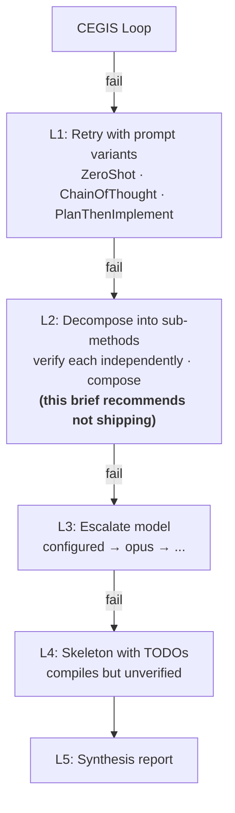

> **Status:** decision-of-record. Authored 2026-05-10 alongside [issue #227](https://github.com/HardMax71/spec_to_rest/issues/227). Read this if you want to understand why our M6.6 graduated-fallback ladder skips the L2 (decomposition) level and why M6.7 instead targets monolithic synthesis improvements via DafnyPro-style hint-augmentation.

## TL;DR

When M6.6 shipped the graduated-fallback orchestrator (L1 prompt strategies → L3 model escalation → L4 skeleton emit), level **L2 — operation decomposition** was deferred under the explicit caveat that compositional verification with LLMs is research-grade. Three benchmark papers published between July 2025 and POPL 2026 turned that caveat into hard data:

- LLMs hit a **3.69% Pass@1 / 7% Pass@8 ceiling** on multi-function Dafny programs (DafnyComp, 13 frontier models).
- Sampling more candidates does **not** rescue the result — Pass@4 → Pass@8 yields +0.8% on average. The plateau is architectural, not search-budget bound.
- The current state of the art for compositional Dafny is **14.0% Pass@1 with RL-trained 14B models** (Re:Form), still far below useful production thresholds and unavailable as an inference-time technique.
- In contrast, the same period's leading **monolithic** technique (DafnyPro hint-augmentation) gives **+16pp on DafnyBench** with Claude Sonnet 3.5 — a proven, inference-time intervention orthogonal to model choice.

We therefore close [#227](https://github.com/HardMax71/spec_to_rest/issues/227) without shipping operation decomposition and redirect M6.7 engineering effort to hint-augmentation, which raises the success rate on the case we already handle (monolithic synthesis through CEGIS) rather than chasing a 7% ceiling on cases we don't.

## What L2 was supposed to do

The graduated-fallback design from `03_llm_verifier_synthesis.md` §8.1 defined a five-level escalation:

The reasoning was: when monolithic synthesis fails because the operation is *complex*, an LLM might propose a useful decomposition into sub-methods, each of which is small enough that the same CEGIS pipeline can verify it. Compose the verified subs to get a verified parent. The research/03 example was `ShipOrder = UpdateOrderStatus + DecrementInventory`.

This is a clean architectural idea. The problem is that the empirical evidence — finally available in 2025–2026 — says it does not work.

## The empirical picture

### DafnyComp (Xu et al., [arXiv:2509.23061](https://arxiv.org/abs/2509.23061), Sept 2025)

Direct, decisive evidence on the planned pipeline shape. The benchmark synthesizes 300 multi-function Dafny programs by chaining 2–5 functions from `LeetCodeDataset`, with type-compatible interfaces and real data dependencies. 13 frontier models were evaluated zero-shot (GPT-4o, GPT-4-turbo, Claude 3.5, Claude 3.7, Gemini 2.5, DeepSeek-v3.1, Qwen, plus reasoning-specialized variants QwQ-32B and DeepSeek-R1).

Headline results:

| Metric | DafnyBench (single-function) | DafnyComp (2–5 functions) | Δ |
|---|---|---|---|
| Syntax correctness | ~99% | 95.67% | −3.3pp |
| **Verification success (Pass@1)** | **58%** | **3.69%** | **−54pp** |
| Best-model Pass@8 | — | 7% (Claude 3.5) | — |
| Pass@4 → Pass@8 marginal | — | +0.8% avg | plateau |

A **14.4× verification-rate drop for a 3.2× function-count increase**. The compositional axis dominates everything — model choice, sampling budget, reasoning specialization — by a wide margin.

The paper's failure-mode breakdown (% of failed cases attributable to each cause) is the closest thing to a root-cause analysis we have:

| Failure mode | Share | Description |
|---|---|---|
| **Specification fragility** | **39.2%** | Sub-functions with locally-correct but weakly-framed contracts cannot propagate properties through call sites. The downstream caller needs `ensures result >= 0`; the callee only ensured "what it computes," not the bound the caller depends on. |
| Implementation–proof misalignment | 21.7% | Plausible-looking invariants generated independently of the actual code path; pattern-matched rather than proven. |
| Reasoning instability | 14.1% | Inductive reasoning collapses across iterations: loop invariants fail to accumulate, recursive termination arguments break. |
| Other | 25.0% | Misc. |

The 39.2% category — *contract fragility under composition* — is precisely the failure mode our linear-L2 design produces. We would generate sub-method bodies that each verify against their proposed sub-contracts, but the chain of contracts would not imply the parent's `ensures`.

The Pass@4 plateau is the second decisive finding. Marginal verification gain from Pass@4 → Pass@8 averages 0.8% across all 13 models. This means the standard "throw more samples at it" mitigation that works for code generation does *not* work here: more candidates explore the syntactic space (syntax correctness keeps rising) without reaching new semantic cells. The authors interpret this as evidence that current transformers lack the inductive biases for compositional formal reasoning.

### Re:Form (Yan et al., [arXiv:2507.16331](https://arxiv.org/abs/2507.16331), Jul 2025)

The current state of the art for compositional Dafny verification — and it requires RL training, not inference-time tricks.

| Approach | DafnyComp Pass@1 |
|---|---|
| Claude 3.5 (zero-shot baseline) | 2.7% |
| 14B model + SFT (3,000 examples) | 8.3% |
| 14B model + SFT + RL (GRPO) | **14.0%** |

Re:Form's recipe — SFT to "activate patterns," then GRPO with three reward components (syntax, verification, **subset rewards**) — establishes today's ceiling. The subset reward ingredient is the most novel: it prevents the model from gaming verification rewards by producing trivially-true specifications (e.g. omitting unverifiable clauses). The authors explicitly note that *"verification rewards alone caused mode collapse."*

Two implications for our pipeline:

1. **No inference-time technique reaches this ceiling.** Our orchestrator is inference-only; we don't train models. So 14% is a north star, not a budget.
2. **Pass@128 needed for stronger gains.** Re:Form's RL gains widen at Pass@128. Our `CegisBudget.maxIterations` is 8. We can't credibly close that gap without changing the budget by an order of magnitude.

### DafnyPro (POPL 2026, [arXiv:2601.05385](https://arxiv.org/abs/2601.05385))

The most relevant SOTA *technique* for our use case — applicable today, no training. DafnyPro's contribution is three orthogonal interventions on top of any frontier model:

| Component | Mechanism |
|---|---|
| **Hint-augmentation** | Maintain a curated repository of verified Dafny patterns (loop invariants, frame conditions, decreases templates). On verifier failure, retrieve the most-relevant patterns by error category and inject them as in-context examples in the repair prompt. |
| **Diff-checker** | Structural comparison flags which assertions failed, targets repair feedback rather than blind resampling. |
| **Pruner** | Filter syntactically/typeically malformed candidates before SMT verification. |

Result: **Claude Sonnet 3.5 + DafnyPro = 86% on DafnyBench**, a +16pp improvement over the base model — and the largest single-paper jump on the single-function benchmark.

DafnyPro is **single-function only**. The paper does not address the compositional case. But the diff-checker we already shipped in M6.4 (`DiffChecker.scala`), and the pruner is implicit in our `ResponseParser` rejection of unparseable bodies. The missing ingredient is **hint-augmentation**, and that's where the +16pp delta lives.

### Other 2025–2026 work checked

- **VERINA** ([arXiv:2505.23135](https://arxiv.org/pdf/2505.23135), May 2025) — Dafny + Lean benchmark; confirms the compositional gap, no inference-time technique advances the SOTA.
- **VeriCoding** ([arXiv:2509.22908](https://arxiv.org/pdf/2509.22908), Sept 2025) — multi-method verified synthesis benchmark; supports the same pattern.
- **Clover** (SAIV 2024, [Stanford](https://theory.stanford.edu/~barrett/pubs/SSP+24.pdf)) — closed-loop monolithic synthesis with feedback. The original CEGIS-with-Dafny paradigm. Reports 87% acceptance / 100% rejection on ground-truth single-function programs. Not compositional.
- **DafnyBench** ([Loughridge et al.](https://namin.seas.harvard.edu/pubs/dafnybench.pdf), Harvard 2024) — the underlying single-function benchmark. ~58% baseline against which DafnyPro measured its +16pp delta.
- **"LLM-Based Code Translation Needs Formal Compositional Reasoning"** ([Anshumaan et al.](https://openreview.net/forum?id=wGj8LU2EOf), 2025) — design points for injecting formal signals into translation; explicitly treats compositional reasoning as a known gap to fill, not a solved problem.
- **Autoformalization survey** ([Weng et al., arXiv:2505.23486](https://arxiv.org/abs/2505.23486)) — explicitly notes "systems that can generalize compositionally" remains an open problem.

There is no evidence from any 2024–2026 source that an *inference-time* decomposition strategy beats *monolithic* prompting on compositional Dafny. We searched.

## What this means for our pipeline

Mapping the data onto the M6.6 pipeline as currently shipped:

- M6.4 CEGIS loop with verifier feedback — analogous to Clover, 58% baseline on single-function.
- M6.6 L1 (prompt strategies) + L3 (model escalation) — small marginal gains; per the DafnyComp Pass@k plateau, not transformative.
- M6.6 L4 (skeleton fallback) — the "always ships something" guarantee.
- The unimplemented L2 — would inherit the 7% compositional ceiling. For our 3-LLM_SYNTHESIS-op `url_shortener.spec`, expected ops verified through L2: **0.07 × 3 = 0.21 ops per spec** in the best case (Claude 3.5 Pass@8). **0.11** under Pass@1.

That is, statistically, *less than one op per spec* would benefit from L2 even on the most generous interpretation. Most users wouldn't see L2 fire successfully on any of their specs.

Cost to ship that: ~1000 LoC, ~1 week of engineering, dilution of the M6.5/M6.6 narrative (we'd be shipping research-grade code into a production-shaped tool).

## Decision: pivot M6.7 to hint-augmentation

Instead of L2, M6.7 implements a hint-augmentation module modelled on DafnyPro:

- **`HintLibrary`** — a small, hand-curated repository of Dafny proof patterns indexed by `VerifierError.category` (`postcondition_violation`, `loop_invariant_failure`, `decreases_failure`, `precondition_violation`, etc.). Each hint is a short Dafny snippet showing how a similar issue was resolved.
- **PromptBuilder integration** — when `CegisLoop` repairs after a failed verification, the most relevant hints for the failure category are injected as in-context examples in the repair prompt.
- **CLI flag** — `synth verify --with-hints` (default ON when `--fallback` is enabled, off for strict CEGIS so the M6.4 contract is preserved).

Expected leverage based on DafnyPro's reported +16pp:

| Pipeline stage | Without hints (today) | With hints (target) |
|---|---|---|
| Single-op CEGIS verification rate | ~CEGIS baseline | +up to 16pp on the same ops |
| L4 skeleton-fallback rate | unchanged | strictly less (more ops verify before falling through) |

We do **not** claim the +16pp delta will reproduce on our specific spec/op shapes — DafnyPro's number is on DafnyBench, which is a different distribution. We claim the *mechanism* is sound (proven) and the implementation cost is modest (~750 LoC), so it's the right next bet.

We also **do not** ship a pass-rate AC — there is no real-LLM A/B test in CI (cost + flakiness). Instead we ship deterministic mock-driven tests that prove the *plumbing* (hint retrieved, hint injected, prompt contains snippet) and treat the empirical-uplift question as a follow-up that requires real LLM budget.

## What's deferred

- **L2 / operation decomposition** — closed as wontfix-now. Re-open if (a) a published inference-time technique reaches >50% on DafnyComp, or (b) we want to invest in RL training infrastructure (out of scope for this project).
- **Pass@128 scaling** — Re:Form-level sampling budgets are out of scope; would require a `CegisBudget.maxIterations >= 64` configuration and a much larger cost cap.
- **Cross-family LLM escalation** (Anthropic ↔ OpenAI within one fallback run) — already in M6.6 backlog; orthogonal to compositional question.
- **Automatic hint discovery** — DafnyPro hand-curates hints from the training corpus; we hand-curate from successful CEGIS runs in our codebase. Auto-mining from a verified-bodies cache is a follow-up if the manual library proves valuable.

## Sources

| Paper | Year | Why we cited it |
|---|---|---|
| [DafnyComp (arXiv:2509.23061)](https://arxiv.org/abs/2509.23061) | 2025 | The 7% / Pass@4 plateau evidence; failure-mode breakdown |
| [Re:Form (arXiv:2507.16331)](https://arxiv.org/abs/2507.16331) | 2025 | Compositional Dafny SOTA at 14% via RL training |
| [DafnyPro (arXiv:2601.05385)](https://arxiv.org/abs/2601.05385) | 2026 | Hint-augmentation +16pp on monolithic — the technique we adopt |
| [DafnyBench](https://namin.seas.harvard.edu/pubs/dafnybench.pdf) | 2024 | Single-function 58% baseline |
| [Clover (SAIV 2024)](https://theory.stanford.edu/~barrett/pubs/SSP+24.pdf) | 2024 | Origin of the closed-loop CEGIS pattern we already use |
| [VERINA (arXiv:2505.23135)](https://arxiv.org/pdf/2505.23135) | 2025 | Independent corroboration of compositional gap |
| [VeriCoding (arXiv:2509.22908)](https://arxiv.org/pdf/2509.22908) | 2025 | Multi-method verified synthesis benchmark |
| [LLM-Based Code Translation Needs Compositional Reasoning](https://openreview.net/forum?id=wGj8LU2EOf) | 2025 | Treats compositional reasoning as an open gap |
| [Autoformalization survey (arXiv:2505.23486)](https://arxiv.org/abs/2505.23486) | 2025 | Notes compositional generalization remains open |
