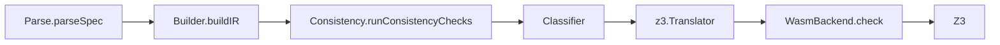

> Profile doc for issue [#173](https://github.com/HardMax71/spec_to_rest/issues/173).
> Follows [`11_global_proof_governance`](/research/11_global_proof_governance) and
> operationalizes the first stable scope that `M_L.1` and `M_L.2` should implement against.

## 1. Decision Summary

The global-proof program does **not** start from "all current language features."

The committed first profile is a Z3-only fragment named **`Z3-Core`**:

- the theorem target is the in-memory `ServiceIR → Z3Script` path described in
  [`M_G.0`](https://github.com/HardMax71/spec_to_rest/issues/171),
- Alloy-routed checks are outside the theorem boundary,
- proof export / proof replay is outside the first ship,
- and the profile is intentionally smaller than the full 25-case `Expr` ADT.

Within `Z3-Core`, the first implementation slice is **`Z3-Core-1S`**:

- one-state only,
- `global` and `requires` checks only,
- no `Prime`, `Pre`, frame synthesis, or post-state cardinality reasoning.

`Z3-Core-1S` is where `M_L.1` should start. `Z3-Core` is the first honest ship claim for the
global-proof program.

## 2. Named Scope Stages

| Stage | Meaning |
| --- | --- |
| `bootstrap` | In scope for `Z3-Core-1S`, the first end-to-end implementation slice. |
| `first ship` | Not needed on day one, but required before the first public global-proof claim is honest. |
| `defer` | Explicitly out of the first ship; can only enter later by profile expansion. |
| `exclude` | Outside the Z3 global-theorem track entirely; would require a separate solver or semantics story. |

## 3. Declaration-Level Profile

| Construct | Stage | Rule |
| --- | --- | --- |
| `EnumDecl` | `bootstrap` | Finite domains are cheap to formalize and support the first bounded quantifier story. |
| `EntityDecl` | `bootstrap` | Flat entities only: no inheritance, no per-field constraints, no constructor semantics. |
| `StateDecl` | `bootstrap` | Scalar fields and simple relation/map fields over profile-safe types only. |
| `InvariantDecl` | `bootstrap` | Must be expressible using only in-profile `Expr` cases. |
| `OperationDecl` | `bootstrap` | Inputs and `requires` are in scope immediately. `ensures`, outputs, and post-state reasoning become `first ship` when they use only in-profile two-state forms. |
| `TypeAliasDecl` | `defer` | Transparent aliases are cheap, but constrained aliases add a second semantic layer that is not needed for the first proof. |
| `FactDecl` | `defer` | Not needed for the first Z3 theorem boundary; can be revisited later as additional assumptions. |
| `FunctionDecl` | `defer` | User-defined function semantics would expand the proof target too early. |
| `PredicateDecl` | `defer` | Same reason as functions; keep the first theorem on direct IR formulas. |
| `TransitionDecl` | `defer` | Separate state-machine proof problem; not part of the current verification path theorem. |
| `ConventionsDecl` | `defer` | Compiler-convention logic is not part of the verification obligation theorem. |
| `TemporalDecl` | `exclude` | Always Alloy-routed and bounded today; incompatible with the first Z3 theorem. |

## 4. Expression-Level Profile

| `Expr` case | Stage | Rule / reason |
| --- | --- | --- |
| `BinaryOp(And \| Or \| Implies \| Iff)` | `bootstrap` | Core propositional layer. |
| `BinaryOp(Eq \| Neq \| Lt \| Gt \| Le \| Ge)` | `bootstrap` | Core comparison layer over proof-safe scalar/entity values. |
| `BinaryOp(In \| NotIn)` | `bootstrap` | Only for membership in state-relation domains or other profile-safe finite memberships; no powerset reasoning. |
| `BinaryOp(Subset \| Union \| Intersect \| Diff)` | `defer` | Set algebra is supported in Scala but materially expands the semantic and lemma burden. |
| `BinaryOp(Add \| Sub \| Mul \| Div)` | `defer` | Useful, but not required for the first proof slice; admit later as the first arithmetic expansion. |
| `UnaryOp(Not \| Negate)` | `bootstrap` | Small, direct semantic cases. |
| `UnaryOp(Cardinality)` | `first ship` | Restricted to state-relation identifiers and their `Prime`/`Pre` forms. Needed for realistic preservation proofs, not for the bootstrap slice. |
| `UnaryOp(Power)` | `exclude` | Routed to Alloy / second-order style reasoning; not part of the Z3 theorem track. |
| `Quantifier` | `bootstrap` | Only over finite enum domains in the first slice. Quantification over entity/state collections is deferred. |
| `SomeWrap` | `defer` | Option semantics not needed in the first theorem. |
| `The` | `defer` | Choice/operator semantics add proof complexity with little early payoff. |
| `FieldAccess` | `bootstrap` | Needed for realistic entity-valued invariants and preconditions. |
| `EnumAccess` | `bootstrap` | Cheap finite-constant semantics. |
| `Index` | `bootstrap` | Restricted to state-relation references; no general map/sequence indexing in the first theorem. |
| `Call` | `defer` | Builtins such as `len`, `isValidURI`, and `dom` need per-builtin semantics; higher-order calls are already unsupported. |
| `Prime` | `first ship` | Two-state coupling is required for enabledness/preservation but not for the bootstrap slice. |
| `Pre` | `first ship` | Same reason as `Prime`. |
| `With` | `first ship` | Record-update semantics and frame interaction belong in the first full preservation claim, not the bootstrap slice. |
| `If` | `defer` | Currently unsupported; can only enter after product and solver semantics exist. |
| `Let` | `bootstrap` | Small environment-extension case; useful enough to keep. |
| `Lambda` | `defer` | Outside first-order target shape and unsupported today. |
| `Constructor` | `defer` | Requires explicit constructor semantics; not needed for the first claim. |
| `SetLiteral` | `defer` | Current translator only partially supports it; keep the first theorem off collection literals. |
| `MapLiteral` | `defer` | Unsupported today. |
| `SetComprehension` | `defer` | Partially supported in narrow forms only; too brittle for the committed first profile. |
| `SeqLiteral` | `defer` | Unsupported today. |
| `Matches` | `defer` | Regex/string semantics are intentionally postponed. |
| `IntLit` | `bootstrap` | Core scalar atom. |
| `FloatLit` | `defer` | No committed solver semantics in the first proof profile. |
| `StringLit` | `defer` | String literals are translated today, but the first theorem avoids uninterpreted-string and regex semantics. |
| `BoolLit` | `bootstrap` | Core atom. |
| `NoneLit` | `defer` | Option semantics deferred with `SomeWrap`. |
| `Identifier` | `bootstrap` | Core atom. |

## 5. Backend Contract

| Question | Decision | Consequence |
| --- | --- | --- |
| Which solver remains trusted in the first ship? | **Z3** | The first theorem is Z3-trusting. It does not attempt solver-proof replay. |
| Is the first theorem backend-agnostic? | **No** | The target is the current Z3 path, not a generic SMT theorem over all backends. |
| Is Alloy in scope for the first ship? | **No** | Anything routed to Alloy is outside `Z3-Core` and outside the first global-proof claim. |
| Is `SmtLib.scala` inside the first theorem? | **No** | The runtime path uses `Z3Script` plus `WasmBackend`; textual SMT export stays outside the first claim. |
| Is proof export / replay in scope for the first ship? | **No** | That is a separate translation-validation / certificate track, not the initial global theorem. |
| Is cvc5 cross-checking part of the proof claim? | **No** | Native cvc5 agreement in CI is defense in depth only. |

The concrete runtime path covered by the program is:

The first theorem proves the prover-side mirror of the `z3.Translator` obligations for
`Z3-Core`. The parser, builder, routing/orchestration code, backend renderer, and the Z3 API and
solver remain in the trusted boundary defined by `M_G.0`.

## 6. First End-to-End Slice

The first slice the proof program should actually implement is:

- `Z3-Core-1S`
- `global` and `requires` checks only
- no `Prime`, `Pre`, `With`, or `UnaryOp(Cardinality)`
- no collection algebra, no strings, no regex/match builtins
- quantifiers, if present, range only over enums

This slice is deliberately small, but it is not fake work:

- it still forces a real `Expr` semantics,
- it still forces a real `ServiceIR → Z3Script` mirror,
- and it avoids spending the first months on post-state/frame machinery.

Only after `Z3-Core-1S` is stable should the program widen to the `first ship` cases needed for
enabledness and preservation.

## 7. Expansion Rule

A feature may move from `defer` into `first ship` or a later profile only if all of the following
are true:

1. The source-level semantics are explicit enough to state the theorem honestly.
2. The current Scala translator support is either full, or the restriction is narrow enough to
   state precisely in this doc.
3. The feature stays on the Z3 path; otherwise it starts a separate theorem track instead of
   silently widening `Z3-Core`.
4. The prover-side semantics and the Scala mirror both have at least one concrete fixture or
   audit target.
5. [`12_global_proof_status`](/research/12_global_proof_status) and this doc are updated in the
   same change.

Recommended expansion order after the bootstrap slice:

1. `Prime` / `Pre` / `With` / restricted `Cardinality`
2. integer arithmetic (`Add`, `Sub`, `Mul`, `Div`)
3. restricted collection literals and set algebra
4. string literals plus selected builtins
5. user-defined functions / predicates, if they are still worth the proof cost

## 8. References

- Scoping and milestone plan: [`10_translator_soundness`](/research/10_translator_soundness)
- Governance: [`11_global_proof_governance`](/research/11_global_proof_governance)
- Status ledger: [`12_global_proof_status`](/research/12_global_proof_status)
- Umbrella: [#170](https://github.com/HardMax71/spec_to_rest/issues/170)
- Theorem statement / TCB: [#171](https://github.com/HardMax71/spec_to_rest/issues/171)
- This profile issue: [#173](https://github.com/HardMax71/spec_to_rest/issues/173)
