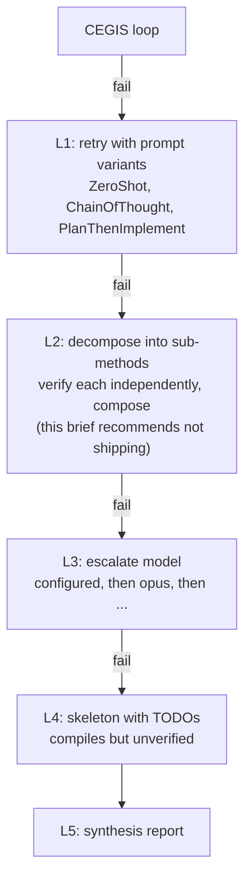

> Decision-of-record, authored 2026-05-10 alongside [issue #227](https://github.com/HardMax71/spec_to_rest/issues/227). Read this for why the graduated-fallback ladder skips the L2 (decomposition) level and why M6.7 targeted monolithic synthesis instead. The decision it records was executed: the HintLibrary shipped in M6.7.

When M6.6 shipped the graduated-fallback orchestrator (L1 prompt strategies, then L3 model escalation, then L4 skeleton emit), the L2 level, operation decomposition, was deferred under the explicit caveat that compositional verification with LLMs is research-grade. Three benchmark papers published between July 2025 and POPL 2026 turned that caveat into hard data:

- LLMs hit a 3.69% Pass@1 and 7% Pass@8 ceiling on multi-function Dafny programs (DafnyComp, 13 frontier models).
- Sampling more candidates does not rescue it: Pass@4 to Pass@8 yields +0.8% on average. The plateau is architectural, not search-budget bound.
- The state of the art for compositional Dafny is 14.0% Pass@1 with RL-trained 14B models (Re:Form), still far below useful production thresholds and not an inference-time technique.
- Over the same period the leading monolithic technique, DafnyPro hint-augmentation, gave +16pp on DafnyBench with Claude Sonnet 3.5, a proven, inference-time intervention orthogonal to model choice.

So [#227](https://github.com/HardMax71/spec_to_rest/issues/227) closed without operation decomposition, and M6.7 effort went to hint-augmentation, which raises the success rate on the case already handled (monolithic synthesis through CEGIS) rather than chasing a 7% ceiling on cases not handled.

## What L2 was supposed to do

The graduated-fallback design (the synthesis [fallback ladder](/research/llm_verifier_synthesis/triangulation-and-fallback)) was a five-level escalation:

The reasoning: when monolithic synthesis fails because an operation is complex, an LLM might propose a decomposition into sub-methods small enough for the same CEGIS pipeline to verify, then compose the verified subs into a verified parent. The worked example was `ShipOrder = UpdateOrderStatus + DecrementInventory`. A clean architectural idea, except the empirical evidence, finally available in 2025-2026, says it does not work.

## The empirical picture

### DafnyComp (Xu et al., [arXiv:2509.23061](https://arxiv.org/abs/2509.23061), Sept 2025)

Direct, decisive evidence on the planned pipeline shape. The benchmark synthesizes 300 multi-function Dafny programs by chaining 2-5 functions from LeetCodeDataset, with type-compatible interfaces and real data dependencies, and evaluates 13 frontier models zero-shot (GPT-4o, GPT-4-turbo, Claude 3.5, Claude 3.7, Gemini 2.5, DeepSeek-v3.1, Qwen, plus QwQ-32B and DeepSeek-R1).

| Metric | DafnyBench (single-function) | DafnyComp (2-5 functions) | delta |
|---|---|---|---|
| Syntax correctness | ~99% | 95.67% | -3.3pp |
| Verification success (Pass@1) | 58% | 3.69% | -54pp |
| Best-model Pass@8 |   | 7% (Claude 3.5) |   |
| Pass@4 to Pass@8 marginal |   | +0.8% avg | plateau |

A 14.4x verification-rate drop for a 3.2x function-count increase. The compositional axis dominates everything else (model choice, sampling budget, reasoning specialization) by a wide margin. The paper's failure-mode breakdown, the closest thing to a root-cause analysis available:

| Failure mode | Share | Description |
|---|---|---|
| Specification fragility | 39.2% | Sub-functions with locally-correct but weakly-framed contracts cannot propagate properties through call sites. The caller needs `ensures result >= 0`; the callee only ensured what it computes, not the bound the caller depends on. |
| Implementation-proof misalignment | 21.7% | Plausible-looking invariants generated independently of the actual code path; pattern-matched rather than proven. |
| Reasoning instability | 14.1% | Inductive reasoning collapses across iterations: loop invariants fail to accumulate, recursive termination arguments break. |
| Other | 25.0% | Miscellaneous. |

The 39.2% category, contract fragility under composition, is exactly the failure mode a linear-L2 design produces: sub-method bodies that each verify against their proposed sub-contracts, while the chain of contracts does not imply the parent's `ensures`. The Pass@4 plateau is the second decisive finding. A +0.8% average gain from Pass@4 to Pass@8 means the standard "throw more samples at it" mitigation does not work here: more candidates explore the syntactic space without reaching new semantic cells, which the authors read as evidence that current transformers lack the inductive biases for compositional formal reasoning.

### Re:Form (Yan et al., [arXiv:2507.16331](https://arxiv.org/abs/2507.16331), Jul 2025)

The state of the art for compositional Dafny, and it requires RL training rather than inference-time tricks.

| Approach | DafnyComp Pass@1 |
|---|---|
| Claude 3.5 (zero-shot baseline) | 2.7% |
| 14B model + SFT (3,000 examples) | 8.3% |
| 14B model + SFT + RL (GRPO) | 14.0% |

Re:Form's recipe, SFT to activate patterns then GRPO with three reward components (syntax, verification, subset rewards), sets today's ceiling. The subset reward is the novel ingredient: it stops the model gaming verification rewards by producing trivially-true specifications, since "verification rewards alone caused mode collapse." Two implications: no inference-time technique reaches this ceiling (the orchestrator is inference-only, so 14% is a north star, not a budget), and Re:Form's gains widen at Pass@128 against a `CegisBudget.maxIterations` of 8, a gap that cannot be closed without an order-of-magnitude budget change.

### DafnyPro (POPL 2026, [arXiv:2601.05385](https://arxiv.org/abs/2601.05385))

The most relevant technique for this use case, applicable today with no training. Three orthogonal interventions on top of any frontier model:

| Component | Mechanism |
|---|---|
| Hint-augmentation | Maintain a curated repository of verified Dafny patterns (loop invariants, frame conditions, decreases templates). On verifier failure, retrieve the most-relevant patterns by error category and inject them as in-context examples in the repair prompt. |
| Diff-checker | Structural comparison flags which assertions failed, targeting repair feedback rather than blind resampling. |
| Pruner | Filter syntactically or typically malformed candidates before SMT verification. |

The result, Claude Sonnet 3.5 plus DafnyPro at 86% on DafnyBench, is a +16pp improvement over the base model and the largest single-paper jump on the single-function benchmark. DafnyPro is single-function only and does not address the compositional case. But the diff-checker already shipped in M6.4 (`DiffChecker.scala`), and the pruner is implicit in `ResponseParser`'s rejection of unparseable bodies. The missing ingredient was hint-augmentation, and that is where the +16pp delta lives.

### Other 2025-2026 work checked

- VERINA ([arXiv:2505.23135](https://arxiv.org/pdf/2505.23135), May 2025), a Dafny and Lean benchmark; confirms the compositional gap, no inference-time technique advances the state of the art.
- VeriCoding ([arXiv:2509.22908](https://arxiv.org/pdf/2509.22908), Sept 2025), a multi-method verified-synthesis benchmark; the same pattern.
- Clover (SAIV 2024, [Stanford](https://theory.stanford.edu/~barrett/pubs/SSP+24.pdf)), closed-loop monolithic synthesis with feedback, the original CEGIS-with-Dafny paradigm; 87% acceptance and 100% rejection on ground-truth single-function programs, not compositional.
- DafnyBench ([Loughridge et al.](https://namin.seas.harvard.edu/pubs/dafnybench.pdf), Harvard 2024), the single-function benchmark with the ~58% baseline DafnyPro measured its +16pp against.
- "LLM-Based Code Translation Needs Formal Compositional Reasoning" ([Anshumaan et al.](https://openreview.net/forum?id=wGj8LU2EOf), 2025), which treats compositional reasoning as a known gap to fill.
- The autoformalization survey ([Weng et al., arXiv:2505.23486](https://arxiv.org/abs/2505.23486)), which notes "systems that can generalize compositionally" remains open.

No 2024-2026 source shows an inference-time decomposition strategy beating monolithic prompting on compositional Dafny.

## What this meant for the pipeline

Mapping the data onto the M6.6 pipeline as shipped: M6.4 is the CEGIS loop with verifier feedback, analogous to Clover, at a 58% single-function baseline; M6.6's L1 and L3 give small marginal gains, not transformative ones, per the Pass@k plateau; L4 is the always-ships-something guarantee. The unimplemented L2 would inherit the 7% compositional ceiling. For the three-operation `url_shortener.spec`, that is 0.07 x 3 = 0.21 operations verified through L2 in the best case (Claude 3.5 Pass@8), or 0.11 under Pass@1, statistically less than one op per spec, even generously read. Most users would not see L2 fire successfully on any of their specs. The cost to ship that was about 1000 lines and a week of engineering, plus diluting the production-shaped tool with research-grade code.

## Decision: hint-augmentation, executed in M6.7

M6.7 shipped a hint-augmentation module modelled on DafnyPro instead of L2: a `HintLibrary` of hand-curated Dafny proof patterns indexed by the verifier error category (`postcondition_violation`, `loop_invariant_failure`, `decreases_failure`, `precondition_violation`, and so on), each a short snippet showing how a similar issue was resolved. When `CegisLoop` repairs after a failed verification, the [PromptBuilder](/research/llm_verifier_synthesis/prompts) injects the most relevant hints for that failure category as in-context examples, gated by a `synth verify --with-hints` flag (default on under `--fallback`, off for strict CEGIS so the M6.4 contract holds).

| Pipeline stage | Without hints | With hints (target) |
|---|---|---|
| Single-op CEGIS verification rate | CEGIS baseline | up to +16pp on the same ops |
| L4 skeleton-fallback rate | unchanged | strictly less (more ops verify first) |

The +16pp was not claimed to reproduce on these spec shapes, DafnyPro's number is on a different distribution. The claim was that the mechanism is proven and the cost modest (~750 lines), so it was the right next bet. No pass-rate gate ships either: there is no real-LLM A/B test in CI (cost and flakiness), only deterministic mock-driven tests proving the plumbing (hint retrieved, hint injected, prompt contains the snippet), with empirical uplift left as a real-budget follow-up.

## What stayed deferred

- L2 operation decomposition, closed as wontfix-now. Reopen if a published inference-time technique reaches above 50% on DafnyComp, or if RL-training infrastructure comes into scope.
- Pass@128 scaling: Re:Form-level sampling budgets would need `CegisBudget.maxIterations` near 64 and a much larger cost cap.
- Cross-family LLM escalation (Anthropic and OpenAI within one fallback run), already in the M6.6 backlog and orthogonal to the compositional question.
- Automatic hint discovery: hints are hand-curated from successful CEGIS runs; auto-mining from a verified-bodies cache is a follow-up if the manual library proves valuable.
