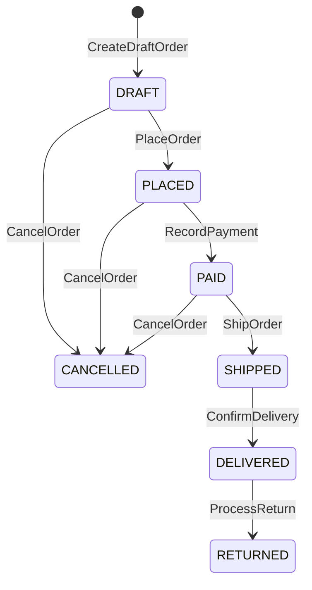

This page applies the [ruleset](/research/convention_engine/ruleset) to two fixtures and shows what
the engine emits for each: the endpoints and the schema. The full specs are on the language
[Examples](/research/spec_language_design/worked-examples) page and in `fixtures/spec/`.

## URL shortener

`url_shortener.spec` has four operations over a `store: ShortCode -> lone LongURL` relation, and its
`conventions` block overrides every endpoint. That is the point of the example: the defaults are
ordinary CRUD, but the spec redirects `Resolve` to a `302` with a `Location` header, which is exactly
the case overrides exist for.

| Operation | Classifier | Endpoint         | Status                      |
| --------- | ---------- | ---------------- | --------------------------- |
| Shorten   | M1         | `POST /shorten`  | 201                         |
| Resolve   | M2         | `GET /{code}`    | 302, `Location: output.url` |
| Delete    | M5         | `DELETE /{code}` | 204                         |
| ListAll   | M2         | `GET /urls`      | 200                         |

`Shorten` introduces a new key in `store`, so the classifier reads it as M1 and the method is `POST`;
the conventions block keeps the `201` and renames the path to `/shorten`.

```spec
operation Shorten {
  input:  url: LongURL
  output: code: ShortCode, short_url: String
  requires: isValidURI(url)
  ensures:
    code not in pre(store)
    store' = pre(store) + {code -> url}
    #store' = #pre(store) + 1
}
```

The `UrlMapping` entity becomes a table, and the two `lone` relations become nullable foreign keys.
`compile` emits a full project rather than a snippet: the application code, Alembic migrations, an
`openapi.yaml`, a test suite, and Docker config. Goldens pin that output for all three targets,
FastAPI, chi, and Express, across PostgreSQL, SQLite, and MySQL, under `fixtures/golden/codegen/`.

## E-commerce order service

`ecommerce.spec` is the richer case: an `Order` moves through a status lifecycle, and each transition
is a named operation declared in the `transition` block.



Three of those transitions carry a guard: `RecordPayment` fires only `when paymentCaptured`, the
`PAID -> CANCELLED` refund only `when refundIssued`, and `ProcessReturn` only `when
withinReturnWindow`.

Each transition operation is M10, a `POST` to a verb under the order. `CreateDraftOrder` is M1, the
line-item operations nest under their order, and the two reads are M2.

| Operation                           | Endpoint                                    |
| ----------------------------------- | ------------------------------------------- |
| CreateDraftOrder                    | `POST /orders` (201)                        |
| AddLineItem                         | `POST /orders/{order_id}/items` (201)       |
| RemoveLineItem                      | `DELETE /orders/{order_id}/items/{item_id}` |
| PlaceOrder, ShipOrder, and the rest | `POST /orders/{order_id}/{verb}`            |
| GetOrder                            | `GET /orders/{order_id}`                    |
| ListOrders                          | `GET /orders`                               |

The four state relations (`orders`, `products`, `inventory`, `payments`) each become a table, the
`OrderStatus` enum becomes a `CHECK`-constrained column, and `LineItem` hangs off the order. The full
spec, with every entity and field, is in `fixtures/spec/ecommerce.spec`.
