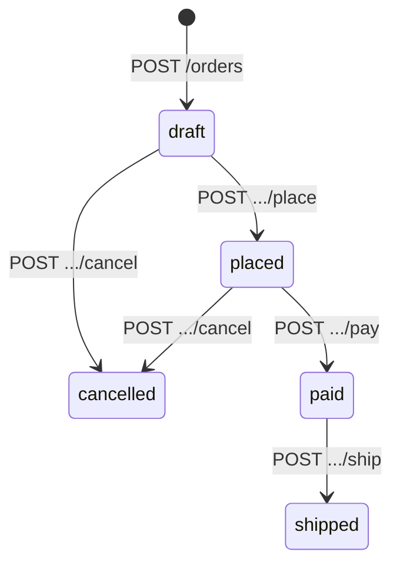

### 4.1 URL shortener

#### Spec

```text
service UrlShortener {

  entity ShortCode {
    value: String
    invariant: len(value) >= 6 and len(value) <= 10
    invariant: value matches /^[a-zA-Z0-9]+$/
  }

  entity LongURL {
    value: String
    invariant: isValidURI(value)
  }

  state {
    store: ShortCode -> lone LongURL
    created_at: ShortCode -> DateTime
  }

  operation Shorten {
    input:   url: LongURL
    output:  code: ShortCode, short_url: String

    requires: isValidURI(url.value)

    ensures:
      code not in pre(store)
      store'[code] = url
      short_url = base_url + "/" + code.value
      #store' = #store + 1
  }

  operation Resolve {
    input:  code: ShortCode
    output: url: LongURL

    requires: code in store

    ensures:
      url = store[code]
      store' = store
  }

  operation Delete {
    input:  code: ShortCode

    requires: code in store

    ensures:
      code not in store'
      #store' = #store - 1
  }

  operation ListAll {
    output: entries: Set[UrlMapping]

    ensures:
      entries = store
      store' = store
  }

  conventions {
    Resolve.http_status_success = 302
    Resolve.http_header "Location" = output.url
  }
}
```

#### Convention engine output: HTTP endpoints

| #   | Method | Path                  | Status (Success) | Status (Errors)      | Request Body                        | Response Body                                                                             |
| --- | ------ | --------------------- | ---------------- | -------------------- | ----------------------------------- | ----------------------------------------------------------------------------------------- |
| 1   | POST   | `/short-codes`        | 201 Created      | 422 (invalid URL)    | `{"url": {"value": "https://..."}}` | `{"data": {"code": {"value": "abc123"}, "short_url": "https://sho.rt/abc123"}}`           |
| 2   | GET    | `/short-codes/{code}` | 302 Found        | 404 (code not found) |   | Empty (redirect via Location header)                                                      |
| 3   | DELETE | `/short-codes/{code}` | 204 No Content   | 404 (code not found) |   |   |
| 4   | GET    | `/short-codes`        | 200 OK           |   |   | `{"data": [{"code": {...}, "url": {...}}], "meta": {"page": 1, "limit": 20, "total": N}}` |

##### Decision trace for endpoint 1 (shorten)

- Ensures clause adds to `store` -> state mutation, new key created -> Rule M1 -> POST
- Entity is ShortCode -> pluralize -> `short-codes`
- No ID in input -> collection endpoint -> `/short-codes`
- Creates new entity -> 201 + Location header

##### Decision trace for endpoint 2 (resolve)

- Ensures clause: `store' = store` -> no state mutation -> Rule M2 -> GET
- Input is `code: ShortCode` which is the key type of `store` -> path parameter
- Override: `Resolve.http_status_success = 302` -> 302 instead of 200
- Override: `Location` header set to URL value

#### Convention engine output: SQL DDL

```sql
-- Entity: ShortCode (primary table from the 'store' relation)
CREATE TABLE short_codes (
    id          BIGSERIAL PRIMARY KEY,
    value       VARCHAR(10) NOT NULL
                CHECK (length(value) >= 6 AND length(value) <= 10)
                CHECK (value ~ '^[a-zA-Z0-9]+$'),
    created_at  TIMESTAMPTZ NOT NULL DEFAULT NOW(),
    updated_at  TIMESTAMPTZ NOT NULL DEFAULT NOW()
);

CREATE UNIQUE INDEX idx_short_codes_value ON short_codes(value);

-- Relation: store (ShortCode -> lone LongURL)
-- Since 'lone' means at most one, this is a nullable FK on short_codes
-- But since the relation is the core state, we embed it in the same table:
ALTER TABLE short_codes
    ADD COLUMN long_url TEXT
    CHECK (long_url ~ '^https?://');  -- derived from isValidURI invariant

-- Metadata: created_at relation
-- Already covered by the auto-generated created_at column

-- Trigger: update updated_at on modification
CREATE OR REPLACE FUNCTION update_updated_at()
RETURNS TRIGGER AS $$
BEGIN
    NEW.updated_at = NOW();
    RETURN NEW;
END;
$$ LANGUAGE plpgsql;

CREATE TRIGGER trg_short_codes_updated_at
    BEFORE UPDATE ON short_codes
    FOR EACH ROW
    EXECUTE FUNCTION update_updated_at();
```

**Schema design decision.** The `store: ShortCode -> lone LongURL` relation is embedded as a column
in `short_codes` rather than a separate table because LongURL is a value type (single field, no
identity of its own) and the multiplicity is `lone` (at most one). If LongURL were a full entity
with its own state relations, a separate table with a foreign key would be generated instead.

#### Convention engine output: OpenAPI snippet

```yaml
openapi: 3.1.0
info:
  title: UrlShortener API
  version: 1.0.0

paths:
  /short-codes:
    post:
      operationId: shorten
      summary: Create a new short code
      requestBody:
        required: true
        content:
          application/json:
            schema:
              $ref: "#/components/schemas/ShortenRequest"
      responses:
        "201":
          description: Short code created
          headers:
            Location:
              schema:
                type: string
              description: URL of the created resource
          content:
            application/json:
              schema:
                $ref: "#/components/schemas/ShortenResponse"
        "422":
          description: Validation failed
          content:
            application/json:
              schema:
                $ref: "#/components/schemas/ErrorResponse"
    get:
      operationId: listAll
      summary: List all short codes
      parameters:
        - name: page
          in: query
          schema:
            type: integer
            default: 1
            minimum: 1
        - name: limit
          in: query
          schema:
            type: integer
            default: 20
            minimum: 1
            maximum: 100
      responses:
        "200":
          description: List of short codes
          content:
            application/json:
              schema:
                $ref: "#/components/schemas/ListAllResponse"

  /short-codes/{code}:
    get:
      operationId: resolve
      summary: Resolve a short code to its URL
      parameters:
        - name: code
          in: path
          required: true
          schema:
            type: string
            minLength: 6
            maxLength: 10
            pattern: "^[a-zA-Z0-9]+$"
      responses:
        "302":
          description: Redirect to the long URL
          headers:
            Location:
              schema:
                type: string
              description: The original long URL
        "404":
          description: Short code not found
          content:
            application/json:
              schema:
                $ref: "#/components/schemas/ErrorResponse"
    delete:
      operationId: delete
      summary: Delete a short code
      parameters:
        - name: code
          in: path
          required: true
          schema:
            type: string
            minLength: 6
            maxLength: 10
            pattern: "^[a-zA-Z0-9]+$"
      responses:
        "204":
          description: Short code deleted
        "404":
          description: Short code not found
          content:
            application/json:
              schema:
                $ref: "#/components/schemas/ErrorResponse"

components:
  schemas:
    ShortenRequest:
      type: object
      required: [url]
      properties:
        url:
          type: object
          required: [value]
          properties:
            value:
              type: string
              format: uri

    ShortenResponse:
      type: object
      properties:
        data:
          type: object
          properties:
            code:
              type: object
              properties:
                value:
                  type: string
                  minLength: 6
                  maxLength: 10
            short_url:
              type: string
              format: uri

    ListAllResponse:
      type: object
      properties:
        data:
          type: array
          items:
            type: object
            properties:
              code:
                $ref: "#/components/schemas/ShortCodeSchema"
              url:
                $ref: "#/components/schemas/LongURLSchema"
        meta:
          $ref: "#/components/schemas/PaginationMeta"

    ShortCodeSchema:
      type: object
      properties:
        value:
          type: string
          minLength: 6
          maxLength: 10
          pattern: "^[a-zA-Z0-9]+$"

    LongURLSchema:
      type: object
      properties:
        value:
          type: string
          format: uri

    PaginationMeta:
      type: object
      properties:
        page:
          type: integer
        limit:
          type: integer
        total:
          type: integer

    ErrorResponse:
      type: object
      properties:
        error:
          type: object
          properties:
            code:
              type: string
            message:
              type: string
            details:
              type: array
              items:
                type: object
                properties:
                  field:
                    type: string
                  constraint:
                    type: string
                  value: {}
```

#### Validation logic description

| Check                                                   | Layer          | Implementation                                             |
| ------------------------------------------------------- | -------------- | ---------------------------------------------------------- |
| `url.value` is a valid URI                              | Layer 1 (HTTP) | Pydantic `AnyUrl` type / JSON Schema `format: uri`         |
| `url.value` is present and not null                     | Layer 1 (HTTP) | `required` in schema                                       |
| `code.value` length 6-10                                | Layer 1 (HTTP) | Path parameter schema validation                           |
| `code.value` matches alphanumeric                       | Layer 1 (HTTP) | Path parameter pattern validation                          |
| `code in store` (for Resolve, Delete)                   | Layer 2 (App)  | `SELECT EXISTS(SELECT 1 FROM short_codes WHERE value = ?)` |
| `code not in pre(store)` (for Shorten, post-generation) | Layer 2 (App)  | Check after generating code; retry if collision            |
| `length(value) >= 6 AND length(value) <= 10`            | Layer 3 (DB)   | CHECK constraint (safety net)                              |
| `value ~ '^[a-zA-Z0-9]+$'`                              | Layer 3 (DB)   | CHECK constraint (safety net)                              |

### 4.2 E-commerce order service

#### Spec

```text
service OrderService {

  entity Product {
    name: String
    price: Decimal
    sku: String
    invariant: price > 0
    invariant: len(sku) = 10
  }

  entity LineItem {
    quantity: Int
    unit_price: Decimal
    invariant: quantity > 0
    invariant: unit_price > 0
  }

  entity Order {
    status: String
    total: Decimal
    customer_email: String
    invariant: status in {"draft", "placed", "paid", "shipped", "cancelled"}
    invariant: total >= 0
    invariant: customer_email matches /^.+@.+$/
  }

  entity InventoryRecord {
    quantity_available: Int
    invariant: quantity_available >= 0
  }

  state {
    products: ProductId -> one Product
    inventory: ProductId -> one InventoryRecord
    orders: OrderId -> one Order
    line_items: OrderId -> set LineItem
    item_product: LineItem -> one Product    // each line item references a product
  }

  // --- CRUD Operations ---

  operation CreateProduct {
    input: name: String, price: Decimal, sku: String, initial_stock: Int
    output: product: Product

    requires: initial_stock >= 0

    ensures:
      product not in pre(products)
      products'[product] = Product{name, price, sku}
      inventory'[product] = InventoryRecord{initial_stock}
  }

  operation GetProduct {
    input: id: ProductId
    output: product: Product, stock: Int

    requires: id in products

    ensures:
      product = products[id]
      stock = inventory[id].quantity_available
      products' = products
  }

  operation ListProducts {
    input: name_filter?: String, min_price?: Decimal, max_price?: Decimal
    output: results: set Product

    ensures:
      results = {p in products | matches_filters(p, name_filter, min_price, max_price)}
      products' = products
  }

  // --- Order Lifecycle ---

  operation CreateOrder {
    input: customer_email: String
    output: order: Order

    requires: customer_email matches /^.+@.+$/

    ensures:
      order not in pre(orders)
      orders'[order] = Order{status: "draft", total: 0, customer_email}
      line_items'[order] = {}
  }

  operation AddLineItem {
    input: order_id: OrderId, product_id: ProductId, quantity: Int
    output: item: LineItem

    requires:
      order_id in orders
      orders[order_id].status = "draft"
      product_id in products
      quantity > 0
      inventory[product_id].quantity_available >= quantity

    ensures:
      item = LineItem{quantity, unit_price: products[product_id].price}
      line_items'[order_id] = line_items[order_id] + {item}
      item_product'[item] = products[product_id]
      orders'[order_id].total = orders[order_id].total + item.quantity * item.unit_price
  }

  operation RemoveLineItem {
    input: order_id: OrderId, item_id: LineItemId

    requires:
      order_id in orders
      orders[order_id].status = "draft"
      item_id in line_items[order_id]

    ensures:
      line_items'[order_id] = line_items[order_id] - {item_id}
      orders'[order_id].total = orders[order_id].total - item_id.quantity * item_id.unit_price
  }

  // --- State Machine Transitions ---

  operation PlaceOrder {
    input: order_id: OrderId

    requires:
      order_id in orders
      orders[order_id].status = "draft"
      #line_items[order_id] > 0      // must have at least one item

    ensures:
      orders'[order_id].status = "placed"
      // reserve inventory
      all item in line_items[order_id] |
        inventory'[item_product[item]].quantity_available =
          inventory[item_product[item]].quantity_available - item.quantity
  }

  operation PayOrder {
    input: order_id: OrderId, payment_token: String

    requires:
      order_id in orders
      orders[order_id].status = "placed"

    ensures:
      orders'[order_id].status = "paid"
  }

  operation ShipOrder {
    input: order_id: OrderId, tracking_number: String

    requires:
      order_id in orders
      orders[order_id].status = "paid"

    ensures:
      orders'[order_id].status = "shipped"
  }

  operation CancelOrder {
    input: order_id: OrderId

    requires:
      order_id in orders
      orders[order_id].status in {"draft", "placed"}

    ensures:
      orders'[order_id].status = "cancelled"
      // release inventory if was placed
      orders[order_id].status = "placed" implies
        all item in line_items[order_id] |
          inventory'[item_product[item]].quantity_available =
            inventory[item_product[item]].quantity_available + item.quantity
  }

  operation GetOrder {
    input: order_id: OrderId
    output: order: Order, items: set LineItem

    requires: order_id in orders

    ensures:
      order = orders[order_id]
      items = line_items[order_id]
      orders' = orders
  }
}
```

#### Convention engine output: HTTP endpoints

| #   | Method | Path                                      | Operation      | Success | Error Codes                                                                                      |
| --- | ------ | ----------------------------------------- | -------------- | ------- | ------------------------------------------------------------------------------------------------ |
| 1   | POST   | `/products`                               | CreateProduct  | 201     | 422 (invalid stock/price/sku)                                                                    |
| 2   | GET    | `/products/{id}`                          | GetProduct     | 200     | 404 (product not found)                                                                          |
| 3   | GET    | `/products`                               | ListProducts   | 200     |   |
| 4   | POST   | `/orders`                                 | CreateOrder    | 201     | 422 (invalid email)                                                                              |
| 5   | GET    | `/orders/{order_id}`                      | GetOrder       | 200     | 404 (order not found)                                                                            |
| 6   | POST   | `/orders/{order_id}/line-items`           | AddLineItem    | 201     | 404 (order/product not found), 409 (order not draft, insufficient stock), 422 (invalid quantity) |
| 7   | DELETE | `/orders/{order_id}/line-items/{item_id}` | RemoveLineItem | 204     | 404 (order/item not found), 409 (order not draft)                                                |
| 8   | POST   | `/orders/{order_id}/place`                | PlaceOrder     | 200     | 404 (order not found), 409 (not draft, no items)                                                 |
| 9   | POST   | `/orders/{order_id}/pay`                  | PayOrder       | 200     | 404 (order not found), 409 (not placed)                                                          |
| 10  | POST   | `/orders/{order_id}/ship`                 | ShipOrder      | 200     | 404 (order not found), 409 (not paid)                                                            |
| 11  | POST   | `/orders/{order_id}/cancel`               | CancelOrder    | 200     | 404 (order not found), 409 (not draft/placed)                                                    |

##### Decision trace for endpoint 6 (addlineitem)

- Mutates state + creates new entity (LineItem) -> Rule M1 -> POST
- LineItem is a child of Order (detected from `line_items: OrderId -> set LineItem`)
- Parent is Order, child is LineItem -> nested resource
- Path: `/orders/{order_id}/line-items`
- `order_id` is a path parameter (key of orders relation)
- `product_id` and `quantity` are body fields (not keys of the target resource)

##### Decision trace for endpoints 8-11 (state machine transitions)

- Each mutates status field -> state mutation -> Rule M10 (state transition)
- The operation name after removing the entity prefix gives the action verb
- `PlaceOrder` -> action `place` -> POST `/orders/{order_id}/place`
- `PayOrder` -> action `pay` -> POST `/orders/{order_id}/pay`
- `ShipOrder` -> action `ship` -> POST `/orders/{order_id}/ship`
- `CancelOrder` -> action `cancel` -> POST `/orders/{order_id}/cancel`

#### Convention engine output: SQL DDL

```sql
-- Entity: Product
CREATE TABLE products (
    id          BIGSERIAL PRIMARY KEY,
    name        TEXT NOT NULL,
    price       NUMERIC(19,4) NOT NULL CHECK (price > 0),
    sku         VARCHAR(10) NOT NULL CHECK (length(sku) = 10),
    created_at  TIMESTAMPTZ NOT NULL DEFAULT NOW(),
    updated_at  TIMESTAMPTZ NOT NULL DEFAULT NOW()
);

CREATE UNIQUE INDEX idx_products_sku ON products(sku);

-- Entity: InventoryRecord (1:1 with Product via 'inventory' relation)
CREATE TABLE inventory_records (
    id                  BIGSERIAL PRIMARY KEY,
    product_id          BIGINT NOT NULL UNIQUE REFERENCES products(id) ON DELETE CASCADE,
    quantity_available  INTEGER NOT NULL CHECK (quantity_available >= 0),
    created_at          TIMESTAMPTZ NOT NULL DEFAULT NOW(),
    updated_at          TIMESTAMPTZ NOT NULL DEFAULT NOW()
);

CREATE INDEX idx_inventory_records_product_id ON inventory_records(product_id);

-- Entity: Order
CREATE TABLE orders (
    id              BIGSERIAL PRIMARY KEY,
    status          VARCHAR(20) NOT NULL DEFAULT 'draft'
                    CHECK (status IN ('draft', 'placed', 'paid', 'shipped', 'cancelled')),
    total           NUMERIC(19,4) NOT NULL DEFAULT 0 CHECK (total >= 0),
    customer_email  TEXT NOT NULL CHECK (customer_email ~ '.+@.+'),
    created_at      TIMESTAMPTZ NOT NULL DEFAULT NOW(),
    updated_at      TIMESTAMPTZ NOT NULL DEFAULT NOW()
);

CREATE INDEX idx_orders_status ON orders(status);
CREATE INDEX idx_orders_customer_email ON orders(customer_email);

-- Entity: LineItem (child of Order via 'line_items' relation)
CREATE TABLE line_items (
    id          BIGSERIAL PRIMARY KEY,
    order_id    BIGINT NOT NULL REFERENCES orders(id) ON DELETE CASCADE,
    product_id  BIGINT NOT NULL REFERENCES products(id) ON DELETE RESTRICT,
    quantity    INTEGER NOT NULL CHECK (quantity > 0),
    unit_price  NUMERIC(19,4) NOT NULL CHECK (unit_price > 0),
    created_at  TIMESTAMPTZ NOT NULL DEFAULT NOW(),
    updated_at  TIMESTAMPTZ NOT NULL DEFAULT NOW()
);

CREATE INDEX idx_line_items_order_id ON line_items(order_id);
CREATE INDEX idx_line_items_product_id ON line_items(product_id);

-- updated_at trigger (applied to all tables)
CREATE OR REPLACE FUNCTION update_updated_at()
RETURNS TRIGGER AS $$
BEGIN
    NEW.updated_at = NOW();
    RETURN NEW;
END;
$$ LANGUAGE plpgsql;

CREATE TRIGGER trg_products_updated_at BEFORE UPDATE ON products
    FOR EACH ROW EXECUTE FUNCTION update_updated_at();
CREATE TRIGGER trg_inventory_records_updated_at BEFORE UPDATE ON inventory_records
    FOR EACH ROW EXECUTE FUNCTION update_updated_at();
CREATE TRIGGER trg_orders_updated_at BEFORE UPDATE ON orders
    FOR EACH ROW EXECUTE FUNCTION update_updated_at();
CREATE TRIGGER trg_line_items_updated_at BEFORE UPDATE ON line_items
    FOR EACH ROW EXECUTE FUNCTION update_updated_at();
```

##### Schema design decisions

- `inventory: ProductId -> one InventoryRecord` creates a 1:1 relationship. Since it's keyed by
  ProductId, the `inventory_records` table gets a `product_id` column with a UNIQUE constraint
  (ensuring 1:1).
- `line_items: OrderId -> set LineItem` creates a 1:N relationship. Since it's `set` (zero or more),
  no minimum-cardinality trigger is needed. The `line_items` table gets an `order_id` foreign key.
- `item_product: LineItem -> one Product` becomes `product_id` in `line_items` with NOT NULL
  (because `one` means exactly one).
- The `status` field's enum invariant becomes a CHECK constraint with IN clause.

#### State machine visualization



### 4.3 Social media feed

#### Spec

```text
service SocialFeed {

  entity User {
    username: String
    display_name: String
    bio: String
    invariant: len(username) >= 3 and len(username) <= 30
    invariant: username matches /^[a-zA-Z0-9_]+$/
  }

  entity Post {
    content: String
    posted_at: DateTime
    invariant: len(content) >= 1 and len(content) <= 280
  }

  entity Comment {
    content: String
    commented_at: DateTime
    invariant: len(content) >= 1 and len(content) <= 500
  }

  state {
    users: UserId -> one User
    posts: PostId -> one Post
    post_author: Post -> one User
    comments: PostId -> set Comment
    comment_author: Comment -> one User

    // M:N relations
    follows: User -> set User          // who a user follows
    likes: User -> set Post            // which posts a user liked
  }

  // --- User Operations ---

  operation CreateUser {
    input: username: String, display_name: String, bio: String
    output: user: User

    requires:
      len(username) >= 3
      // username must be unique (not already a value in users)
      all u in users | users[u].username != username

    ensures:
      user not in pre(users)
      users'[user] = User{username, display_name, bio}
  }

  operation GetUser {
    input: id: UserId
    output: user: User, follower_count: Int, following_count: Int

    requires: id in users

    ensures:
      user = users[id]
      follower_count = #{u in users | id in follows[u]}
      following_count = #follows[id]
  }

  // --- Post Operations ---

  operation CreatePost {
    input: author_id: UserId, content: String
    output: post: Post

    requires:
      author_id in users
      len(content) >= 1 and len(content) <= 280

    ensures:
      post not in pre(posts)
      posts'[post] = Post{content, posted_at: now()}
      post_author'[post] = users[author_id]
  }

  operation GetFeed {
    input: user_id: UserId, page: Int, limit: Int
    output: feed: list Post

    requires:
      user_id in users
      page >= 1
      limit >= 1 and limit <= 100

    ensures:
      feed = sorted_by_time(
        {p in posts | post_author[p] in follows[users[user_id]]},
        descending
      )
      // paginated to (page, limit)
  }

  // --- Social Graph ---

  operation Follow {
    input: follower_id: UserId, followee_id: UserId

    requires:
      follower_id in users
      followee_id in users
      follower_id != followee_id
      users[followee_id] not in follows[users[follower_id]]

    ensures:
      follows'[users[follower_id]] = follows[users[follower_id]] + {users[followee_id]}
  }

  operation Unfollow {
    input: follower_id: UserId, followee_id: UserId

    requires:
      follower_id in users
      followee_id in users
      users[followee_id] in follows[users[follower_id]]

    ensures:
      follows'[users[follower_id]] = follows[users[follower_id]] - {users[followee_id]}
  }

  // --- Likes ---

  operation LikePost {
    input: user_id: UserId, post_id: PostId

    requires:
      user_id in users
      post_id in posts
      posts[post_id] not in likes[users[user_id]]

    ensures:
      likes'[users[user_id]] = likes[users[user_id]] + {posts[post_id]}
  }

  operation UnlikePost {
    input: user_id: UserId, post_id: PostId

    requires:
      user_id in users
      post_id in posts
      posts[post_id] in likes[users[user_id]]

    ensures:
      likes'[users[user_id]] = likes[users[user_id]] - {posts[post_id]}
  }

  // --- Comments ---

  operation AddComment {
    input: post_id: PostId, author_id: UserId, content: String
    output: comment: Comment

    requires:
      post_id in posts
      author_id in users
      len(content) >= 1 and len(content) <= 500

    ensures:
      comment not in pre(comments[post_id])
      comments'[post_id] = comments[post_id] + {comment}
      comment = Comment{content, commented_at: now()}
      comment_author'[comment] = users[author_id]
  }

  operation GetComments {
    input: post_id: PostId, page: Int, limit: Int
    output: results: list Comment

    requires: post_id in posts

    ensures:
      results = sorted_by_time(comments[post_id], descending)
  }
}
```

#### Convention engine output: HTTP endpoints

| #   | Method | Path                                           | Operation   | Notes                                                        |
| --- | ------ | ---------------------------------------------- | ----------- | ------------------------------------------------------------ |
| 1   | POST   | `/users`                                       | CreateUser  |                                                              |
| 2   | GET    | `/users/{id}`                                  | GetUser     | Includes computed follower/following counts                  |
| 3   | POST   | `/posts`                                       | CreatePost  | `author_id` in body                                          |
| 4   | GET    | `/users/{user_id}/feed`                        | GetFeed     | Feed is a sub-resource of User; pagination via query params  |
| 5   | POST   | `/users/{follower_id}/following`               | Follow      | `followee_id` in body. Following is a sub-collection of User |
| 6   | DELETE | `/users/{follower_id}/following/{followee_id}` | Unfollow    |                                                              |
| 7   | POST   | `/users/{user_id}/likes`                       | LikePost    | `post_id` in body                                            |
| 8   | DELETE | `/users/{user_id}/likes/{post_id}`             | UnlikePost  |                                                              |
| 9   | POST   | `/posts/{post_id}/comments`                    | AddComment  | `author_id` and `content` in body                            |
| 10  | GET    | `/posts/{post_id}/comments`                    | GetComments | Pagination via query params                                  |

##### Decision trace for endpoint 5 (follow)

- `follows: User -> set User` is a M:N self-relation on User
- Follow mutates state (adds to follows) -> Rule M1 -> POST
- The relation is from the follower's perspective, so the sub-resource is under the follower
- Path: `/users/{follower_id}/following` (the set of users this user follows)
- `followee_id` is not a path param of the target collection -> goes in body

##### Decision trace for endpoint 6 (unfollow)

- Removes from follows -> Rule M5 -> DELETE
- Targets a specific follow relationship: `/users/{follower_id}/following/{followee_id}`

##### Decision trace for endpoint 4 (getfeed)

- Reads state, no mutation -> Rule M2 -> GET
- Feed is conceptually a sub-resource of a user (their personalized feed)
- Path: `/users/{user_id}/feed`
- `page` and `limit` are pagination params -> query parameters

#### Convention engine output: SQL DDL (junction tables)

```sql
-- Entity: User
CREATE TABLE users (
    id            BIGSERIAL PRIMARY KEY,
    username      VARCHAR(30) NOT NULL
                  CHECK (length(username) >= 3 AND length(username) <= 30)
                  CHECK (username ~ '^[a-zA-Z0-9_]+$'),
    display_name  TEXT NOT NULL,
    bio           TEXT NOT NULL DEFAULT '',
    created_at    TIMESTAMPTZ NOT NULL DEFAULT NOW(),
    updated_at    TIMESTAMPTZ NOT NULL DEFAULT NOW()
);

CREATE UNIQUE INDEX idx_users_username ON users(username);

-- Entity: Post
CREATE TABLE posts (
    id          BIGSERIAL PRIMARY KEY,
    author_id   BIGINT NOT NULL REFERENCES users(id) ON DELETE CASCADE,
    content     VARCHAR(280) NOT NULL
                CHECK (length(content) >= 1 AND length(content) <= 280),
    posted_at   TIMESTAMPTZ NOT NULL DEFAULT NOW(),
    created_at  TIMESTAMPTZ NOT NULL DEFAULT NOW(),
    updated_at  TIMESTAMPTZ NOT NULL DEFAULT NOW()
);

CREATE INDEX idx_posts_author_id ON posts(author_id);
CREATE INDEX idx_posts_posted_at ON posts(posted_at DESC);

-- Entity: Comment
CREATE TABLE comments (
    id            BIGSERIAL PRIMARY KEY,
    post_id       BIGINT NOT NULL REFERENCES posts(id) ON DELETE CASCADE,
    author_id     BIGINT NOT NULL REFERENCES users(id) ON DELETE CASCADE,
    content       VARCHAR(500) NOT NULL
                  CHECK (length(content) >= 1 AND length(content) <= 500),
    commented_at  TIMESTAMPTZ NOT NULL DEFAULT NOW(),
    created_at    TIMESTAMPTZ NOT NULL DEFAULT NOW(),
    updated_at    TIMESTAMPTZ NOT NULL DEFAULT NOW()
);

CREATE INDEX idx_comments_post_id ON comments(post_id);
CREATE INDEX idx_comments_author_id ON comments(author_id);
CREATE INDEX idx_comments_commented_at ON comments(commented_at DESC);

-- Junction Table: follows (User -> set User, M:N self-relation)
CREATE TABLE user_follows (
    id           BIGSERIAL PRIMARY KEY,
    follower_id  BIGINT NOT NULL REFERENCES users(id) ON DELETE CASCADE,
    followee_id  BIGINT NOT NULL REFERENCES users(id) ON DELETE CASCADE,
    created_at   TIMESTAMPTZ NOT NULL DEFAULT NOW(),
    CHECK (follower_id != followee_id),  -- from requires: follower_id != followee_id
    UNIQUE(follower_id, followee_id)
);

CREATE INDEX idx_user_follows_follower_id ON user_follows(follower_id);
CREATE INDEX idx_user_follows_followee_id ON user_follows(followee_id);

-- Junction Table: likes (User -> set Post, M:N)
CREATE TABLE user_post_likes (
    id          BIGSERIAL PRIMARY KEY,
    user_id     BIGINT NOT NULL REFERENCES users(id) ON DELETE CASCADE,
    post_id     BIGINT NOT NULL REFERENCES posts(id) ON DELETE CASCADE,
    created_at  TIMESTAMPTZ NOT NULL DEFAULT NOW(),
    UNIQUE(user_id, post_id)
);

CREATE INDEX idx_user_post_likes_user_id ON user_post_likes(user_id);
CREATE INDEX idx_user_post_likes_post_id ON user_post_likes(post_id);
```

##### Junction table design decisions

- `follows: User -> set User` is a M:N self-relation. The junction table `user_follows` has
  `follower_id` and `followee_id` both referencing `users(id)`. The
  `CHECK (follower_id != followee_id)` constraint comes from the
  `requires: follower_id != followee_id` clause in the Follow operation, the engine promotes
  operation-level preconditions to DB constraints when they are universally applicable.

- `likes: User -> set Post` is a standard M:N relation. The junction table `user_post_likes` has a
  UNIQUE constraint on `(user_id, post_id)` because the spec's requires clause for LikePost includes
  `posts[post_id] not in likes[users[user_id]]`, which means duplicates are not allowed.

- Both junction tables get individual indexes on each foreign key column to support efficient
  lookups in both directions (e.g., "who follows this user" and "who does this user follow").

#### Pagination convention

For GetFeed and GetComments, the engine generates:

```text
GET /users/{user_id}/feed?page=1&limit=20

Response:
{
  "data": [
    {"id": 42, "content": "Hello world", "posted_at": "2026-04-05T10:30:00Z", ...},
    ...
  ],
  "meta": {
    "page": 1,
    "limit": 20,
    "total": 1523,
    "has_next": true,
    "has_prev": false
  }
}
```

The engine adds `has_next` and `has_prev` boolean fields to the pagination metadata based on the
current page and total count. This allows clients to implement forward/ backward pagination without
computing it themselves.

For cursor-based pagination (when the spec uses `sorted_by_time` or similar ordered access
patterns), the engine can optionally generate cursor-based endpoints:

```text
GET /users/{user_id}/feed?after=eyJpZCI6NDJ9&limit=20
```

This is activated via `global.pagination.strategy = "cursor"` in the conventions block.
