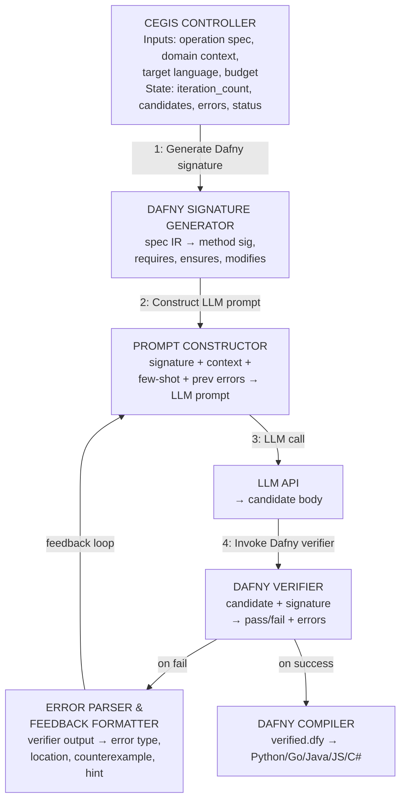
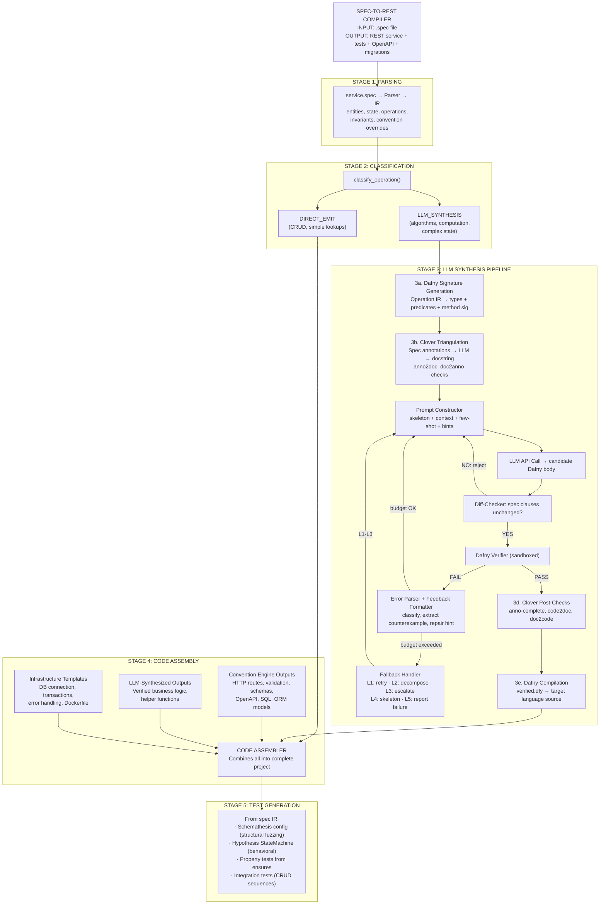

## 1. Overview and motivation

The spec-to-REST compiler has two code-generation paths:

1. **Convention engine (direct emission).** Handles structural concerns, HTTP routing, database
   schema, request validation, OpenAPI generation. For pure CRUD operations (create, read, update,
   delete), the convention engine emits code directly with no LLM involvement. This path is
   deterministic, fast, and free.

2. **LLM+Verifier synthesis (this document).** Handles non-trivial business logic, algorithms,
   complex computations, stateful transformations, and any operation where the "how" is not implied
   by the "what." This path uses a Counter-Example Guided Inductive Synthesis (CEGIS) loop with
   Dafny as the verification-aware intermediate language.

The key insight is that the spec already contains formal pre/postconditions. These translate
directly into Dafny `requires`/`ensures` clauses. An LLM generates a candidate implementation body,
the Dafny verifier checks it against the spec, and on failure the counterexample feeds back to the
LLM. On success, Dafny compiles the verified code to the target language (Python, Go, Java, etc.).

This document details every aspect of this pipeline.

## 2. The CEGIS loop architecture

### 2.1 Classical CEGIS background

Counter-Example Guided Inductive Synthesis (CEGIS) was introduced by Solar-Lezama et al. (2006) for
program synthesis. The classical loop has two players:

- The synthesizer proposes a candidate program that satisfies all seen examples.
- The verifier checks the candidate against the full specification. If it fails, it produces a
  counterexample, a concrete input where the candidate violates the spec.

The loop terminates when either the verifier accepts (success) or the budget is exhausted (failure).
In classical CEGIS, the synthesizer is a SAT/SMT solver. In our pipeline, the synthesizer is an LLM,
and the verifier is Dafny's auto-active verification toolchain (Boogie + Z3).

### 2.2 Our adapted CEGIS loop



### 2.3 Step-by-step walkthrough

#### Step 1: Translate spec to Dafny method signature

The spec IR contains an operation with typed inputs, outputs, preconditions, and postconditions. The
Dafny signature generator translates these into a complete Dafny method skeleton.

##### Translation rules

| Spec Concept              | Dafny Construct                                                     |
| ------------------------- | ------------------------------------------------------------------- |
| `state { store: K -> V }` | `class ServiceState { var store: map<K, V> }`                       |
| `operation Foo`           | `method Foo(st: ServiceState, ...)`                                 |
| `input: x: T`             | Method parameter `x: T`                                             |
| `output: y: T`            | Method return `returns (y: T)`                                      |
| `requires: P`             | `requires P` clause                                                 |
| `ensures: Q`              | `ensures Q` clause                                                  |
| `store' = ...`            | `modifies st` + ensures about `st.store`                            |
| `pre(store)`              | `old(st.store)`                                                     |
| `x not in store`          | `x !in st.store`                                                    |
| `#store`                  | `\|st.store\|`                                                      |
| `isValidURI(x)`           | Predicate `predicate isValidURI(s: string)` (axiomatized or extern) |
| Entity invariants         | Type refinements or function predicates                             |

**Key design decision.** We generate the _full_ Dafny file including the class definition, all
predicates, all type definitions, and the method signature with all `requires`/`ensures`/`modifies`
clauses. The LLM is asked to fill in ONLY the method body. The spec-derived parts are immutable,
the diff-checker (from DafnyPro) verifies the LLM has not modified them.

#### Step 2: Construct the LLM prompt

The prompt has four sections:

1. **System message.** You are a Dafny code generator. You produce ONLY the method body. You MUST
   NOT modify the method signature, requires, ensures, or modifies clauses.

2. **The Dafny skeleton.** The complete file with a `// YOUR CODE HERE` placeholder in the method
   body.

3. **Domain context.** Natural language description of what this operation does, derived from the
   spec's docstring or auto-generated from the pre/postconditions.

4. **Few-shot examples:** 1-3 examples of similar Dafny methods with verified implementations, drawn
   from a library of templates (map insert, map lookup, stateful update, etc.).

5. **Failure context (iterations 2+).** The previous candidate, the exact verifier error, and a hint
   about what kind of fix is needed.

#### Step 3: Generate candidate code

The LLM returns a Dafny method body. The response parser:

1. Extracts the code block from the LLM response (handles markdown fences, etc.).
2. Inserts the body into the skeleton at the placeholder location.
3. Runs the diff-checker: compares the `requires`/`ensures`/`modifies` clauses against the original.
   If the LLM modified them, rejects the candidate immediately and re-prompts with an explicit
   warning.
4. Runs the pruner: if the LLM added unnecessary `assert` statements or loop invariants that are
   redundant, removes them to speed up verification.

#### Step 4: Invoke the Dafny verifier

Dafny is invoked programmatically via its CLI or language server:

```bash
dafny verify --cores 4 --verification-time-limit 60 candidate.dfy
```

The invocation:

- Sets a per-method verification time limit (default: 60 seconds, configurable).
- Uses multiple cores for parallel VC discharge.
- Captures both stdout and stderr.
- Parses the exit code: 0 = verified, non-zero = errors.

##### Dafny's internal pipeline when verifying

```text
candidate.dfy
    -> Dafny parser (AST)
    -> Dafny resolver (type checking, name resolution)
    -> Dafny-to-Boogie translation (intermediate verification language)
    -> Boogie VC generation (weakest precondition calculus)
    -> Z3 SMT solver (discharges verification conditions)
    -> Result: verified / error with location + message
```

#### Step 5: Parse and classify verification errors

Dafny verifier errors fall into several categories. Each category implies a different repair
strategy:

| Error Category                     | Example Message                                           | Likely Fix                                                                                                      |
| ---------------------------------- | --------------------------------------------------------- | --------------------------------------------------------------------------------------------------------------- |
| **Postcondition violation**        | `A postcondition might not hold on this return path`      | The implementation does not establish the ensures clause. LLM needs to add logic or fix logic.                  |
| **Precondition violation**         | `A precondition for this call might not hold`             | The implementation calls a method/function without establishing its requires clause. Add an assertion or guard. |
| **Loop invariant failure**         | `This loop invariant might not be maintained by the loop` | The loop invariant is too weak or the loop body violates it. Strengthen or fix the invariant.                   |
| **Loop invariant not established** | `This loop invariant might not hold on entry`             | The invariant is not true before the loop starts. Fix initialization or weaken the invariant.                   |
| **Decreases failure**              | `A decreases expression might not decrease`               | The loop or recursion does not provably terminate. Fix the decreases clause.                                    |
| **Assertion failure**              | `Assertion might not hold`                                | An intermediate assertion the LLM added is wrong. Remove or fix it.                                             |
| **Type error**                     | `Type mismatch`                                           | The LLM used wrong types. Fix type annotations.                                                                 |
| **Syntax error**                   | `Unexpected token`                                        | The LLM produced invalid Dafny. Re-parse or re-generate.                                                        |
| **Timeout**                        | `Timed out`                                               | The verification condition is too complex. Simplify the code or add ghost annotations.                          |

##### Error parsing implementation

```python
@dataclass
class VerifierError:
    category: str           # postcondition, precondition, invariant, etc.
    message: str            # full error message from Dafny
    file: str               # source file
    line: int               # line number
    column: int             # column number
    related_clause: str     # the specific requires/ensures that failed
    counterexample: dict    # variable assignments if available

def parse_dafny_errors(stderr: str, source: str) -> list[VerifierError]:
    errors = []
    for match in DAFNY_ERROR_REGEX.finditer(stderr):
        category = classify_error(match.group("message"))
        related = find_related_clause(source, int(match.group("line")))
        ce = extract_counterexample(stderr, match.start())
        errors.append(VerifierError(
            category=category,
            message=match.group("message"),
            file=match.group("file"),
            line=int(match.group("line")),
            column=int(match.group("col")),
            related_clause=related,
            counterexample=ce,
        ))
    return errors
```

#### Step 6: Extract and format counterexamples

When Dafny/Z3 finds a counterexample, it provides concrete variable assignments that violate the
specification. These are extracted and formatted for the LLM:

```text
COUNTEREXAMPLE:
  When st.store == {shortcode_1 -> url_1}
  And   url.value == "https://example.com"
  The postcondition `|st.store| == old(|st.store|) + 1` fails because:
  Your code set st.store to {shortcode_1 -> url_1} (unchanged).
  Expected: |st.store| to increase from 1 to 2.
```

Not all Dafny errors produce counterexamples. Postcondition violations and assertion failures often
do. Loop invariant failures and timeouts typically do not. When no counterexample is available, we
provide the error message and the relevant source line instead.

#### Step 7: Construct feedback prompt

The regeneration prompt includes:

````text
Your previous implementation was rejected by the Dafny verifier.

## Your Previous Code
```csharp
{previous_candidate_body}
```text

## Verifier Error

{error.category}: {error.message} At line {error.line}, column {error.column}

## Related Specification Clause

{error.related_clause}

## Counterexample (if available)

{formatted_counterexample}

## Hint

{repair_hint_for_category}

## Instructions

Fix the implementation body to satisfy the specification. Do NOT modify the method signature,
requires, ensures, or modifies clauses. Return ONLY the corrected method body.
````

### Repair hints by category

| Category | Hint |
|---|---|
| Postcondition violation | "Your code does not establish the postcondition `{clause}`. Make sure every return path satisfies it. Consider what state changes are needed." |
| Precondition violation | "You are calling `{callee}` without first establishing its precondition `{callee_requires}`. Add a check or assertion before the call." |
| Loop invariant not maintained | "Your loop body invalidates the invariant `{inv}`. Either fix the loop body or strengthen the invariant to account for the intermediate state." |
| Loop invariant not established | "The loop invariant `{inv}` is not true before the loop starts. Check your initialization before the loop." |
| Decreases failure | "The verifier cannot prove your loop/recursion terminates. Add or fix the `decreases` clause. The decreasing expression must be a non-negative integer that strictly decreases each iteration." |
| Timeout | "Verification timed out. Your code may be too complex for the solver. Try: (1) adding intermediate assertions to guide the prover, (2) breaking complex expressions into simpler steps, (3) using `calc` blocks for multi-step reasoning." |

#### Step 8: Termination conditions

The CEGIS loop terminates when any of the following is true:

1. **Success.** Dafny verifier reports 0 errors. Proceed to compilation.
2. **Max iterations reached.** Default 8 (configurable). Based on DafnyPro's finding
   that most successful verifications converge within 3-5 iterations.
3. **Token budget exhausted.** Total input+output tokens across all iterations exceeds
   a configurable limit (default: 100k tokens per operation).
4. **Wall-clock timeout.** Total synthesis time exceeds limit (default: 5 minutes per
   operation).
5. **Repeated failure.** The same error appears 3 times in a row with no progress.
   Indicates the LLM is stuck.

#### Step 9: Fallback strategies

When synthesis fails (the loop terminates without a verified candidate), we execute
a graduated fallback (see Section 8 for full details).

## 10. End-to-end pipeline diagram


