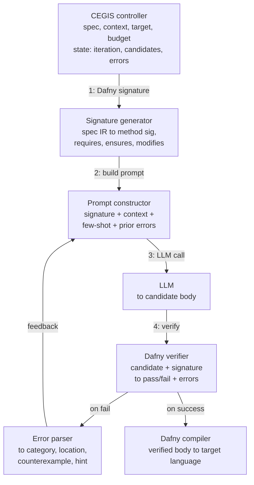
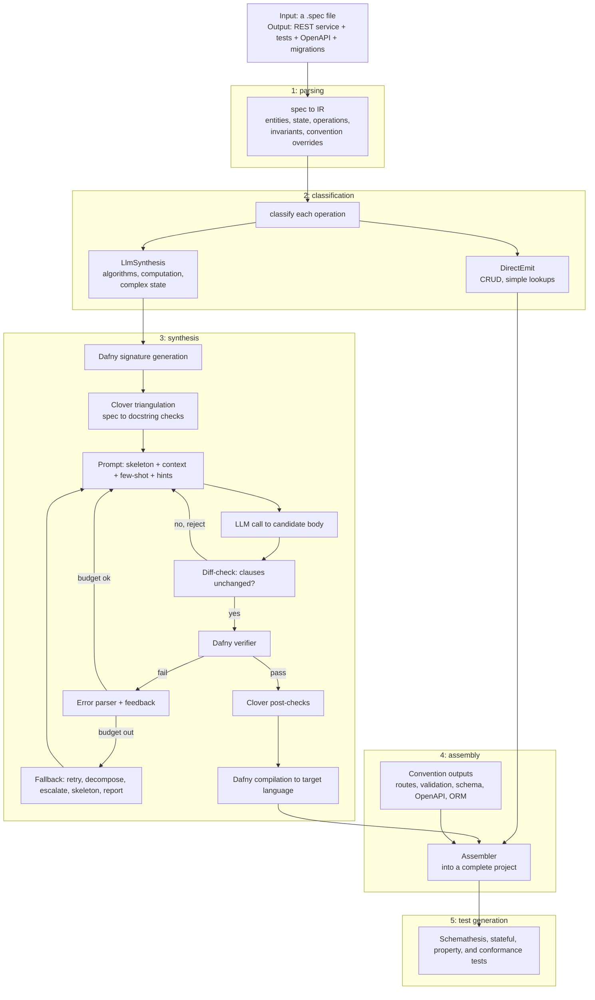

The compiler emits code two ways. The convention engine handles the structural half, the routes,
schema, validation, and OpenAPI, and for plain CRUD it emits the operation body directly, with no
model and no cost. Everything where the how is not implied by the what, an algorithm, a computation,
a stateful transformation, goes to LLM synthesis instead. Which path an operation takes is decided by
the classifier in [the convention engine](/design/convention-engine), which tags each operation
`DirectEmit` or `LlmSynthesis`. This subsection is the second path.

Its premise is that the spec already carries the contract. An operation's `requires` and `ensures`
become Dafny `requires` and `ensures`, an LLM writes a candidate body, the Dafny verifier checks it
against those clauses, and a failure feeds back into the next prompt. When the body verifies, it
compiles to the target language.

## The loop

CEGIS, counterexample-guided inductive synthesis (Solar-Lezama, 2006), pairs a synthesizer that
proposes a candidate with a verifier that either accepts it or returns a concrete counterexample, and
iterates until one side gives way. Classically the synthesizer is an SMT solver; here it is an LLM,
and the verifier is Dafny, with Boogie and Z3 underneath.



## From spec to a Dafny skeleton

The first step turns the operation's IR into a complete Dafny file: an `Option` datatype and per-spec
datatypes for enums and entities, a `ServiceState` class mirroring the `state` block, and one
`method` per operation carrying the translated clauses. A handful of the mappings:

| Spec                         | Dafny                                          |
| ---------------------------- | ---------------------------------------------- |
| `state { store: K -> V }`    | `class ServiceState { var store: map<K, V> }`  |
| `pre(store)`                 | `old(st.store)`                                |
| `x not in store`             | `x !in st.store`                               |
| `#store`                     | `\|st.store\|`                                 |
| `requires P` / `ensures Q`   | the same clauses on the method                 |

The spec-derived parts are fixed; the LLM fills only the body, marked `// YOUR CODE HERE`. This
skeleton is the `inspect --format dafny` path described in
[the convention engine](/design/convention-engine), and what Dafny does with the finished file is on
the [Dafny](/research/llm_verifier_synthesis/dafny) page.

## Generating and checking a candidate

The prompt carries the skeleton, a natural-language description of the operation, one to three
few-shot examples of similar verified methods, and, from the second iteration on, the previous body
with the verifier's error. The LLM returns a body; the response parser extracts it from the markdown
and splices it at the placeholder. Before anything runs, the diff-checker compares the candidate's
`requires`, `ensures`, and `modifies` against the originals and rejects the candidate outright if the
model touched them, since the contract is not the model's to weaken.

The verifier then runs the real Dafny binary:

```text
dafny verify --verification-time-limit=<seconds> --log-format=json;LogFileName=<log>
```

It reads results from that JSON log rather than scraping stderr, and kills the process five seconds
past the limit if Dafny hangs. The binary is located through `DAFNY_BIN` or the `PATH`.

## When verification fails

Dafny reports each failed obligation with a location and a category: a postcondition that might not
hold, a precondition for a call, a loop invariant not maintained or not established, a `decreases`
that might not shrink, a failed assertion, a type or syntax error, or a timeout. The category selects
a repair hint from a resource-backed library. Where Dafny produced a counterexample, and
postcondition and assertion failures usually do while invariant failures and timeouts usually do not,
the concrete assignment is formatted into the feedback:

```text
COUNTEREXAMPLE:
  When  st.store == {shortcode_1 -> url_1}
  And   url.value == "https://example.com"
  The postcondition |st.store| == old(|st.store|) + 1 fails because
  your code left st.store unchanged; it must grow from 1 to 2.
```

The next prompt restates the previous body, the error and its clause, the counterexample, and the
hint, then asks for a corrected body with the signature untouched.

## Termination

The loop stops on success, when Dafny reports no errors, or when the budget runs out. The budget is
configurable and defaults to eight iterations, 100k input tokens, 50k output tokens, and one US
dollar. It also stops when the same error category repeats three times in a row, which means the
model is stuck, and on an infrastructure failure: a provider error, an unparseable response, a
diff-check rejection, or a Dafny backend crash. On any exit short of success, the
[graduated fallback](/research/llm_verifier_synthesis/triangulation-and-fallback) takes over.

## Where this sits


