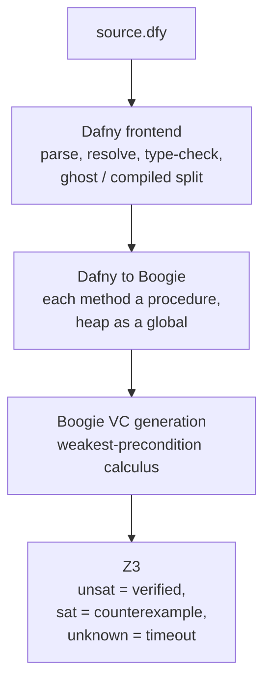
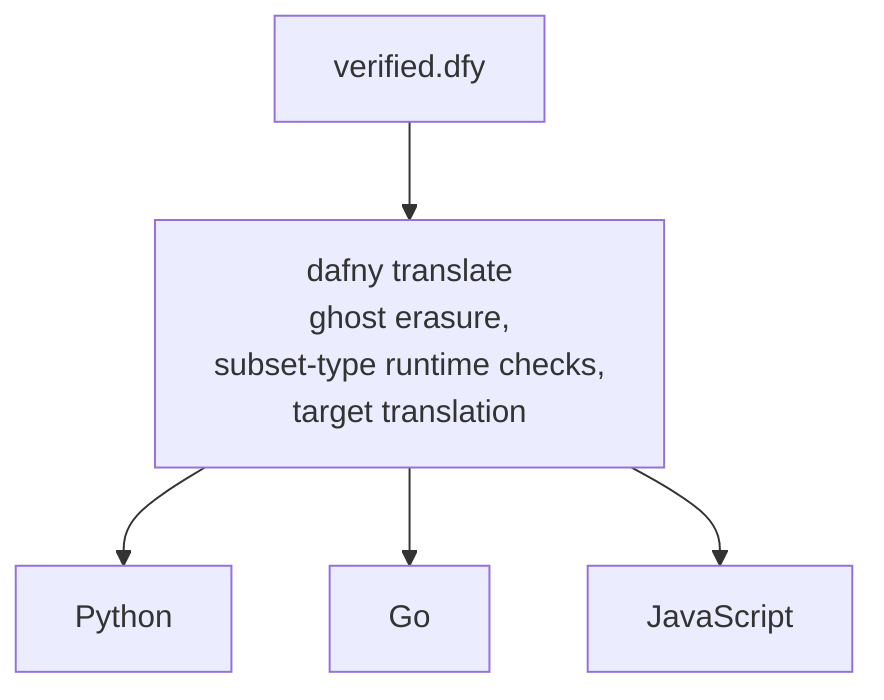

## Why Dafny

The synthesized body has to be both verifiable and compilable to the service's language, and Dafny is
the rare tool that does both. Its verification is auto-active: the proof lives inline with the code
as `requires`, `ensures`, `invariant`, and `decreases` annotations, which an LLM can produce because
they read like ordinary code. Tactic-based provers such as Coq or Isabelle want proof scripts in a
separate metalanguage, which models handle far worse. It also compiles to several languages, and the
three this project targets, Python, Go, and TypeScript (through Dafny's JavaScript backend), are all
covered. And it has the benchmark ecosystem to back the bet: DafnyBench and DafnyPro report verification
rates in the mid-eighties on thousands of methods, which no other verification language with an
LLM-targeted benchmark matches.

| Criterion         | Dafny                            | Coq                  | F\*                  | Verus            | Isabelle              |
| ----------------- | -------------------------------- | -------------------- | -------------------- | ---------------- | --------------------- |
| Proof style       | auto-active, inline              | tactic scripts       | mixed                | auto-active      | tactic scripts (Isar) |
| LLM suitability    | high, proof is inline code       | low, opaque tactics  | medium               | medium           | low                   |
| Compiles to       | C#, Java, Go, JS, Python         | OCaml extraction     | C (via KaRaMeL)      | Rust only        | SML, OCaml, Scala     |
| Automation        | high, Z3 discharges most VCs     | low, manual          | medium               | high             | medium                |
| Adoption          | AWS (Cedar, smithy-dafny)        | CompCert, seL4       | HACL\*               | early            | seL4                  |

The trade-off is real: Dafny's compiled output is not idiomatic and carries a runtime library. The
pipeline accepts that by using Dafny only for the operation body, the business-logic kernel, and
wrapping it in hand-written infrastructure rather than shipping the raw translation as the service.

## The compilation pipeline

Verification runs Dafny's own stack. The file goes through the frontend, lowers to Boogie, where each
method becomes a procedure and the heap a global variable, and Boogie generates verification
conditions by weakest-precondition calculus that Z3 discharges.



Once the body verifies, `dafny translate` compiles the file to the target. The [`DafnyTranslateCli`](https://github.com/HardMax71/spec_to_rest/blob/main/modules/synth/src/main/scala/specrest/synth/DafnyTranslator.scala)
wrapper runs each translation in its own directory under a fixed `kernel.dfy` name, so the Go
backend, which names the package after the file, produces a stable `package kernel`.



## What survives compilation

Everything that existed only to convince the verifier is erased, because it has no runtime effect.

| Dafny construct                  | After compilation                                  |
| -------------------------------- | -------------------------------------------------- |
| `requires` / `ensures`           | erased; they were already proved                   |
| loop `invariant`, `decreases`    | erased                                             |
| ghost variables, lemma calls     | erased entirely                                    |
| `assert`                         | erased                                             |
| subset types                     | a runtime check on construction                    |
| datatypes and classes            | target-language classes                            |
| `map`, `seq`, `set`              | Dafny runtime-library types                        |
| `:\|` (assign-such-that)         | a search or iteration                              |

So the guarantee that ships is conditional: if the preconditions hold at runtime and the
axiomatized functions behave as assumed, the postconditions hold. Unknown calls such as `isValidURI`
are axiomatized as opaque predicates with a trivially-true body. That is sound here because they
appear only inside contracts, which are erased, so their runtime behavior never matters; the real
validation lives in the convention engine's generated layer.

## The runtime cost

Because the body is compiled by `dafny translate`, the output is not idiomatic. It leans on Dafny's
runtime library for the target language, its `Map`, `Seq`, and `Set` types and big-integer
arithmetic, and it reads like machine output: a `dafny.Map` rather than a `dict`, interface-heavy Go,
a `:\|` that became a linear scan. None of that is a correctness problem, since the code is verified,
but it is why the verified body is treated as a kernel. The convention engine wraps it in idiomatic,
hand-written infrastructure, the HTTP handler, the validation, the database calls, rather than
exposing the raw translation as the whole service.

## Dafny patterns for REST operations

A few shapes recur across generated skeletons.

State is a class of maps. A table is a `map` from key to row, a one-to-many relation a `map` to a
set, a counter an `int`, and the state invariant a `predicate`:

```csharp
class ServiceState {
  var users: map<UserId, User>
  var user_posts: map<UserId, set<PostId>>
  var next_id: int
}

predicate Valid(st: ServiceState)
  reads st
{ forall uid :: uid in st.users ==> uid < st.next_id }
```

CRUD operations are distinguished by what their `ensures` says about the table and its size. A create
adds one key, a read leaves the table alone, an update keeps the size, a delete drops one key:

```csharp
method Create(st: ServiceState, id: K, val: V)
  modifies st
  requires id !in st.table
  ensures st.table == old(st.table)[id := val]
  ensures |st.table| == |old(st.table)| + 1

method Read(st: ServiceState, id: K) returns (val: V)
  requires id in st.table
  ensures val == st.table[id] && st.table == old(st.table)

method Delete(st: ServiceState, id: K)
  modifies st
  requires id in st.table
  ensures st.table == map k | k in old(st.table) && k != id :: old(st.table)[k]
  ensures |st.table| == |old(st.table)| - 1
```

A state-machine transition guards on the current state and pins everything else unchanged:

```csharp
method ConfirmOrder(st: ServiceState, orderId: OrderId)
  modifies st
  requires orderId in st.orders
  requires st.orders[orderId].status == Pending
  ensures st.orders[orderId].status == Confirmed
  ensures forall oid :: oid in st.orders && oid != orderId ==> st.orders[oid] == old(st.orders[oid])
```

A loop needs a `decreases` clause to prove termination, usually a recursive ghost function pinning
the expected result:

```csharp
ghost function SumPrices(items: seq<LineItem>): int
  decreases |items|
{ if |items| == 0 then 0 else items[0].price * items[0].quantity + SumPrices(items[1..]) }

method ComputeTotal(items: seq<LineItem>) returns (total: int)
  ensures total == SumPrices(items)
  decreases |items|
```
