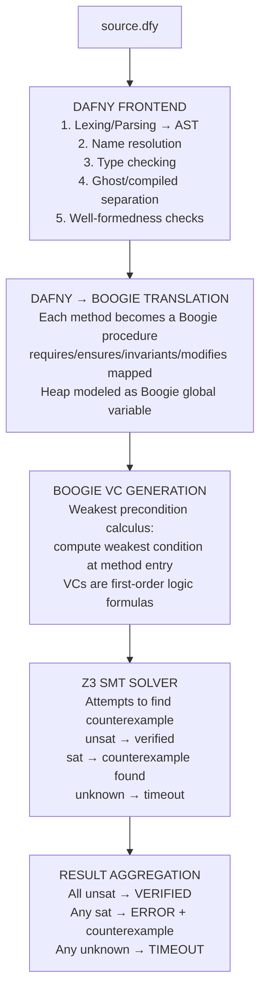
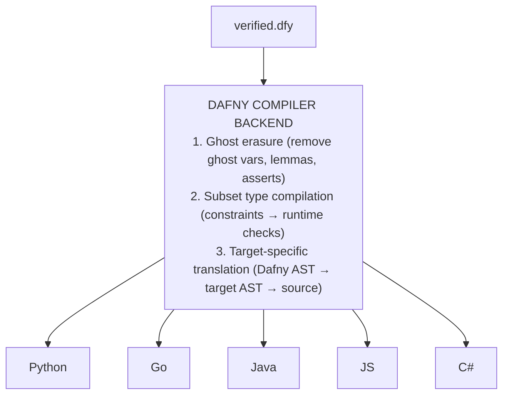

## 5. Dafny as the verification IL

### 5.1 Why Dafny (not Coq, f\*, Verus, isabelle)

| Criterion             | Dafny                             | Coq                               | F\*/KaRaMeL             | Verus                  | Isabelle                   |
| --------------------- | --------------------------------- | --------------------------------- | ----------------------- | ---------------------- | -------------------------- |
| **Proof style**       | Auto-active (inline annotations)  | Tactic scripts                    | Mix of auto/manual      | Auto-active (Rust)     | Tactic scripts (Isar)      |
| **LLM suitability**   | High, proof is inline with code | Low, tactics are opaque to LLMs | Medium                  | Medium, Rust subset  | Low, Isar is niche       |
| **Target languages**  | C#, Java, Go, JS, Python          | OCaml (extraction)                | C (KaRaMeL)             | Rust only              | SML, OCaml, Haskell, Scala |
| **LLM benchmarks**    | DafnyBench (86% SOTA)             | CoqGym (limited)                  | None                    | VerusBench (43% SAFE)  | PISA (limited)             |
| **Industry adoption** | AWS (Cedar, smithy-dafny)         | CompCert, sel4                    | HACL\* (Firefox, Linux) | None yet               | seL4                       |
| **Learning curve**    | Moderate                          | Very high                         | High                    | Low (if you know Rust) | Very high                  |
| **Automation level**  | High (Z3 handles most VCs)        | Low (manual proofs)               | Medium                  | High                   | Medium                     |

#### Dafny wins on three decisive factors

1. **Multi-language compilation.** Coq only extracts to OCaml. F\* only to C. Verus only to Rust.
   Dafny compiles to 5 languages. For a REST compiler targeting Python, Go, and Java, this is
   essential.

2. **LLM compatibility.** Auto-active verification means the proof is embedded in the code as
   annotations (assertions, invariants, decreases clauses). LLMs can generate these because they
   look like code comments. Tactic-based provers (Coq, Isabelle) require generating proof scripts in
   a separate metalanguage that LLMs struggle with.

3. **Benchmark ecosystem.** DafnyBench provides 782 programs with 17,324 methods. DafnyPro achieves
   86% verification rate on this benchmark. No other verification language has comparable
   LLM-targeted benchmarks or success rates.

**The trade-off we accept.** Dafny's generated code requires a runtime library and is not idiomatic
in the target language. We mitigate this by:

- Using Dafny only for the "business logic kernel" (the operation body).
- Wrapping the Dafny-generated code in hand-crafted, idiomatic infrastructure templates.
- Post-processing the generated code to improve readability where possible.

### 5.2 The Dafny compilation pipeline in detail



#### After verification succeeds, the compilation path



### 5.3 What is preserved and what is lost

| Dafny Concept                              | After Compilation                                                          |
| ------------------------------------------ | -------------------------------------------------------------------------- |
| `requires` clauses                         | Erased (already verified) or compiled to runtime assertions (configurable) |
| `ensures` clauses                          | Erased (already verified) or compiled to runtime assertions (configurable) |
| `invariant` (loop)                         | Erased (already verified)                                                  |
| `decreases` clauses                        | Erased (already verified)                                                  |
| Ghost variables                            | Erased entirely                                                            |
| Lemma calls                                | Erased entirely                                                            |
| `assert` statements                        | Erased or compiled to runtime assertions (configurable)                    |
| Subset types (`type T = x: int \| x > 0`) | Runtime check on construction                                              |
| Datatypes / classes                        | Compiled to target language classes                                        |
| `map`, `seq`, `set`                        | Compiled to Dafny runtime library types                                    |
| `:\|` (assign-such-that)                   | Compiled to search/iteration                                               |
| `{:extern}` methods                        | Become FFI calls to target language libraries                              |

**Correctness guarantee.** The verification ensures that IF the preconditions hold at runtime AND
the `{:extern}` functions behave as axiomatized, THEN the postconditions will hold. Ghost code and
proof annotations are erased because they were only needed to convince the verifier, they have no
runtime effect.

### 5.4 Dafny runtime library requirements

Each target language requires the Dafny runtime library:

| Target     | Runtime Package                        | Size   | Notes                          |
| ---------- | -------------------------------------- | ------ | ------------------------------ |
| Python     | `dafny-runtime` (PyPI)                 | ~50KB  | Pure Python, no native deps    |
| Go         | `github.com/dafny-lang/DafnyRuntimeGo` | ~100KB | Pure Go                        |
| Java       | `dafny.jar`                            | ~200KB | Included in Dafny distribution |
| JavaScript | `@anthropic-ai/dafny-runtime` (npm)    | ~80KB  | Pure JS, CommonJS + ESM        |
| C#         | `DafnyRuntime.dll` (NuGet)             | ~150KB | .NET Standard 2.0              |

The runtime provides: `DafnyMap`, `DafnySequence`, `DafnySet`, `DafnyMultiset`, big integer
arithmetic, and utility functions. These are immutable/persistent data structures that match Dafny's
mathematical semantics.

### 5.5 Known issues with generated code quality

| Target | Issue                                                | Severity | Mitigation                                              |
| ------ | ---------------------------------------------------- | -------- | ------------------------------------------------------- |
| Python | Uses `dafny.Map` instead of `dict`                   | Medium   | Post-process to convert to native types at API boundary |
| Python | Verbose class definitions                            | Low      | Post-process with formatter                             |
| Go     | Uses interface types extensively                     | Medium   | Type assertions may be needed at boundaries             |
| Go     | Non-idiomatic error handling (uses `Option` type)    | Medium   | Wrap in idiomatic Go error returns                      |
| Java   | Generates raw types without generics sometimes       | Low      | Post-process to add type parameters                     |
| JS     | CommonJS output by default                           | Low      | Configure ESM output                                    |
| All    | `:\|` compiles to potentially slow iteration         | Medium   | Replace with efficient algorithm in infrastructure layer |

### 5.6 Practical Dafny patterns for REST operations

#### Pattern 1: Modeling database state

```csharp
class ServiceState {
  // A table is a map from primary key to row data
  var users: map<UserId, User>

  // A one-to-many relation is a map from parent key to set of child keys
  var user_posts: map<UserId, set<PostId>>

  // A many-to-many relation is a set of pairs
  var user_roles: set<(UserId, RoleId)>

  // A counter or sequence generator
  var next_id: int

  // Invariant: next_id is always greater than all existing IDs
  ghost predicate Valid()
    reads this
  {
    forall uid :: uid in users ==> uid.value < next_id
  }
}
```

#### Pattern 2: Modeling HTTP-like request/response

```csharp
datatype HttpStatus = OK | Created | BadRequest | NotFound | Conflict | ServerError

datatype ApiResult<T> = Success(value: T, status: HttpStatus)
                       | Failure(error: string, status: HttpStatus)

// An operation that can fail with a meaningful error
method CreateUser(st: ServiceState, name: string, email: string)
  returns (result: ApiResult<UserId>)
  modifies st
  requires |name| > 0
  requires |email| > 0
  ensures result.Success? ==>
    result.value in st.users &&
    st.users[result.value].name == name &&
    |st.users| == |old(st.users)| + 1
  ensures result.Failure? ==>
    st.users == old(st.users)  // state unchanged on failure
```

#### Pattern 3: Ensures clauses for CRUD operations

```csharp
// CREATE: new entry added, exactly one more element
method Create(st: ServiceState, id: K, val: V)
  modifies st
  requires id !in st.table
  ensures st.table == old(st.table)[id := val]
  ensures |st.table| == |old(st.table)| + 1

// READ: state unchanged, correct value returned
method Read(st: ServiceState, id: K)
  returns (val: V)
  requires id in st.table
  ensures val == st.table[id]
  ensures st.table == old(st.table)  // no mutation

// UPDATE: entry changed, count unchanged
method Update(st: ServiceState, id: K, val: V)
  modifies st
  requires id in st.table
  ensures st.table == old(st.table)[id := val]
  ensures |st.table| == |old(st.table)|

// DELETE: entry removed, exactly one fewer element
method Delete(st: ServiceState, id: K)
  modifies st
  requires id in st.table
  ensures st.table == map k | k in old(st.table) && k != id :: old(st.table)[k]
  ensures |st.table| == |old(st.table)| - 1
```

#### Pattern 4: Stateful operations (state machines)

```csharp
datatype OrderStatus = Pending | Confirmed | Shipped | Delivered | Cancelled

// Ensures clauses encode valid state transitions
method ConfirmOrder(st: ServiceState, orderId: OrderId)
  modifies st
  requires orderId in st.orders
  requires st.orders[orderId].status == Pending  // can only confirm pending orders
  ensures st.orders[orderId].status == Confirmed
  ensures st.orders[orderId].items == old(st.orders[orderId].items)  // items unchanged
  ensures forall oid :: oid in st.orders && oid != orderId ==>
    st.orders[oid] == old(st.orders[oid])  // other orders unchanged
```

#### Pattern 5: Operations with loops (decreases clauses)

```csharp
// Computing a total from a sequence of line items
method ComputeTotal(items: seq<LineItem>) returns (total: int)
  requires forall i :: 0 <= i < |items| ==> items[i].price >= 0
  requires forall i :: 0 <= i < |items| ==> items[i].quantity >= 0
  ensures total == SumPrices(items)  // matches a recursive ghost function
  decreases |items|  // termination: sequence gets shorter
{
  if |items| == 0 {
    total := 0;
  } else {
    var rest := ComputeTotal(items[1..]);
    total := items[0].price * items[0].quantity + rest;
  }
}

// Ghost function defining the expected sum (specification)
ghost function SumPrices(items: seq<LineItem>): int
  decreases |items|
{
  if |items| == 0 then 0
  else items[0].price * items[0].quantity + SumPrices(items[1..])
}
```

#### Pattern 6: Using `{:extern}` for FFI

```csharp
// External function: URI validation (implemented in target language)
function {:extern "UrlShortener", "ValidateUri"} valid_uri_impl(s: string): bool

// We axiomatize its behavior for verification:
lemma {:axiom} ValidUriSpec(s: string)
  ensures valid_uri_impl(s) <==> (
    |s| > 0 &&
    (s[..7] == "http://" || s[..8] == "https://")
  )

// External function: hash generation
method {:extern "UrlShortener", "GenerateHash"} generate_hash(s: string)
  returns (h: string)
  ensures |h| == 8
  ensures forall i :: 0 <= i < |h| ==>
    ('a' <= h[i] <= 'z') || ('0' <= h[i] <= '9')
```

At compilation time, `{:extern}` methods become calls to the target language's implementation. The
axiomatized behavior is assumed correct, this is where the verification boundary meets the
unverified world. The convention engine generates the target-language implementations of these
extern functions.
