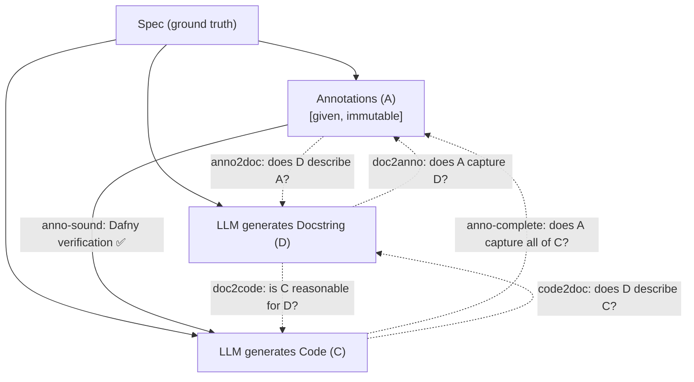
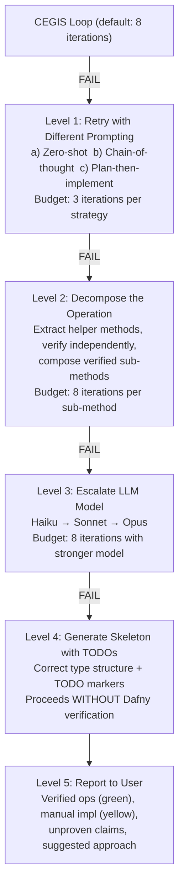

## 4. Clover-style triangulation

### 4.1 Background: Stanford's Clover (2023)

Clover (Sun et al., 2023) achieved 87% acceptance rate with 0% false positives on Dafny code
generation. The key insight: instead of generating only code, generate three independently
verifiable artifacts and cross-validate them:

1. **Code (C).** The implementation.
2. **Annotations (A).** Formal pre/postconditions (Dafny requires/ensures).
3. **Docstrings (D).** Natural language description of behavior.

By checking all six pairwise consistency directions, Clover catches errors that any single check
would miss.

### 4.2 Adaptation for our pipeline

In our pipeline, annotations (A) come directly from the spec, they are not LLM-generated. This is
a major advantage: one of the three artifacts is ground truth.

#### What is generated vs. what is given

| Artifact        | Source                   | Confidence                                  |
| --------------- | ------------------------ | ------------------------------------------- |
| Annotations (A) | Spec (ground truth)      | 100%, these ARE the specification         |
| Docstrings (D)  | LLM-generated from spec  | High, natural language is LLMs' strength  |
| Code (C)        | LLM-generated to match A | Variable, this is what we're synthesizing |

### 4.3 The six consistency checks

Clover defines six checks between the three artifacts. Here is how each applies in our pipeline:

#### Check 1: Anno-sound (a -> c)

**"Does the code satisfy the annotations?"**

- This is the primary Dafny verification step.
- The Dafny verifier checks that the code body satisfies all `requires`/`ensures`.
- Implementation: `dafny verify candidate.dfy`
- This is the core CEGIS check. If this passes, the code is provably correct with respect to the
  spec.

#### Check 2: Anno-complete (c -> a)

**"Do the annotations capture all behaviors of the code?"**

- Checks whether the code does something the annotations do not constrain.
- In Clover, this is done by generating additional postconditions from the code and checking if they
  are implied by the existing annotations.
- In our pipeline: after verification succeeds, ask the LLM to enumerate behaviors of the
  implementation that are not covered by `ensures` clauses. If the LLM identifies any, flag them for
  human review.
- Example: The code might update `created_at` but no `ensures` clause mentions it. This is
  acceptable (the spec is silent about it) but worth flagging.

Implementation:

```python
def check_anno_complete(verified_code: str, annotations: list[str]) -> list[str]:
    """Ask LLM to find behaviors in code not captured by annotations."""
    prompt = f"""
    Given this verified Dafny method:
    {verified_code}

    And these postconditions:
    {annotations}

    List any behaviors of the code that are NOT captured by the postconditions.
    For each, explain whether this is:
    (a) intentional (the spec is silent about this detail), or
    (b) potentially dangerous (the code does something the spec didn't intend).
    """
    return call_llm(prompt)
```

#### Check 3: anno2doc (a -> d)

**"Does the docstring accurately describe the annotations?"**

- Checks that the natural language description matches the formal spec.
- In our pipeline: generate a docstring from the annotations, then ask the LLM to verify that the
  docstring and annotations describe the same behavior.
- Since our annotations come from the spec (ground truth), this check validates the docstring.

Implementation:

```python
def check_anno2doc(annotations: list[str], docstring: str) -> bool:
    """Verify docstring accurately describes the annotations."""
    prompt = f"""
    Formal specification:
    {annotations}

    Natural language description:
    {docstring}

    Does the natural language description accurately and completely describe the
    formal specification? Answer YES or NO, and explain any discrepancies.
    """
    response = call_llm(prompt)
    return "YES" in response.upper()
```

#### Check 4: doc2anno (d -> a)

**"Do the annotations capture everything the docstring says?"**

- The reverse of check 3.
- Checks if the docstring mentions behaviors not in the annotations.
- In our pipeline: if the docstring says "generates a unique random code" but the annotation only
  says `code !in old(st.store)`, the discrepancy is harmless (the annotation is weaker). But if the
  docstring says "the URL is validated" and there is no `requires isValidURI(...)`, that is a real
  gap.

Implementation:

```python
def check_doc2anno(docstring: str, annotations: list[str]) -> list[str]:
    """Find claims in docstring not captured by annotations."""
    prompt = f"""
    Natural language description:
    {docstring}

    Formal specification:
    {annotations}

    List any claims in the natural language description that are NOT captured
    by the formal specification. For each, indicate severity:
    - LOW: the claim is a reasonable implication of the spec
    - HIGH: the claim adds a requirement the spec does not enforce
    """
    return call_llm(prompt)
```

#### Check 5: code2doc (c -> d)

**"Does the docstring accurately describe what the code does?"**

- After verification, generate a natural language description of the code and compare it to the
  docstring.
- Catches cases where the code is technically correct per the annotations but does something
  unexpected that the docstring would reveal.

Implementation:

```python
def check_code2doc(code: str, docstring: str) -> bool:
    """Verify code behavior matches docstring description."""
    prompt = f"""
    Code:
    {code}

    Docstring:
    {docstring}

    Does this code do what the docstring says? Are there any behaviors of the
    code that contradict the docstring? Answer YES (matches) or NO (discrepancy).
    """
    response = call_llm(prompt)
    return "YES" in response.upper()
```

#### Check 6: doc2code (d -> c)

**"Could the docstring plausibly describe this code?"**

- The reverse of check 5.
- Asks: given only the docstring, would a reader expect this implementation?
- Catches "technically correct but bizarre" implementations.

Implementation:

```python
def check_doc2code(docstring: str, code: str) -> bool:
    """Check if code is a reasonable implementation of the docstring."""
    prompt = f"""
    A developer was asked to implement the following:
    {docstring}

    They wrote:
    {code}

    Is this a reasonable implementation of the description? Would a code reviewer
    accept this? Answer YES or NO, and explain any concerns.
    """
    response = call_llm(prompt)
    return "YES" in response.upper()
```

### 4.4 Triangulation workflow



#### Execution order

1. Generate D from the spec (cheap, one LLM call).
2. Run anno2doc and doc2anno checks (two LLM calls). Fix D if needed.
3. Generate C via the CEGIS loop (the primary synthesis, multiple iterations).
4. On CEGIS success, run anno-complete, code2doc, doc2code checks (three LLM calls).
5. If any check fails, flag for review but do not reject, the Dafny verification (anno-sound) is
   the hard guarantee. The other checks are soft validation.

### 4.5 When a check fails

| Check                  | Failure Action                                                                                      |
| ---------------------- | --------------------------------------------------------------------------------------------------- |
| anno-sound (A -> C)    | **Hard failure.** Re-enter CEGIS loop.                                                              |
| anno-complete (C -> A) | **Soft warning.** Log unconstrained behaviors. User can add more `ensures` clauses if desired.      |
| anno2doc (A -> D)      | **Regenerate D.** The docstring is wrong, rather than the spec.                                             |
| doc2anno (D -> A)      | **Soft warning.** D claims something A does not enforce. Either update A (update spec) or soften D. |
| code2doc (C -> D)      | **Soft warning.** The code is verified but the docstring does not match. Regenerate D from C.       |
| doc2code (D -> C)      | **Soft warning.** The code is bizarre but correct. Log for human review.                            |

The critical insight: **only the anno-sound check is a hard gate.** The Dafny verifier is the only
component that provides mathematical certainty. The other five checks are LLM-based heuristics that
improve confidence and catch "technically correct but practically wrong" implementations.

## 8. Handling synthesis failures

### 8.1 The graduated fallback strategy

When the CEGIS loop fails to produce a verified candidate, the compiler does not simply give up. It
executes a series of escalating fallback strategies.



### 8.2 Level 2: Decomposition strategy

When a complex operation fails as a monolith, decompose it:

**Example.** The `ShipOrder` operation from Section 7.3 fails because the LLM cannot simultaneously
update the order status, set the shipped timestamp, decrement inventory, and prove the frame
condition.

#### Decomposition

```csharp
// Sub-operation 1: Update order status
method UpdateOrderStatus(st: ServiceState, orderId: OrderId, newStatus: OrderStatus)
  modifies st
  requires orderId in st.orders
  ensures st.orders[orderId].status == newStatus
  ensures forall oid :: oid in st.orders && oid != orderId ==>
    st.orders[oid] == old(st.orders[oid])

// Sub-operation 2: Decrement inventory
method DecrementInventory(st: ServiceState, productId: ProductId, qty: int)
  modifies st
  requires productId in st.inventory
  requires st.inventory[productId].quantity >= qty
  ensures st.inventory[productId].quantity ==
    old(st.inventory[productId].quantity) - qty
  ensures forall pid :: pid in st.inventory && pid != productId ==>
    st.inventory[pid] == old(st.inventory[pid])

// Composed operation
method ShipOrder(st: ServiceState, orderId: OrderId)
  modifies st
  requires orderId in st.orders
  requires st.orders[orderId].status == Confirmed
  requires st.orders[orderId].product in st.inventory
  requires st.inventory[st.orders[orderId].product].quantity >=
    st.orders[orderId].quantity
{
  var productId := st.orders[orderId].product;
  var qty := st.orders[orderId].quantity;
  UpdateOrderStatus(st, orderId, Shipped);
  DecrementInventory(st, productId, qty);
}
```

Each sub-operation is simpler and more likely to pass verification independently.

### 8.3 Level 4: Skeleton generation

When all automated approaches fail, generate a compilable skeleton:

```python
def generate_skeleton(op: OperationIR, errors: list[VerifierError]) -> str:
    """Generate a method skeleton with TODO markers."""
    skeleton = f"""
method {op.name}({op.params_str})
  returns ({op.returns_str})
  // NOTE: This method could NOT be automatically verified.
  // The following postconditions must be satisfied manually:
"""
    for clause in op.ensures:
        skeleton += f"  // ensures {clause}\n"

    skeleton += "{\n"
    skeleton += f"  // TODO: Implement {op.name}\n"
    skeleton += f"  // The verifier failed with these errors:\n"
    for error in errors:
        skeleton += f"  //   - {error.category}: {error.message}\n"
    skeleton += f"  //\n"
    skeleton += f"  // Suggested approach:\n"
    skeleton += f"  {generate_suggested_approach(op)}\n"
    skeleton += "}\n"
    return skeleton
```

### 8.4 Metrics to track

The compiler tracks these metrics for every synthesis attempt:

```python
@dataclass
class SynthesisMetrics:
    operation_name: str
    complexity_category: str      # "simple", "medium", "complex"
    total_iterations: int         # how many CEGIS iterations
    successful: bool              # did it verify?
    fallback_level: int           # 0=first try, 1=retry, 2=decompose, etc.
    total_tokens_input: int       # tokens sent to LLM
    total_tokens_output: int      # tokens received from LLM
    total_llm_time_ms: int        # wall clock time in LLM calls
    total_verify_time_ms: int     # wall clock time in Dafny verification
    total_time_ms: int            # wall clock total
    error_categories: list[str]   # which error types were encountered
    model_used: str               # which LLM model was used
```

These metrics are aggregated into a compilation report:

```text
=== Synthesis Report ===
Service: UrlShortener (5 operations)

  Shorten ............. VERIFIED (3 iterations, 2.1s, $0.003)
  Resolve ............. DIRECT EMIT (0 iterations, 0s, $0.000)
  Delete .............. DIRECT EMIT (0 iterations, 0s, $0.000)
  ListAll ............. VERIFIED (1 iteration, 0.8s, $0.001)
  Analytics ........... FAILED -> SKELETON (8 iterations, 12.4s, $0.015)

  Total: 4/5 operations verified (80%)
  Total cost: $0.019
  Total time: 15.3s
  Manual review needed: Analytics
```
