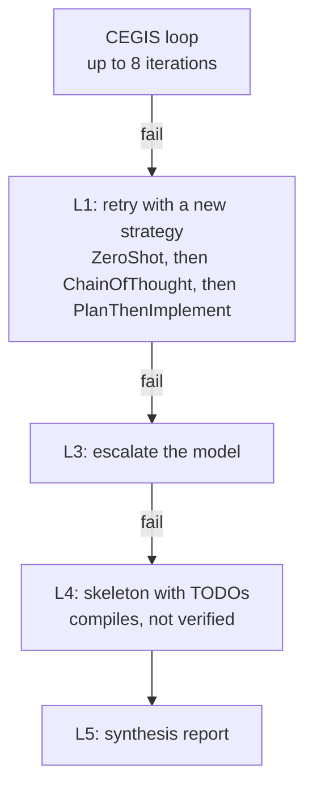

## What the pipeline takes from Clover

Clover (Stanford, 2023) is the source of the closed-loop pattern this pipeline uses: generate code,
check it against a formal contract, feed the failures back. Clover's broader idea is triangulation
across three artifacts, the code, the formal annotations, and a natural-language docstring,
cross-checked in every direction so that an error one check would miss shows up in another.

The pipeline takes two things from it and leaves the rest. One of the three artifacts is ground
truth: the annotations are the spec's `requires` and `ensures`, not something the model wrote, so
there is nothing to second-guess about them. And the hard gate is the Dafny verification, Clover's
code-against-annotations check, the one step that gives mathematical certainty rather than an LLM's
opinion. Beside it runs the diff-checker, which confirms the model returned the contract it was given
instead of a weakened one.

Clover's other checks, the docstring-against-annotation and code-against-docstring comparisons, are
LLM-judged heuristics, and they are not built here. The verification and the diff-check are the
consistency the pipeline actually enforces. A generated docstring that disagreed with the code would
be a useful warning, but it is not certainty, so it is not what ships.

## The fallback ladder

A CEGIS run has a budget, and budgets run out. When one does without a verified body,
[`FallbackOrchestrator`](https://github.com/HardMax71/spec_to_rest/blob/main/modules/synth/src/main/scala/specrest/synth/FallbackOrchestrator.scala) does not give up; it walks a plan of strategy-and-model combinations and, only
if all of them fail, emits something compilable.



The plan varies the prompt strategy first (L1), since a fresh framing is the cheapest thing to try,
then escalates to a stronger model (L3). If no combination verifies, L4 emits a skeleton: the right
signature and types, with the unmet postconditions and the verifier's errors left as TODO comments,
so the build still produces something a person can finish. L5 is the report.

## The level that is not there

The numbering skips L2 on purpose. The original design had a decomposition level between the retries
and the model escalation: when a complex operation fails as a whole, ask the model to split it into
sub-methods, verify each, and compose them. It was never shipped, and that is a decision of record
([#227](https://github.com/HardMax71/spec_to_rest/issues/227)) rather than an oversight. The
[compositional synthesis findings](/research/compositional_synthesis_findings) lay out the evidence:
LLMs hit a verification ceiling around 7% on multi-function Dafny, sampling more candidates does not
move it, and the dominant failure is exactly the contract-fragility-under-composition a
decompose-and-recompose strategy produces. For the URL shortener's three synthesized operations, that
ceiling works out to well under one operation per spec that L2 would rescue. The effort went instead
to hint-augmentation, the reactive repair hints on the
[prompts](/research/llm_verifier_synthesis/prompts) page, which lifts the rate on the monolithic case
the pipeline already handles.

## The report

Every run ends in a report. Each operation is marked verified, direct-emitted, or fallen through to a
skeleton, with its iteration count. It is the one place that states plainly which operations a person
still has to finish.

```text
Service: UrlShortener

  Shorten ....... VERIFIED      (3 iterations)
  Resolve ....... VERIFIED      (2 iterations)
  Delete ........ DIRECT_EMIT
  ListAll ....... VERIFIED      (1 iteration)
```

An operation that exhausts the ladder shows `SKELETON` instead of `VERIFIED`, which is the signal
that it compiled but was not proved and needs a hand. The per-operation cost and timing that the
report also carries are covered on the [cost and security](/research/llm_verifier_synthesis/cost-and-security)
page.
