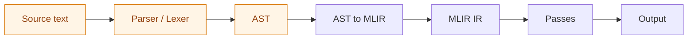

MLIR stands for Multi-Level Intermediate Representation, and it is compiler infrastructure, not a
compiler, not a language, and not a parser. It gives you a generic SSA-based IR of operations,
regions, blocks, and values; an extensible dialect system for defining your own operations, types,
and attributes as first-class IR; a pass framework for transformations; and a progressive-lowering
model that walks a program down through intermediate dialects (`arith`, `func`, `scf`, `affine`,
`memref`, `llvm`) toward machine code. Its defining idea is that several levels of abstraction coexist
in one IR: a `toy.transpose` can sit beside an `affine.for` beside an `llvm.call`, each from a
different dialect at a different level.

The "ML" is not Machine Learning, despite the era it arrived in. Chris Lattner and the LLVM community
built it as general-purpose compiler infrastructure; the name is Multi-Level, and the official
description is "a novel approach to building reusable and extensible compiler infrastructure," with no
ML-specific scope.

## It does not help you parse

This is the finding that decides most of the question: MLIR gives you nothing for parsing a custom
DSL. Its job starts after the AST already exists.



The orange stages are the ones you build yourself; MLIR's contribution begins at the AST-to-MLIR
boundary. The canonical proof is MLIR's own Toy tutorial, whose Chapter 1 is a hand-written
recursive-descent lexer and parser in C++, and whose Chapter 2, "Emitting Basic MLIR," is where MLIR
finally enters. There is an experimental community bridge that generates an MLIR dialect from an
ANTLR4 grammar, but it covers only a subset of ANTLR and never left experimental status. For a spec
language that needs a lexer, parser, and AST no matter what, and the compiler builds its on ANTLR4,
MLIR removes none of that work.

## What a dialect costs

Defining a dialect is a spread of files across three languages and two build systems.

```text
mlir/include/mlir/Dialect/Foo/
    FooDialect.td          # dialect declaration (TableGen)
    FooOps.td              # operation definitions (TableGen)
    FooTypes.td            # custom type definitions (TableGen, optional)
    FooDialect.h           # C++ header (partly generated)
    FooOps.h               # C++ header (partly generated)
mlir/lib/Dialect/Foo/IR/
    FooDialect.cpp         # C++ implementation
    FooOps.cpp             # operation implementations
    CMakeLists.txt         # build configuration
```

Operations are declared in TableGen's ODS (Operation Definition Specification) format, terse on the
page but expanding into multi-thousand-line generated C++:

```text
def ConstantOp : Foo_Op<"constant"> {
  let summary = "constant operation";
  let arguments = (ins F64ElementsAttr:$value);
  let results = (outs F64Tensor);
  let hasVerifier = 1;
  let assemblyFormat = "$value attr-dict `:` type($value)";
}

def Foo_PolyType : TypeDef<Foo_Dialect, "Polynomial"> {
  let parameters = (ins "int":$degreeBound);
  let assemblyFormat = "`<` $degreeBound `>`";
}
```

The build is CMake, and even with TableGen generating the boilerplate, the dialect registration,
custom verifiers, builders, lowering passes, and storage classes are all hand-written C++.

```cmake
add_mlir_dialect(FooOps foo)
add_mlir_dialect_library(MLIRFoo
  FooDialect.cpp FooOps.cpp
  DEPENDS MLIRFooOpsIncGen
  LINK_LIBS PUBLIC MLIRIR MLIRSupport)
```

The rough totals bear out the weight.

| Component                           | Lines      | Language       |
| ----------------------------------- | ---------- | -------------- |
| TableGen dialect and ops (5-10 ops) | 100-300    | ODS / TableGen |
| C++ dialect implementation          | 200-500    | C++            |
| CMake configuration                 | 30-60      | CMake          |
| Lowering pass, per target           | 300-1000   | C++            |
| Minimum viable dialect              | ~700-2000  | mixed          |

Practitioners report the same shape: the MLIR-Forge study measured individual dialect components at
56 to 1,519 lines each, by developers who already knew MLIR, and Jeremy Kun's polynomial-dialect
tutorial describes the generated files as "multi-thousand line implementation files" and flags
TableGen's `class` versus `def` distinction as a stumbling point.

## The C++ wall

All of that machinery is C++, non-negotiably: upstream MLIR is written in C++ and requires C++ for
dialect definitions, plus a full LLVM and Clang toolchain, CMake, and TableGen, with a from-source
build of about an hour on a laptop. Its own introduction assumes "knowledge of C++ and advanced
Python."

That is the dealbreaker here, and it does not turn on any fine print. The compiler is written in
[Scala 3 on the JVM](/research/implementation_architecture/host-language), so adopting MLIR would mean
bolting a C++ component and a CMake build onto an sbt project, asking for C++ on the team, slowing
every IR change behind an incremental C++ rebuild, and complicating distribution, all to gain nothing
on the work that actually dominates: parsing, constraint solving, and template-based code generation.
