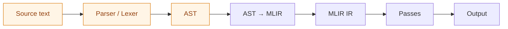

## 1. What MLIR actually is

MLIR is a **compiler infrastructure framework**, rather than a compiler, rather than a language, rather than a parser. It
provides:

- A generic SSA-based IR format with operations, regions, blocks, and values
- An extensible dialect system where you define your own operations, types, and attributes as
  first-class IR constructs
- A transformation/pass infrastructure for writing optimization and lowering passes
- A progressive lowering model where high-level domain operations are incrementally lowered
  through intermediate dialects down to machine code (via LLVM IR)
- Built-in dialects for common patterns: `arith`, `func`, `scf` (structured control flow),
  `affine` (loop nests), `memref` (memory), `llvm` (LLVM IR)

The key architectural insight: MLIR lets multiple levels of abstraction coexist in a single IR. A
program can contain `toy.transpose` next to `affine.for` next to `llvm.call`, each from a
different dialect, at a different abstraction level.

Despite the name, the "ML" in MLIR does **not** stand for Machine Learning. Chris Lattner (MLIR's
creator) and the LLVM community have explicitly stated it was conceived as general-purpose compiler
infrastructure. The official MLIR website describes it as "a novel approach to building reusable and
extensible compiler infrastructure" with no ML-specific limitation.

## 2. Does MLIR help with parsing?

**No. MLIR provides zero parsing infrastructure for custom DSLs.**

This is the single most important finding for our use case. MLIR's role begins _after_ parsing is
complete:



The orange-tinted stages are the part you build yourself; MLIR's contribution starts at the
**AST → MLIR** boundary.

Evidence from the official Toy language tutorial (the canonical MLIR learning path):

> "The code for the lexer is fairly straightforward; it is all in a single header:
> `examples/toy/Ch1/include/toy/Lexer.h`. The parser can be found in
> `examples/toy/Ch1/include/toy/Parser.h`."

The Toy tutorial uses a **hand-written recursive descent parser** in C++. MLIR provides no lexer
generator, no parser generator, no grammar specification mechanism, and no AST construction
utilities. The MLIR Toy tutorial Chapter 1 is entirely about the hand-written parser; Chapter 2 is
titled "Emitting Basic MLIR", this is where MLIR begins.

### ANTLR + MLIR bridge

There is an experimental community project that generates MLIR dialects from ANTLR4 grammars
(discussed on LLVM Discourse, author: leothaud). It automatically:

- Transforms an ANTLR4 grammar into an MLIR dialect representing the AST
- Generates an ANTLR4-based frontend that targets this MLIR dialect

However, this project supports only a subset of ANTLR4 features and is experimental. The community
reception noted it could be useful but suggested IRDL (Intermediate Representation Definition
Language) for broader portability.

### Implication for spec-to-REST

Our spec language needs a parser regardless. Whether we use MLIR or not, we still need to build a
lexer, parser, and AST, using ANTLR, tree-sitter, pest, hand-written recursive descent, or
similar. MLIR does not reduce this work at all.

## 3. Custom dialect creation: What it takes

Creating an MLIR dialect requires a substantial amount of scaffolding across multiple files, build
systems, and languages.

### 3.1 Files required for a minimal dialect

```text
mlir/include/mlir/Dialect/Foo/
    FooDialect.td          # Dialect declaration (TableGen)
    FooOps.td              # Operation definitions (TableGen)
    FooTypes.td            # Custom type definitions (TableGen, optional)
    FooDialect.h           # C++ header (partly generated)
    FooOps.h               # C++ header (partly generated)

mlir/lib/Dialect/Foo/IR/
    FooDialect.cpp         # C++ implementation
    FooOps.cpp             # Operation implementations
    CMakeLists.txt         # Build configuration

mlir/lib/Dialect/Foo/Transforms/
    FooTransforms.td       # Rewrite rules (TableGen, optional)
    CMakeLists.txt         # Build configuration
```

### 3.2 Tablegen (ods) definitions

The dialect is declared in TableGen's ODS (Operation Definition Specification) format:

```text
// FooDialect.td
def Foo_Dialect : Dialect {
  let name = "foo";
  let cppNamespace = "foo";
}
```

Operations are defined declaratively:

```text
// FooOps.td
def ConstantOp : Foo_Op<"constant"> {
  let summary = "constant operation";
  let arguments = (ins F64ElementsAttr:$value);
  let results = (outs F64Tensor);
  let hasVerifier = 1;
  let builders = [
    OpBuilder<(ins "DenseElementsAttr":$value)>
  ];
  let assemblyFormat = "$value attr-dict `:` type($input)";
}
```

Custom types require additional definitions:

```text
// FooTypes.td -- a parameterized type
def Foo_PolyType : TypeDef<Foo_Dialect, "Polynomial"> {
  let parameters = (ins "int":$degreeBound);
  let assemblyFormat = "`<` $degreeBound `>`";
}
```

### 3.3 Cmake configuration

```cmake
add_mlir_dialect(FooOps foo)
add_mlir_doc(FooOps FooDialect Dialects/ -gen-dialect-doc)

add_mlir_dialect_library(MLIRFoo
  FooDialect.cpp
  FooOps.cpp
  DEPENDS
  MLIRFooOpsIncGen
  LINK_LIBS PUBLIC
  MLIRIR
  MLIRSupport
)
```

### 3.4 C++ implementation

Even with TableGen generating most boilerplate, you still write C++ for:

- Dialect initialization and registration
- Custom verification logic (if `hasVerifier = 1`)
- Custom builders beyond what TableGen generates
- Lowering passes (the `ConversionPattern` implementations)
- Custom type/attribute storage classes

### 3.5 Effort estimate

Based on multiple tutorials and real-world examples:

| Component                         | Estimated lines | Language     |
| --------------------------------- | --------------- | ------------ |
| TableGen dialect + ops (5-10 ops) | 100-300         | ODS/TableGen |
| C++ dialect implementation        | 200-500         | C++          |
| CMake build configuration         | 30-60           | CMake        |
| Lowering pass (per target)        | 300-1000        | C++          |
| **Total minimum viable dialect**  | **~700-2000**   | **Mixed**    |

The MLIR-Forge project found that individual dialect components required 56-1,519 lines of code,
with each taking a developer less than one week to implement, but these developers already knew
MLIR.

Jeremy Kun's tutorial on building a polynomial dialect noted that progression sped up over time but
acknowledged confusion with TableGen's `class` vs `def` distinction and uncertainty about optimal
file organization. He described the generated files as "multi-thousand line implementation files."

## 4. The C++ requirement

**MLIR is written in C++ and requires C++ for dialect definitions.** This is non-negotiable in
upstream MLIR.

### What this means practically

- Compiling MLIR from source takes ~1 hour on a laptop, ~10 minutes on a desktop.
  This is a one-time cost, but iterating on dialect changes requires incremental rebuilds of
  generated C++ code.
- MLIR requires a full LLVM/Clang toolchain, CMake, and TableGen.
- The official MLIR introduction page assumes "knowledge of C++ and advanced
  Python, along with passing familiarity with NVIDIA CUDA."
- Our spec-to-REST compiler is designed around Python
  (primary), Rust (alternative), or TypeScript as implementation languages. Using MLIR means either
  (a) rewriting in C++, (b) maintaining a C++ MLIR component that communicates with our main
  codebase via IPC/FFI, or (c) using xDSL (Python, see Section 9).

### Is it a dealbreaker?

For this project: **almost certainly yes.** The implementation architecture document (07) evaluated
five languages and chose Python as the primary implementation language for its Z3 integration, LLM
API support, development velocity, and distribution story. Introducing a mandatory C++ component for
MLIR would:

1. Add a second implementation language and build system (CMake alongside pip/poetry)
2. Require C++ expertise on the team
3. Slow iteration speed for IR changes
4. Complicate distribution (native binaries vs. pure Python)
5. Provide no benefit for our actual bottleneck (parsing, constraint solving, code generation via
   templates)
