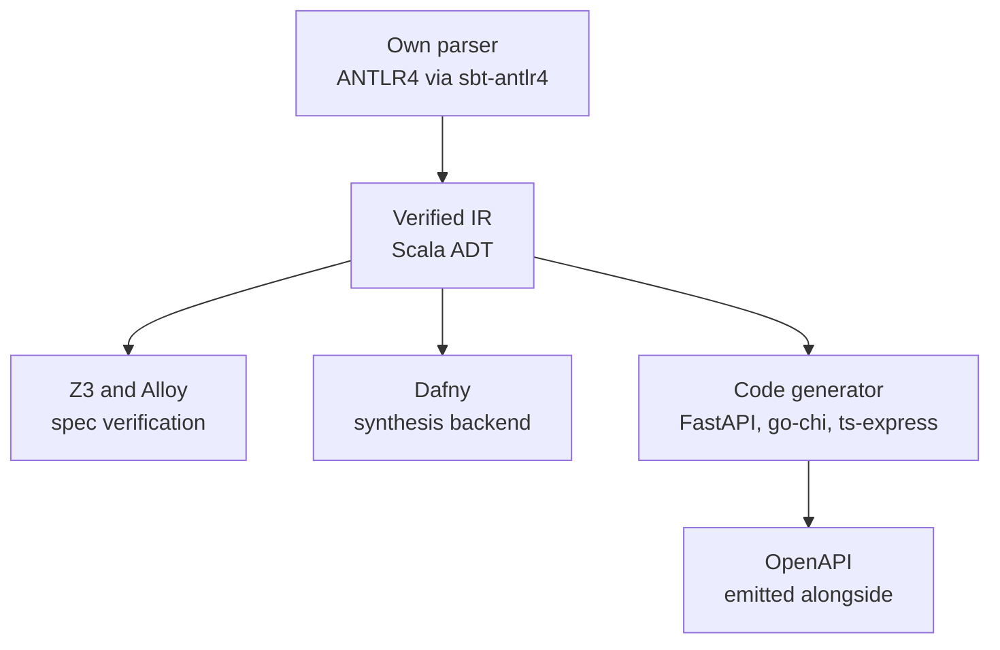

The per-construct coverage is on the [formal-methods](/research/parser_reuse_analysis/formal-methods)
and [API-language](/research/parser_reuse_analysis/api-languages) pages; lined up on the criteria that
actually decide a reuse question, the six candidates fall out like this:

| Criterion               | Alloy 6      | Quint          | Dafny        | TypeSpec     | Smithy         | Ballerina    |
| ----------------------- | ------------ | -------------- | ------------ | ------------ | -------------- | ------------ |
| Constructs covered      | 8.5/14       | 6.5/14         | 8/14         | 3.5/14       | 4/14           | 4.5/14       |
| Integration effort      | high         | med-high       | very high    | very high    | high           | very high    |
| Parser extensibility    | low, CUP     | medium, ANTLR  | low, C#      | low, TS      | low, Java      | low, Java    |
| Fork-maintenance burden | high         | high           | very high    | very high    | high           | very high    |
| Verification backend    | Kodkod / SAT | Apalache / SMT | Z3 / Boogie  | none         | none           | none         |
| Code generation         | none         | none           | many targets | via emitters | smithy-codegen | JVM bytecode |
| HTTP awareness          | none         | none           | none         | excellent    | excellent      | excellent    |

## The core tension

One split runs through the whole table. The languages strong on behavior, Alloy, Quint, and Dafny,
have no HTTP awareness and little or no path to a running service. The languages strong on HTTP and
API modeling, TypeSpec, Smithy, and Ballerina, have no behavioral specification at all. No existing
language sits on both sides of that line, which is the gap this project was built to fill, so no
single parser was ever going to cover it.

## Build it, and reuse the rest

So the parser is built from scratch, and the existing tools are kept as pipeline components rather
than as a base to extend. The reasoning is cumulative. No candidate covers more than 61% of the
constructs, and the missing ones are foundational rather than additive: adding HTTP conventions to
Alloy, or behavioral contracts to TypeSpec, changes what the language is for, not just what it can
say. Extending a grammar is roughly 5% of the work; the other 95% is the AST, the type checker, and
every downstream phase, none of which a foreign codebase hands you. Forking any of these actively
developed languages is a permanent merge-conflict tax, and each one locks you into its stack (Alloy to
the JVM and SAT, Dafny to C# and Boogie, Quint to TypeScript and Apalache). A purpose-built parser was
estimated at two to three months against four to nine for extending any of them, at lower risk and
with a clean AST shaped for the pipeline.

What shipped follows that plan, with one correction from a later decision: the parser is an ANTLR4
grammar compiled through `sbt-antlr4` inside the [Scala 3 compiler](/research/implementation_architecture/host-language),
not the TypeScript-targeted port the research originally assumed. ANTLR4's `ALL(*)` algorithm handles
the grammar's operator precedence and quantifiers without the ambiguity trouble an LALR generator like
CUP would hit. The tools that earned their place stay in the pipeline: Dafny as the verification and
synthesis backend, Z3 and Alloy for spec checking, and OpenAPI emitted alongside the generated code,
with Smithy and TypeSpec export available as future targets.

## The Langium reconsideration

After the survey settled on ANTLR4, a separate evaluation weighed Langium, a TypeScript language
workbench that bundles parser, AST, and LSP, and briefly preferred it before reversing back. The short
version: Langium's companion type system cannot express refinement types, relations, or quantified
expressions, so most of the type checker has to be hand-built whichever way the choice goes, which
erases Langium's main productivity argument; ANTLR's community dwarfs it; and ANTLR keeps the parser
independent of any one framework. The full back-and-forth is the
[DSL frameworks](/research/dsl_compiler_frameworks) survey.
