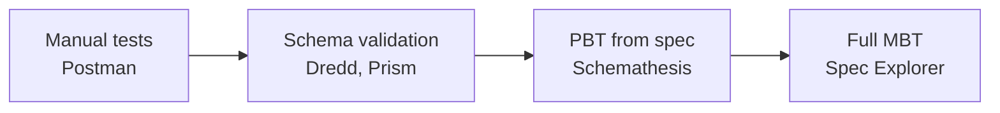

## TLA+ traces and test generation

Two ways connect a TLA+ spec to a real implementation: validate execution traces against the spec, or
generate tests from its state space.

Trace validation ([Kuppe et al., 2024](https://arxiv.org/abs/2404.16075)) instruments the
implementation to emit a trace of state transitions, expresses that trace as a constrained TLA+ spec,
and runs the TLC model checker to confirm the trace is a valid behavior, which reduces to whether some
sequence of spec states matches the observed trace. Not every variable needs tracing: the model
checker reconstructs the missing ones, trading a larger search space for less invasive
instrumentation. The published experiments found spec-implementation discrepancies in every
distributed program tested.

[MongoDB](https://www.mongodb.com/company/blog/engineering/conformance-checking-at-mongodb-testing-our-code-matches-our-tla-specs)
runs this in production, specifying its replication protocol in TLA+, capturing execution traces, and
validating them against the spec while checking invariants. Five years in, the lessons are that the
specs caught real algorithmic issues, that maintaining the conformance checking is significant ongoing
effort, and that keeping specs in sync with an evolving implementation, "agile modelling," is the
hardest part. [OmniLink (2025)](https://arxiv.org/html/2601.11836) pushes the idea to unmodified
concurrent systems: it records operation start and end times as timeboxes (no code change), generates
a fuzzer template from the TLA+ spec, uses the `rr` record-replay framework's chaos mode to randomize
thread scheduling, and validates the observed behaviors against the spec via TLC. It found two
previously unknown bugs across WiredTiger, BAT, and ConcurrentQueue, and outran Porcupine, the
state-of-the-art linearizability checker, on 200k-plus-operation traces. A related strand
([Fragoso Santos et al., 2022](https://dl.acm.org/doi/fullHtml/10.1145/3559744.3559747)) generates
both code and tests from a TLA+ spec so the two are consistent by construction. The TLC checker
underneath is mature (AWS, MongoDB, Microsoft, Cockroach Labs); trace validation is research-grade but
maturing fast, and OmniLink is recent.

## The landscape

In the REST world the OpenAPI spec is the de facto formal model, and the tools sit on a spectrum by
how much formality they demand:

| Approach          | Representative tools        | Spec input                 | What it tests                                      |
| ----------------- | --------------------------- | -------------------------- | -------------------------------------------------- |
| Schema-driven PBT | Schemathesis, RESTler       | OpenAPI/Swagger            | schema conformance, edge cases, stateful workflows |
| Contract testing  | Pact, Spring Cloud Contract | consumer-defined contracts | service compatibility                              |
| Spec validation   | Dredd, Prism                | OpenAPI/API Blueprint      | doc-implementation sync                            |
| Commercial MBT    | Tricentis Tosca             | proprietary models         | end-to-end business flows                          |
| Academic MBT      | Spec Explorer, NModel       | C# or formal models        | protocol conformance                               |

Formality, automation, coverage, and setup cost all rise from left to right, and the richer the spec
(examples, links, constraints), the better the generated tests.
[openapi.tools](https://tools.openapis.org/categories/testing.html) catalogs the testing tools in this
space.

## Conformance testing

Conformance testing asks whether an implementation correctly realizes a formal model, and the
conformance relation defines what "correctly" means. The dominant one for reactive systems is
[ioco, input-output conformance](https://www.sciencedirect.com/topics/computer-science/conformance-testing):
an implementation `i` conforms to spec `s` if, for every trace `s` can produce, the outputs `i`
produces after that trace are a subset of the outputs `s` allows. The model can be any of several
formalisms:

| Model type                      | Expressiveness              | Typical domain       |
| ------------------------------- | --------------------------- | -------------------- |
| FSM (finite state machine)      | states and transitions      | protocol conformance |
| LTS (labeled transition system) | non-determinism, quiescence | reactive systems     |
| EFSM (extended FSM)             | data variables and guards   | richer protocols     |
| TFSM (timed FSM)                | real-time constraints       | real-time systems    |
| TLA+ specifications             | arbitrary math              | distributed systems  |

[Test generation from such a model](https://link.springer.com/content/pdf/10.1007/978-0-387-34883-4_12.pdf)
aims to be sound (a conforming implementation passes every generated test) and
[complete](https://www.sciencedirect.com/science/article/abs/pii/S0950584910001278) (a non-conforming
one fails at least one), with coverage measured over states, transitions, or paths. The strongest
variant is [differential fuzzing against a verified model](https://welltyped.systems/blog/verified-conformance-testing-for-dummies):
build a small model proven correct, generate random operations, run them on both the model and the
implementation, and treat any divergence as a real bug, because the model cannot be wrong. It fits
state machines, protocols, financial logic, parsers, anything with strict invariants.

## Spec Explorer

[Spec Explorer](https://www.microsoft.com/en-us/research/project/model-based-testing-with-specexplorer/)
is a Visual Studio extension from Microsoft Research, used internally for over a decade and credited
with saving around 50 person-years. The model is written as a plain C#
[model program](https://learn.microsoft.com/en-us/archive/msdn-magazine/2013/december/model-based-testing-an-introduction-to-model-based-testing-and-spec-explorer):
fields are state, `[Rule]` methods are transitions, and `Condition.IsTrue(...)` guards them, so there
is no new language to learn. A Cord script then constructs the model program, exploring the full state
space, and slices it with regular-expression-like scenarios and synchronized parallel composition
(`||`), which is what makes an infinite state space tractable. Spec Explorer explores that into a
state graph, controllable states where the test sends a stimulus and observable ones where it expects
a response, and turns the graph into human-readable Visual Studio or NUnit tests in test normal form,
covering every transition. At Microsoft it drove Windows protocol-compliance testing (250 person-years
of testing, roughly 40% saved), .NET, and OS components since 2004, and its rules of thumb for when
MBT pays off are large or infinite state spaces, reactive or distributed or asynchronous systems,
non-determinism, methods with many parameters, and requirements coverable many ways. The tooling is
aging, though: Spec Explorer 2010 was the last extension release, and NModel is the open-source
successor.

## NModel

[NModel](https://jon-jacky.github.io/NModel/) is the open-source model-based testing framework for C#,
the Spec Explorer successor usable without Visual Studio. It is a library of attributes and types for
writing C# model programs plus three tools: `mpv`, the model-program viewer for visualization and
analysis; `mp2dot`, which exports to Graphviz DOT; and `ct`, for test generation and execution. The
connection to tests is the same as Spec Explorer's, the C# model program is the specification, and the
tools explore its state space and generate cases (the
[modeling book](http://staff.washington.edu/jon/modeling-book/) is the long-form reference).
