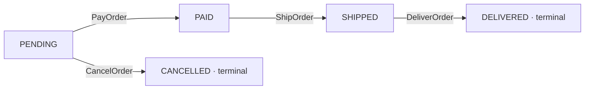
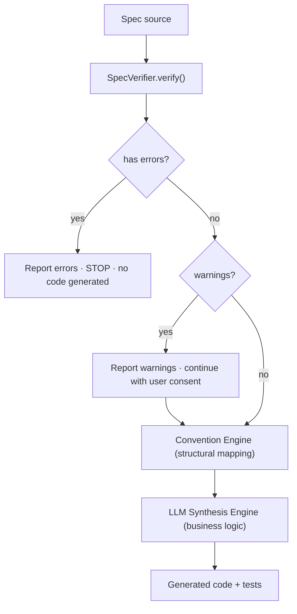
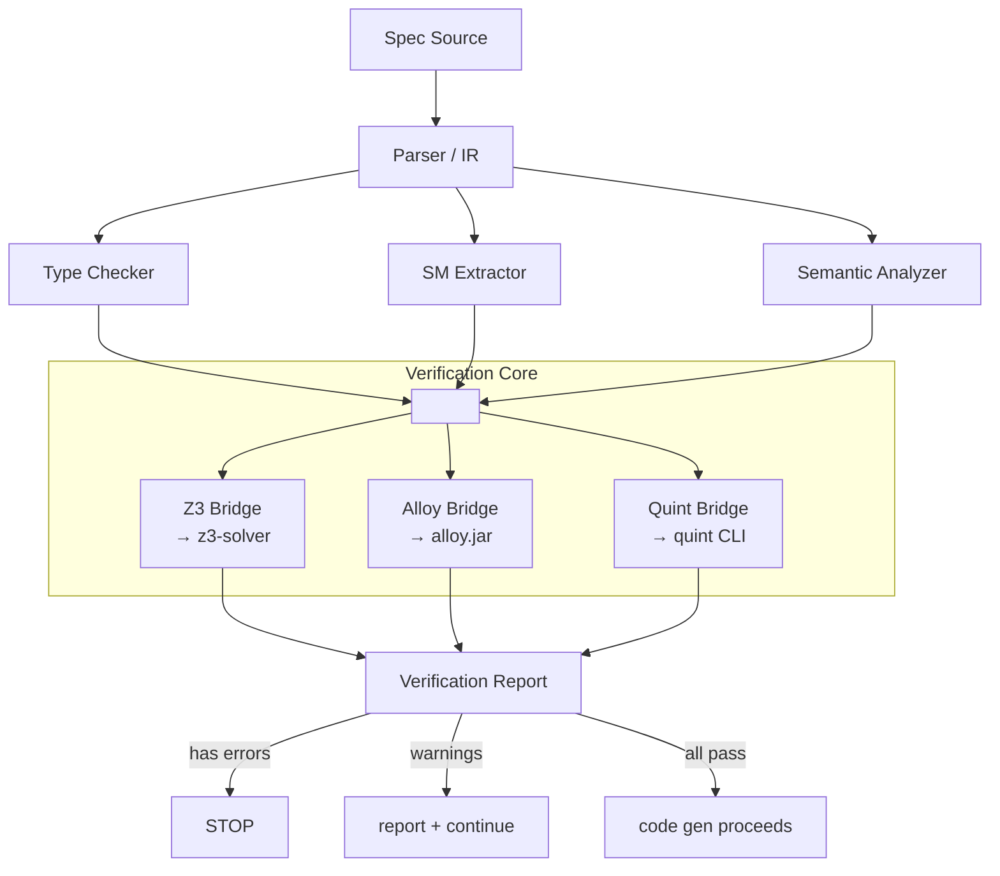

> The component that model-checks the formal specification ITSELF before any code is generated.
> Catches design errors at the specification level rather than discovering them in the generated
> implementation.

> **Status.** Verification is **shipped** in
> [`modules/verify/`](https://github.com/HardMax71/spec_to_rest/tree/main/modules/verify) (Scala 3 + Cats Effect 3),
> backed by Z3 (via `tools.aqua:z3-turnkey`) for first-order checks and Alloy 6 for
> powerset / temporal checks. Translator soundness is mechanically validated by the
> universal `soundness` theorem in `proofs/isabelle/SpecRest/Soundness.thy` (pivoted from
> Lean 4 to Isabelle/HOL via [#193](https://github.com/HardMax71/spec_to_rest/issues/193)).
> The live reference is the
> [Verification Engine pipeline page](/pipelines/verification). The Quint subprocess
> path explored in §2 was **not** adopted, Z3 + Alloy cover the shipped surface, and
> Quint is referenced here only as a comparison point. Python and TypeScript code
> samples below are design illustrations; the production compiler is Scala 3.

## Table of contents

1. [What Can Go Wrong in a Spec](#1-what-can-go-wrong-in-a-spec)
2. [Verification Techniques](#2-verification-techniques)
3. [The Verification Pipeline](#3-the-verification-pipeline)
4. [Invariant Preservation Checking (Deep Dive)](#4-invariant-preservation-checking-deep-dive)
5. [State Machine Verification](#5-state-machine-verification)
6. [Error Reporting](#6-error-reporting)
7. [Performance and Scalability](#7-performance-and-scalability)
8. [Comparison with Existing Spec Checkers](#8-comparison-with-existing-spec-checkers)
9. [Implementation Strategy](#9-implementation-strategy)

## 1. What can Go wrong in a spec

Every specification error falls into one of five categories: inconsistency, incompleteness,
unreachability, type errors, or semantic warnings. We enumerate them exhaustively here so the
verification engine can be designed to catch each one.

### 1.1 Inconsistency errors

An inconsistency means two or more parts of the spec contradict each other. No implementation can
simultaneously satisfy both. These are the most dangerous errors because they silently produce
impossible requirements.

**1.1.1 Invariant contradicts an operation's postcondition**

```text
entity ShortCode {
  value: String
  invariant: len(value) >= 6
}

state {
  store: ShortCode -> lone LongURL
}

operation Shorten {
  input:  url: LongURL
  output: code: ShortCode, short_url: String

  requires: isValidURI(url.value)

  ensures:
    store'[code] = url
    short_url = base_url + "/" + code.value
}
```

The `ensures` clause places no constraint on `code.value`'s length. It is legal under the
postcondition for `code.value` to be `"ab"` (length 2), but this violates the entity invariant
`len(value) >= 6`. The operation's postcondition is consistent with states that the invariant
forbids.

This is insidious because the spec author likely _intended_ the invariant to apply, but the ensures
clause does not explicitly reference it. The verification engine must synthesize the proof
obligation: does the postcondition, together with the precondition, guarantee the invariant holds in
the post-state?

**1.1.2 Two operations' postconditions are mutually exclusive**

```text
operation SetStatus {
  input: order_id: OrderId, status: Status
  ensures: orders'[order_id].status = status
}

operation FreezeOrder {
  input: order_id: OrderId
  ensures: orders'[order_id].status = FROZEN
           and all o in orders' | o.status != CANCELLED
}
```

If `SetStatus` is invoked with `status = CANCELLED` and then `FreezeOrder` is invoked,
`FreezeOrder`'s postcondition demands that no order has status CANCELLED. But the spec does not
require `SetStatus`'s effect to be undone. If both operations are in the same service, their
postconditions impose conflicting constraints on reachable states.

**1.1.3 An invariant is unsatisfiable (no valid state exists)**

```text
state {
  items: Item -> lone Price
}

invariant: all i in items | items[i] > 100
invariant: all i in items | items[i] < 50
```

No price can be simultaneously greater than 100 and less than 50. No valid state exists. Every
operation trivially preserves the invariant (vacuous truth), but the service can never be
initialized.

**1.1.4 Initial state violates an invariant**

```text
state {
  counter: Int
}

invariant: counter > 0

// No operation creates the initial state; counter defaults to 0.
```

The implicit initial state (empty store, zero counters) may not satisfy the invariant. The spec must
either define an explicit init block or the invariant must hold for the default values of all state
components.

**1.1.5 Conflicting cardinality constraints**

```text
state {
  assignments: Student -> one Course    // every student has exactly one course
}

operation Unenroll {
  input: s: Student
  ensures: s not in assignments'         // student has no course
}
```

After `Unenroll`, the student has zero courses, but the `one` multiplicity requires exactly one. The
operation postcondition contradicts the state declaration's multiplicity.

### 1.2 Incompleteness errors

An incomplete spec has gaps: situations it does not address. While a spec need not describe every
possible behavior, certain gaps indicate likely design errors.

**1.2.1 Operation requires clause does not cover a case needed by ensures**

```text
operation Withdraw {
  input: account_id: AccountId, amount: Money

  requires: account_id in accounts

  ensures:
    accounts'[account_id].balance = accounts[account_id].balance - amount
}
```

The requires clause checks that the account exists but does not check that `balance >= amount`. The
ensures clause allows negative balances. If the service invariant demands `balance >= 0`, the
operation can violate it. The requires clause is insufficient to guarantee the postcondition
preserves the invariant.

**1.2.2 Missing state transition**

```text
operation CreateOrder { ... ensures: orders'[id].status = PENDING }
operation CancelOrder { ... requires: orders[id].status = PENDING ... }
operation ShipOrder   { ... requires: orders[id].status = PAID ... }

// Missing: no operation transitions from PENDING to PAID.
```

The state machine has a gap: orders can be created (PENDING) and cancelled, and can be shipped if
PAID, but nothing transitions an order from PENDING to PAID. The PAID state is unreachable.
ShipOrder can never be invoked.

**1.2.3 Entity defined but never used in any operation**

```text
entity AuditLog {
  timestamp: DateTime
  action: String
  user: UserId
}

// No operation reads or writes AuditLog. It is dead specification.
```

**1.2.4 State relation is read but never written (always empty)**

```text
state {
  cache: ShortCode -> lone LongURL
}

operation Resolve {
  input: code: ShortCode
  requires: code in cache           // reads cache
  ensures: url = cache[code]
}

// No operation ever writes to cache. It is always empty.
// Therefore: Resolve's requires clause is always false.
```

**1.2.5 Operation input field is never constrained**

```text
operation Transfer {
  input: from: AccountId, to: AccountId, amount: Money, memo: String

  requires: from in accounts and to in accounts and amount > 0
  ensures: ...
}
```

The `memo` field is accepted as input but never appears in the requires or ensures clauses, nor in
any invariant. It is carried through without purpose. This may be intentional (pass-through
metadata) or may indicate a forgotten constraint.

**1.2.6 No operation produces a particular output entity**

```text
entity Receipt {
  order_id: OrderId
  total: Money
  issued_at: DateTime
}

// No operation has output: Receipt. The entity is defined but never emitted.
```

### 1.3 Reachability errors

Reachability errors mean some part of the spec describes situations that can never actually occur
during execution.

**1.3.1 Operation can never be invoked (requires always false)**

```text
operation Refund {
  input: order_id: OrderId

  requires:
    orders[order_id].status = SHIPPED
    and orders[order_id].status = CANCELLED
}
```

No order can be simultaneously SHIPPED and CANCELLED. The conjunction is always false. The operation
is dead code in the spec.

**1.3.2 State unreachable from initial state**

If the initial state is the empty state (no entries in any relation), and the only operation that
writes to `archive` requires entries in `archive` to exist:

```text
state {
  archive: Document -> lone DateTime
}

operation ArchiveDocument {
  input: doc: Document
  requires: doc in archive              // BUG: should be doc NOT in archive
  ensures: archive'[doc] = now()
}
```

Nothing can ever enter the archive because the only write operation requires the document to already
be archived. The archive is permanently empty.

**1.3.3 State machine deadlock**

```text
operation CreateOrder { ensures: orders'[id].status = PENDING }
operation PayOrder    { requires: status = PENDING, ensures: status' = PAID }
operation ShipOrder   { requires: status = PAID, ensures: status' = SHIPPED }
// SHIPPED is terminal -- no outgoing transitions. This is intentional.

operation HoldOrder   { requires: status = REVIEW, ensures: status' = HELD }
// HELD has no outgoing transitions AND no operation transitions INTO REVIEW.
```

REVIEW is unreachable, HELD is unreachable, and HoldOrder is dead. Additionally, if an operation
erroneously transitions into REVIEW, HELD becomes a deadlock because no operation exits it.

**1.3.4 Invariant makes a state component useless**

```text
state {
  discounts: Customer -> lone Percent
}

invariant: discounts = {}     // no customer ever has a discount
```

The invariant forces the discounts relation to always be empty. Any operation that reads or writes
discounts is either dead or will violate the invariant.

### 1.4 Type errors

Type errors are syntactic or structural mismatches in how spec elements reference each other.

**1.4.1 Relation multiplicity mismatch**

```text
state {
  owner: Car -> one Person         // each car has exactly one owner
}

operation TransferOwnership {
  input: car: Car, new_owner: Person
  ensures: owner'[car] = {new_owner, old_owner}  // set of two people
}
```

The `one` multiplicity means `owner[car]` is exactly one Person, but the ensures clause assigns a
set of two Persons. This is a type/multiplicity mismatch.

**1.4.2 Type incompatibility in expressions**

```text
entity Product {
  price: Money
  name: String
}

invariant: all p in products | p.price > p.name   // comparing Money to String
```

**1.4.3 Undeclared entities or fields**

```text
operation Checkout {
  input: cart_id: CartId
  ensures: receipt.total = carts[cart_id].total_price
}
// "receipt" is not declared as output.
// "total_price" is not a declared field of Cart.
```

**1.4.4 Primed variable used outside ensures clause**

```text
invariant: all c in store' | isValidURI(store'[c].value)
// store' (post-state) has no meaning in a global invariant,
// which describes a static property of any reachable state.
```

**1.4.5 Scope errors in quantifiers**

```text
operation Shorten {
  input: url: LongURL
  output: code: ShortCode

  ensures:
    all c in store | store'[c] = store[c]    // frame: all EXISTING entries preserved
    store'[code] = url
    all x in store' | isValidURI(store'[x].value)  // uses x but also references code
}
```

If the quantifier variable shadows the output variable name, confusion arises. More generally, any
free variable in an ensures clause that is neither an input, an output, a state component, nor a
bound quantifier variable is an error.

### 1.5 Semantic warnings (not errors but likely bugs)

**1.5.1 Operation has empty postcondition**

```text
operation Ping {
  input: none
  output: msg: String
  requires: true
  ensures: true          // does literally nothing observable
}
```

An ensures clause of `true` means the operation is allowed to do anything or nothing. This is almost
certainly a mistake, the author forgot to write the postcondition.

**1.5.2 Invariant is trivially true**

```text
invariant: all c in store | c = c
```

This is a tautology. It holds for every state, so it provides no constraint. Likely the author meant
to write something more specific.

**1.5.3 Requires clause is trivially true**

```text
operation Delete {
  input: code: ShortCode
  requires: true                    // accepts every input unconditionally
  ensures: code not in store'
}
```

If `code` is not in the store, the operation tries to delete a non-existent entry. The author likely
forgot to write `requires: code in store`.

**1.5.4 Two operations are functionally identical**

```text
operation GetUrl {
  input: code: ShortCode
  output: url: LongURL
  requires: code in store
  ensures: url = store[code] and store' = store
}

operation Resolve {
  input: code: ShortCode
  output: url: LongURL
  requires: code in store
  ensures: url = store[code] and store' = store
}
```

The two operations have identical signatures, preconditions, and postconditions. One is redundant.

**1.5.5 Invariant is subsumed by another invariant**

```text
invariant: all c in store | len(c.value) >= 6
invariant: all c in store | len(c.value) >= 1
```

The second invariant is strictly weaker than the first. If the first holds, the second automatically
holds. This is not wrong but suggests redundancy.

**1.5.6 Precondition is stronger than necessary**

```text
operation Resolve {
  input: code: ShortCode
  requires: code in store and len(code.value) >= 6

  ensures: url = store[code] and store' = store
}
```

If the entity invariant already guarantees `len(code.value) >= 6` for all ShortCodes in the store,
then the length check in the requires clause is redundant. The verification engine can detect this
and suggest simplification.

## 2. Verification techniques

### 2.1 SAT/SMT checking (Z3-Based)

SMT (Satisfiability Modulo Theories) solvers like Z3 can check whether logical formulas over
integers, strings, arrays, and uninterpreted functions are satisfiable. We translate spec elements
to SMT-LIB formulas and use Z3 to check key properties.

#### What it catches

- Unsatisfiable invariants (Section 1.1.3)
- Invariant-postcondition inconsistencies (Section 1.1.1)
- Requires clause insufficiency (Section 1.2.1)
- Trivially true/false conditions (Section 1.5)

#### Core checks

1. **Invariant satisfiability.** Translate all invariants to a conjunction. Ask Z3: is the
   conjunction satisfiable? If UNSAT, no valid state exists.

2. **Invariant preservation.** For each operation O and invariant I, check:
   `I(state) AND O.requires(input, state) AND O.ensures(input, state, state', output) => I(state')`
   Negate the implication and ask Z3 for satisfiability. If SAT, the solver returns a counterexample
   showing how the operation violates the invariant.

3. **Requires sufficiency.** Check that the precondition is strong enough to make the postcondition
   achievable:
   `O.requires(input, state) => EXISTS state', output. O.ensures(input, state, state', output)` If
   this fails, the precondition allows inputs for which no valid post-state exists.

4. **Dead condition detection.** Check `O.requires(input, state)` for satisfiability on its own. If
   UNSAT, the operation can never be invoked.

#### Complete SMT-LIB translation for the URL shortener spec

```lisp
; ============================================================
; URL Shortener Spec -> SMT-LIB2 Translation
; ============================================================

; --- Sorts ---
(declare-sort ShortCode 0)
(declare-sort LongURL 0)

; --- Entity field accessors ---
(declare-fun sc_value (ShortCode) String)
(declare-fun lu_value (LongURL) String)

; --- State: store is a partial function ShortCode -> LongURL ---
; We model the store as a set of ShortCode (the domain) plus a function
; for the mapping.
(declare-fun store_domain (ShortCode) Bool)          ; pre-state domain membership
(declare-fun store_map (ShortCode) LongURL)          ; pre-state mapping
(declare-fun store_domain_post (ShortCode) Bool)     ; post-state domain membership
(declare-fun store_map_post (ShortCode) LongURL)     ; post-state mapping

; --- Entity Invariants ---
; invariant: len(sc.value) >= 6 and len(sc.value) <= 10
(define-fun shortcode_inv ((c ShortCode)) Bool
  (and (>= (str.len (sc_value c)) 6)
       (<= (str.len (sc_value c)) 10)))

; invariant: sc.value matches /^[a-zA-Z0-9]+$/
(define-fun shortcode_alphanum ((c ShortCode)) Bool
  (str.in_re (sc_value c) (re.+ (re.union
    (re.range "a" "z") (re.range "A" "Z") (re.range "0" "9")))))

; invariant: valid_uri(lu.value)
; We approximate valid_uri as: starts with "http://" or "https://"
(define-fun valid_uri ((u LongURL)) Bool
  (or (str.prefixof "http://" (lu_value u))
      (str.prefixof "https://" (lu_value u))))

; --- Global Invariant: all codes in store map to valid URIs ---
(declare-const global_inv_valid_urls Bool)
(assert (= global_inv_valid_urls
  (forall ((c ShortCode))
    (=> (store_domain c)
        (valid_uri (store_map c))))))

; --- Global Invariant: all codes in store satisfy entity invariants ---
(define-fun global_inv_codes () Bool
  (forall ((c ShortCode))
    (=> (store_domain c)
        (and (shortcode_inv c) (shortcode_alphanum c)))))

; --- Combined pre-state invariant ---
(define-fun all_invariants () Bool
  (and global_inv_valid_urls global_inv_codes))

; --- Combined post-state invariant ---
(define-fun all_invariants_post () Bool
  (and
    (forall ((c ShortCode))
      (=> (store_domain_post c)
          (valid_uri (store_map_post c))))
    (forall ((c ShortCode))
      (=> (store_domain_post c)
          (and (shortcode_inv c) (shortcode_alphanum c))))))

; ============================================================
; CHECK 1: Are the invariants satisfiable?
; ============================================================
; (push)
; (assert all_invariants)
; (check-sat)  ; expect SAT -- a valid state exists
; (pop)

; ============================================================
; CHECK 2: Does Shorten preserve invariants?
; ============================================================
; Operation Shorten:
;   input:  url: LongURL
;   output: code: ShortCode
;   requires: isValidURI(url)
;   ensures:  code not in pre(store)
;             store'[code] = url
;             for all other c: store'[c] = store[c]
;             code in store'

(declare-const input_url LongURL)
(declare-const output_code ShortCode)

; Pre-state invariants hold
(assert all_invariants)

; Precondition
(assert (valid_uri input_url))

; Postcondition: code was not in store
(assert (not (store_domain output_code)))

; Postcondition: store' = store + {output_code -> input_url}
(assert (store_domain_post output_code))
(assert (= (store_map_post output_code) input_url))

; Frame condition: everything else unchanged
(assert (forall ((c ShortCode))
  (=> (not (= c output_code))
      (and (= (store_domain_post c) (store_domain c))
           (= (store_map_post c) (store_map c))))))

; Now check: does the post-state invariant hold?
; We NEGATE the post-invariant and check for SAT.
; If SAT, the solver found a counterexample (invariant violation).
(assert (not all_invariants_post))

(check-sat)
; If SAT: VIOLATION FOUND. The model shows a counterexample.
;   The output_code might have sc_value of length < 6, violating shortcode_inv.
;   This is because the ensures clause does not constrain output_code's value length.
;
; If UNSAT: The operation provably preserves the invariant.

; (get-model)  ; in SAT case, shows the counterexample

; ============================================================
; CHECK 3: Does Resolve preserve invariants?
; ============================================================
; Resolve is read-only (store' = store), so it trivially preserves
; invariants. The check is:
;   all_invariants AND store' = store => all_invariants_post
; This is always UNSAT (when negated), confirming preservation.

; ============================================================
; CHECK 4: Does Delete preserve invariants?
; ============================================================
; Delete removes an entry. The frame is: store' = store - {code}.
; Since we only remove, and invariants are universally quantified
; over store contents, removing an entry preserves them. The check
; confirms this automatically.
```

#### What the Z3 output looks like

For Check 2 (Shorten), Z3 returns SAT with a model like:

```text
sat
(model
  (define-fun output_code () ShortCode ShortCode!val!0)
  (define-fun sc_value ((x!0 ShortCode)) String
    (ite (= x!0 ShortCode!val!0) "ab" "abcdef"))
  (define-fun input_url () LongURL LongURL!val!0)
  (define-fun lu_value ((x!0 LongURL)) String
    "https://example.com")
)
```

This counterexample shows that `output_code` has `sc_value = "ab"` (length 2), which violates the
entity invariant. The ensures clause must be strengthened.

### 2.2 Alloy-based bounded model checking

Alloy uses SAT-based bounded model checking via the Kodkod solver. We translate the spec to Alloy
and use the Alloy Analyzer to search for counterexamples within finite bounds.

#### What it catches

- All inconsistency errors (Sections 1.1.x)
- Reachability errors within bounds (Section 1.3)
- Cardinality constraint violations (Section 1.1.5)
- State machine properties within bounded traces

#### Strengths over SMT

- Alloy's relational logic maps naturally to our spec's data model
- Bounded search is decidable and terminates
- Alloy's visualizer produces human-readable counterexamples
- Handles transitive closure and relational composition natively

#### Limitations

- Bounded: only checks up to N instances (misses bugs requiring N+1)
- No string operations (cannot check `len(value) >= 6` directly)
- No arithmetic beyond small integers

#### Complete Alloy translation for the URL shortener spec

```text
-- ============================================================
-- URL Shortener Spec -> Alloy Translation
-- ============================================================

module UrlShortener

open util/ordering[State] as StateOrder

-- --- Entities ---

sig ShortCode {
  value: one Value
}

sig LongURL {
  url_value: one Value
}

-- Abstract value type (Alloy lacks native strings; we model lengths abstractly)
sig Value {
  length: one Int
}

-- --- State ---

sig State {
  store: ShortCode -> lone LongURL
}

-- --- Entity Invariants ---

-- All ShortCodes have value length between 6 and 10
fact ShortCodeInvariant {
  all c: ShortCode | c.value.length >= 6 and c.value.length <= 10
}

-- All LongURLs are "valid" (modeled as having positive length)
fact LongURLInvariant {
  all u: LongURL | u.url_value.length > 0
}

-- --- Global Invariants ---

-- All stored URLs are valid (subsumed by entity invariant, but stated explicitly)
fact GlobalValidURLs {
  all s: State, c: s.store.LongURL |
    let u = s.store[c] |
      u.url_value.length > 0
}

-- --- Initial State ---

fact InitialState {
  let s0 = StateOrder/first |
    no s0.store
}

-- --- Operations ---

-- Shorten: adds a new mapping
pred Shorten[s, s': State, url: LongURL, code: ShortCode] {
  -- Precondition: code is fresh
  code not in s.store.LongURL

  -- Postcondition: store gains exactly this mapping
  s'.store = s.store + code -> url

  -- Frame: nothing else changes (implicit in the equality above)
}

-- Resolve: reads a mapping (no state change)
pred Resolve[s, s': State, code: ShortCode, url: LongURL] {
  -- Precondition: code exists
  code in s.store.LongURL

  -- Postcondition: url is the stored value
  url = s.store[code]

  -- Frame: state unchanged
  s'.store = s.store
}

-- Delete: removes a mapping
pred Delete[s, s': State, code: ShortCode] {
  -- Precondition: code exists
  code in s.store.LongURL

  -- Postcondition: code removed
  s'.store = s.store - code -> s.store[code]
}

-- --- Transition System ---

fact Traces {
  all s: State - StateOrder/last |
    let s' = s.next |
      (some url: LongURL, code: ShortCode | Shorten[s, s', url, code])
      or
      (some code: ShortCode, url: LongURL | Resolve[s, s', code, url])
      or
      (some code: ShortCode | Delete[s, s', code])
}

-- ============================================================
-- Verification Commands
-- ============================================================

-- Check 1: Can a valid trace exist?
-- (Run finds an instance if one exists within bounds)
run TraceExists {} for 5 but 4 State, 5 ShortCode, 5 LongURL, 5 Value, 5 Int

-- Check 2: Does Shorten preserve the store integrity?
-- (Assert negation; if counterexample found, the property is violated)
assert ShortenPreservesIntegrity {
  all s, s': State, url: LongURL, code: ShortCode |
    Shorten[s, s', url, code] implies
      (all c: s'.store.LongURL | c.value.length >= 6)
}
check ShortenPreservesIntegrity for 5 but 4 State, 5 ShortCode, 5 LongURL, 5 Value, 6 Int

-- Check 3: No deadlocks (from any non-empty state, at least one op is enabled)
assert NoDeadlock {
  all s: State - StateOrder/last |
    (some url: LongURL, code: ShortCode | code not in s.store.LongURL)
    or
    (some code: ShortCode | code in s.store.LongURL)
}
check NoDeadlock for 5 but 4 State, 5 ShortCode, 5 LongURL, 5 Value, 6 Int

-- Check 4: Delete undoes Shorten
assert DeleteUndoesShorten {
  all s1, s2, s3: State, url: LongURL, code: ShortCode |
    (Shorten[s1, s2, url, code] and Delete[s2, s3, code])
      implies s3.store = s1.store
}
check DeleteUndoesShorten for 5 but 4 State, 5 ShortCode, 5 LongURL, 5 Value, 6 Int
```

#### Alloy analyzer output for a valid spec

```text
Executing "Check ShortenPreservesIntegrity for 5"
   Solver=sat4j Bitwidth=6 MaxSeq=5 Symmetry=20
   12,345 vars. 678 primary vars. 23,456 clauses. 150ms.
   No counterexample found. Assertion may be valid.
```

#### Alloy analyzer output for an invalid spec (when shortcode invariant is removed)

```text
Executing "Check ShortenPreservesIntegrity for 5"
   Solver=sat4j Bitwidth=6 MaxSeq=5 Symmetry=20
   12,345 vars. 678 primary vars. 23,456 clauses. 85ms.
   Counterexample found.

   State$0:
     store = { ShortCode$0 -> LongURL$0 }
   State$1:
     store = { ShortCode$0 -> LongURL$0, ShortCode$1 -> LongURL$1 }

   ShortCode$1.value = Value$2
   Value$2.length = 2          <-- VIOLATION: length 2 < 6

   Shorten[State$0, State$1, LongURL$1, ShortCode$1]
```

### 2.3 Complete Alloy translation for e-commerce order service

```text
-- ============================================================
-- E-Commerce Order Service -> Alloy Translation
-- ============================================================

module OrderService

open util/ordering[State] as StateOrder

abstract sig OrderStatus {}
one sig PENDING, PAID, SHIPPED, DELIVERED, CANCELLED extends OrderStatus {}

sig OrderId {}
sig ProductId {}
sig CustomerId {}

sig OrderItem {
  product: one ProductId,
  quantity: one Int
} {
  quantity > 0
}

sig Order {
  id: one OrderId,
  customer: one CustomerId,
  items: set OrderItem,
  status: one OrderStatus,
  total: one Int
} {
  total >= 0
  #items > 0
}

sig State {
  orders: set Order,
  order_status: Order -> one OrderStatus,
  inventory: ProductId -> one Int
}

-- Inventory is never negative
fact InventoryNonNegative {
  all s: State, p: ProductId |
    let qty = s.inventory[p] |
      qty >= 0
}

-- Initial state: no orders, all inventory positive
fact InitialState {
  let s0 = StateOrder/first |
    no s0.orders
}

-- --- Operations ---

pred PlaceOrder[s, s': State, o: Order] {
  -- Pre: order not already placed
  o not in s.orders

  -- Pre: sufficient inventory for all items
  all item: o.items |
    s.inventory[item.product] >= item.quantity

  -- Post: order added with PENDING status
  s'.orders = s.orders + o
  s'.order_status = s.order_status ++ (o -> PENDING)

  -- Post: inventory decremented
  all p: ProductId |
    (some item: o.items | item.product = p)
      implies s'.inventory[p] = sub[s.inventory[p],
        (sum item: o.items & product.p | item.quantity)]
      else s'.inventory[p] = s.inventory[p]
}

pred CancelOrder[s, s': State, o: Order] {
  -- Pre: order exists and is PENDING
  o in s.orders
  s.order_status[o] = PENDING

  -- Post: status changed to CANCELLED
  s'.orders = s.orders
  s'.order_status = s.order_status ++ (o -> CANCELLED)

  -- Post: inventory restored
  all p: ProductId |
    (some item: o.items | item.product = p)
      implies s'.inventory[p] = add[s.inventory[p],
        (sum item: o.items & product.p | item.quantity)]
      else s'.inventory[p] = s.inventory[p]
}

pred PayOrder[s, s': State, o: Order] {
  o in s.orders
  s.order_status[o] = PENDING
  -- Post: order becomes PAID, everything else unchanged
  s'.orders = s.orders
  s'.order_status = s.order_status ++ (o -> PAID)
  s'.inventory = s.inventory
}

pred ShipOrder[s, s': State, o: Order] {
  o in s.orders
  s.order_status[o] = PAID
  s'.orders = s.orders
  s'.order_status = s.order_status ++ (o -> SHIPPED)
  s'.inventory = s.inventory
}

-- Verification: PlaceOrder preserves non-negative inventory
assert PlaceOrderPreservesInventory {
  all s, s': State, o: Order |
    PlaceOrder[s, s', o] implies
      (all p: ProductId | s'.inventory[p] >= 0)
}
check PlaceOrderPreservesInventory for 4 but 3 State, 4 Order, 3 ProductId, 5 Int

-- Verification: An order can go from PENDING to DELIVERED
-- (reachability -- run to see if a trace exists)
run CanDeliver {
  some s: State | some o: s.orders | o.status = DELIVERED
} for 6 but 5 State, 3 Order, 2 ProductId, 6 Int
```

### 2.4 Quint / TLA+ model checking (for temporal properties)

Quint is a modern syntax for TLA+ that reads like TypeScript. We use it for temporal properties:
liveness (something good eventually happens), deadlock freedom (system can always make progress),
and reachability.

#### What it catches

- State machine deadlocks (Section 1.3.3)
- Unreachable states (Section 1.3.2)
- Liveness violations (e.g., "an order is eventually delivered or cancelled")
- Fairness violations (e.g., "the system does not starve an operation")

#### Complete Quint translation for an order state machine spec

```typescript
// ============================================================
// Order State Machine -> Quint Translation
// ============================================================

module OrderStateMachine {

  // --- Types ---
  type OrderId = str
  type ProductId = str
  type CustomerId = str

  type OrderStatus =
    | PENDING
    | PAID
    | SHIPPED
    | DELIVERED
    | CANCELLED

  type OrderItem = {
    product: ProductId,
    quantity: int
  }

  type Order = {
    id: OrderId,
    customer: CustomerId,
    items: List[OrderItem],
    status: OrderStatus,
    total: int
  }

  // --- State ---
  var orders: OrderId -> Order
  var inventory: ProductId -> int

  // --- Initial state ---
  action init = all {
    orders' = Map(),
    inventory' = Map("prod1" -> 100, "prod2" -> 50, "prod3" -> 200),
  }

  // --- Operations ---

  action placeOrder(id: OrderId, customer: CustomerId, items: List[OrderItem], total: int): bool = all {
    not(orders.has(id)),
    items.length() > 0,
    total > 0,
    // Check inventory
    items.forall(item => inventory.get(item.product) >= item.quantity),
    // Update state
    orders' = orders.put(id, {
      id: id,
      customer: customer,
      items: items,
      status: PENDING,
      total: total
    }),
    // Decrement inventory
    inventory' = items.foldl(inventory, (inv, item) =>
      inv.put(item.product, inv.get(item.product) - item.quantity)
    ),
  }

  action payOrder(id: OrderId): bool = all {
    orders.has(id),
    orders.get(id).status == PENDING,
    orders' = orders.put(id, { ...orders.get(id), status: PAID }),
    inventory' = inventory,
  }

  action shipOrder(id: OrderId): bool = all {
    orders.has(id),
    orders.get(id).status == PAID,
    orders' = orders.put(id, { ...orders.get(id), status: SHIPPED }),
    inventory' = inventory,
  }

  action deliverOrder(id: OrderId): bool = all {
    orders.has(id),
    orders.get(id).status == SHIPPED,
    orders' = orders.put(id, { ...orders.get(id), status: DELIVERED }),
    inventory' = inventory,
  }

  action cancelOrder(id: OrderId): bool = all {
    orders.has(id),
    orders.get(id).status == PENDING,
    // Restore inventory
    val items = orders.get(id).items
    orders' = orders.put(id, { ...orders.get(id), status: CANCELLED }),
    inventory' = items.foldl(inventory, (inv, item) =>
      inv.put(item.product, inv.get(item.product) + item.quantity)
    ),
  }

  // --- Step: nondeterministic choice of operation ---
  action step = any {
    nondet id = oneOf(Set("o1", "o2", "o3"))
    nondet cust = oneOf(Set("c1", "c2"))
    nondet items = oneOf(Set(
      [{ product: "prod1", quantity: 1 }],
      [{ product: "prod2", quantity: 2 }],
    ))
    nondet total = oneOf(Set(10, 20, 50))
    placeOrder(id, cust, items, total),

    nondet id = oneOf(Set("o1", "o2", "o3"))
    payOrder(id),

    nondet id = oneOf(Set("o1", "o2", "o3"))
    shipOrder(id),

    nondet id = oneOf(Set("o1", "o2", "o3"))
    deliverOrder(id),

    nondet id = oneOf(Set("o1", "o2", "o3"))
    cancelOrder(id),
  }

  // ============================================================
  // Temporal Properties
  // ============================================================

  // Safety: inventory is never negative
  val inventoryNonNegative: bool =
    inventory.keys().forall(p => inventory.get(p) >= 0)

  // Safety: order status transitions are valid
  //   PENDING -> PAID, PENDING -> CANCELLED
  //   PAID -> SHIPPED
  //   SHIPPED -> DELIVERED
  // No backwards transitions
  val validTransitions: bool =
    orders.keys().forall(id =>
      val order = orders.get(id)
      order.status != DELIVERED or order.status != CANCELLED
      // (terminal states have no further transitions)
    )

  // Deadlock freedom: at least one operation is always enabled
  // (Either we can place a new order, or we can advance an existing one)
  temporal deadlockFree = always(enabled(step))

  // Liveness: every PENDING order is eventually PAID, DELIVERED, or CANCELLED
  // (requires fairness assumption on step)
  temporal eventualResolution =
    orders.keys().forall(id =>
      orders.get(id).status == PENDING implies
        eventually(
          orders.get(id).status == PAID or
          orders.get(id).status == DELIVERED or
          orders.get(id).status == CANCELLED
        )
    )

  // Ordering: an order must be PAID before it can be SHIPPED
  // Track payment history using an auxiliary variable
  var was_paid: OrderId -> bool

  // (In payOrder action, set was_paid' = was_paid.put(id, true))

  temporal payBeforeShip =
    always(orders.keys().forall(id =>
      orders.get(id).status == SHIPPED implies was_paid.get(id)
    ))
}
```

#### Running the Quint model checker

```bash
$ quint run OrderStateMachine.qnt --max-steps=20 --max-samples=10000

# Check safety invariant
$ quint verify OrderStateMachine.qnt --invariant=inventoryNonNegative --max-steps=15

[ok] inventoryNonNegative satisfied in 10000 traces (max depth 15).

# Check temporal property
$ quint verify OrderStateMachine.qnt --temporal=deadlockFree --max-steps=15

[ok] deadlockFree satisfied in 10000 traces (max depth 15).

# If a violation is found:
$ quint verify OrderStateMachine.qnt --invariant=inventoryNonNegative --max-steps=15

[violation] inventoryNonNegative violated after 3 steps.
Trace:
  State 0: { orders: {}, inventory: { "prod1": 1 } }
  Step 1 (placeOrder): { orders: { "o1": { status: PENDING, items: [{ product: "prod1", quantity: 1 }] } },
                         inventory: { "prod1": 0 } }
  Step 2 (placeOrder): FAILED -- inventory for "prod1" is 0, but quantity 1 requested
  // The precondition should prevent this, but if it doesn't, the invariant catches it.
```

### 2.5 Quint translation for the URL shortener

```typescript
// ============================================================
// URL Shortener -> Quint Translation
// ============================================================

module UrlShortener {

  type ShortCode = str
  type LongURL = str

  var store: ShortCode -> LongURL
  var created_at: ShortCode -> int  // timestamp as integer

  // --- Helpers ---
  pure def validCode(c: ShortCode): bool =
    c.length() >= 6 and c.length() <= 10

  pure def validUri(u: LongURL): bool =
    u.length() > 0  // simplified; real check would use regex

  // --- Initial state ---
  action init = all {
    store' = Map(),
    created_at' = Map(),
  }

  // --- Operations ---

  action shorten(url: LongURL, code: ShortCode, timestamp: int): bool = all {
    // Precondition
    validUri(url),
    not(store.has(code)),
    validCode(code),
    // Postcondition
    store' = store.put(code, url),
    created_at' = created_at.put(code, timestamp),
  }

  action resolve(code: ShortCode): bool = all {
    // Precondition
    store.has(code),
    // Frame: no state change
    store' = store,
    created_at' = created_at,
  }

  action delete(code: ShortCode): bool = all {
    // Precondition
    store.has(code),
    // Postcondition
    store' = store.mapRemove(code),
    created_at' = created_at.mapRemove(code),
  }

  action step = any {
    nondet url = oneOf(Set("https://example.com", "https://test.org", "invalid"))
    nondet code = oneOf(Set("abcdef", "ghijkl", "ab", "mnopqrstuv"))
    nondet ts = oneOf(Set(1000, 2000, 3000))
    shorten(url, code, ts),

    nondet code = oneOf(Set("abcdef", "ghijkl", "ab"))
    resolve(code),

    nondet code = oneOf(Set("abcdef", "ghijkl"))
    delete(code),
  }

  // --- Invariants ---

  val allStoredUrlsValid: bool =
    store.keys().forall(c => validUri(store.get(c)))

  val allCodesValid: bool =
    store.keys().forall(c => validCode(c))

  val storeAndCreatedAtConsistent: bool =
    store.keys().forall(c => created_at.has(c)) and
    created_at.keys().forall(c => store.has(c))

  // Deadlock freedom: we can always do something
  // (we can always shorten with a fresh code, or resolve/delete existing ones,
  //  or at worst the store is empty and we can shorten)
  temporal alwaysProgress = always(enabled(step))
}
```

## 3. The verification pipeline

### 3.1 Pipeline overview

```text
  Spec Source Text
       |
       v
  [Step 1] PARSING + IR Construction
       |
       v
  [Step 2] TYPE CHECKING (fast)
       |
       v
  [Step 3] CONSTRAINT SATISFIABILITY (moderate)
       |
       v
  [Step 4] INVARIANT PRESERVATION (moderate-slow)
       |
       v
  [Step 5] REACHABILITY ANALYSIS (slow)
       |
       v
  [Step 6] TEMPORAL PROPERTY CHECKING (slowest)
       |
       v
  Verification Report
       |
       v
  [Proceed to Code Generation or Report Errors]
```

### 3.2 Step 1: Parse spec to IR

**What it checks.** Syntactic correctness. Missing brackets, invalid keywords, malformed
expressions.

**Time.** Milliseconds. Linear in spec size.

**Errors caught.** All parse errors, structural malformations.

**Soundness.** Complete and sound for syntax. If it parses, the syntax is valid. If it rejects, the
syntax is definitely wrong.

**User presentation.** Standard compiler error with line/column and expected tokens.

```text
ERROR: Parse error at line 12, column 5
  Expected: 'requires' or 'ensures'
  Found: 'guarantee'

  12 |    guarantee: code in store
            ^^^^^^^^^ Did you mean 'requires'?
```

### 3.3 Step 2: Type checking

#### What it checks

- All referenced entities and fields are declared
- Expression types are compatible (no `Price > Name`)
- Relation multiplicities are consistent
- Quantifier variables are properly scoped
- Primed variables only appear in ensures clauses
- Every free variable in an ensures clause is an input, output, or state component

**Time.** Milliseconds. Single pass over the IR.

**Errors caught.** Sections 1.4.1 through 1.4.5.

**Soundness.** Sound (no false negatives for type errors). Complete (no false positives if the type
system is well-designed).

#### User presentation

```text
ERROR: Type mismatch at line 35
  Expression: p.price > p.name
  Left operand:  p.price has type Money
  Right operand: p.name  has type String
  The '>' operator requires both operands to have the same ordered type.
```

### 3.4 Step 3: Constraint satisfiability

#### What it checks

- Are the invariants satisfiable together? (Can any valid state exist?)
- Is each operation's requires clause satisfiable? (Can the operation ever fire?)
- Is the initial state valid? (Does it satisfy all invariants?)
- Are there contradictory constraints?

**Time.** Seconds. One SMT query per check, each typically solves in < 1 second for spec-scale
formulas (not software-verification-scale).

**Errors caught.** Sections 1.1.3, 1.1.4, 1.3.1, 1.3.4.

**Soundness.** Sound for the theories Z3 supports (linear arithmetic, strings, arrays). May time out
on nonlinear arithmetic or complex quantifier alternations.

**Completeness.** If Z3 returns UNSAT, the constraint is definitely unsatisfiable. If Z3 returns
SAT, it provides a witness. If Z3 times out, the result is unknown.

#### User presentation

```text
ERROR: Unsatisfiable invariants at lines 15, 18

  Line 15: invariant: all i in items | items[i] > 100
  Line 18: invariant: all i in items | items[i] < 50

  These two invariants cannot be simultaneously satisfied.
  No valid state exists for the 'items' relation.

  Z3 proof core: the conjunction
    (forall x. f(x) > 100) AND (forall x. f(x) < 50)
  is unsatisfiable.
```

### 3.5 Step 4: Invariant preservation

**What it checks.** For each (operation, invariant) pair, does executing the operation in a state
satisfying the invariant produce a post-state that also satisfies the invariant?

**Time.** Seconds to tens of seconds. One SMT query per (operation, invariant) pair. For N
operations and M invariants, this is N x M queries.

**Errors caught.** Section 1.1.1, 1.1.5, 1.2.1.

**Soundness.** Sound if Z3 can decide the query. May time out on complex formulas.

**Completeness.** If Z3 returns SAT (on the negated implication), it provides a concrete
counterexample showing the violation. No false positives.

**User presentation.** See Section 6 for detailed error reports.

### 3.6 Step 5: Reachability analysis

#### What it checks

- Can every operation be invoked from some reachable state?
- Is every state (in a state machine) reachable from the initial state?
- Are there dead entities, dead relations, dead operations?
- Is every state relation both read and written?

**Time.** Tens of seconds to minutes. Uses bounded model checking (Alloy or Quint's random trace
exploration). The bound determines the depth of exploration.

**Errors caught.** Sections 1.2.2, 1.2.3, 1.2.4, 1.3.2, 1.3.3.

**Soundness.** Incomplete (bounded). A reachable state beyond the bound will not be found. However,
bounded model checking is effective in practice: Alloy's "small scope hypothesis" says most
bugs have small counterexamples.

**Completeness.** Within bounds, complete. If it says "reachable within 5 steps," that is definitely
true. If it says "not reachable within 5 steps," the state might still be reachable in 6 steps.

#### User presentation

```text
WARNING: Potentially unreachable operation 'ShipOrder' (line 45)

  ShipOrder requires: orders[id].status = PAID

  But no operation produces status = PAID.
  Available status transitions:
    CreateOrder -> PENDING
    CancelOrder: PENDING -> CANCELLED

  No path from PENDING to PAID was found within 10 steps.
  Consider adding a 'PayOrder' operation.
```

### 3.7 Step 6: Temporal property checking

#### What it checks

- Liveness: Does every started process eventually complete?
- Deadlock freedom: Is at least one operation always enabled?
- Ordering: Do events happen in the required sequence?
- Fairness: Does the system avoid starvation?

**Time.** Minutes. Full model checking explores the state space. Quint uses random simulation; TLC
uses exhaustive BFS/DFS.

**Errors caught.** Section 1.3.3 (deadlocks), plus temporal properties that the spec author
explicitly declares (e.g., "every order is eventually resolved").

**Soundness.** Depends on the checker. TLC is sound within bounds for safety properties and sound
for liveness with fairness assumptions. Quint's random simulation is neither sound nor complete but
effective in practice.

#### User presentation

```text
WARNING: Potential deadlock detected

  State: { orders: { "o1": { status: HELD } }, inventory: { ... } }

  No operation is enabled in this state:
    - PlaceOrder: disabled (requires order not in orders)
    - PayOrder: disabled (requires status = PENDING, but status = HELD)
    - ShipOrder: disabled (requires status = PAID)
    - CancelOrder: disabled (requires status = PENDING)

  The system reaches a state from which no further progress is possible.
  Trace to deadlock state:
    Step 0: init -> { orders: {} }
    Step 1: PlaceOrder("o1") -> { orders: { "o1": PENDING } }
    Step 2: HoldOrder("o1") -> { orders: { "o1": HELD } }
    Step 3: DEADLOCK -- no enabled operations
```

## 4. Invariant preservation checking (deep dive)

### 4.1 The proof obligation

For each operation O and each invariant I, the proof obligation is:

```text
forall state, input, state', output:
  I(state)
  AND O.requires(input, state)
  AND O.ensures(input, state, state', output)
  => I(state')
```

Equivalently, we check the negation for satisfiability:

```text
EXISTS state, input, state', output:
  I(state)
  AND O.requires(input, state)
  AND O.ensures(input, state, state', output)
  AND NOT I(state')
```

If this is satisfiable, the solver returns concrete values for state, input, state', and output that
demonstrate the violation.

### 4.2 Example 1: URL shortener, shorten + "all stored urls are valid"

#### Spec excerpt

```text
entity LongURL {
  value: String
  invariant: isValidURI(value)
}

state {
  store: ShortCode -> lone LongURL
}

invariant: all c in store | isValidURI(store[c].value)

operation Shorten {
  input:  url: LongURL
  output: code: ShortCode, short_url: String
  requires: isValidURI(url.value)
  ensures:
    code not in pre(store)
    store'[code] = url
    all c in pre(store) | store'[c] = store[c]
    short_url = base_url + "/" + code.value
}
```

#### Proof obligation (in logical notation)

```text
Assume:
  (A1) forall c in store. isValidURI(store[c].value)       -- invariant on pre-state
  (A2) isValidURI(url.value)                                 -- precondition
  (A3) code not in store                                    -- ensures: freshness
  (A4) store'[code] = url                                   -- ensures: insertion
  (A5) forall c in store. store'[c] = store[c]             -- ensures: frame

Prove:
  forall c in store'. isValidURI(store'[c].value)            -- invariant on post-state
```

#### Proof sketch

For any `c` in `store'`, either `c = code` or `c != code`.

Case 1: `c = code`. Then `store'[c] = url` (by A4). We need `isValidURI(url.value)`. This follows
directly from (A2). HOLDS.

Case 2: `c != code`. Then `c` must be in `store` (the only new entry is `code`), and
`store'[c] = store[c]` (by A5). We need `isValidURI(store'[c].value) = isValidURI(store[c].value)`.
This follows from (A1). HOLDS.

Both cases hold. The invariant is preserved. Z3 confirms this by returning UNSAT on the negation.

#### SMT-LIB encoding of the proof obligation

```lisp
(set-logic ALL)

(declare-sort ShortCode 0)
(declare-sort LongURL 0)

(declare-fun sc_value (ShortCode) String)
(declare-fun lu_value (LongURL) String)

; valid_uri approximation
(define-fun valid_uri ((u LongURL)) Bool
  (or (str.prefixof "http://" (lu_value u))
      (str.prefixof "https://" (lu_value u))))

; Pre-state
(declare-fun store_has (ShortCode) Bool)
(declare-fun store_get (ShortCode) LongURL)

; Post-state
(declare-fun store_has_post (ShortCode) Bool)
(declare-fun store_get_post (ShortCode) LongURL)

; Input and output
(declare-const url LongURL)
(declare-const code ShortCode)

; --- Assumptions ---

; (A1) Pre-state invariant
(assert (forall ((c ShortCode))
  (=> (store_has c) (valid_uri (store_get c)))))

; (A2) Precondition
(assert (valid_uri url))

; (A3) Freshness
(assert (not (store_has code)))

; (A4) Insertion
(assert (store_has_post code))
(assert (= (store_get_post code) url))

; (A5) Frame
(assert (forall ((c ShortCode))
  (=> (not (= c code))
      (and (= (store_has_post c) (store_has c))
           (=> (store_has c) (= (store_get_post c) (store_get c)))))))

; --- Negation of goal ---
; There exists some c in store' where valid_uri fails
(declare-const witness ShortCode)
(assert (store_has_post witness))
(assert (not (valid_uri (store_get_post witness))))

(check-sat)
; Expected: UNSAT (invariant is preserved)
```

### 4.3 Example 2: E-commerce, placeorder + "inventory >= 0"

#### Spec excerpt

```text
entity Product { id: ProductId, name: String }

state {
  inventory: ProductId -> one Int
  orders: set Order
}

invariant: all p in inventory | inventory[p] >= 0

operation PlaceOrder {
  input: items: set OrderItem
  output: order_id: OrderId

  requires:
    #items > 0
    all item in items | item.product in inventory
    all item in items | inventory[item.product] >= item.quantity

  ensures:
    all item in items |
      inventory'[item.product] = inventory[item.product] - item.quantity
    all p not in (items.product) |
      inventory'[p] = inventory[p]
}
```

#### Proof obligation

```text
Assume:
  (A1) forall p in inventory. inventory[p] >= 0               -- pre-state invariant
  (A2) #items > 0                                              -- precondition
  (A3) forall item in items. item.product in inventory         -- precondition
  (A4) forall item in items. inventory[item.product] >= item.quantity  -- precondition
  (A5) forall item in items.
         inventory'[item.product] = inventory[item.product] - item.quantity  -- postcondition
  (A6) forall p not in items.product.
         inventory'[p] = inventory[p]                           -- frame

Prove:
  forall p in inventory'. inventory'[p] >= 0                   -- post-state invariant
```

#### Proof sketch

For any product `p` in `inventory'`:

Case 1: `p` is referenced by some item in `items`. Then
`inventory'[p] = inventory[p] - item.quantity`. By (A4), `inventory[p] >= item.quantity`, so
`inventory[p] - item.quantity >= 0`. HOLDS.

But wait, what if multiple items reference the same product? Suppose items contains
`{product: p, quantity: 3}` and `{product: p, quantity: 5}`, and `inventory[p] = 6`. The
postcondition as written says `inventory'[p] = inventory[p] - item.quantity` for _each_ item. This
is ambiguous: is it `6 - 3 = 3` or `6 - 5 = 1`? Or should it be `6 - 3 - 5 = -2`?

**This is a spec bug that the proof obligation exposes.** The postcondition needs to aggregate
quantities per product:

```text
ensures:
  all p in (items.product) |
    inventory'[p] = inventory[p] - sum(item.quantity for item in items if item.product = p)
```

And the precondition needs:

```text
requires:
  all p in (items.product) |
    inventory[p] >= sum(item.quantity for item in items if item.product = p)
```

Z3 would find a counterexample with duplicate products in items, exposing the bug.

#### SMT-LIB encoding (simplified, single item per product)

```lisp
(set-logic ALL)

(declare-sort ProductId 0)
(declare-sort OrderItem 0)

(declare-fun item_product (OrderItem) ProductId)
(declare-fun item_quantity (OrderItem) Int)

(declare-fun inventory (ProductId) Int)
(declare-fun inventory_post (ProductId) Int)

; Items set (modeled as two concrete items for bounded checking)
(declare-const item1 OrderItem)
(declare-const item2 OrderItem)

; (A1) Pre-state invariant
(assert (forall ((p ProductId)) (>= (inventory p) 0)))

; (A3) All item products are in inventory (trivially true for total function)

; (A4) Sufficient inventory
(assert (>= (inventory (item_product item1)) (item_quantity item1)))
(assert (>= (inventory (item_product item2)) (item_quantity item2)))
(assert (> (item_quantity item1) 0))
(assert (> (item_quantity item2) 0))

; (A5) Postcondition: decrement per item
; BUG: this does not aggregate when item1 and item2 have the same product
(assert (= (inventory_post (item_product item1))
           (- (inventory (item_product item1)) (item_quantity item1))))
(assert (= (inventory_post (item_product item2))
           (- (inventory (item_product item2)) (item_quantity item2))))

; (A6) Frame for other products
(assert (forall ((p ProductId))
  (=> (and (not (= p (item_product item1)))
           (not (= p (item_product item2))))
      (= (inventory_post p) (inventory p)))))

; --- Negation of post-invariant ---
(declare-const witness ProductId)
(assert (< (inventory_post witness) 0))

(check-sat)
; SAT when item1.product = item2.product and their quantities sum > inventory
; Counterexample: product = P, inventory[P] = 6, item1.qty = 4, item2.qty = 4
;   inventory_post[P] = 6 - 4 = 2 (from item1) BUT ALSO 6 - 4 = 2 (from item2)
;   Z3 finds the conflict: two assignments to inventory_post for same product
```

### 4.4 Example 3: Todo list, complete + "done items have completion date"

#### Spec excerpt

```text
entity Todo {
  title: String
  done: Bool
  completed_at: optional DateTime
}

state {
  todos: TodoId -> one Todo
}

invariant: all t in todos |
  todos[t].done = true implies todos[t].completed_at != none

operation Complete {
  input: id: TodoId
  requires: id in todos and todos[id].done = false

  ensures:
    todos'[id].done = true
    todos'[id].title = todos[id].title
    all other in todos | other != id implies todos'[other] = todos[other]
}
```

#### Proof obligation

```text
Assume:
  (A1) forall t in todos. todos[t].done => todos[t].completed_at != none
  (A2) id in todos
  (A3) todos[id].done = false
  (A4) todos'[id].done = true
  (A5) todos'[id].title = todos[id].title
  (A6) forall other != id. todos'[other] = todos[other]

Prove:
  forall t in todos'. todos'[t].done => todos'[t].completed_at != none
```

#### Proof attempt

For `t = id`: We know `todos'[id].done = true` (A4). We need `todos'[id].completed_at != none`. But
the ensures clause says nothing about `completed_at`! It only constrains `done` and `title`. The
`completed_at` field is unconstrained in the post-state.

**This is a spec bug.** The Complete operation must also set the completion date:

```text
ensures:
  todos'[id].done = true
  todos'[id].completed_at = now()        // MISSING -- this is the fix
  todos'[id].title = todos[id].title
```

Z3 returns SAT on the negation, with a counterexample where `todos'[id].completed_at = none` and
`todos'[id].done = true`.

### 4.5 Discharging proof obligations

#### Via Z3 (automatic, fast, may time out)

- Translate the proof obligation to SMT-LIB as shown above.
- Call Z3 with a timeout (e.g., 30 seconds per query).
- If UNSAT: invariant is preserved. Proof is complete.
- If SAT: Z3 returns a counterexample. Report it to the user.
- If TIMEOUT: report "could not verify" and suggest bounded checking.

Z3 handles quantifier-free formulas and simple universal quantifiers well. It struggles with nested
quantifier alternations (`forall exists forall`) and nonlinear arithmetic.

#### Via dafny's verifier (more powerful, handles more cases)

- Translate the spec to a Dafny method with `requires` and `ensures`.
- The operation's precondition becomes `requires`.
- The invariant becomes both a `requires` (pre-state) and `ensures` (post-state).
- Dafny's Boogie/Z3 backend handles loop invariants, recursive functions, and trigger-based
  quantifier instantiation.

```csharp
method Shorten(store: map<ShortCode, LongURL>, url: LongURL)
  returns (code: ShortCode, store': map<ShortCode, LongURL>)
  requires forall c :: c in store ==> ValidUri(store[c])    // pre-invariant
  requires ValidUri(url)                                      // precondition
  ensures code !in old(store)                                 // freshness
  ensures store' == old(store)[code := url]                   // insertion
  ensures forall c :: c in store' ==> ValidUri(store'[c])    // post-invariant
{
  // Implementation synthesized by LLM
  code := GenerateFreshCode(store);
  store' := store[code := url];
}
```

#### Via bounded checking (incomplete but practical)

- Use Alloy with finite bounds (e.g., up to 5 short codes, 5 URLs).
- Alloy exhaustively checks all instances within bounds.
- If no counterexample within bounds, the property likely holds (small scope hypothesis).
- Faster than SMT for relational properties; cannot handle strings or arithmetic.

#### When manual proof hints are needed

Some proof obligations require lemmas or intermediate assertions that neither Z3 nor Dafny can
discover automatically. For example, a property that depends on induction over a recursively defined
structure.

The user provides hints in the spec:

```text
operation MergeSort {
  input: list: List[Int]
  output: sorted: List[Int]

  requires: true
  ensures: is_sorted(sorted) and is_permutation(sorted, list)

  hint: "Use structural induction on list length. Split at midpoint."
  lemma: is_sorted(merge(a, b)) if is_sorted(a) and is_sorted(b)
}
```

The `hint` is passed to the LLM during synthesis. The `lemma` is passed to Dafny as a separate
`lemma` declaration that the verifier can use.

## 5. State machine verification

### 5.1 Extracting the state machine from the spec

Many specs implicitly define a state machine through:

- An entity with a `status` field that has an enumerated type
- Operations whose preconditions check the status and whose postconditions set it

#### Extraction algorithm

1. Find all entities with enum-typed fields (candidates for state variables).
2. For each such field, find operations that: a. Require a specific value of the field
   (precondition) b. Ensure a specific value of the field in the post-state (postcondition)
3. Each such operation defines a transition: `pre-status -> post-status`.
4. The initial state is the status set by the creation operation (or the first enum value by
   convention).
5. Terminal states are those with no outgoing transitions.

#### Example extraction from the order service spec

```text
operation CreateOrder  { ensures: status' = PENDING }
operation PayOrder     { requires: status = PENDING, ensures: status' = PAID }
operation ShipOrder    { requires: status = PAID, ensures: status' = SHIPPED }
operation DeliverOrder { requires: status = SHIPPED, ensures: status' = DELIVERED }
operation CancelOrder  { requires: status = PENDING, ensures: status' = CANCELLED }
```

Extracted state machine:



### 5.2 Properties to verify

**5.2.1 All states are reachable from the initial state**

Algorithm: BFS/DFS from the initial state, following all transitions. Any state not visited is
unreachable.

For the Order example: Starting from PENDING, BFS visits PAID (via PayOrder), SHIPPED (via
ShipOrder), DELIVERED (via DeliverOrder), and CANCELLED (via CancelOrder). All five states are
reachable.

#### Reachability bug example

```text
operation CreateOrder  { ensures: status' = PENDING }
operation ShipOrder    { requires: status = PAID, ensures: status' = SHIPPED }
// Missing: no way to get from PENDING to PAID
```

BFS from PENDING visits only PENDING. PAID, SHIPPED, DELIVERED are unreachable.

**5.2.2 No deadlocks (every non-terminal state has enabled transitions)**

For each non-terminal state, check that at least one outgoing transition exists. A state is terminal
if explicitly marked or if no transitions leave it.

#### Deadlock bug example

```text
PENDING -> PAID -> REVIEW
```

If REVIEW has no outgoing transitions and is not marked terminal, it is a deadlock.

**5.2.3 Transition determinism (no ambiguous transitions)**

For each state, check that outgoing transitions have non-overlapping guards. If two transitions from
the same state can both fire simultaneously, the outcome is nondeterministic.

```text
operation PayOrder    { requires: status = PENDING and amount > 0, ensures: status' = PAID }
operation CancelOrder { requires: status = PENDING, ensures: status' = CANCELLED }
```

From PENDING, if `amount > 0`, both PayOrder and CancelOrder are enabled. This is not necessarily an
error (the user chooses which to invoke), but it should be flagged if determinism is expected.

**5.2.4 State machine completeness**

For every (state, input-type) pair, at least one transition is defined. Missing transitions indicate
incomplete specification.

**5.2.5 Temporal ordering properties**

Properties like "an order must be paid before it can be shipped" are verified by checking that every
path from the initial state to SHIPPED passes through PAID.

### 5.3 Complete verification for the order lifecycle

#### State machine extracted

```text
States: { PENDING, PAID, SHIPPED, DELIVERED, CANCELLED }
Initial: PENDING
Terminal: { DELIVERED, CANCELLED }

Transitions:
  PENDING ---PayOrder---> PAID
  PENDING ---CancelOrder---> CANCELLED
  PAID ---ShipOrder---> SHIPPED
  SHIPPED ---DeliverOrder---> DELIVERED
```

#### Reachability check (BFS)

```text
Queue: [PENDING]
Visited: {}

Step 1: Visit PENDING. Neighbors: PAID, CANCELLED.
  Queue: [PAID, CANCELLED]. Visited: {PENDING}.

Step 2: Visit PAID. Neighbors: SHIPPED.
  Queue: [CANCELLED, SHIPPED]. Visited: {PENDING, PAID}.

Step 3: Visit CANCELLED. Neighbors: (none -- terminal).
  Queue: [SHIPPED]. Visited: {PENDING, PAID, CANCELLED}.

Step 4: Visit SHIPPED. Neighbors: DELIVERED.
  Queue: [DELIVERED]. Visited: {PENDING, PAID, CANCELLED, SHIPPED}.

Step 5: Visit DELIVERED. Neighbors: (none -- terminal).
  Queue: []. Visited: {PENDING, PAID, CANCELLED, SHIPPED, DELIVERED}.

Result: All 5 states reachable. PASS.
```

#### Deadlock check

Non-terminal states: {PENDING, PAID, SHIPPED}.

- PENDING has outgoing: {PayOrder, CancelOrder}. OK.
- PAID has outgoing: {ShipOrder}. OK.
- SHIPPED has outgoing: {DeliverOrder}. OK.

Result: No deadlocks. PASS.

#### Temporal property: "PAID must precede SHIPPED"

All paths from PENDING to SHIPPED:

- PENDING -> PAID -> SHIPPED.

Every path passes through PAID. PASS.

#### Temporal property: "every order is eventually resolved"

Under fairness (every enabled transition is eventually taken):

- From PENDING, either PayOrder or CancelOrder fires.
  - If CancelOrder: terminal. Resolved.
  - If PayOrder: PAID. Then ShipOrder fires: SHIPPED. Then DeliverOrder fires: DELIVERED. Terminal.
    Resolved.

Result: Under fairness, every order eventually reaches a terminal state. PASS.

#### Bug injection, adding a REVIEW state with no exit

```text
operation ReviewOrder {
  requires: status = PAID
  ensures: status' = REVIEW
}
```

New state machine:

```text
PENDING -> PAID -> SHIPPED -> DELIVERED
              |        \
              +-> REVIEW (deadlock!)
              |
PENDING -> CANCELLED
```

Deadlock check:

- REVIEW has no outgoing transitions and is not marked terminal.
- FAIL: REVIEW is a deadlock state.

Liveness check:

- From PENDING, if PayOrder fires and then ReviewOrder fires, the order is stuck in REVIEW forever.
- FAIL: Not every order eventually reaches a terminal state.

## 6. Error reporting

### 6.1 Inconsistency: Invariant violated by operation

```text
ERROR: Invariant violation detected

  Invariant at line 42:
    invariant: all c in store | len(c.value) >= 6

  Violated by operation 'Shorten' at line 28:
    The postcondition allows store'[code] = url where code.value
    has no length constraint.

  Counterexample:
    Pre-state:  store = {}                          (empty, invariant trivially holds)
    Input:      url = LongURL { value: "https://example.com" }
    Output:     code = ShortCode { value: "ab" }    (length 2, violates invariant)
    Post-state: store = { ShortCode("ab") -> LongURL("https://example.com") }

  The post-state violates the invariant because code.value has length 2 < 6.

  Suggestion: Add constraint to Shorten's ensures clause:
    ensures:
      ...existing clauses...
  +   len(code.value) >= 6 and len(code.value) <= 10
```

### 6.2 Unreachable operation

```text
WARNING: Operation 'ShipOrder' at line 67 may be unreachable

  ShipOrder requires:
    orders[id].status = PAID

  But no operation in the spec produces status = PAID.

  Defined status transitions:
    CreateOrder: (new) -> PENDING
    CancelOrder: PENDING -> CANCELLED

  There is no path from any reachable state to a state where
  orders[id].status = PAID.

  Checked: exhaustive BFS from initial state, depth 10, with
    up to 5 orders and 3 products. No reachable state enables ShipOrder.

  Suggestion: Add a 'PayOrder' operation:
    operation PayOrder {
      input: id: OrderId
      requires: orders[id].status = PENDING
      ensures: orders'[id].status = PAID
    }
```

### 6.3 State machine deadlock

```text
ERROR: State machine deadlock detected

  State 'REVIEW' at line 34 has no outgoing transitions and
  is not marked as a terminal state.

  An order can reach REVIEW via:
    CreateOrder -> PENDING -> PayOrder -> PAID -> ReviewOrder -> REVIEW

  Once in REVIEW, no operation is enabled:
    PayOrder:     requires status = PENDING    (status is REVIEW)
    ShipOrder:    requires status = PAID       (status is REVIEW)
    CancelOrder:  requires status = PENDING    (status is REVIEW)
    DeliverOrder: requires status = SHIPPED    (status is REVIEW)

  Trace to deadlock:
    State 0: orders = {}
    Step 1:  CreateOrder("o1")  -> orders = { "o1": PENDING }
    Step 2:  PayOrder("o1")     -> orders = { "o1": PAID }
    Step 3:  ReviewOrder("o1")  -> orders = { "o1": REVIEW }
    DEADLOCK: no operation can fire.

  Suggestions:
    (a) Add transitions from REVIEW:
        operation ApproveOrder { requires: status = REVIEW, ensures: status' = PAID }
        operation RejectOrder  { requires: status = REVIEW, ensures: status' = CANCELLED }

    (b) Or mark REVIEW as a terminal state:
        terminal states: { DELIVERED, CANCELLED, REVIEW }
```

### 6.4 Unsatisfiable invariant

```text
ERROR: Invariants are unsatisfiable -- no valid state can exist

  Invariant at line 15:
    invariant: all i in items | items[i].price > 100

  Invariant at line 18:
    invariant: all i in items | items[i].price < 50

  These invariants are contradictory: no value can be both > 100 and < 50.

  Proof:
    Assume items is non-empty (contains some item i).
    By line 15: items[i].price > 100
    By line 18: items[i].price < 50
    But 100 < 50 is false. Contradiction.

  Note: if items is always empty, the invariants hold vacuously.
  However, this means no item can ever be added to the service,
  rendering it useless.

  Suggestion: Review the invariant bounds. Perhaps one should be:
    invariant: all i in items | items[i].price > 50
```

### 6.5 Missing state transition

```text
WARNING: Missing state transition detected

  The state machine for Order.status has a gap:

  Reachable states: { PENDING, CANCELLED }
  Defined but unreachable states: { PAID, SHIPPED, DELIVERED }

  The gap is between PENDING and PAID -- no operation transitions
  from PENDING to PAID.

  Complete transition graph:
    PENDING --CancelOrder--> CANCELLED
    PAID    --ShipOrder-->   SHIPPED     (but PAID is unreachable)
    SHIPPED --DeliverOrder--> DELIVERED  (but SHIPPED is unreachable)

  The intended lifecycle appears to be:
    PENDING -> PAID -> SHIPPED -> DELIVERED
       |
       +-> CANCELLED

  Suggestion: Add:
    operation PayOrder {
      input: id: OrderId
      requires: orders[id].status = PENDING
      ensures: orders'[id].status = PAID
    }
```

### 6.6 Type error in expression

```text
ERROR: Type error at line 35

  Expression: p.price > p.name

  Left operand:  p.price : Money  (declared at line 8)
  Right operand: p.name  : String (declared at line 7)

  The '>' operator requires both operands to have the same ordered type.
  Money and String are incompatible.

  Did you mean one of:
    p.price > p.cost       (Money > Money)
    p.name  > p.category   (String > String, lexicographic)
```

## 7. Performance and scalability

### 7.1 How verification time scales with spec size

| Metric               | Type Check | SAT Check | Invariant Pres. | Reachability | Temporal    |
| -------------------- | ---------- | --------- | --------------- | ------------ | ----------- |
| Algorithm            | Linear     | NP (SAT)  | NP per pair     | BFS/DFS      | Model check |
| Typical spec (5 ops) | < 10ms     | < 1s      | < 5s            | < 30s        | < 2min      |
| Medium spec (20 ops) | < 50ms     | < 5s      | < 60s           | < 5min       | < 30min     |
| Large spec (50+ ops) | < 200ms    | < 30s     | < 10min         | < 1hr        | May timeout |
| Scaling factor       | O(n)       | O(2^n)\*  | O(n*m)*         | O(S\*T)      | O(S\*T)     |

\*n = formula size, m = invariant count, S = reachable states, T = transitions.

In practice, REST service specs are small: 5-20 operations, 3-10 entities, 5-15 invariants. Even the
slowest checks complete in under 5 minutes.

### 7.2 Bounds for bounded model checking

Alloy and Quint require bounds on the number of instances of each type. Choosing appropriate bounds
is critical: too small and bugs are missed, too large and the checker times out.

#### Recommended bounds for REST service specs

| Type                 | Recommended Bound | Rationale                               |
| -------------------- | ----------------- | --------------------------------------- |
| Entity instances     | 4-6               | Most bugs manifest with 3-4 instances   |
| State sequence depth | 8-12              | Most state machine bugs within 10 steps |
| Integer bitwidth     | 6-8 bits          | Enough for small arithmetic examples    |
| Set/relation size    | 4-6               | Small scope hypothesis (Alloy research) |

**The small scope hypothesis** (Jackson, 2006): Most bugs that exist in a system can be found by
testing all cases within a small scope. Empirical evidence from Alloy (tens of thousands of models
checked) strongly supports this.

#### When to increase bounds

- If the spec has deep nesting (e.g., lists of lists), increase instance bounds.
- If the state machine has long chains (> 10 states), increase depth.
- If arithmetic properties depend on specific large values, increase bitwidth.

### 7.3 When verification becomes impractical

#### Specs that are hard to verify

1. **Heavy nonlinear arithmetic:** `ensures: result = factorial(n)` where `n` is unbounded. Z3
   struggles with nonlinear integer arithmetic. _Mitigation:_ Use Dafny with explicit loop
   invariants, or test with bounded values.

2. **Complex string constraints.** Regular expression matching, string concatenation properties.
   Z3's string theory is decidable but slow. _Mitigation:_ Abstract string properties as Boolean
   predicates and verify the abstraction.

3. **Recursive data structures.** Specs involving trees, graphs, or recursive lists. Alloy handles
   these well with transitive closure; Z3 needs quantifier triggers. _Mitigation:_ Use Alloy for
   structural properties, Z3 for arithmetic.

4. **Large state spaces.** A spec with 10 enum-typed fields, each with 5 values, has 5^10 = ~10
   million states. Explicit-state model checking is infeasible. _Mitigation:_ Use symbolic model
   checking (Apalache, nuXmv) instead of explicit-state (TLC, Quint's simulator).

5. **Specs with quantifier alternation:** `forall x. exists y. forall z. P(x,y,z)` is undecidable in
   general. Z3 may loop. _Mitigation:_ Restrict to universal quantifiers with triggers, or use
   bounded model checking.

### 7.4 Incremental verification

When the user edits the spec, we should not re-verify everything from scratch.

#### Dependency tracking

Maintain a dependency graph:

- Each operation depends on its own pre/postconditions and the state it reads/writes.
- Each invariant depends on the state components it references.
- Each (operation, invariant) preservation check depends on both.

When the user changes an operation O:

- Re-run type checking on O.
- Re-run invariant preservation for all (O, I) pairs where I references state that O modifies.
- Re-run reachability if O's precondition changed (may affect which states are reachable).
- Do NOT re-check operations that are unrelated to O.

#### Cache invalidation

Store verification results keyed by a hash of the relevant spec fragment. If the hash matches, reuse
the cached result.

Example: If the user changes `Shorten.ensures` but not `Resolve` or `Delete`, only re-verify
`Shorten` against each invariant. Cached results for `Resolve` and `Delete` remain valid.

### 7.5 Timeout strategies and partial results

**Per-query timeout.** Each Z3 query gets a 30-second timeout. If it times out:

1. Report "could not verify in time" (not "verified" and not "violated").
2. Try a weaker check: bounded model checking with small bounds.
3. If bounded check passes, report "verified within bounds (4 instances)."
4. If bounded check also times out, report "verification skipped" and proceed with a warning.

#### Progressive verification

Run checks in order of speed. If a fast check finds an error, skip slower checks on the same
(operation, invariant) pair. Concretely:

1. Type check everything (milliseconds).
2. If type errors exist, stop. (No point in deeper checks.)
3. Check invariant satisfiability (seconds).
4. If unsatisfiable, stop. (No valid state exists.)
5. Check invariant preservation (seconds each).
6. Report all violations found.
7. Check reachability (longer).
8. Report warnings.
9. Check temporal properties (longest).
10. Report warnings.

The user sees results incrementally as they become available.

**Budget allocation.** For a spec with N operations and M invariants:

- Total budget: 5 minutes (configurable).
- Per-query budget: min(30s, total_budget / (N \* M + N + M)).
- If total budget exhausted, report partial results and list unchecked pairs.

## 8. Comparison with existing spec checkers

### 8.1 Alloy analyzer

**What it is.** SAT-based bounded model checker for Alloy's relational logic. Uses the Kodkod engine
(which compiles relational constraints to SAT via symmetry-breaking optimizations).

#### Strengths

- Excellent for relational data model properties.
- Transitive closure, relational composition, and set operations are native.
- Visualizer produces clear counterexample diagrams.
- The small scope hypothesis is well-validated in practice.
- Handles complex relational structures (graphs, hierarchies) well.

#### Weaknesses

- No string operations, limited arithmetic (bounded integer bitwidth).
- Cannot express temporal properties natively (Alloy 6 adds LTL but it is experimental).
- Bounded: cannot prove unbounded properties.
- SAT solver performance degrades rapidly with scope increase beyond ~10.
- No incremental checking (re-solves from scratch on every edit).

**Use for our engine.** Data model consistency, relational invariant checking, bounded reachability.
Translation from our spec to Alloy is natural because our data model (entities, relations,
multiplicities) mirrors Alloy's sigs and relations.

### 8.2 TLC (TLA+ explicit-state model checker)

**What it is.** Exhaustive state-space explorer for TLA+ specifications. Used extensively at AWS
(S3, DynamoDB, EBS, etc.).

#### Strengths

- Exhaustive within bounds (no bugs missed within scope).
- Handles temporal properties (liveness, fairness) natively.
- Battle-tested on production systems at massive scale.
- Can generate traces for counterexamples.
- Distributed mode for large state spaces.

#### Weaknesses

- Explicit-state: state space explodes combinatorially.
- TLA+ syntax is unfamiliar to most developers.
- No native string or floating-point operations.
- Slow startup (JVM-based).
- No SMT integration (purely SAT/enumeration).

**Use for our engine.** Temporal property checking for state machines, deadlock detection, liveness
verification. We would translate our spec to TLA+ and invoke TLC as a subprocess.

### 8.3 Apalache (TLA+ symbolic model checker)

**What it is.** SMT-based symbolic model checker for TLA+. Translates TLA+ to SMT constraints and
uses Z3, avoiding explicit state enumeration.

#### Strengths

- Handles larger state spaces than TLC (symbolic, rather than explicit).
- Same TLA+ input as TLC (no separate spec needed).
- Can find counterexamples that TLC misses at small bounds.
- Better for data-intensive specs (arithmetic, arrays).

#### Weaknesses

- Less mature than TLC.
- Cannot check liveness properties (safety only as of 2025).
- May produce spurious counterexamples if the encoding is imprecise.
- Slower than TLC for small state spaces (SMT overhead).

**Use for our engine.** Safety invariant checking for specs with arithmetic or data-intensive
operations, as an alternative to TLC when state spaces are too large for explicit enumeration.

### 8.4 Dafny verifier

**What it is.** Deductive verification system using Boogie/Z3 as backend. Verifies
pre/postconditions, loop invariants, and termination for imperative programs.

#### Strengths

- Unbounded verification (proves properties for ALL inputs, rather than just bounded).
- Handles complex data types, generics, classes, traits.
- Compiles verified code to multiple languages.
- Growing ecosystem (DafnyBench, smithy-dafny, AWS Cedar).
- Best LLM+verification success rates (86% on DafnyPro).

#### Weaknesses

- Requires annotations (loop invariants, decreases clauses) that are hard to write and hard for LLMs
  to generate.
- Verification is undecidable in general; may time out.
- The verifier sometimes requires non-obvious proof hints.
- Not a model checker: cannot explore state spaces or check temporal properties.
- Error messages can be cryptic.

**Use for our engine.** Invariant preservation proofs (the most important check). Dafny's
`requires`/`ensures` directly match our spec's pre/postconditions. We generate Dafny code from the
spec and verify it. Also used in Stage 4 (LLM synthesis) for generating verified implementations.

### 8.5 Spin (LTL model checking for promela)

**What it is.** Explicit-state model checker for concurrent systems, using Promela as its
specification language. Checks LTL (Linear Temporal Logic) properties.

#### Strengths

- Extremely efficient for concurrent/distributed protocol verification.
- Partial-order reduction and state compression for scalability.
- LTL property checking is native and well-optimized.
- Decades of industrial use (telecommunications, aerospace).

#### Weaknesses

- Promela is a process-oriented language, rather than a good fit for REST services.
- No native data structures beyond arrays and channels.
- Limited arithmetic.
- Translation from our spec to Promela would be unnatural.

**Use for our engine.** Limited. Spin is best for concurrent protocols, which are not the primary
domain of REST service specs. If the spec describes concurrent interactions between multiple
services, Spin could be useful, but TLC/Quint are more natural choices.

### 8.6 NuSMV / nuxmv (symbolic model checking)

**What it is.** BDD-based (NuSMV) and SMT-based (nuXmv) symbolic model checkers. Check CTL and LTL
properties over finite-state transition systems.

#### Strengths

- Very efficient for hardware-like finite-state systems.
- CTL model checking (branching-time logic) is unique to this tool family.
- nuXmv adds infinite-state capabilities via SMT.
- BDD-based approach can handle very large state spaces that defeat explicit enumeration.

#### Weaknesses

- Input language (SMV) is low-level and hardware-oriented.
- Not designed for software specifications.
- No native support for relational data models, strings, or complex data types.
- Translation from our spec to SMV would be complex and error-prone.

**Use for our engine.** Niche. Useful only if we need CTL properties (e.g., "there exists a path
where an order is delivered without being paid"), which is uncommon for REST services. Prefer
Quint/TLC for temporal checking.

### 8.7 Summary comparison

| Tool        | Best For                    | Our Use                         | Integration Effort |
| ----------- | --------------------------- | ------------------------------- | ------------------ |
| Alloy       | Relational data models      | Data invariants, reachability   | Medium (Java API)  |
| TLC         | Temporal properties         | Deadlock, liveness              | Medium (CLI)       |
| Apalache    | Large safety checks         | Fallback for complex invariants | Medium (CLI)       |
| Dafny       | Unbounded proof obligations | Invariant preservation, synth   | Low (CLI + API)    |
| Spin        | Concurrent protocols        | Unlikely needed                 | High               |
| NuSMV/nuXmv | Finite-state CTL            | Unlikely needed                 | High               |
| Z3 (direct) | SMT queries                 | Core: all SAT/SMT checks        | Low (Python API)   |
| Quint       | TLA+ with modern syntax     | Temporal, simulation            | Low (CLI + npm)    |

#### Our recommended stack

1. **Z3 (direct).** Core solver for satisfiability, invariant preservation, dead condition
   detection. Called via the z3-solver Python package or Z3's C API.

2. **Dafny.** For complex proof obligations that Z3 alone cannot handle, and for generating verified
   implementations.

3. **Alloy Analyzer.** For relational data model checking (entity relationships, multiplicity
   constraints, bounded reachability). Called via the Alloy API (Java) or by generating `.als` files
   and invoking the CLI.

4. **Quint.** For temporal property checking and state machine simulation. Called via the `quint`
   CLI.

## 9. Implementation strategy

> **Forward pointer**: see [10. Mechanically Verified Translator Soundness](/research/translator_soundness)
> for the trust-chain framing, the 2024-2026 prior art, why Z3 proof reconstruction does not
> work in 2026, and the M_L.0-M_L.4 milestone breakdown that delivered the IR → SMT-LIB
> translator-soundness theorem in Isabelle/HOL. Issue
> [#88](https://github.com/HardMax71/spec_to_rest/issues/88) closed 2026-04-26 (post-pivot
> via [#193](https://github.com/HardMax71/spec_to_rest/issues/193)); the universal
> `soundness` theorem ships with zero `sorry`, and the extracted translator runs in the
> production verify path on every in-subset check.

### 9.1 Prioritized implementation order

The verification checks are ordered by value/effort ratio:

| Priority | Check                       | Value     | Effort | Catches                                   |
| -------- | --------------------------- | --------- | ------ | ----------------------------------------- |
| P0       | Type checking               | High      | Low    | 1.4.x (type errors)                       |
| P0       | Dead entity/relation detect | High      | Low    | 1.2.3, 1.2.4 (unused definitions)         |
| P1       | Invariant satisfiability    | High      | Medium | 1.1.3 (unsatisfiable invariants)          |
| P1       | Dead operation detection    | High      | Medium | 1.3.1 (unreachable requires)              |
| P2       | Invariant preservation      | Very High | Medium | 1.1.1, 1.1.5, 1.2.1 (the big ones)        |
| P3       | State machine extraction    | High      | Medium | Enables P4-P5                             |
| P4       | State reachability          | High      | Medium | 1.2.2, 1.3.2, 1.3.3 (missing transitions) |
| P5       | Temporal properties         | Medium    | High   | Deadlock, liveness                        |
| P6       | Semantic warnings           | Medium    | Low    | 1.5.x (likely bugs)                       |
| P7       | Subsumption detection       | Low       | Medium | 1.5.5, 1.5.6 (redundancy)                 |

**Phase 1 (P0).** Implement type checking and dead definition detection as part of the parser/IR
construction. These are purely structural checks with no solver dependency. Estimated: 300-500 lines
of code.

**Phase 2 (P1 + P2).** Integrate Z3 via the Python `z3-solver` package. Implement invariant
satisfiability and preservation checks. Estimated: 500-800 lines.

**Phase 3 (P3 + P4).** Implement state machine extraction from the IR and BFS-based reachability
analysis. No external solver needed for basic reachability. Estimated: 300-500 lines.

**Phase 4 (P5).** Integrate Quint for temporal property checking. Generate Quint modules from the IR
and invoke the Quint CLI. Estimated: 400-600 lines.

**Phase 5 (P6 + P7).** Implement semantic warnings as an additional IR analysis pass. Some checks
(subsumption) require SMT queries. Estimated: 200-400 lines.

### 9.2 Solver and checker backend for each check

| Check                     | Backend                         | Interface             |
| ------------------------- | ------------------------------- | --------------------- |
| Type checking             | Built-in                        | IR traversal          |
| Dead definition detection | Built-in                        | IR graph analysis     |
| Invariant satisfiability  | Z3                              | z3-solver Python API  |
| Dead operation detection  | Z3                              | z3-solver Python API  |
| Invariant preservation    | Z3 (primary), Dafny (fallback)  | z3-solver + Dafny CLI |
| State machine extraction  | Built-in                        | IR pattern matching   |
| State reachability        | Built-in BFS + Alloy (optional) | BFS + Alloy CLI       |
| Temporal properties       | Quint                           | quint CLI             |
| Semantic warnings         | Z3 + built-in                   | Mixed                 |

### 9.3 Interfacing with Z3, Alloy, Quint programmatically

#### Z3 (Python)

```python
from z3 import (
    DeclareSort, Function, BoolSort, IntSort, StringSort,
    ForAll, Exists, Implies, And, Or, Not, Solver, sat, unsat
)

class Z3SpecVerifier:
    def __init__(self, ir):
        self.ir = ir
        self.solver = Solver()
        self.solver.set("timeout", 30000)  # 30 seconds
        self.sorts = {}
        self.functions = {}

    def declare_entity(self, entity):
        """Declare an entity as an uninterpreted sort with field accessors."""
        sort = DeclareSort(entity.name)
        self.sorts[entity.name] = sort
        for field in entity.fields:
            field_sort = self._type_to_z3(field.type)
            func = Function(f"{entity.name}_{field.name}", sort, field_sort)
            self.functions[f"{entity.name}.{field.name}"] = func
        return sort

    def declare_state(self, state):
        """Declare state relations as functions."""
        for rel in state.relations:
            domain_sort = self.sorts[rel.domain_type]
            range_sort = self.sorts[rel.range_type]
            # Domain membership (is this key in the relation?)
            has_func = Function(f"{rel.name}_has", domain_sort, BoolSort())
            # Mapping function
            get_func = Function(f"{rel.name}_get", domain_sort, range_sort)
            self.functions[f"{rel.name}_has"] = has_func
            self.functions[f"{rel.name}_get"] = get_func

    def check_invariant_satisfiability(self, invariants):
        """Check if all invariants can be simultaneously satisfied."""
        self.solver.push()
        for inv in invariants:
            self.solver.add(self._translate_invariant(inv))
        result = self.solver.check()
        if result == unsat:
            core = self.solver.unsat_core()
            self.solver.pop()
            return VerificationResult(
                status="FAIL",
                message="Invariants are unsatisfiable",
                core=core
            )
        self.solver.pop()
        return VerificationResult(status="PASS")

    def check_invariant_preservation(self, operation, invariant):
        """Check if operation preserves invariant."""
        self.solver.push()

        # Assert pre-state invariant
        self.solver.add(self._translate_invariant(invariant, primed=False))

        # Assert precondition
        self.solver.add(self._translate_requires(operation))

        # Assert postcondition
        self.solver.add(self._translate_ensures(operation))

        # Assert negation of post-state invariant
        self.solver.add(Not(self._translate_invariant(invariant, primed=True)))

        result = self.solver.check()
        if result == sat:
            model = self.solver.model()
            self.solver.pop()
            return VerificationResult(
                status="FAIL",
                message=f"Operation '{operation.name}' may violate invariant",
                counterexample=self._extract_counterexample(model)
            )
        elif result == unsat:
            self.solver.pop()
            return VerificationResult(status="PASS")
        else:
            self.solver.pop()
            return VerificationResult(
                status="UNKNOWN",
                message="Verification timed out"
            )

    def _translate_invariant(self, invariant, primed=False):
        """Translate a spec invariant to a Z3 formula."""
        # Implementation depends on the IR expression AST.
        # Each node type (quantifier, comparison, field access, etc.)
        # maps to a Z3 construct.
        ...

    def _translate_requires(self, operation):
        """Translate operation precondition to Z3."""
        ...

    def _translate_ensures(self, operation):
        """Translate operation postcondition to Z3, with primed state variables."""
        ...

    def _extract_counterexample(self, model):
        """Extract a human-readable counterexample from a Z3 model."""
        ...
```

#### Alloy (via CLI and Java API)

```python
import subprocess
import tempfile
import os

class AlloySpecVerifier:
    ALLOY_JAR = "lib/alloy.jar"  # Path to Alloy JAR

    def __init__(self, ir):
        self.ir = ir

    def verify(self, checks):
        """Generate Alloy file, run checks, parse results."""
        alloy_source = self._generate_alloy(self.ir)

        with tempfile.NamedTemporaryFile(
            suffix=".als", mode="w", delete=False
        ) as f:
            f.write(alloy_source)
            als_path = f.name

        try:
            results = []
            for check in checks:
                result = self._run_check(als_path, check)
                results.append(result)
            return results
        finally:
            os.unlink(als_path)

    def _run_check(self, als_path, check_name):
        """Run a single Alloy check command."""
        # Use Alloy's CLI mode (available in Alloy 6+)
        cmd = [
            "java", "-cp", self.ALLOY_JAR,
            "edu.mit.csail.sdg.alloy4whole.ExampleUsingTheCompiler",
            als_path
        ]
        result = subprocess.run(
            cmd, capture_output=True, text=True, timeout=120
        )

        if "No counterexample found" in result.stdout:
            return VerificationResult(status="PASS", check=check_name)
        elif "Counterexample found" in result.stdout:
            return VerificationResult(
                status="FAIL",
                check=check_name,
                counterexample=self._parse_alloy_counterexample(result.stdout)
            )
        else:
            return VerificationResult(
                status="ERROR",
                message=result.stderr
            )

    def _generate_alloy(self, ir):
        """Translate IR to Alloy source code."""
        lines = []
        lines.append("module GeneratedSpec")
        lines.append("open util/ordering[State] as StateOrder")
        lines.append("")

        # Generate sigs for entities
        for entity in ir.entities:
            lines.append(f"sig {entity.name} {{")
            for i, field in enumerate(entity.fields):
                sep = "," if i < len(entity.fields) - 1 else ""
                alloy_type = self._type_to_alloy(field.type, field.multiplicity)
                lines.append(f"  {field.name}: {alloy_type}{sep}")
            lines.append("}")
            lines.append("")

        # Generate State sig
        lines.append("sig State {")
        for i, rel in enumerate(ir.state.relations):
            sep = "," if i < len(ir.state.relations) - 1 else ""
            lines.append(f"  {rel.name}: {rel.domain_type} -> "
                        f"{rel.multiplicity} {rel.range_type}{sep}")
        lines.append("}")
        lines.append("")

        # Generate facts for invariants
        for inv in ir.invariants:
            lines.append(f"fact {{ {self._invariant_to_alloy(inv)} }}")

        # Generate operation predicates
        for op in ir.operations:
            lines.append(self._operation_to_alloy(op))

        # Generate check commands
        for op in ir.operations:
            for inv in ir.invariants:
                lines.append(
                    self._generate_preservation_check(op, inv)
                )

        return "\n".join(lines)
```

#### Quint (via CLI)

```python
import subprocess
import tempfile
import json

class QuintSpecVerifier:
    def __init__(self, ir):
        self.ir = ir

    def check_temporal(self, property_name, max_steps=15, max_samples=10000):
        """Generate Quint module, run verification, parse results."""
        quint_source = self._generate_quint(self.ir)

        with tempfile.NamedTemporaryFile(
            suffix=".qnt", mode="w", delete=False
        ) as f:
            f.write(quint_source)
            qnt_path = f.name

        try:
            cmd = [
                "npx", "quint", "verify",
                qnt_path,
                f"--invariant={property_name}",
                f"--max-steps={max_steps}",
                f"--max-samples={max_samples}",
            ]
            result = subprocess.run(
                cmd, capture_output=True, text=True, timeout=300
            )

            if result.returncode == 0:
                return VerificationResult(status="PASS")
            else:
                trace = self._parse_quint_trace(result.stdout)
                return VerificationResult(
                    status="FAIL",
                    counterexample=trace,
                    message=result.stdout
                )
        finally:
            os.unlink(qnt_path)

    def simulate(self, max_steps=20, num_traces=1000):
        """Run random simulation to explore state space."""
        quint_source = self._generate_quint(self.ir)

        with tempfile.NamedTemporaryFile(
            suffix=".qnt", mode="w", delete=False
        ) as f:
            f.write(quint_source)
            qnt_path = f.name

        try:
            cmd = [
                "npx", "quint", "run",
                qnt_path,
                f"--max-steps={max_steps}",
                f"--max-samples={num_traces}",
            ]
            result = subprocess.run(
                cmd, capture_output=True, text=True, timeout=300
            )
            return self._parse_simulation_results(result.stdout)
        finally:
            os.unlink(qnt_path)

    def _generate_quint(self, ir):
        """Translate IR to Quint source code."""
        lines = []
        module_name = ir.service_name.replace(" ", "")
        lines.append(f"module {module_name} {{")
        lines.append("")

        # Types
        for entity in ir.entities:
            fields = ", ".join(
                f"{f.name}: {self._type_to_quint(f.type)}"
                for f in entity.fields
            )
            lines.append(f"  type {entity.name} = {{ {fields} }}")

        # State variables
        for rel in ir.state.relations:
            qtype = self._relation_to_quint_type(rel)
            lines.append(f"  var {rel.name}: {qtype}")

        lines.append("")

        # Init action
        lines.append("  action init = all {")
        for rel in ir.state.relations:
            lines.append(f"    {rel.name}' = {self._default_value(rel)},")
        lines.append("  }")
        lines.append("")

        # Operations as actions
        for op in ir.operations:
            lines.append(self._operation_to_quint(op))

        # Step action (nondeterministic choice)
        lines.append("  action step = any {")
        for op in ir.operations:
            lines.append(f"    // {op.name}")
            lines.append(self._step_clause_for(op))
        lines.append("  }")
        lines.append("")

        # Invariants as val declarations
        for i, inv in enumerate(ir.invariants):
            lines.append(f"  val inv_{i}: bool = {self._invariant_to_quint(inv)}")

        lines.append("}")
        return "\n".join(lines)
```

### 9.4 API design for the verification engine

The shipped verification engine entry point is
[`Consistency.runConsistencyChecks`](https://github.com/HardMax71/spec_to_rest/blob/main/modules/verify/src/main/scala/specrest/verify/Consistency.scala).
Result categories live in
[`Diagnostic.scala`](https://github.com/HardMax71/spec_to_rest/blob/main/modules/verify/src/main/scala/specrest/verify/Diagnostic.scala);
the per-check `CheckResult` and `CheckOutcome` ADTs are in `Consistency.scala`.
Sketch (Scala 3 + Cats Effect 3):

```scala
import cats.effect.IO
import specrest.ir.{ServiceIR, Span}

enum DiagnosticLevel derives CanEqual: case Error, Warning

enum DiagnosticCategory derives CanEqual:
  case ContradictoryInvariants, UnsatisfiablePrecondition, UnreachableOperation,
       InvariantViolationByOperation, SolverTimeout, TranslatorLimitation, BackendError

enum CheckKind derives CanEqual: case Global, Requires, Enabled, Preservation, Temporal
enum CheckOutcome derives CanEqual: case Sat, Unsat, Unknown, Skipped
enum VerifierTool derives CanEqual: case Z3, Alloy

final case class Diagnostic(
    level: DiagnosticLevel,
    category: DiagnosticCategory,
    message: String,
    primarySpan: Option[Span],
    relatedSpans: List[(Span, String)],
    counterexample: Option[Counterexample],
    suggestion: Option[String],
    narrative: Option[String],
    coreSpans: List[Span]
)

final case class CheckResult(
    id: String,
    kind: CheckKind,
    tool: VerifierTool,
    operationName: Option[String],
    invariantName: Option[String],
    status: CheckOutcome,
    durationMs: Double,
    detail: Option[String],
    sourceSpans: List[Span],
    diagnostic: Option[Diagnostic]
)

final case class ConsistencyReport(checks: List[CheckResult], totalMs: Double, ok: Boolean)

object Consistency:
  def runConsistencyChecks(
      ir: ServiceIR,
      config: VerificationConfig,
      dump: Option[DumpSink] = None
  ): IO[ConsistencyReport] = ???  // see Consistency.scala
```

Behavioural notes that diverge from the original Python sketch:

- No staged early-termination on type errors. Z3/Alloy translation reports
  `TranslatorLimitation` per affected check (skipped, rather than fatal); the rest of the run
  continues. The CLI exit-code mapping in
  [`ExitStatus.forCheckResults`](https://github.com/HardMax71/spec_to_rest/blob/main/modules/cli/src/main/scala/specrest/cli/ExitCodes.scala)
  surfaces translator gaps as exit `2` after the run.
- Per-check failures are data, rather than exceptions. `runConsistencyChecks` returns
  `IO[ConsistencyReport]`, failures stay inside `CheckResult.diagnostic`, so a
  partial-pass run still yields a populated report. `IO[Either[VerifyError, _]]` is
  reserved for parse / build / translator-level errors that abort the run.
- No `verify_incremental`. Incremental verification is not on the current
  roadmap; the gate runs all checks in parallel via `parTraverseN(maxParallel)`.
- Exit-code mapping lives separately in the `ExitStatus` enum (0 / 1 / 2 / 3 / 4), see
  [Verification Engine, Exit codes](/pipelines/verification#exit-codes).


### 9.5 How verification results feed into the compilation pipeline



**Critical gate.** The verification engine is a hard gate before code generation. If any
`ERROR`-severity check fails, code generation does not proceed. This prevents generating code from
an inconsistent or contradictory spec.

**Warnings are advisory:** `WARNING`-severity results are reported but do not block code generation.
The user can choose to address them or proceed.

#### Verification metadata propagates downstream

- Proven invariants become runtime assertions in generated code (belt-and-suspenders).
- Proven preservation allows the code generator to skip redundant checks.
- State machine properties inform the generated API's HTTP status codes (e.g., a transition from
  an invalid state returns 409 Conflict).
- Counterexamples from failed checks become test cases: the generated test suite includes the
  specific inputs that expose spec violations.

### 9.6 Architecture diagram



### 9.7 Testing the verification engine itself

The verification engine must be tested to ensure it correctly identifies spec errors and does not
produce false positives.

#### Test corpus

1. **Valid specs.** Known-good specs that should pass all checks. Verify that the engine produces no
   errors. (Regression testing against false positives.)

2. **Specs with known bugs.** Specs with deliberately introduced errors. For each error category
   (Section 1), create a spec that contains exactly that error. Verify that the engine detects it
   and produces the correct error message.

3. **Boundary cases.** Specs at the edge of validity. An invariant that is barely satisfiable (one
   valid state). An operation that is barely reachable (only from one specific state). Verify
   correct classification.

4. **Performance tests.** Specs of increasing size (5, 10, 20, 50 operations). Verify that the
   engine completes within the time budget.

**Mutation testing.** Automatically mutate valid specs (change `>=` to `>`, remove an ensures
clause, swap field names) and verify that the engine catches each mutation. This tests the engine's
sensitivity.

#### Example test cases

```python
def test_unsatisfiable_invariants():
    spec = """
    service Test {
      entity Item { price: Int }
      state { items: ItemId -> one Item }
      invariant: all i in items | items[i].price > 100
      invariant: all i in items | items[i].price < 50
    }
    """
    ir = parse(spec)
    report = SpecVerifier(ir).verify()
    assert report.has_errors
    assert any("unsatisfiable" in r.message.lower() for r in report.errors)

def test_invariant_preservation_violation():
    spec = """
    service Test {
      entity Code { value: String, invariant: len(value) >= 6 }
      entity URL { value: String }
      state { store: Code -> lone URL }
      invariant: all c in store | len(c.value) >= 6
      operation Add {
        input: url: URL
        output: code: Code
        requires: true
        ensures: store'[code] = url
      }
    }
    """
    ir = parse(spec)
    report = SpecVerifier(ir).verify()
    assert report.has_errors
    assert any("preservation" in r.category.value or
               "violation" in r.message.lower()
               for r in report.errors)

def test_valid_spec_passes():
    spec = """
    service Test {
      entity Code { value: String, invariant: len(value) >= 6 }
      entity URL { value: String, invariant: len(value) > 0 }
      state { store: Code -> lone URL }
      invariant: all c in store | len(c.value) >= 6
      operation Add {
        input: url: URL
        output: code: Code
        requires: len(url.value) > 0
        ensures:
          len(code.value) >= 6
          store'[code] = url
          all c in pre(store) | store'[c] = store[c]
      }
    }
    """
    ir = parse(spec)
    report = SpecVerifier(ir).verify()
    assert not report.has_errors

def test_deadlock_detection():
    spec = """
    service Test {
      entity Order { status: Status }
      type Status = PENDING | REVIEW | DONE
      state { orders: OrderId -> one Order }
      operation Create {
        input: id: OrderId
        ensures: orders'[id].status = PENDING
      }
      operation Review {
        input: id: OrderId
        requires: orders[id].status = PENDING
        ensures: orders'[id].status = REVIEW
      }
      // REVIEW has no exit -- deadlock
    }
    """
    ir = parse(spec)
    report = SpecVerifier(ir).verify()
    assert any("deadlock" in r.message.lower() for r in report.results)
```

## Appendix A: Complete SMT-LIB translation for e-commerce order service

```lisp
; ============================================================
; E-Commerce Order Service -> SMT-LIB2 Translation
; ============================================================

(set-logic ALL)

; --- Sorts ---
(declare-sort OrderId 0)
(declare-sort ProductId 0)
(declare-sort CustomerId 0)

; --- Order Status Enum ---
; Modeled as integer constants
(declare-datatypes ((OrderStatus 0))
  ((PENDING) (PAID) (SHIPPED) (DELIVERED) (CANCELLED)))

; --- Order Fields ---
(declare-fun order_customer (OrderId) CustomerId)
(declare-fun order_status (OrderId) OrderStatus)
(declare-fun order_total (OrderId) Int)

; --- State: orders set and inventory ---
(declare-fun order_exists (OrderId) Bool)            ; pre-state
(declare-fun order_exists_post (OrderId) Bool)       ; post-state
(declare-fun order_status_pre (OrderId) OrderStatus)
(declare-fun order_status_post (OrderId) OrderStatus)
(declare-fun order_total_pre (OrderId) Int)
(declare-fun order_total_post (OrderId) Int)

(declare-fun inventory (ProductId) Int)              ; pre-state
(declare-fun inventory_post (ProductId) Int)         ; post-state

; --- Item mapping: order -> product -> quantity ---
(declare-fun order_item_qty (OrderId ProductId) Int) ; quantity of product in order

; --- Invariant: inventory >= 0 ---
(define-fun inv_inventory_nonneg () Bool
  (forall ((p ProductId)) (>= (inventory p) 0)))

(define-fun inv_inventory_nonneg_post () Bool
  (forall ((p ProductId)) (>= (inventory_post p) 0)))

; --- Invariant: order total >= 0 ---
(define-fun inv_total_nonneg () Bool
  (forall ((o OrderId))
    (=> (order_exists o) (>= (order_total_pre o) 0))))

; ============================================================
; CHECK: PlaceOrder preserves inventory >= 0
; ============================================================

(declare-const new_order OrderId)
(declare-const product1 ProductId)

; Pre-state invariant
(assert (forall ((p ProductId)) (>= (inventory p) 0)))

; Precondition: order does not already exist
(assert (not (order_exists new_order)))

; Precondition: sufficient inventory
; (simplified: one product in the order)
(assert (> (order_item_qty new_order product1) 0))
(assert (>= (inventory product1) (order_item_qty new_order product1)))

; Postcondition: order exists in post-state
(assert (order_exists_post new_order))
(assert (= (order_status_post new_order) PENDING))

; Postcondition: inventory decremented for product1
(assert (= (inventory_post product1)
           (- (inventory product1) (order_item_qty new_order product1))))

; Frame: inventory unchanged for other products
(assert (forall ((p ProductId))
  (=> (not (= p product1))
      (= (inventory_post p) (inventory p)))))

; Negation of post-invariant
(assert (not (forall ((p ProductId)) (>= (inventory_post p) 0))))

(check-sat)
; Expected: UNSAT (precondition guarantees sufficient inventory)

; ============================================================
; CHECK: CancelOrder preserves inventory >= 0
; ============================================================
; (Cancel restores inventory, so if pre-inventory >= 0 and we add positive
;  quantities, post-inventory >= 0. Trivially preserves the invariant.)
```

## Appendix B: Quint translation for URL shortener with full verification

```typescript
// ============================================================
// URL Shortener -> Quint (Full Verification Version)
// ============================================================

module UrlShortenerFull {

  // --- Constants for bounded model checking ---
  pure val ALL_CODES = Set("abc123", "def456", "ghi789", "short", "x")
  pure val ALL_URLS = Set(
    "https://example.com",
    "https://test.org/page",
    "ftp://invalid",
    ""
  )

  // --- Helpers ---
  pure def validCode(c: str): bool =
    c.length() >= 6 and c.length() <= 10

  pure def validUri(u: str): bool =
    u.length() > 7 and (u.slice(0, 7) == "http://" or u.slice(0, 8) == "https://")

  // --- State ---
  var store: str -> str         // ShortCode -> LongURL
  var created_at: str -> int    // ShortCode -> timestamp

  // --- Initial state ---
  action init = all {
    store' = Map(),
    created_at' = Map(),
  }

  // --- Operations ---

  action shorten(code: str, url: str, ts: int): bool = all {
    validUri(url),
    validCode(code),
    not(store.has(code)),
    store' = store.put(code, url),
    created_at' = created_at.put(code, ts),
  }

  action resolve(code: str): bool = all {
    store.has(code),
    store' = store,
    created_at' = created_at,
  }

  action delete(code: str): bool = all {
    store.has(code),
    store' = store.mapRemove(code),
    created_at' = created_at.mapRemove(code),
  }

  // --- Nondeterministic step ---
  action step = any {
    nondet code = ALL_CODES.oneOf()
    nondet url = ALL_URLS.oneOf()
    nondet ts = Set(1000, 2000, 3000).oneOf()
    shorten(code, url, ts),

    nondet code = ALL_CODES.oneOf()
    resolve(code),

    nondet code = ALL_CODES.oneOf()
    delete(code),
  }

  // ============================================================
  // Properties to verify
  // ============================================================

  // Safety: all stored URLs are valid
  val allUrlsValid: bool =
    store.keys().forall(c => validUri(store.get(c)))

  // Safety: all stored codes are valid
  val allCodesValid: bool =
    store.keys().forall(c => validCode(c))

  // Safety: store and created_at are always consistent
  val storeConsistent: bool =
    store.keys() == created_at.keys()

  // Safety: store size never exceeds the number of valid codes
  val storeBounded: bool =
    store.keys().size() <= ALL_CODES.filter(c => validCode(c)).size()

  // Combined invariant
  val allInvariants: bool =
    allUrlsValid and allCodesValid and storeConsistent

  // Liveness: shorten is eventually possible (not always blocked)
  // (True as long as there exists a valid code not in the store)
  temporal canAlwaysShorten =
    always(eventually(
      ALL_CODES.exists(c => validCode(c) and not(store.has(c)))
    ))
}
```

## Appendix C: Decision matrix for backend selection

For each type of verification check, this matrix summarizes which backend is optimal and why.

| Check                      | Z3   | Alloy | Quint/TLC | Dafny | Rationale                               |
| -------------------------- | ---- | ----- | --------- | ----- | --------------------------------------- |
| Invariant satisfiability   | BEST | OK    |   |   | Pure constraint problem; Z3 is fastest  |
| Invariant preservation     | BEST | OK    |   | GOOD  | SMT proof obligation; Dafny for complex |
| Dead requires detection    | BEST |   |   |   | Simple SAT check                        |
| Entity type checking       |   |   |   |   | Built-in IR traversal, no solver needed |
| Relational multiplicity    | OK   | BEST  |   |   | Alloy's native domain                   |
| State machine reachability |   | GOOD  | BEST      |   | BFS/simulation; Quint most natural      |
| Deadlock detection         |   | GOOD  | BEST      |   | Temporal property; Quint/TLC native     |
| Liveness                   |   |   | BEST      |   | Requires temporal logic                 |
| Transition determinism     | GOOD | OK    | OK        |   | SMT check on guard overlap              |
| Trivially true/false       | BEST |   |   |   | Quick SAT/tautology check               |
| Operation equivalence      | BEST |   |   |   | Equivalence check via SMT               |
| String constraint checking | BEST |   | OK        |   | Z3 has a string theory; Alloy does not  |
| Arithmetic invariants      | BEST |   | OK        | GOOD  | Z3's arithmetic theories are strongest  |

Legend: BEST = optimal choice, GOOD = viable alternative, OK = works but not ideal, blank = not
applicable or not recommended.

The recommended default pipeline uses Z3 for nearly all checks, with Quint added for temporal
properties and Alloy optionally available for complex relational models.
