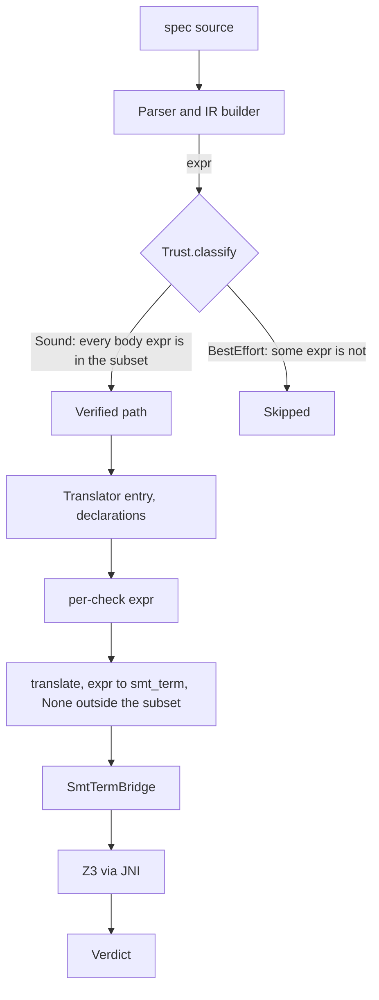

This page enumerates the trusted computing base (TCB) for `spec-to-rest verify`, the set of
components whose correctness must be assumed for the verifier's verdicts to mean what they claim.
Anything in the TCB is not something the soundness theorem proves; the rest of the system is either
machine-verified or out of the soundness scope. It exists because issue
[#192](https://github.com/HardMax71/spec_to_rest/issues/192) asked for the TCB to be documented and
audited in one place rather than scattered across research notes.

## Verdict semantics

`verify` issues one verdict per check:

- `sat`, the check holds: Z3 found no counterexample within the timeout.
- `unsat`, the check fails: Z3 (or Alloy) produced a model violating the property.
- `unknown`, Z3 timed out or hit incompleteness; the result is indeterminate.
- `skipped`, the check was not run; the diagnostic says why.

Each verdict carries a trust tag in the JSON report. `trust: "sound"` means the check ran end to end
through the extracted, Isabelle-verified translator, so a `sat` or `unsat` is backed by the soundness
theorem (modulo the TCB below). `trust: "best-effort"` would mean the check body fell outside the
verified subset; since #192 such checks always skip with `category=soundness_limitation` rather than
producing a verdict. The practical guarantee is that every non-skipped Z3 verdict is `trust=sound`.

## The verify pipeline, layer by layer



Each layer's correctness obligation:

| Layer | Component | Status |
| ----- | --------- | ------ |
| Parse | `modules/parser/.../Parser.scala`, `Builder.scala` | trusted, hand-written; build errors surface as exit 1 |
| Classifier | `Trust.classify` | trusted, hand-written, but only decides which path runs; a classification error causes a spurious skip, not unsoundness |
| `translate` (verified) | extracted from `semantics/Translate.thy` via `Code_Target_Scala`, in `SpecRestGenerated.scala` | verified; this is the function the soundness theorem talks about; returns `None` for shapes outside the subset |
| `Code_Target_Scala` extraction | Isabelle stock tool | trusted, production-grade but not formally verified end to end |
| Z3 entrypoint | `modules/verify/.../z3/Translator.scala` | trusted, hand-written; a small public API that declares context and dispatches checks |
| Checked / declaration boundary | `z3/ExpressionEncoder.scala` (`translateCheckedExpr`, `translateDeclarationExpr`) | trusted; check bodies use the extracted translator only, declaration refinements may use the fallback |
| `SmtTermBridge` | `z3/SmtTermBridge.scala` (`encodeFromSmtTerm`) | trusted, hand-written; converts extracted `smt_term` values to `Z3Expr` |
| Declaration fallback | `z3/ExpressionEncoder.scala` (`translateDeclarationExprRaw`) | trusted but bypassed for sound checks; only for declaration-level expressions like field constraints and `where` clauses |
| Sort inference, Z3 declaration management, set monomorphization, Skolem allocation, span threading | `TranslationContext`, `Z3EncodingSupport`, `Declarations`, `RelationFrames`, `SmtTermBridge` | trusted, outside the soundness statement; runs around the bridge |
| Z3 solver (`com.microsoft.z3`) | external | trusted, incomplete on quantifiers, nonlinear arithmetic, and theory combinations; `unsat` is sound, `sat`/`unknown` can be solver artifacts |
| Counterexample decoder | `z3/CounterExample.scala` | trusted, hand-written, outside soundness |
| Alloy backend | `modules/verify/.../alloy/*` | trusted, a separate bounded-model-checking story, not routed through the extracted translator |

## What "verified" means

The soundness theorem (`translate_soundness_standalone`, in `soundness/DirectSound.thy`) is meaning
preservation, conditional on translation succeeding:

```text
theorem translate_soundness_standalone:
  assumes "eval fs ps fuel s st env e = Some v"
      and "translate enums e = Some t"
      ...
  shows "smtEval (correlate_model s st) (correlate_env env) t = Some (value_to_smt v)"
```

For any expression the reference evaluator reduces to a value, the SMT term `translate` produces
evaluates to the SMT encoding of that value. A companion theorem,
`cat_h_progress_and_preservation_direct` in `soundness/DirectPreservation.thy`, adds that a well-typed
expression always translates. Both close with zero `sorry`, checked by building the `SpecRest_Soundness`
session in CI. What the theorem does not claim: nothing about Z3's own evaluation (the bridge converts
`smt_term` to `Z3Expr` and Z3 takes over, so Z3 is in the TCB); nothing about shapes outside the
subset (`translate` returns `None` and the check skips); nothing about declaration-level expressions, which
still run through the hand-written path; and nothing about the parser, builder, or sort inference,
whose errors set the meaning of a failure even though they are not what soundness is about.

## What changed at #192

Before #192 the hand-written translator ran end to end for every check (around 1900 lines in the old
single-file implementation), and although the soundness theorem existed, only the round-trip oracle
exercised the verified path, on too few probes to call the production path verified. After #192 the
declaration fallback is isolated behind `translateDeclarationExpr`, check bodies call
`translateCheckedExpr` with no Scala fallback, and check-body translation routes through the verified
`translate` plus the bridge. The only new piece of TCB is the bridge itself, which is
small, syntax-directed, and structurally constrained: each `smt_term` constructor maps to one or two
`Z3Expr` shapes with sort checks at the boundary. Everything else in the trust closure shrank or
stayed the same; best-effort checks no longer produce a verdict at all, they skip.

## Where the bridge sits outside the theorem

A few corners of the bridge handle distinctions the verified `smt_term` ADT does not make, and a
reviewer auditing the TCB should know they sit outside the theorem's reach:

- `TInDom(name, _)` over a set-typed state constant: the verified semantics expects a relation, and a
  set constant is treated as set membership. Sound under the well-typed-IR assumption, not backed by
  the theorem.
- `TForallRel(v, name, _)` where `name` is a set-typed constant or operation input: the bridge emits a
  membership-guarded quantifier, or for genuinely unknown sorts an unconstrained one.
- Sort checks on `TSetMember`, `TSetUnion`, `TSetIntersect`, `TSetDiff`: the bridge reproduces the
  hand-written translator's sort-mismatch diagnostics so an ill-typed spec fails at translation rather
  than at solve time.

## What is permanently out of scope

Some shapes will not, on any reasonable horizon, enter the verified subset: the powerset operator
(undecidable in first-order SMT), arbitrary higher-order lambdas, and user-defined function bodies of
arbitrary shape (per-spec inlining extends soundness to specific bodies but cannot anticipate every
shape an author writes). Those route through the hand-written path when a spec uses them and surface
as a `soundness_limitation` skip. Note that several constructs once listed here as permanently out,
regex matching through `matches` and sum aggregates among them, were since lifted into the verified
subset by the construct-lift campaign, so this list is the genuinely-undecidable residue, not a
freeze on coverage.

## Where to look

| Concern | Path |
| ------- | ---- |
| Verified subset ADT | `proofs/isabelle/SpecRest/core/IR.thy` |
| Verified semantics | `proofs/isabelle/SpecRest/semantics/Semantics.thy`, `semantics/Smt.thy` |
| Verified translation | `proofs/isabelle/SpecRest/semantics/Translate.thy` |
| Soundness theorem | `proofs/isabelle/SpecRest/soundness/DirectSound.thy`, `soundness/DirectPreservation.thy` |
| Code extraction | `proofs/isabelle/SpecRest/codegen/Codegen.thy` |
| Generated Scala | `modules/ir/src/main/scala/specrest/ir/generated/SpecRestGenerated.scala` |
| Z3 entrypoint and bridge | `modules/verify/src/main/scala/specrest/verify/z3/Translator.scala`, `z3/SmtTermBridge.scala` |
| Trust classifier | `modules/verify/src/main/scala/specrest/verify/Trust.scala` |
| CI gate for Isabelle | `.github/workflows/isabelle-build.yml` |

## The user-facing contract

A `sat` for a `trust=sound` check is formally backed: the universal soundness theorem (zero `sorry`),
the bridge, and Z3 jointly assert the property holds in every model the spec admits, modulo the TCB
above. An `unsat` for a `trust=sound` check comes with a counterexample decoded from Z3 that is a
witness in a model the verified semantics also admits. A `skipped` check with
`category=soundness_limitation` uses constructs outside the verified subset: narrow the spec or extend
the subset. There is no path that produces a `trust=best-effort` verdict; that mode, present through
#205, was retired in #192 in favor of explicit skipping.
