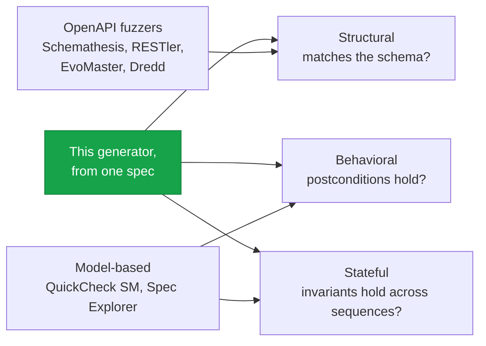

Plenty of tools generate API tests; what sets this one apart is the span. It is the only approach
that derives structural, behavioral, and stateful checks from a single formal spec.

| Approach                 | Structural         | Behavioral                  | Stateful                    | From a spec        | Auto-generated | Shrinks |
| ------------------------ | ------------------ | --------------------------- | --------------------------- | ------------------ | -------------- | ------- |
| This generator           | yes (Schemathesis) | yes (Hypothesis properties) | yes (Hypothesis state machine) | yes             | yes            | yes     |
| Schemathesis alone       | yes                | no                          | links only                  | OpenAPI only       | yes            | partial |
| RESTler                  | partial            | no                          | fuzzing                     | OpenAPI only       | yes            | no      |
| EvoMaster                | yes                | no                          | evolutionary                | OpenAPI only       | yes            | no      |
| Dredd                    | yes                | no                          | no                          | OpenAPI only       | yes            | no      |
| Pact                     | no                 | contracts                   | no                          | consumer-driven    | partial        | no      |
| QuickCheck state machine | no                 | yes                         | yes                         | hand-written model | no             | yes     |
| Spec Explorer            | no                 | yes                         | yes                         | C# model           | yes            | no      |
| Hand-written             | varies             | varies                      | varies                      | no                 | no             | no      |

## What the others miss

The OpenAPI fuzzers, Schemathesis, RESTler, EvoMaster, and the archived Dredd, all drive the API from
its OpenAPI surface and check that responses do not crash and match the declared schema. None of them
has a behavioral oracle: they cannot tell whether the returned short code was actually fresh, or
whether an invariant still holds, because nothing in OpenAPI says so. That is the gap this generator
fills, the `ensures`-derived assertions and the post-step invariant checks. EvoMaster is the
interesting case, complementary rather than competing: its evolutionary search is good at finding
inputs that reach deep code paths, and those inputs still need an oracle to judge the outputs, which
is exactly what the spec supplies.

Pact sits in a different quadrant. It is consumer-driven: a consumer writes the contract it expects,
and Pact checks the provider honors it. That is useful at integration boundaries, but it tests
expectations, not the service's own invariants, and the contract comes from a consumer rather than the
authoritative spec.

The closest conceptual match is model-based testing. QuickCheck-style state-machine testing (used to
great effect at Ericsson and Volvo) and Microsoft's Spec Explorer both drive sequences of operations
against a model and check the result, which is precisely the stateful layer here. The difference is
where the model comes from and what surrounds it. QuickCheck's model is hand-written in Erlang or
Haskell; Spec Explorer's was a C# program tied to a Visual Studio tool that is no longer maintained;
neither is REST-aware or does structural testing. This generator derives the state-machine model from
the spec, wires it to an HTTP client, and runs the structural layer alongside it.

## The coverage spectrum

The fuzzers cover the structural floor; the model-based tools cover behavior and state but skip the
structural surface; this generator is the only one that reaches all three from one source.

## What this cannot do

The honesty is in the limits. Because every test derives from the spec, an unstated requirement has no
test, so domain edge cases the spec does not mention still want hand-written coverage. Performance and
latency go untested, the spec does not declare them, and a load tool like k6 or Locust is the right
instrument. Concurrency is the sharper gap: the stateful layer drives operations in sequence, so it
will not surface a race between two interleaved requests, and catching those would need a model
checker like TLA+, which is out of scope here rather than part of the generated suite. The spec
describes one service's API, so the UI and third-party integrations fall outside it, mock external
dependencies in fixtures. And the suite runs against a live service rather than in-process, which
makes it slower than unit tests; the conformance runner takes a `smoke` profile for fast local
feedback and a fuller profile for release gates.
