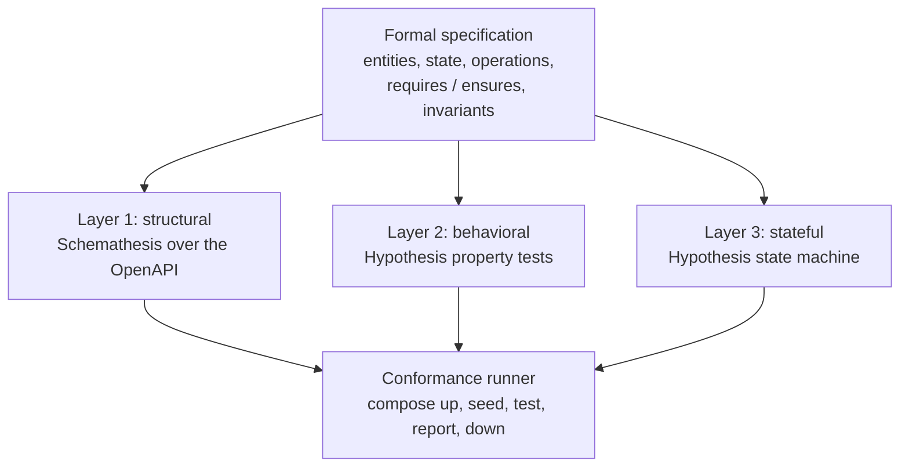

A spec gives three different things to check, so the generator emits three layers of tests, each
aimed at a class of defect the others miss. Together they carry conformance from "the API has the
right shape" to "the API keeps its contract across a run."

The structural layer comes first because it is the cheapest signal. Schemathesis fuzzes the generated
OpenAPI surface, throwing malformed and boundary inputs at every endpoint and checking that the
response is a declared status with a schema-valid body. It proves the API has the right shape, not
the right values. The behavioral layer takes that on: from each operation's `requires` and `ensures`
it builds Hypothesis property tests that drive one operation and assert its postcondition, so a single
call is held to its contract. What that still cannot see is a sequence of calls drifting off the
invariants, and the stateful layer is the sequence test, a Hypothesis state machine that drives
operation orderings against a model of the spec's state and checks the global invariants after each
step. Each layer is aimed at exactly what the one before it cannot reach.

The three layers hold for every target; only the tools change, Schemathesis and Hypothesis on Python,
Vitest and fast-check on TypeScript, `go test` and rapid on Go. The exact files each layer emits, and
the conformance runner that stands the service up and runs them, are on the
[test-generation pipeline](/pipelines/test-generation) page.

| Layer                               | Catches                                                                  | Misses                                              |
| ----------------------------------- | ------------------------------------------------------------------------ | --------------------------------------------------- |
| Structural (Schemathesis)           | wrong status codes, missing endpoints, schema mismatches, uncaught 500s  | correct-shaped but wrong-valued responses; cross-call invariant drift |
| Behavioral (Hypothesis properties)  | single-operation postcondition failures, precondition bypass             | multi-step invariant drift, state corruption across sequences |
| Stateful (Hypothesis state machine) | multi-step invariant violations, illegal transitions, ordering-dependent bugs | performance and concurrency issues             |
