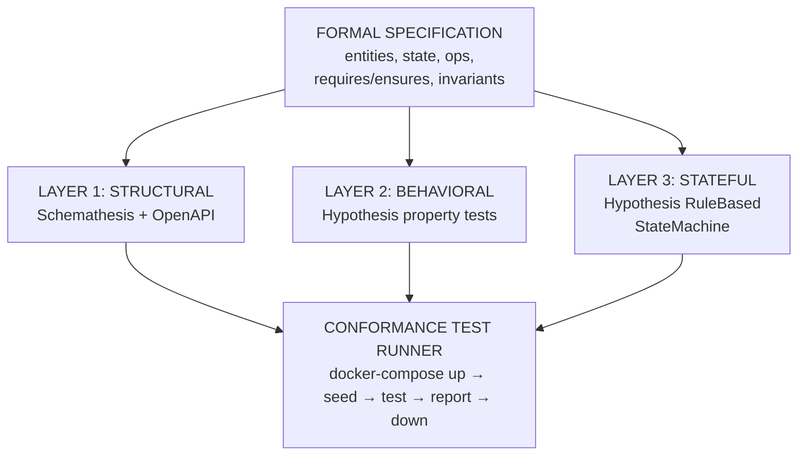

## 1. Architecture overview

The test generation pipeline produces three complementary test layers from a single formal
specification. Each layer catches a different class of defects, and together they provide end-to-end
conformance checking between the spec and the running service.

### What each layer catches

| Layer                               | Catches                                                                                                          | Misses                                                                       |
| ----------------------------------- | ---------------------------------------------------------------------------------------------------------------- | ---------------------------------------------------------------------------- |
| Structural (Schemathesis)           | Wrong status codes, missing endpoints, schema mismatches, 500 errors, content-type violations                    | Correct-shaped but wrong-valued responses, invariant violations across calls |
| Behavioral (Hypothesis properties)  | Single-operation postcondition failures, precondition bypass, wrong return values                                | Multi-step invariant drift, state corruption across operation sequences      |
| Stateful (Hypothesis state machine) | Multi-step invariant violations, illegal state transitions, resource lifecycle bugs, ordering-dependent failures | Performance issues, concurrency bugs (unless parallel testing is added)      |
