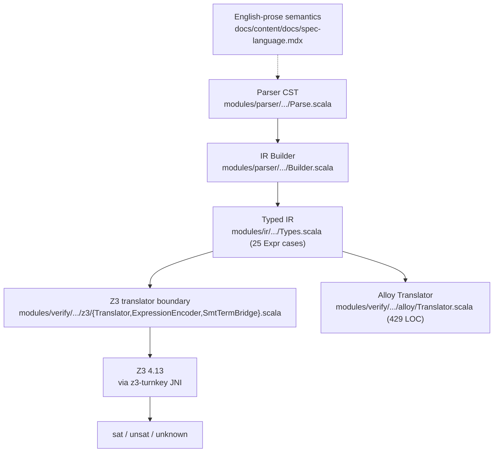

## 1. Status and framing

Issue #88 asks for a mechanically checked correctness proof of spec_to_rest's
`spec → IR → Z3` verification path. The issue itself flags this as **unscheduled,
research-flavored, easily one person-year of work**, filed primarily to give the
capability a concrete home so it isn't absorbed into other milestones.

This doc updates that framing for 2026:

- The Z3-proof-replay path that #77 partly assumed has not materialized. Z3
  4.13 (the version this project pins via `z3-turnkey`) emits only its undocumented
  2008-era natural-deduction term tree; `:proof_format alethe` was never shipped in
  any Z3 release, and quantifier instantiations remain opaque (see §3).
- The closest published prior art (Cohen, Princeton PhD, 2025) is a 5-person-year
  effort that verifies five Why3 IVL transformations in Coq, and even Cohen left
  monomorphization, the SMT-LIB printer, and end-to-end SMT soundness in the trusted
  computing base (TCB).
- A cheaper, more recent template exists: per-run *translation validation* à la
  Parthasarathy et al. (PLDI 2024 / POPL 2025) emits an Isabelle proof certificate
  *for each verifier run* showing "if the IVL output is correct then the source is
  correct." This is the realistic 2026 path for a project our size.

The recommendation in this doc is therefore: **decompose #88 into a tractable
five-milestone plan (M_L.0 → M_L.4) that ships translation validation first, then
moves toward meta-soundness only for the verified subset (§6) once a contributor
signs up for the M_L.2 commitment**.

As of `M_G.0`, the first honest theorem target is the in-memory
`ServiceIR → Z3Script` path used by `Consistency.runConsistencyChecks`, rather than the
optional `SmtLib.scala` exporter. The exporter stays outside the first ship claim
until a later milestone.

**Status: execution track shipped.** `M_G.3` committed the runway, `M_G.4` activated
`M_L.*`, and the post-pivot Isabelle/HOL track delivered through Phase 7
(see [`STATUS.md`](https://github.com/HardMax71/spec_to_rest/blob/main/proofs/isabelle/STATUS.md)).
Issue [#88](https://github.com/HardMax71/spec_to_rest/issues/88) closed 2026-04-26 with
all M_L sub-issues ([#126](https://github.com/HardMax71/spec_to_rest/issues/126)-[#130](https://github.com/HardMax71/spec_to_rest/issues/130))
resolved. The universal `soundness` theorem closes with zero `sorry`,
`Code_Target_Scala` produces the production translator at
`modules/ir/src/main/scala/specrest/ir/generated/SpecRestGenerated.scala`, and the
`A8RoundTripOracleTest` exercises every in-subset shape end-to-end. Per-run
certificate emission was deleted post-pivot (vestigial after universal soundness,
Option 2 of #193 review).

## 2. The trust chain today

Today, "we proved this spec correct" is shorthand for the following chain:

Each link is a potential silent-failure point:

| Link | Failure mode |
|---|---|
| Prose semantics → IR | Spec language has only English-prose semantics; nothing to refine the IR builder against. |
| IR builder | Hand-written; tested via fixtures, rather than proven. |
| Z3 Translator | 1917 LOC of Scala. 13 of 25 `Expr` cases are fully translated, 8 partial, 4 raise `TranslatorError`. The encoding choices for entities (uninterpreted sort + field functions), state (pre/post functions), and quantifier domains are defensible but unverified (see [codebase-analysis appendix below](#a-codebase-translator-coverage-april-2026)). |
| Z3 itself | Has had soundness CVEs historically. Pinning at 4.13 deters silent verdict flips on upgrade but does not eliminate the trust assumption. |

Mechanically verifying *every* link is far beyond a project our size. The smallest
useful target is the **IR → Z3 step**: it's the largest hand-written piece, the one
whose semantic behaviour we control, and the one closest to user-visible verdicts.

## 3. Why "reconstruct Z3 proofs" does not work in 2026

Issue #77 (closed) sketched a "verify-as-gate" path that gestured at proof export and
Alethe-via-Z3 as a future direction. Research as of April 2026 says that path is
blocked at the Z3 side:

### 3.1 Z3 has no alethe export

Direct search of the Z3 [release notes](https://github.com/Z3Prover/z3/blob/master/RELEASE_NOTES.md)
finds no mention of "alethe" in any release. Issue search `alethe repo:Z3Prover/z3`
returns zero results. The release notes mention only:

- 4.11.2: *"change proof logging format for the new core to use SMTLIB commands. The
  format was so far an extension of DRAT used by SAT solvers"*
- 4.12.0: *"sat.smt.proof.check_rup ... apply forward RUP proof checking"*

Z3 4.13 (the version pinned by `z3-turnkey % 4.13.0.1` in `build.sbt`) emits only its
undocumented [IWIL 2008 natural-deduction proof](https://ceur-ws.org/Vol-418/paper10.pdf)
format. Quantifier instantiation steps (`quant-inst`) appear with no machine-readable
witness justification, the very steps that dominate spec_to_rest's preservation
checks (5 invariants × 10 ops = 50 quantifier scopes per service).

### 3.2 cvc5-Alethe does not cover datatypes

The cvc5 [Alethe documentation](https://cvc5.github.io/docs/latest/proofs/output_alethe.html)
says verbatim:

> Currently, the theories of equality with uninterpreted functions, linear
> arithmetic, bit-vectors and parts of the theory of strings (with or without
> quantifiers) are supported in cvc5's Alethe proofs.

Datatypes are not in this list. spec_to_rest's IR translator emits
`declare-datatypes` for entity records, sums, and option types (see
[codebase analysis](#a-codebase-translator-coverage-april-2026)). A cvc5-as-proof-certifier
backend therefore requires re-engineering the SMT encoding to be datatype-free
(records as parallel UF arrays, sums as tag+payload via UF), a non-trivial rewrite,
not a flag flip.

### 3.3 Quantifier-instantiation proof bloat

E-matching with non-trivial trigger sets routinely yields 10³-10⁵ ground instances
per quantifier (see [Reynolds, SMT 2023](http://homepage.divms.uiowa.edu/~ajreynol/smt2023.pdf)
and [DSLab "Conjecture Regarding SMT Instability"](https://ceur-ws.org/Vol-4008/SMT_paper21.pdf)).
For a typical preservation suite, expect Alethe proof files in the tens to hundreds
of MB, with [Carcara](https://github.com/ufmg-smite/carcara) check times in minutes.
This is workable for one-off audits, prohibitive for CI-on-every-PR.

### 3.4 What this means

The "Z3 emits a checkable proof + Carcara/ITP replays it" architecture from #77 is
not viable in 2026. Three implications:

1. Translator soundness must be proven as a meta-theorem about our `translate`
   function, rather than by replaying each Z3 run's proof.
2. The Z3 verdict remains an oracle in our trust base. This is the same posture
   as F\*, Dafny, Verus, and Why3-O, none of them check Z3 proofs; they verify the
   *encoder*.
3. An "external solver agreement" CI job is still useful as cheap defense in
   depth: emit our SMT-LIB, run cvc5 in parallel, alert on disagreement. Doesn't need
   proof export. Belongs in #77 follow-up, rather than here.

## 7. Picking a proof assistant

### 7.1 Three candidates compared

| Criterion | Lean 4 + mathlib4 | Isabelle/HOL + AFP | Coq/Rocq |
|---|---|---|---|
| Z3 reconstruction available? | No (lean-smt is cvc5-only) | No (Sledgehammer Z3 is legacy; ITP 2025 work targets cvc5/veriT) | No (SMTCoq targets veriT/cvc5) |
| Closest prior-art language | AliveInLean (LLVM peepholes) | TLA\*, Z, Object-Z, Cohen's framework if ported | Cohen's Why3-O (the Coq variant) |
| Toolchain churn | Quarterly (Lean 4.27→4.28→4.29→4.30 in 14 weeks Feb-Apr 2026) | Yearly Isabelle releases; AFP push-through | Yearly Coq → Rocq transition; stable post-2025 |
| Long-lived single-author projects | Few (ecosystem &lt;5 years) | CryptHOL (9 yrs), TLA\* (14 yrs), HOL-Z (25 yrs) | CompCert (20 yrs) |
| Scala-team learning curve | Lowest (most syntactically similar to Scala 3) | Medium (Isar prose-style proofs unfamiliar) | Medium-high (tactic style, ssreflect) |
| Mathlib4 record / Finset support | Excellent (`structure`, `Finset α`, decidability) | Excellent (`record`, `Set`, fset library) | Good (`Record`, `MSet`, but more boilerplate) |
| Risk of mathlib churn breaking proofs | High | Low (definitional shallow embeddings rarely break) | Low |

### 7.2 Decision: Isabelle/HOL (post-#193 pivot)

**Active proof assistant: Isabelle/HOL** (Isabelle2025-2). The original recommendation
was Lean 4 (see §7.4 historical note); the project pivoted to Isabelle/HOL on
2026-05-04 after the M_L.0-M_L.5 first-ship gate landed. Tracking issue:
[#193](https://github.com/HardMax71/spec_to_rest/issues/193).

**Why Isabelle won the rematch**:

1. Production-grade Scala extraction: `Code_Target_Scala` (in HOL-Library)
   ships Lean's missing piece. The verified `translate`, `eval`, and `smt_eval`
   functions extract directly to ~1.4 kLoC of idiomatic Scala 3. The Scala
   layer's translator is no longer hand-written, it is the extracted Isabelle
   definition.
2. Toolchain stability: Isabelle releases yearly with AFP push-through
   migration. Lean 4 ran 4.27 → 4.30 in 14 weeks Feb-Apr 2026, quarterly churn
   is expensive at single-author scale.
3. Stronger automation on the proof side: the universal soundness theorem
   closes in ~600 LoC of Isabelle (`apply (cases ...; auto)` + per-case `*_step`
   lemmas) vs ~5400 LoC of Lean's case-bashing.
4. Cleaner TCB: Isabelle kernel + Z3 driver + extracted-Scala output. No
   `Lean.ofReduceBool` axiom, no `cert_decide` per-run native compilation.

**Active configuration**:

- `lean-toolchain` retired; `proofs/isabelle/SpecRest/lean-toolchain` doesn't
  exist. Isabelle pin lives at the host level (Isabelle2025-2 installed via
  the system's `isabelle` binary).
- No mathlib analog: imports are restricted to `Main` + `HOL-Library`. AFP
  entries are only imported when load-bearing (none currently).
- Records use `[code]`-marked `defs` to bypass the polymorphic-scheme codegen
  barrier observed during Phase 5 of #193.

### 7.4 Historical: Lean 4 was the original choice

The pre-pivot recommendation cited Lean 4's smallest learning-curve gap from
Scala 3 and the AliveInLean precedent. Both arguments still hold; they were
outweighed by the lack of a production Scala extractor in Lean's ecosystem
and the quarterly toolchain churn. The Lean track at `proofs/lean/` was
retired with the pivot, see [#193](https://github.com/HardMax71/spec_to_rest/issues/193)
for the full decision record and [#202](https://github.com/HardMax71/spec_to_rest/issues/202)
for the related (deferred) IR-canonicalization follow-up.

### 7.3 Embedding shape (locked across all three candidates)

- Source IR (`Expr`, `TypeExpr`, declarations): deep embedding as inductive
  types mirroring `modules/ir/.../Types.scala` 1:1. Required because the soundness
  theorem `∀ e. denote(translate(e)) = eval(e)` quantifies over `e` syntactically.
- Semantic domain: shallow. `Int → Lean Int`, `Bool → Lean Bool`, `Set α →
  Mathlib Finset α` (or core `List` if we sidestep mathlib), entity sorts as opaque
  type variables.
- SMT-LIB target: shallow. Interpret SMT terms directly as `Prop`,
  no need for meta-reasoning over SMT syntax, only over IR syntax.

This is the standard hybrid Why3-in-Coq, AliveInLean, and Concrete Semantics IMP
all use ([Gibbons & Wu](https://www.cs.ox.ac.uk/jeremy.gibbons/publications/embedding.pdf);
[Annenkov & Spitters](https://cs.au.dk/~spitters/TYPES19.pdf)).
