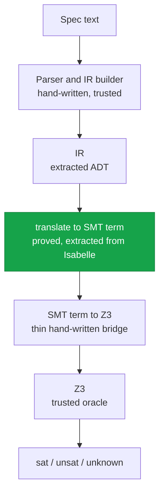

The claim behind "we proved this spec correct" rests on one mechanized theorem: the function that
translates the IR into SMT means the same thing the reference semantics does. It is proved in
Isabelle/HOL with zero `sorry`, and `Code_Target_Scala` extracts the proved `translate` straight into
[`SpecRestGenerated.scala`](https://github.com/HardMax71/spec_to_rest/blob/main/modules/ir/src/main/scala/specrest/ir/generated/SpecRestGenerated.scala),
so the translator the compiler runs is not a hand-written approximation of the proof. It is the proof.

## What the theorem says

Two results carry the weight, both in
[`soundness/`](https://github.com/HardMax71/spec_to_rest/tree/main/proofs/isabelle/SpecRest/soundness).
`translate_soundness_standalone` is meaning preservation: whenever the reference evaluator `eval`
reduces an expression `e` to a value `v`, the SMT term that `translate` produces evaluates, under
`smtEval`, to the SMT encoding of that same `v`.

```text
theorem translate_soundness_standalone:
  assumes "eval fs ps fuel s st env e = Some v"
      and "translate enums e = Some t"
      ...
  shows "smtEval (correlate_model s st) (correlate_env env) t = Some (value_to_smt v)"
```

`cat_h_progress_and_preservation_direct` is the companion: a well-typed expression always translates
(`translate` returns `Some`, never failing on a typed input), and evaluation preserves its type. Put
together, they say `translate` cannot quietly change a spec's meaning or refuse a well-typed one, so
when Z3 returns `unsat` the property holds under the reference semantics as well.

## The trust chain

That theorem shrinks what has to be trusted. The path from spec text to verdict:



The green step is the one that matters. The largest and most delicate piece, an expression-to-SMT
translator that used to be around two thousand hand-written lines with partial coverage, is now the
extracted proved definition. What stays in the trusted base is small and mechanical: the parser and
IR builder, the thin bridge that hands the verified SMT term to Z3's Java API, and Z3 itself.

## Why prove the translator, not replay Z3

The tempting alternative is to make Z3 emit a proof of each verdict and check it, leaving nothing
trusted. In 2026 that does not work. Z3 4.13, the pinned version, emits only its undocumented
2008-era proof tree, and its quantifier-instantiation steps carry no machine-checkable witness, the
very steps that dominate a preservation suite (roughly fifty quantifier scopes for five invariants
across ten operations). cvc5's Alethe export, the closest checkable format, does not cover datatypes,
which the encoding leans on. And e-matching routinely produces tens of thousands of ground instances
per quantifier, so the proof files run to hundreds of megabytes, fine for a one-off audit and
prohibitive on every push.

So the Z3 verdict stays an oracle, and the proof obligation moves to the encoder: prove `translate`
sound once, as a meta-theorem, rather than re-checking Z3 on every run. That is the posture F\*,
Dafny, Verus, and Why3 all take. None of them check Z3's proofs; they verify the translation into the
solver.

## Why Isabelle

The proof track started in Lean 4, for its closeness to Scala syntax, and pivoted to Isabelle/HOL in
2026 ([#193](https://github.com/HardMax71/spec_to_rest/issues/193)). The deciding factor was
extraction. Isabelle's `Code_Target_Scala` turns the verified `translate` and `smtEval` into idiomatic
Scala 3 directly, which is the whole point, the production translator becomes the proved definition
instead of a hand-written sibling that could drift, and Lean had no production Scala extractor. Two
smaller reasons reinforced it: Isabelle releases yearly with migration support where Lean churned
through four toolchain versions in fourteen weeks, and the universal theorem closes in roughly six
hundred lines of Isabelle against several thousand of Lean case-bashing. The trusted base ends up as
the Isabelle kernel, the Z3 driver, and the extracted Scala, with no per-run native-compilation axiom.
