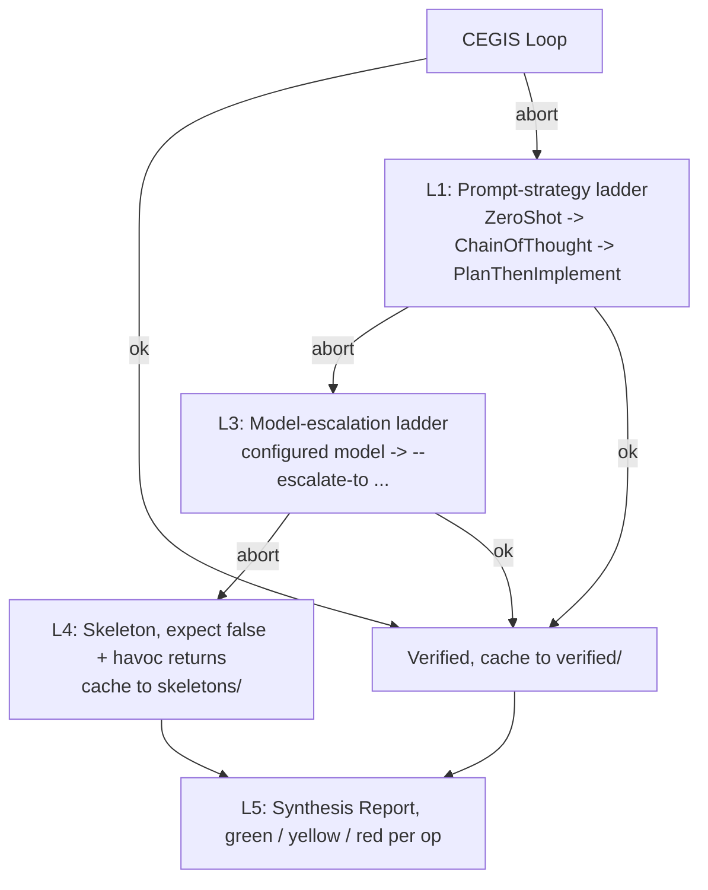

## `compile --with-synthesis` (M6.5)

When every `LLM_SYNTHESIS` operation has been verified at least once
(`synth verify` populated `.spec-to-rest/synth-cache/verified/`), running
`compile --with-synthesis` integrates the verified bodies into the emitted
project:

```bash
sbt "cli/run synth verify fixtures/spec/url_shortener.spec --operation Shorten"
sbt "cli/run synth verify fixtures/spec/url_shortener.spec --operation Resolve"
sbt "cli/run synth verify fixtures/spec/url_shortener.spec --operation ListAll"
sbt "cli/run compile fixtures/spec/url_shortener.spec \
       --framework fastapi --db postgres --out /tmp/out --with-synthesis"
```

Pipeline:

1. Look up each `LLM_SYNTHESIS` operation's verified body in the cache. The
   key is `(signature, requires, ensures, modifies, model, temperature,
   SynthPromptVersion)`. `--synthesis-model` and `--synthesis-temperature`
   default to `claude-sonnet-4-6 / 1.0`; pass them explicitly if the body
   was verified with a different combination.
2. Multi-method splice every cached body into one fresh `.dfy` file using
   the convention engine's deterministic skeleton.
3. Invoke `dafny translate py --include-runtime --no-verify --output=...` and
   capture every file the back-end emits. The `_dafny` runtime is bundled
   in-tree, generated `pyproject.toml` does not pull a PyPI runtime.
4. Lay the captured files under `<out>/app/dafny_kernel/` and emit a
   companion `app/services/_dafny_adapter.py` with boundary helpers
   (`make_state`, `to_dafny_seq`, `from_dafny_map`, ...).
5. The entity service template now branches on each operation's
   `dafnyMethod`: when set, the handler hydrates a fresh `ServiceState`,
   calls `app.dafny_kernel.module_.default__.<Op>(state, ...)`, and returns
   the result. The previous `NotImplementedError` placeholder is preserved
   for operations with no cached body.

Hard failure modes:

| Condition | Exit code | Message |
|---|---|---|
| `--with-synthesis` set but `verified/` directory missing | 1 | "no verified-body cache at ...; run `synth verify` for each LLM_SYNTHESIS op first" |
| Cache exists but a specific op is missing | 1 | "no verified body cached for '$Op' (model=..., temp=...). Run: cli/run synth verify ... --operation $Op --model ..." |
| `dafny` not on PATH (or `--dafny-bin` invalid) | 3 | "`dafny --version` failed ..." |
| `dafny translate` exits non-zero | 3 | "dafny translate py failed: $stderr" |

Persistence is intentionally out of scope here. The kernel `ServiceState`
is held per-request by `make_state()`; bridging it to SQLAlchemy / Postgres
on a `commit` boundary is tracked as a follow-up issue.

## Graduated fallback (M6.6)

When CEGIS aborts on its first attempt, M6.6's `FallbackOrchestrator`
escalates along two axes before giving up: prompt strategy (`ZeroShot` $\to$
`ChainOfThought` $\to$ `PlanThenImplement`) and model (configured model $\to$
each `--escalate-to MODEL`, in order). All attempts share one budget
envelope (`sharedCostCapUsd`, default \$1.00). When every attempt fails,
the orchestrator emits a labelled fallback skeleton: a Dafny body with
`expect false, "FALLBACK SKELETON [op=...]: not verified..."` plus
havoc-assigned (`out := *;`) return params. The skeleton translates cleanly
to Python under `dafny translate --no-verify` and halts at runtime with
`_dafny.HaltException` carrying the strategy/model/reason payload.



L2 (operation decomposition) is intentionally not in M6.6; it is a
research-grade problem and tracked separately.

### `synth verify --fallback`

```bash
ANTHROPIC_API_KEY=sk-ant-... DAFNY_BIN=/usr/local/bin/dafny \
  sbt "cli/run synth verify fixtures/spec/url_shortener.spec \
       --operation Shorten --fallback --escalate-to claude-opus-4-7"
```

<TypeTable
  type={{
    '--fallback': {
      description: 'Enable the orchestrator. Without it, `synth verify` is strict CEGIS as before.',
      type: 'flag',
      default: 'off',
    },
    '--escalate-to MODEL': {
      description: 'Repeat for a multi-step ladder (e.g. `--escalate-to opus --escalate-to gpt-5`).',
      type: 'string',
      default: '_empty_',
    },
  }}
/>

Stdout is the verified body OR the labelled skeleton (one Dafny block,
splice-ready). Stderr summary line example:

```text
[synth-verify] op=Shorten VERIFIED-ESCALATED attempts=2 strategy=ChainOfThought model=claude-opus-4-7 iter=1
```

or

```text
[synth-verify] op=Shorten SKELETON attempts=4 reason=stuck on postcondition_violation
```

Verified bodies persist to `synth-cache/verified/` exactly like strict
CEGIS. Fallback skeletons persist to `synth-cache/skeletons/` (separate
namespace; the two never mix).

### `synth verify-all`

Runs the orchestrator across every `LLM_SYNTHESIS` operation in the spec
and prints a synthesis report to stderr.

```bash
sbt "cli/run synth verify-all fixtures/spec/url_shortener.spec \
       --escalate-to claude-opus-4-7"
```

```text
Synthesis Report
  Operation                  Verdict              Strategy          Model                   iter   $cost
  ------------------------------------------------------------------------------------------------
  Shorten                    VERIFIED             ZeroShot          claude-sonnet-4-6          1  $0.0023
  Resolve                    VERIFIED-ESCALATED   ChainOfThought    claude-opus-4-7            2  $0.0510
  ListAll                    SKELETON             PlanThenImplement claude-opus-4-7            0  $0.1010
  ------------------------------------------------------------------------------------------------
  total=3 verified=1 escalated=1 skeleton=1  cost=$0.1543  in=2100tok out=4200tok
```

Exit codes: `0` if every op verified or escalated successfully (no
skeletons); `1` if any op fell back to a skeleton; the report prints
either way so partial progress is visible.

### `compile --with-synthesis --allow-skeletons`

Default `compile --with-synthesis` is unchanged: strict cache-only,
hard-error on miss in `verified/`. The new opt-in `--allow-skeletons`
flag relaxes the gate: when a verified body is missing, the compiler
falls back to `synth-cache/skeletons/<key>.json` if present, emits a
warning per op, and proceeds. The kernel files translate identically
(skeleton bodies are well-typed Dafny under `--no-verify`); only at
runtime does the handler raise `_dafny.HaltException` from inside the
kernel call.

```bash
sbt "cli/run compile fixtures/spec/url_shortener.spec \
       --framework fastapi --db postgres --out /tmp/out \
       --with-synthesis --allow-skeletons"
```

This is intended as a "ship a partially-verified service for testing,
finish the proofs later" workflow. The HaltException payload includes
the operation name, the final attempted strategy/model, and the abort
reason: enough to point a developer at what to fix.

## Hint-Augmentation (M6.7)

DafnyPro (POPL 2026) reports +16pp on the single-function DafnyBench
with Claude Sonnet 3.5, and that figure is for the full three-part
system (diff-checker, pruner, and hint-augmentation). The paper's
ablation credits about +10pp of it to hint-augmentation alone: a
curated repository of verified Dafny proof patterns retrieved by error
category and injected into the repair prompt. M6.7 ships that
hint-augmentation slice, since the project already had the diff-checker
(M6.4) and the pruner, as the chosen direction after the L2 /
decomposition path was closed under the 2025-2026 evidence summarised in
[research/12](/research/compositional_synthesis_findings).

### `HintLibrary`

`modules/synth/src/main/scala/specrest/synth/HintLibrary.scala` exposes
12 hand-curated Dafny snippets indexed by `VerifierError.category`:

| Category | Hints |
|---|---|
| `postcondition_violation` | `postcondition_capture_old`, `postcondition_branch_assert`, `postcondition_helper_lemma` |
| `precondition_violation` | `precondition_guard`, `precondition_strengthen_local` |
| `loop_invariant_failure` | `loop_invariant_strengthen` |
| `loop_invariant_not_established` | `loop_invariant_initially`, `loop_init_before_loop` |
| `decreases_failure` | `decreases_metric`, `decreases_lexicographic` |
| `assertion_failure` | `assertion_intermediate_lemma` |
| `timeout` | `timeout_split_proof` |

Each hint is a `.dfy` resource at
`modules/synth/src/main/resources/specrest/synth/hints/`. The first
line is the rationale comment; the rest is a small (3-15 line) Dafny
snippet. `HintLibrary.forCategory(cat, limit = 2)` returns the
relevant entries; `PromptBuilder.repair(..., withHints = true)` injects
them into a `## Suggested Patterns` section of the repair prompt.

### CLI

<TypeTable
  type={{
    '--with-hints': {
      description: 'Force hints ON for this run.',
      type: 'flag',
      default: 'implicit',
    },
    '--no-hints': {
      description: 'Force hints OFF for this run.',
      type: 'flag',
      default: 'implicit',
    },
  }}
/>

When neither flag is set the default is **inferred**: ON when `--fallback` is set; ON for
`verify-all`; OFF for strict `synth verify`.

### What this is NOT

We do **not** claim DafnyPro's uplift will reproduce on our specific
spec/op shapes, neither the full-system +16pp nor the roughly +10pp its
ablation attributes to hint-augmentation alone. The CI tests are mock-driven and prove only the
plumbing (hint retrieved by category, snippet injected verbatim,
section gracefully omitted when no match). Real-LLM A/B is left as a
follow-up that requires non-trivial test budget and a stable spec
fixture.

## What's still deferred

For the live synthesis follow-up backlog (ORM reconciliation, dafny-verified few-shots
in CI, counterexample formatting, cross-family escalation), see
[Roadmap, Synthesis follow-ups](/roadmap#synthesis-follow-ups).
