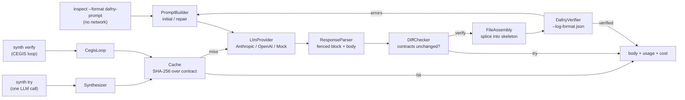

`modules/synth/` is the Phase 6 LLM-and-Dafny synthesis layer. It takes the deterministic Dafny
skeleton emitted by [`inspect --format dafny`](/design/convention-engine) (#32), drives an LLM to
fill in a method body, splices the body back into the skeleton, runs `dafny verify` against the
structured-JSON log format, and iterates with a repair prompt until the body verifies, or the budget
says stop. The verified body is then cached on disk; running `compile --with-synthesis` later
splices every cached body for the spec, calls `dafny translate <target>`, and emits the resulting
kernel under the generated project together with a thin handler-side adapter (M6.5, #27). The worked
example uses the Python (fastapi) target; the Go (chi,
[#465](https://github.com/HardMax71/spec_to_rest/pull/465)) and TypeScript (express,
[#466](https://github.com/HardMax71/spec_to_rest/pull/466)) targets are also supported, each
translating the same spliced Dafny via `dafny translate go` / `dafny translate js` and vendoring the
kernel under its own conventional path. Contracts that no body can implement are their own failure
class with their own fixes; see [Realizability](/synth/realizability).

## Modules and entry points



- `LlmProvider` is the sealed surface (`AnthropicProvider`, `OpenAIProvider`, `MockProvider`). Each
  call returns `IO[Either[ProviderError, LlmResponse]]`. Real providers wrap the official
  `com.anthropic:anthropic-java` (2.30.x) and `com.openai:openai-java` (4.35.x) SDKs in
  `IO.blocking` with `Resource`-managed client lifecycles.
- `PromptBuilder` produces a `Prompt(system, user)` pair. `initial` is used for the first attempt;
  `repair` embeds the previous body and the verifier error for iterations 2+. System prompts live as
  resources under `modules/synth/src/main/resources/specrest/synth/prompts/`.
- `ResponseParser` extracts the first ` ```dafny ` (or ` ```csharp `, fallback ` ``` `) fenced block
  from the LLM's response, then locates the named method's body. The brace-matching scanner is
  string-aware and skips Dafny line and block comments.
- `DiffChecker` takes the canonical `DafnyMethodHeader` and the LLM's full candidate, normalizes the
  `requires` / `ensures` / `modifies` clauses, and rejects any change. Also rejects newly-introduced
  `{:extern}` declarations.
- `FileAssembly` splices the LLM's body into the skeleton at the `// YOUR CODE HERE` placeholder for
  the named method. Pure string operation: the skeleton is generated by the convention engine with a
  stable sentinel, so no parsing is needed.
- `DafnyVerifier` is a trait with a `DafnyCli` real impl plus `MockDafnyVerifier` for tests. The CLI
  wrapper invokes `dafny verify --log-format 'json;LogFileName=...'`, reads the JSON file Dafny
  itself produces, and decodes per-method outcomes. No regex parsing of stderr; the structured JSON
  is the contract.
- `DafnyOutputParser` holds circe decoders for Dafny's `verificationResults[]` log shape (added in
  Dafny 4.5.0). Each method's outcome is keyed by `name`, with
  `vcResults[].assertions[].{filename,line,col,description}` for assertion-level errors. A small
  classifier maps `description` text to the category enum (`postcondition_violation`,
  `precondition_violation`, `loop_invariant_*`, `decreases_failure`, `assertion_failure`, `timeout`,
  `type_error`, `syntax_error`, `unknown`).
- `CegisLoop` is the orchestrator. It takes a `SynthRequest` and drives provider $\to$ parse $\to$
  diff $\to$ splice $\to$ verify $\to$ repeat, bounded by `CegisBudget`. It returns
  `CegisOutcome.Verified(body, fullDfy, iterations, history)` or
  `CegisOutcome.Aborted(reason, lastBody, history)`.
- `CegisBudget` carries four knobs: `maxIterations` (default 8), `maxInputTokens` (100k),
  `maxOutputTokens` (50k), `maxCostUsd` (1.00), plus `repeatedErrorThreshold` (3) for the "stuck"
  detector.
- `Cache` is a filesystem-backed key/value store. Keys are SHA-256 hashes over
  `(signature, requires, ensures, modifies, model, temperature, SynthPromptVersion)`. Writes are
  atomic. `synth try` writes to `.spec-to-rest/synth-cache/`; `synth verify` writes to
  `.spec-to-rest/synth-cache/verified/`. The two namespaces are not interchangeable; a try-passing
  body may not verify.
- `Tracker` is a `Ref`-backed call ledger. Each LLM call records
  `(operation, model, usage, costUsd, cached)`. `summary: IO[CostSummary]` aggregates across the
  run.
- `Pricing` is the static table of input/output rates per million tokens. Verified 2026-05-08
  against vendor pricing pages. `forModel` matches both bare and date-suffixed model IDs.

The rest of this section: [CLI and configuration](/synth/cli) covers the subcommands and the runtime
knobs (budget, Dafny binary, caching, temperature); [worked examples](/synth/examples) walks a real
`gpt-4o-mini` run and a mocked three-iteration convergence; and
[compile, fallback, and hints](/synth/compile-and-fallback) covers `compile --with-synthesis`, the
graduated-fallback ladder, and hint-augmentation.
