`modules/synth/` ships the LLM-facing layer of Phase 6. It builds prompts from the
Dafny skeleton emitted by [`inspect --format dafny`](/design/convention-engine) (#32),
calls a provider, parses the response, runs a diff-checker against the immutable
contract clauses, and tracks token cost. The CEGIS loop, `dafny verify`, and
target-language compilation are deferred to [#29](https://github.com/HardMax71/spec_to_rest/issues/29)
and [#27](https://github.com/HardMax71/spec_to_rest/issues/27).

## Modules and entry points

```mermaid
flowchart LR
  Inspect["inspect --format dafny-prompt<br/>(no network)"] --> PromptBuilder
  SynthCmd["synth try<br/>(real LLM call)"] --> Synthesizer
  PromptBuilder["PromptBuilder.initial<br/>system + user sections"] --> SynthCmd
  Synthesizer --> Cache["Cache lookup<br/>SHA-256 over contract"]
  Cache -->|hit| Result
  Cache -->|miss| Provider
  Provider["LlmProvider<br/>Anthropic | OpenAI | Mock"] --> Parser["ResponseParser<br/>extract dafny block + body"]
  Parser --> Diff["DiffChecker<br/>contracts unchanged?"]
  Diff --> Tracker["Tracker<br/>token + cost ledger"]
  Tracker --> Result["SynthResult<br/>(body, usage, cost)"]
```



- `LlmProvider` — sealed surface (`AnthropicProvider`, `OpenAIProvider`,
  `MockProvider`). Each call returns `IO[Either[ProviderError, LlmResponse]]`.
  Real providers wrap the official `com.anthropic:anthropic-java` (2.30.x) and
  `com.openai:openai-java` (4.35.x) SDKs in `IO.blocking` with `Resource`-managed
  client lifecycles.
- `PromptBuilder` — produces a `Prompt(system, user)` pair from the
  `(OperationClassification, DafnyMethodHeader, skeleton)` triple. System prompts
  live as resources under `modules/synth/src/main/resources/specrest/synth/prompts/`.
  Few-shot examples live alongside under `few-shot/`; selection is keyed on
  `OperationKind`. Both `initial` and `repair` prompts are implemented; the repair
  variant is wired but only invoked once the CEGIS loop in #29 lands.
- `ResponseParser` — extracts the first ` ```dafny ` (or ` ```csharp `, fallback
  ` ``` `) fenced block from the LLM's response, then locates the named method's
  body. The brace-matching scanner is string-aware and skips Dafny line and block
  comments.
- `DiffChecker` — given the canonical `DafnyMethodHeader` and the LLM's full
  candidate, normalizes the `requires` / `ensures` / `modifies` clauses and rejects
  any change. Also rejects any newly-introduced `{:extern}` declaration.
- `Cache` — filesystem-backed key/value store. Keys are SHA-256 hashes over
  `(signature, requires, ensures, modifies, model, temperature, SynthPromptVersion)`.
  Writes are atomic (`tmp → ATOMIC_MOVE`). Default root: `.spec-to-rest/synth-cache/`
  in the working directory; override with `--cache-dir`.
- `Tracker` — `Ref`-backed call ledger. Each call records
  `(operation, model, usage, costUsd, cached)`. `summary: IO[CostSummary]` aggregates
  across the run.
- `Pricing` — static table of input/output rates per million tokens. Verified
  2026-05-08 against vendor pricing pages. `forModel` matches both bare and
  date-suffixed model IDs (`claude-haiku-4-5-20251001` resolves to the
  `claude-haiku-4-5` row).

## CLI

### `inspect --format dafny-prompt`

Pure render — no network call, no API key required.

```bash
sbt "cli/run inspect fixtures/spec/url_shortener.spec --format dafny-prompt"
sbt "cli/run inspect fixtures/spec/url_shortener.spec --format dafny-prompt --operation Shorten"
```

With `--operation NAME`, only that operation's prompt is rendered. Without it, every
operation classified `LLM_SYNTHESIS` is emitted, separated by a markdown horizontal
rule. Operations classified `DIRECT_EMIT` are skipped (the convention engine handles
them; no LLM is ever consulted).

### `synth try`

Sends the constructed prompt to the LLM provider and prints the parsed body to
stdout. Cost is reported on stderr.

```bash
ANTHROPIC_API_KEY=sk-ant-... \
  sbt "cli/run synth try fixtures/spec/url_shortener.spec --operation Shorten"
```

Flags:

| Flag | Default | Notes |
|---|---|---|
| `--operation NAME` | _required_ | Must match a `LLM_SYNTHESIS`-classified op |
| `--model M` | `claude-sonnet-4-6` | `gpt-*` routes to OpenAI; otherwise Anthropic |
| `--temperature T` | `1.0` | Ignored on Anthropic models released after Opus 4.6 |
| `--max-tokens N` | `2048` | Per-response output cap |
| `--no-cache` | off | Skip on-disk cache for this call |
| `--cache-dir PATH` | `.spec-to-rest/synth-cache/` | Override cache root |

Exit codes:

| Code | Meaning |
|---|---|
| 0 | Body produced, diff-check passed |
| 1 | Spec missing / parse / build / classification error / op classified DIRECT_EMIT |
| 2 | LLM response unparseable, or diff-check rejected (contract changed, or new `{:extern}` introduced) |
| 3 | Provider HTTP / API error, or cache write failed |

## Provider routing

`synth try` selects a provider based on the model name prefix:

- Model starts with `gpt` (case-insensitive) → `OpenAIProvider.fromEnv`. Reads
  `OPENAI_API_KEY` (and optionally `OPENAI_BASE_URL` for Azure deployments).
- Otherwise → `AnthropicProvider.fromEnv`. Reads `ANTHROPIC_API_KEY`.

Both providers use `Resource[IO, _]` so the underlying OkHttp client is closed on
success, failure, and cancellation alike. Cancellation propagates through CE3 the
same way it does for Z3 / Alloy backends.

## Anthropic temperature note

The Anthropic Messages API rejects `temperature != 1.0` on models released after
Claude Opus 4.6 (4xx error from the API). The `AnthropicProvider` therefore omits
`.temperature(...)` from the SDK builder entirely — newer models default to 1.0
and older models are unaffected. The `--temperature` flag is honoured by
`OpenAIProvider`. For deterministic synthesis on Anthropic, rely on prompt
structure and `--max-tokens` instead.

## Caching

Cache keys are content-addressed and intentionally do not include the spec source
or skeleton text — only the contract surface that matters for verification. This
means trivial spec edits (renames, comment changes) do not invalidate the cache,
but any change to the operation's signature, requires, ensures, modifies, or to
the `SynthPromptVersion` constant immediately misses.

`SynthPromptVersion` is a manual bump knob (`v1` at time of writing). Bump it when
the system prompts or few-shot library changes substantively.

Cache misses cause one provider call; the response is parsed, diff-checked, and
written atomically (`<file>.tmp` → `Files.move(..., ATOMIC_MOVE, REPLACE_EXISTING)`).
Concurrent writers writing the same key are idempotent.

## Cost tracking

Every call emits one stderr line:

```text
[synth] op=Shorten model=claude-sonnet-4-6 in=1234tok out=456tok cost=$0.0114
```

`Tracker.summary` returns an aggregate `CostSummary(operations, inputTokens,
outputTokens, totalUsd, cachedHits)` that #29 will surface in its end-of-run report.

## What's deferred

| Concern | Tracked in |
|---|---|
| `dafny verify` invocation, sandboxing, error parsing | [#29](https://github.com/HardMax71/spec_to_rest/issues/29) |
| CEGIS iteration loop, repair-prompt invocation | [#29](https://github.com/HardMax71/spec_to_rest/issues/29) |
| Dafny → Python / Go splice + post-process | [#27](https://github.com/HardMax71/spec_to_rest/issues/27) |
| Decomposition, model-escalation, skeleton fallback | [#30](https://github.com/HardMax71/spec_to_rest/issues/30) |
| `compile` integrating synth output | [#29](https://github.com/HardMax71/spec_to_rest/issues/29) |
| Few-shot examples machine-verified by `dafny verify` in CI | [#29](https://github.com/HardMax71/spec_to_rest/issues/29) |
