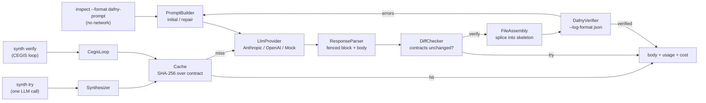
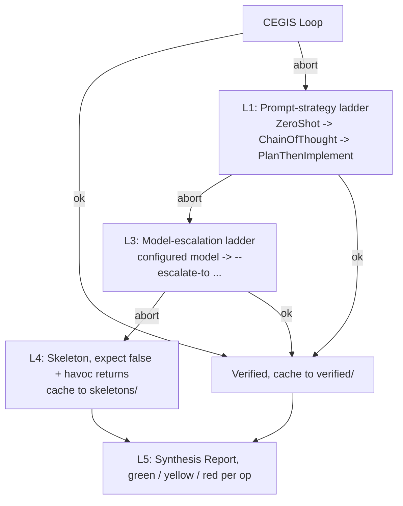

`modules/synth/` is the Phase 6 LLM-and-Dafny synthesis layer. It takes the
deterministic Dafny skeleton emitted by [`inspect --format dafny`](/design/convention-engine)
(#32), drives an LLM to fill in a method body, splices the body back into the
skeleton, runs `dafny verify` against the structured-JSON log format, and
iterates with a repair prompt until the body verifies, or the budget says stop.
The verified body is then cached on disk; running `compile --with-synthesis`
later splices every cached body for the spec, calls `dafny translate py`, and
emits the resulting Python under `app/dafny_kernel/` of the generated project
together with a thin handler-side adapter (M6.5, #27).

## Modules and entry points



- **`LlmProvider`** is the sealed surface (`AnthropicProvider`, `OpenAIProvider`,
  `MockProvider`). Each call returns `IO[Either[ProviderError, LlmResponse]]`.
  Real providers wrap the official `com.anthropic:anthropic-java` (2.30.x) and
  `com.openai:openai-java` (4.35.x) SDKs in `IO.blocking` with `Resource`-managed
  client lifecycles.
- **`PromptBuilder`** produces a `Prompt(system, user)` pair. `initial` is used
  for the first attempt; `repair` embeds the previous body and the verifier error
  for iterations 2+. System prompts live as resources under
  `modules/synth/src/main/resources/specrest/synth/prompts/`.
- **`ResponseParser`** extracts the first ` ```dafny ` (or ` ```csharp `,
  fallback ` ``` `) fenced block from the LLM's response, then locates the
  named method's body. The brace-matching scanner is string-aware and skips
  Dafny line and block comments.
- **`DiffChecker`** takes the canonical `DafnyMethodHeader` and the LLM's
  full candidate, normalizes the `requires` / `ensures` / `modifies` clauses,
  and rejects any change. Also rejects newly-introduced `{:extern}` declarations.
- **`FileAssembly`** splices the LLM's body into the skeleton at the
  `// YOUR CODE HERE` placeholder for the named method. Pure string operation:
  the skeleton is generated by the convention engine with a stable sentinel,
  so no parsing is needed.
- **`DafnyVerifier`** is a trait with a `DafnyCli` real impl plus
  `MockDafnyVerifier` for tests. The CLI wrapper invokes
  `dafny verify --log-format 'json;LogFileName=...'`, reads the JSON file
  Dafny itself produces, and decodes per-method outcomes. No regex parsing
  of stderr; the structured JSON is the contract.
- **`DafnyOutputParser`** holds circe decoders for Dafny's
  `verificationResults[]` log shape (added in Dafny 4.5.0). Each method's
  outcome is keyed by `name`, with
  `vcResults[].assertions[].{filename,line,col,description}` for
  assertion-level errors. A small classifier maps `description` text to the
  category enum (`postcondition_violation`, `precondition_violation`,
  `loop_invariant_*`, `decreases_failure`, `assertion_failure`, `timeout`,
  `type_error`, `syntax_error`, `unknown`).
- **`CegisLoop`** is the orchestrator. It takes a `SynthRequest` and drives
  provider $\to$ parse $\to$ diff $\to$ splice $\to$ verify $\to$ repeat,
  bounded by `CegisBudget`. It returns
  `CegisOutcome.Verified(body, fullDfy, iterations, history)` or
  `CegisOutcome.Aborted(reason, lastBody, history)`.
- **`CegisBudget`** carries four knobs: `maxIterations` (default 8),
  `maxInputTokens` (100k), `maxOutputTokens` (50k), `maxCostUsd` (1.00), plus
  `repeatedErrorThreshold` (3) for the "stuck" detector.
- **`Cache`** is a filesystem-backed key/value store. Keys are SHA-256 hashes
  over `(signature, requires, ensures, modifies, model, temperature,
  SynthPromptVersion)`. Writes are atomic. `synth try` writes to
  `.spec-to-rest/synth-cache/`; `synth verify` writes to
  `.spec-to-rest/synth-cache/verified/`. The two namespaces are not
  interchangeable; a try-passing body may not verify.
- **`Tracker`** is a `Ref`-backed call ledger. Each LLM call records
  `(operation, model, usage, costUsd, cached)`. `summary: IO[CostSummary]`
  aggregates across the run.
- **`Pricing`** is the static table of input/output rates per million tokens.
  Verified 2026-05-08 against vendor pricing pages. `forModel` matches both
  bare and date-suffixed model IDs.

## CLI

### `inspect --format dafny-prompt`

Pure render: no network call, no API key required.

```bash
sbt "cli/run inspect fixtures/spec/url_shortener.spec --format dafny-prompt"
sbt "cli/run inspect fixtures/spec/url_shortener.spec --format dafny-prompt --operation Shorten"
```

With `--operation NAME`, only that operation's prompt is rendered. Without it,
every operation classified `LLM_SYNTHESIS` is emitted, separated by a markdown
horizontal rule.

### `synth try`

Sends the constructed prompt to the LLM and prints the parsed body to stdout.
**No verification.** Cost goes to stderr.

```bash
ANTHROPIC_API_KEY=sk-ant-... \
  sbt "cli/run synth try fixtures/spec/url_shortener.spec --operation Shorten"
```

<TypeTable
  type={{
    '--operation NAME': {
      description: 'Must match an `LLM_SYNTHESIS`-classified op.',
      type: 'string',
      required: true,
    },
    '--model M': {
      description: '`gpt-*` routes to OpenAI; otherwise Anthropic.',
      type: 'string',
      default: 'claude-sonnet-4-6',
    },
    '--temperature T': {
      description: 'Honoured by OpenAI; **ignored on Anthropic** (see below).',
      type: 'number',
      default: '1.0',
    },
    '--max-tokens N': {
      description: 'Per-response output cap.',
      type: 'number',
      default: '2048',
    },
    '--no-cache': {
      description: 'Skip on-disk cache for this call.',
      type: 'flag',
      default: 'off',
    },
    '--cache-dir PATH': {
      description: 'Override cache root.',
      type: 'path',
      default: '.spec-to-rest/synth-cache/',
    },
  }}
/>

Exit codes: `0` body produced + diff-check passed; `1` spec/parse/build/op-not-found/DIRECT_EMIT;
`2` LLM response unparseable or diff-check rejected; `3` provider HTTP / API error.

### `synth verify`

Runs the full CEGIS loop: generate $\to$ diff-check $\to$ splice $\to$ `dafny verify`
$\to$ repair $\to$ repeat, until the body verifies or the budget is exhausted.
**Requires a `dafny` binary on `$PATH`** (or `--dafny-bin` / `$DAFNY_BIN`).

```bash
ANTHROPIC_API_KEY=sk-ant-... DAFNY_BIN=/usr/local/bin/dafny \
  sbt "cli/run synth verify fixtures/spec/url_shortener.spec --operation Shorten"
```

<TypeTable
  type={{
    '--operation NAME': {
      description: 'Must match an `LLM_SYNTHESIS`-classified op.',
      type: 'string',
      required: true,
    },
    '--model M': {
      description: 'Same routing as `synth try`.',
      type: 'string',
      default: 'claude-sonnet-4-6',
    },
    '--temperature T': {
      description: 'Same caveat as `synth try`, ignored on Anthropic.',
      type: 'number',
      default: '1.0',
    },
    '--max-tokens N': {
      description: 'Per-iteration output cap.',
      type: 'number',
      default: '2048',
    },
    '--max-iter N': {
      description: 'Hard cap on CEGIS iterations.',
      type: 'number',
      default: '8',
    },
    '--cost-cap-usd N': {
      description: 'Abort if cumulative LLM cost exceeds this.',
      type: 'number',
      default: '1.00',
    },
    '--dafny-bin PATH': {
      description: 'Path to the Dafny binary.',
      type: 'path',
      default: '$DAFNY_BIN then `dafny` on PATH',
    },
    '--dafny-timeout SEC': {
      description: 'Per-iteration `--verification-time-limit`.',
      type: 'number',
      default: '60',
    },
    '--no-cache': {
      description: 'Skip the verified-body cache.',
      type: 'flag',
      default: 'off',
    },
    '--cache-dir PATH': {
      description: 'Verified bodies live under `<root>/verified/`.',
      type: 'path',
      default: '.spec-to-rest/synth-cache/',
    },
  }}
/>

Exit codes:

| Code | Meaning |
|---|---|
| 0 | Body verified within budget |
| 1 | Budget exhausted (max iter / token / cost) or stuck on the same error |
| 2 | LLM response unparseable, diff-check rejected, or splice failed |
| 3 | Provider HTTP / API error, or Dafny binary missing / crashed |

End-of-run stderr summary line:

```text
[synth-verify] op=Shorten VERIFIED iter=3 records=3
[synth-verify] tokens in=4321tok out=987tok cost=$0.0421 calls=3 cachedHits=0
```

## Iteration budget

The CEGIS loop uses `CegisBudget` to bound work. Defaults:

```text
maxIterations         = 8     # hard cap on repair rounds
maxInputTokens        = 100000
maxOutputTokens       = 50000
maxCostUsd            = 1.00
repeatedErrorThreshold = 3    # same (category, line) -> abort as "stuck"
```

The CLI exposes `--max-iter` and `--cost-cap-usd`. The token caps and stuck
threshold are not surfaced as flags today, they're sane defaults that
correspond to the cost cap on Claude Sonnet 4.6 / GPT-5 pricing. Override
in code when embedding `CegisLoop` directly.

## Dafny binary

`DafnyCli.resolveBinary` checks (in order): the `--dafny-bin` flag, the
`DAFNY_BIN` environment variable, and finally the unqualified `dafny` on
`$PATH`. The check runs `dafny --version` with a 10-second timeout, if it
fails, the command exits `3` (Backend) with a clear error.

The structured-JSON log format used by `DafnyOutputParser` was added in
**Dafny 4.5.0**. Earlier versions lack `--log-format json` for `verify` and
will not work. We do **not** install Dafny in CI: the CEGIS loop is exercised
end-to-end with `MockDafnyVerifier` against staged JSON shapes.

## Caching

Cache keys are content-addressed and intentionally do not include the spec
source or skeleton text; only the contract surface that matters is keyed. Trivial
spec edits (renames, comment changes) do not invalidate the cache; any change
to signature / requires / ensures / modifies / `SynthPromptVersion` does.

`synth try` and `synth verify` use **separate cache namespaces**:

- `synth-cache/<key>.json` for `synth try` (diff-checked bodies; not
  necessarily verified).
- `synth-cache/verified/<key>.json` for `synth verify` (verified bodies).

A `try`-passing body may not verify, so the two stores must not be merged.

## Anthropic temperature note

The Anthropic Messages API rejects `temperature != 1.0` on models released
after Claude Opus 4.6. To stay forward-compatible, `AnthropicProvider` does
**not** call the SDK's `.temperature(...)` builder for any model; Anthropic's
server-side default applies. The flag is honoured by `OpenAIProvider`. For
deterministic synthesis on Anthropic, rely on prompt structure and
`--max-tokens` instead.

## Real-LLM transcript: `safe_counter.Increment` (gpt-4o-mini)

The simplest end-to-end smoke. Dafny 4.11.0 (`dotnet tool install -g Dafny`),
gpt-4o-mini, `safe_counter` fixture. Two consecutive runs exercise the cold
path (LLM call + Dafny verify + cache write) and the warm path (cache hit
short-circuit, no LLM call).

### Cold run

```bash
$ sbt "cli/run synth verify fixtures/spec/safe_counter.spec \
       --operation Increment --max-iter 3 --model gpt-4o-mini --max-tokens 1024"
```

Stdout (the body the LLM produced, with no signature or fence markers):

```text
  // First, capture the old count for use in the postcondition
  var oldCount := st.count;

  // Increment the count
  st.count := st.count + 1;

  // Assert that the new count is indeed the old count plus one
  assert st.count == oldCount + 1;

  // Final assertion to verify service state invariant
  assert ServiceStateInv(st);
```

Stderr summary (always two lines: outcome + cost ledger):

```text
[synth-verify] op=Increment VERIFIED iter=1 records=1
[synth-verify] tokens in=574tok out=127tok cost=$0.0002 calls=1 cachedHits=0
```

Exit code: `0`.

This particular transcript verified on the first iteration. LLM responses are
non-deterministic; on a different draw `gpt-4o-mini` may produce a body that
fails Dafny's postcondition check, in which case `iter` is `2` or higher and
`records` shows the failed candidate plus the repair. Example from a
previous run on the same fixture/model:

```text
[synth-verify] op=Increment VERIFIED iter=2 records=2
[synth-verify] tokens in=1148tok out=353tok cost=$0.0004 calls=2 cachedHits=0
```

The repair-prompt path (`PromptBuilder.repair`) embeds the iteration-1 body
verbatim plus the verifier error category and message, so the LLM sees what
was wrong and produces a corrected body on iteration 2.

### Warm run (cache hit)

Re-running the same command immediately after the cold run:

```text
[synth-verify] op=Increment VERIFIED iter=0 records=1
[synth-verify] tokens in=574tok out=127tok cost=$0.0002 calls=1 cachedHits=1
```

`iter=0` means no CEGIS iteration ran: the verified body was retrieved from
`.spec-to-rest/synth-cache/verified/<2-hex-prefix>/<sha>.json` (entries are
sharded into 2-character subdirectories by the leading hex bytes of the
SHA-256 key) and re-spliced into a fresh copy of the skeleton. The token / cost numbers reproduce the previous run's
ledger entry (which is what `cached=true` records mean), but no LLM call was
billed. `calls=1` here counts the cached-call ledger entry rather than a network
round-trip; `cachedHits=1` is the canonical signal of a cache hit.

Wall clock for both runs combined: ~32s on a developer laptop. About $0.0002
spent on real LLM tokens for the cold run; warm run is free.

## Worked example: URL shortener `Shorten` (3 iterations, mocked)

The acceptance test for #29 walks the canonical case where the LLM converges
in three iterations:

1. **Iteration 1**, initial prompt. LLM produces a body that hardcodes a
   `ShortCode("abcdef")`. Dafny rejects: postcondition `code !in old(st.store)`
   not established (the hardcoded code might already be in the store).
2. **Iteration 2**, repair prompt embeds the iteration-1 body and the
   postcondition error. LLM produces `code :| code !in st.store`. Dafny
   rejects: cannot establish existence of LHS values.
3. **Iteration 3**, repair prompt embeds the iteration-2 body and the
   existence-failure error. LLM produces a `FreshCodeExists` lemma plus the
   `:|` operator. **Verified.**

`CegisLoopTest.scala` exercises this flow with `MockProvider` (three staged
responses) and `MockDafnyVerifier` (three staged outputs), asserting
`outcome.iterations == 3` and that the iteration-2 prompt contains
`postcondition_violation` plus the iteration-1 body verbatim, proving
"error feedback improves subsequent iterations" (AC 2).

## `compile --with-synthesis` (M6.5)

When every `LLM_SYNTHESIS` operation has been verified at least once
(`synth verify` populated `.spec-to-rest/synth-cache/verified/`), running
`compile --with-synthesis` integrates the verified bodies into the emitted
project:

```bash
sbt "cli/run synth verify fixtures/spec/url_shortener.spec --operation Shorten"
sbt "cli/run synth verify fixtures/spec/url_shortener.spec --operation Resolve"
sbt "cli/run synth verify fixtures/spec/url_shortener.spec --operation ListAll"
sbt "cli/run compile fixtures/spec/url_shortener.spec \
       --framework fastapi --db postgres --out /tmp/out --with-synthesis"
```

Pipeline:

1. Look up each `LLM_SYNTHESIS` operation's verified body in the cache. The
   key is `(signature, requires, ensures, modifies, model, temperature,
   SynthPromptVersion)`. `--synthesis-model` and `--synthesis-temperature`
   default to `claude-sonnet-4-6 / 1.0`; pass them explicitly if the body
   was verified with a different combination.
2. Multi-method splice every cached body into one fresh `.dfy` file using
   the convention engine's deterministic skeleton.
3. Invoke `dafny translate py --include-runtime --no-verify --output=...` and
   capture every file the back-end emits. The `_dafny` runtime is bundled
   in-tree, generated `pyproject.toml` does not pull a PyPI runtime.
4. Lay the captured files under `<out>/app/dafny_kernel/` and emit a
   companion `app/services/_dafny_adapter.py` with boundary helpers
   (`make_state`, `to_dafny_seq`, `from_dafny_map`, ...).
5. The entity service template now branches on each operation's
   `dafnyMethod`: when set, the handler hydrates a fresh `ServiceState`,
   calls `app.dafny_kernel.module_.default__.<Op>(state, ...)`, and returns
   the result. The previous `NotImplementedError` placeholder is preserved
   for operations with no cached body.

Hard failure modes:

| Condition | Exit code | Message |
|---|---|---|
| `--with-synthesis` set but `verified/` directory missing | 1 | "no verified-body cache at ...; run `synth verify` for each LLM_SYNTHESIS op first" |
| Cache exists but a specific op is missing | 1 | "no verified body cached for '$Op' (model=..., temp=...). Run: cli/run synth verify ... --operation $Op --model ..." |
| `dafny` not on PATH (or `--dafny-bin` invalid) | 3 | "`dafny --version` failed ..." |
| `dafny translate` exits non-zero | 3 | "dafny translate py failed: $stderr" |

Persistence is intentionally out of scope here. The kernel `ServiceState`
is held per-request by `make_state()`; bridging it to SQLAlchemy / Postgres
on a `commit` boundary is tracked as a follow-up issue.

## Graduated fallback (M6.6)

When CEGIS aborts on its first attempt, M6.6's `FallbackOrchestrator`
escalates along two axes before giving up: prompt strategy (`ZeroShot` $\to$
`ChainOfThought` $\to$ `PlanThenImplement`) and model (configured model $\to$
each `--escalate-to MODEL`, in order). All attempts share one budget
envelope (`sharedCostCapUsd`, default \$1.00). When every attempt fails,
the orchestrator emits a labelled fallback skeleton: a Dafny body with
`expect false, "FALLBACK SKELETON [op=...]: not verified..."` plus
havoc-assigned (`out := *;`) return params. The skeleton translates cleanly
to Python under `dafny translate --no-verify` and halts at runtime with
`_dafny.HaltException` carrying the strategy/model/reason payload.



L2 (operation decomposition) is intentionally not in M6.6; it is a
research-grade problem and tracked separately.

### `synth verify --fallback`

```bash
ANTHROPIC_API_KEY=sk-ant-... DAFNY_BIN=/usr/local/bin/dafny \
  sbt "cli/run synth verify fixtures/spec/url_shortener.spec \
       --operation Shorten --fallback --escalate-to claude-opus-4-7"
```

<TypeTable
  type={{
    '--fallback': {
      description: 'Enable the orchestrator. Without it, `synth verify` is strict CEGIS as before.',
      type: 'flag',
      default: 'off',
    },
    '--escalate-to MODEL': {
      description: 'Repeat for a multi-step ladder (e.g. `--escalate-to opus --escalate-to gpt-5`).',
      type: 'string',
      default: '_empty_',
    },
  }}
/>

Stdout is the verified body OR the labelled skeleton (one Dafny block,
splice-ready). Stderr summary line example:

```text
[synth-verify] op=Shorten VERIFIED-ESCALATED attempts=2 strategy=ChainOfThought model=claude-opus-4-7 iter=1
```

or

```text
[synth-verify] op=Shorten SKELETON attempts=4 reason=stuck on postcondition_violation
```

Verified bodies persist to `synth-cache/verified/` exactly like strict
CEGIS. Fallback skeletons persist to `synth-cache/skeletons/` (separate
namespace; the two never mix).

### `synth verify-all`

Runs the orchestrator across every `LLM_SYNTHESIS` operation in the spec
and prints a synthesis report to stderr.

```bash
sbt "cli/run synth verify-all fixtures/spec/url_shortener.spec \
       --escalate-to claude-opus-4-7"
```

```text
Synthesis Report
  Operation                  Verdict              Strategy          Model                   iter   $cost
  ------------------------------------------------------------------------------------------------
  Shorten                    VERIFIED             ZeroShot          claude-sonnet-4-6          1  $0.0023
  Resolve                    VERIFIED-ESCALATED   ChainOfThought    claude-opus-4-7            2  $0.0510
  ListAll                    SKELETON             PlanThenImplement claude-opus-4-7            0  $0.1010
  ------------------------------------------------------------------------------------------------
  total=3 verified=1 escalated=1 skeleton=1  cost=$0.1543  in=2100tok out=4200tok
```

Exit codes: `0` if every op verified or escalated successfully (no
skeletons); `1` if any op fell back to a skeleton; the report prints
either way so partial progress is visible.

### `compile --with-synthesis --allow-skeletons`

Default `compile --with-synthesis` is unchanged: strict cache-only,
hard-error on miss in `verified/`. The new opt-in `--allow-skeletons`
flag relaxes the gate: when a verified body is missing, the compiler
falls back to `synth-cache/skeletons/<key>.json` if present, emits a
warning per op, and proceeds. The kernel files translate identically
(skeleton bodies are well-typed Dafny under `--no-verify`); only at
runtime does the handler raise `_dafny.HaltException` from inside the
kernel call.

```bash
sbt "cli/run compile fixtures/spec/url_shortener.spec \
       --framework fastapi --db postgres --out /tmp/out \
       --with-synthesis --allow-skeletons"
```

This is intended as a "ship a partially-verified service for testing,
finish the proofs later" workflow. The HaltException payload includes
the operation name, the final attempted strategy/model, and the abort
reason: enough to point a developer at what to fix.

## Hint-Augmentation (M6.7)

DafnyPro (POPL 2026) reports +16pp on the single-function DafnyBench
when Claude Sonnet 3.5 is augmented with a curated repository of
verified Dafny proof patterns retrieved by error category and injected
into the repair prompt. M6.7 ships that mechanism as the chosen
direction after the L2 / decomposition path was closed under the
2025-2026 evidence summarised in
[research/12](/research/12_compositional_synthesis_findings).

### `HintLibrary`

`modules/synth/src/main/scala/specrest/synth/HintLibrary.scala` exposes
12 hand-curated Dafny snippets indexed by `VerifierError.category`:

| Category | Hints |
|---|---|
| `postcondition_violation` | `postcondition_capture_old`, `postcondition_branch_assert`, `postcondition_helper_lemma` |
| `precondition_violation` | `precondition_guard`, `precondition_strengthen_local` |
| `loop_invariant_failure` | `loop_invariant_strengthen` |
| `loop_invariant_not_established` | `loop_invariant_initially`, `loop_init_before_loop` |
| `decreases_failure` | `decreases_metric`, `decreases_lexicographic` |
| `assertion_failure` | `assertion_intermediate_lemma` |
| `timeout` | `timeout_split_proof` |

Each hint is a `.dfy` resource at
`modules/synth/src/main/resources/specrest/synth/hints/`. The first
line is the rationale comment; the rest is a small (3-15 line) Dafny
snippet. `HintLibrary.forCategory(cat, limit = 2)` returns the
relevant entries; `PromptBuilder.repair(..., withHints = true)` injects
them into a `## Suggested Patterns` section of the repair prompt.

### CLI

<TypeTable
  type={{
    '--with-hints': {
      description: 'Force hints ON for this run.',
      type: 'flag',
      default: 'implicit',
    },
    '--no-hints': {
      description: 'Force hints OFF for this run.',
      type: 'flag',
      default: 'implicit',
    },
  }}
/>

When neither flag is set the default is **inferred**: ON when `--fallback` is set; ON for
`verify-all`; OFF for strict `synth verify`.

### What this is NOT

We do **not** claim DafnyPro's +16pp will reproduce on our specific
spec/op shapes. The CI tests are mock-driven and prove only the
plumbing (hint retrieved by category, snippet injected verbatim,
section gracefully omitted when no match). Real-LLM A/B is left as a
follow-up that requires non-trivial test budget and a stable spec
fixture.

## What's still deferred

For the live synthesis follow-up backlog (operation decomposition, ORM reconciliation,
multi-target `--with-synthesis`, dafny-verified few-shots in CI, counterexample formatting,
cross-family escalation), see **[Roadmap $\to$ Synthesis follow-ups](/roadmap#synthesis-follow-ups)**.
