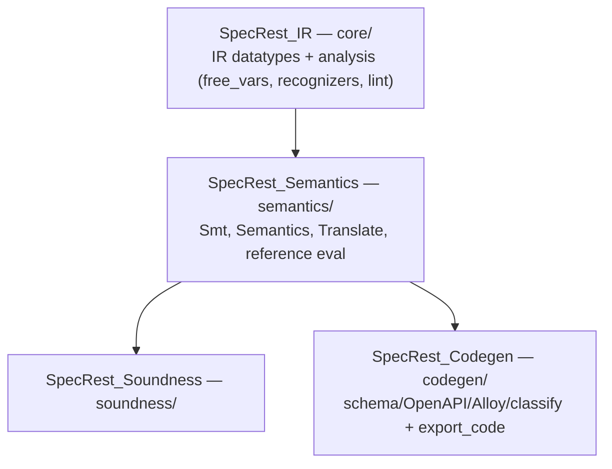

# SpecRest — Isabelle/HOL proof track

The canonical proof track for the SpecRest verifier's translator soundness. Replaces the original
Lean 4 track; pivot completed 2026-05-04 via issue
[#193](https://github.com/HardMax71/spec_to_rest/issues/193). The Lean track was retired in the same
effort.

The universal soundness theorem `SpecRest.soundness` closes with zero `sorry` over the verified
subset. Isabelle's `Code_Target_Scala` extracts `translate`, `eval`, `smt_eval`, and the canonical
IR ADT to `modules/ir/src/main/scala/specrest/ir/generated/SpecRestGenerated.scala`. The Scala layer
no longer maintains a hand-written translator mirror or a hand-written IR — the extracted code is
the canonical implementation. (IR canonicalization shipped in
[#202](https://github.com/HardMax71/spec_to_rest/issues/202).)

## Layout

```text
proofs/isabelle/
├── README.md              this file
├── STATUS.md              proof-state ledger
└── SpecRest/
    ├── ROOT                 session graph (IR ← Semantics ← Soundness, Codegen)
    ├── core/                SpecRest_IR: IR (datatypes) + analysis layer
    │                        (IR_Helpers, IR_Recognizers, IR_Lint, IR_FreeVars, IR_Analysis)
    ├── semantics/           SpecRest_Semantics: Smt(_Fresh), Semantics(_Eval/_Typing),
    │                        Semantics_Reference, Semantics_Inlining, Translate
    ├── soundness/           SpecRest_Soundness: Soundness_Framework, Preservation_*,
    │                        DirectSound(_*), DirectTotality, DirectPreservation
    └── codegen/             SpecRest_Codegen: schema/OpenAPI/Alloy/classify helpers +
                             Codegen.thy (export_code)
```

## Build (requires Isabelle2025-2)

```bash
isabelle build -d proofs/isabelle/SpecRest -b SpecRest_Soundness SpecRest_Codegen
```

(`SpecRest_IR` and `SpecRest_Semantics` build automatically as shared parents.) The first build
downloads/compiles `HOL` and `HOL-Library` heaps (~5-10 minutes); subsequent builds reuse them. Heap
files cache under `~/.isabelle/Isabelle2025-2/heaps/`.

### Session structure (incremental builds)

The proof base is split into four sessions so an edit only re-checks the sessions it touches —
Isabelle's build/cache unit is the _session_, and an unchanged session's heap is reused. The IR
datatype + analysis layer (`SpecRest_IR`) is self-contained and never imports the meaning layer, so
it sits below `SpecRest_Semantics`; `SpecRest_Soundness` and `SpecRest_Codegen` are independent
siblings over the meaning layer:



| Edit                                              | Rebuilds                        | Reuses (skips)       | Cold time |
| ------------------------------------------------- | ------------------------------- | -------------------- | --------- |
| a `codegen/` theory (common case — codegen lifts) | `SpecRest_Codegen`              | IR + Semantics + Snd | ~50 s     |
| a `soundness/` theory                             | `SpecRest_Soundness`            | IR + Semantics + Cg  | ~25 s     |
| a `semantics/` theory (translate / eval lifts)    | Semantics + Soundness + Codegen | IR                   | ~2.5 min  |
| a `core/` IR-layer theory                         | everything                      | —                    | ~3.5 min  |

Measured on Isabelle2025-2: IR ≈ 60 s, Semantics ≈ 110 s, Codegen ≈ 50 s, Soundness ≈ 25 s. Editing
the heavily-churned meaning layer now reuses the ~60 s IR heap instead of re-elaborating it.

**Each session owns its own directory**, so a new theory must live in the subdirectory of its
session, and any cross-session import must be session-qualified (e.g.
`imports SpecRest_IR.IR_Helpers` from `semantics/`, `SpecRest_Semantics.Translate` from `codegen/`);
imports within a session stay bare.

## Regenerating `SpecRestGenerated.scala`

`codegen/Codegen.thy` runs `export_code` on every build of `SpecRest_Codegen`, but Isabelle writes
the extracted Scala into the session's export area — not into the consumer tree. The committed copy
at `modules/ir/src/main/scala/specrest/ir/generated/SpecRestGenerated.scala` is produced by:

```bash
work="$(mktemp -d)"
isabelle build -d proofs/isabelle/SpecRest -b SpecRest_Codegen
isabelle export -d proofs/isabelle/SpecRest -O "$work" \
  -x 'SpecRest_Codegen.Codegen:code/*' SpecRest_Codegen

target="modules/ir/src/main/scala/specrest/ir/generated/SpecRestGenerated.scala"
{
  printf 'package specrest.ir.generated\n\n'
  cat "$work/SpecRest_Codegen.Codegen/code/SpecRestGenerated.scala"
} > "$target"
scalafmt --config .scalafmt.conf --non-interactive "$target"
```

The `isabelle-build` workflow runs this exact pipeline in `--check` mode on every PR that touches
`proofs/isabelle/**` or the generated Scala — a `git diff` between the freshly-extracted file and
the committed one is the gate. **A theory edit that forgets the regen step will fail CI.**

## Why the pivot

See issue #193 for the full rationale. Headlines:

- **`Code_Target_Scala` is production-ready** (used in Stainless/Leon at EPFL since 2010). Replaces
  the custom Lean → Scala extractor that the original #193 scoped at 2-3 person-months.
- **Toolchain stability**: Isabelle releases yearly with AFP push-through migration; Lean 4 ran 4.27
  → 4.30 in 14 weeks Feb–Apr 2026.
- **Cleaner Path 3 TCB**: Isabelle kernel + Z3 driver versus Lean's `Lean.ofReduceBool` + custom
  extractor (1-2 kLoC, in our TCB) + Z3 driver.
- **Net effort to Path-3-shipped**: 4-7 PM vs 5-9 PM on the Lean path (with multi-contributor
  parallelism on the re-port).

## Phased delivery

Per issue #193, 10 phases sized for single-contributor PRs:

| Phase | Days (1×) | Days (2×) | Deliverable                                                         |
| ----- | --------- | --------- | ------------------------------------------------------------------- |
| 0     | 2         | 2         | Branch + Isabelle install + skeleton ROOT/`SpecRest.thy` + `IR.thy` |
| 1     | 7         | 5         | Port `IR.lean` (done in Phase 0); port `Smt.lean` → `Smt.thy`       |
| 2     | 10        | 6         | Port `Semantics.lean`; port `Translate.lean`                        |
| 3     | 14        | 9         | Port per-case lemmas in `Lemmas.lean`                               |
| 4     | 21        | 13        | Port `Soundness.lean` (5374 LoC); close universal `soundness`       |
| 5     | 5         | 5         | `Code_Target_Scala` setup + `export_code` for `eval`, `translate`   |
| 6     | 4         | 4         | `cert/EmitIsabelle.scala` replacing `cert/Emit.scala`               |
| 7     | 3         | 3         | A8a/A8b oracles + CI workflow migration                             |
| 8     | 3         | 3         | Drift audit migration; side-by-side gating                          |
| 9     | 3         | 3         | Docs: §7 of `10_translator_soundness.md` + `STATUS.md` migration    |
| 10    | follow-up | follow-up | Retire Lean track (`rm -rf proofs/lean/`)                           |

Total: 53-72 person-days depending on contributor count.

## Conventions

- **Naming**: snake_case for types (`type_expr`, `bool_bin_op`); CamelCase for constructors
  (`BoolLit`, `IntT`). Differs from Lean's lowerCamelCase constructors (`boolLit`); the extractor's
  `code_printing` directives handle the rename to Scala-style `VBool` etc. when emitting
  `EvalGenerated.scala`.
- **Strings**: `String.literal` (extracts to Scala `String`) everywhere — never `string` (=
  `char list`, extracts as `List[Char]`).
- **Integers**: `int` (mathematical, unbounded) extracts **directly to Scala `BigInt`** — a
  `code_printing` block in `Codegen.thy` maps `Int.int ↦ BigInt` and prints the
  `int_of_integer`/`integer_of_int` morphisms as identity, so there is no `int_of_integer(BigInt)`
  wrapper and arithmetic compiles to native `BigInt` ops (#358). Never `nat` (loses negative range;
  would force code-gen casts at every Z3 boundary).
- **Records vs datatypes**: `record` for product types (single constructor, named fields);
  `datatype` for sum types. Mirrors the Lean split between `structure` and `inductive`.
- **No `mathlib` analog**: keep dependencies to `Main` + `HOL-Library` only. AFP entries are
  imported only when load-bearing (none currently).
